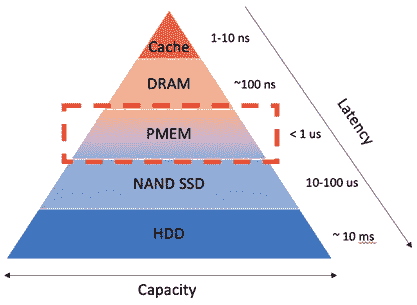
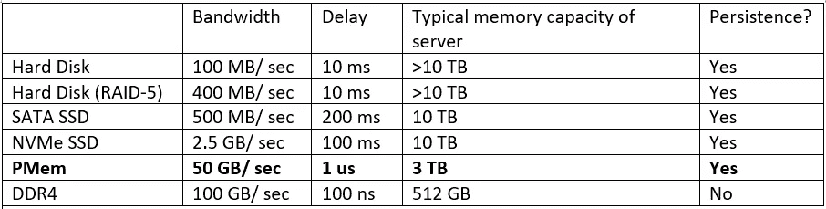

# 持久性存储器(PMem)简介

> 原文：<https://medium.com/geekculture/introduction-of-persistent-memory-pmem-387074548715?source=collection_archive---------13----------------------->

**本文由 MemArk 技术社区(https://memark.io/en/)发布。保留所有权利。*

> *你可能在不同渠道听说过一些容易混淆的技术术语，比如非易失性存储器、持久性存储器、Optane 持久性存储器、PMem、DCPMM、AEP 等等……这些术语是什么？有什么联系？有什么用？本文将从科普的角度帮你解答这些问题。希望看完这篇文章，无论你是程序员还是相关行业的从业者，都能明白什么是持久记忆，起什么作用。*

# 什么是持久记忆？

首先来回答一下比较混乱的命名。暂时不用担心这些名字之间的进化关系。简而言之，我们可以认为它们大多指的是类似的东西。更严格地说，非易失性存储器是一种技术，其他术语指的是英特尔发布的商业产品。目前，英特尔的正式名称是**“英特尔 Optane 持久存储器**，简称 **PMem** 。

那么，让我们开始吧…用一句话来说，永久内存是一种新型的内存模块，能够持久存储数据。我们可以看下图。它与任何普通的内存模块没有太大的不同，它被插入到服务器的内存插槽中。

简单来说，你可以直接去网上网站购买，插在你服务器上的内存条上，永久内存就可以用了。当然，持久内存对硬件有一定要求，尤其是 CPU。永久内存是英特尔的独家武器，不会留给竞争对手来支持。具体的 CPU 支持型号可以在:[https://www . Intel . com/content/www/us/en/support/articles/000055996/memory-and-storage/data-center-persistent-memory . html](https://www.intel.com/content/www/us/en/support/articles/000055996/memory-and-storage/data-center-persistent-memory.html)当然，要想发挥持久内存的最大优势，就要注意硬件配置和运行模式，后面会有说明。

然后，我们研究持久性在整个计算机体系结构中的地位。学过计算机架构的同学，一定非常熟悉计算机存储金字塔的架构。如果我们把持久记忆放进这个金字塔，它会在哪里？让我们仔细看看。在下图所示的存储金字塔中，我们可以看到持久性存储器介于外部存储(HDD 或 SSD)和 DRAM 之间，在容量、性能和价格方面处于两者之间。另外，从功能上来说，完全是 DRAM 和外存的混合体(所以为什么图中 PMem 标注为半海水和一般火焰)。换句话说，它既可以用作内存，也可以用作永久性外部存储器。当然也可以两者兼顾，看你怎么用持久内存。

如果你还是不太明白我在描述什么，最直接的方法就是告诉你持久记忆最重要的三个特征:大、快、持久:

1.**大**:目前单个持久内存模块最大容量可达 512 GB，而单个 DRAM 模块最大容量为 64 GB。换句话说，单台服务器用持久内存就可以轻松达到 TB 的内存容量。另一方面，就单价而言，永久内存大约是普通内存的一半。

2.**快**:既然也叫记忆，那一定不慢。与普通固态硬盘相比，永久存储器具有 1-2 个数量级的延迟性能优势，并且比硬盘具有更大的优势。当然，和 DRAM 相比，会有一定的性能差距。但在实际使用中，由于性能瓶颈不一定在内存，一般不会有明显差距(一般性能下降不到一倍)。

3.**持久性**:持久性存储器与硬盘有着相同的特性。断电重启后，内存中的数据依然存在。这个特征可以说是记忆的一种进化。我们都知道，断电或程序退出后，内存中的数据将不复存在。这个特性使得持久存储器可以作为高速持久设备使用，也可以满足一些存储应用场景下的快速恢复需求。

下表总结了数据中心单台服务器的典型配置以及相应的大致性能数据，以供参考。

General performance of common memory and persistence devices on a single server

# 永久记忆的主要优点是什么？

说了持久内存的特点，可以想象它在某些应用场景下有着独特的优势。具体来说，实际落地有几种玩法。下面从几个具体的场景出发，辩证地给出使用持久内存的好处以及可能出现的问题。

**场景 1:大内存和低成本解决方案**

如果你的应用程序的内存消耗是关键，是整个系统的资源瓶颈，那么使用持久内存将是降低你成本的最佳解决方案。在两种情况下，您的系统通常对大内存有特殊要求:

1.考虑到内存性能，您必须使用基于内存的解决方案，而不是基于磁盘的解决方案，例如 Redis 或 MemSQL。

2.虽然你的应用程序可以接受基于磁盘造成的性能损失，但显然，如果内存得到扩展，你的应用程序可以运行得更快并节省时间，比如基于 Spark 的应用程序

在这种情况下，您可以考虑使用永久内存来提供大内存和低成本的解决方案。

**优势**:永久内存单价是普通内存的一半左右，在单机上可以轻松达到 1.5 TB 甚至 3 TB 的内存大小。因此，例如，您的目标需要 20 TB 的总内存容量，并且可能只需要 10 台机器的永久内存，但是基于 DRAM 的集群可能需要 40 台或更多。考虑到机器投资和运营的成本，永久内存带来的低成本解决方案优势显而易见。

**可能出现的问题**:当然，永久内存的引入可能会导致相对内存有一定的性能下降。下降的原因可能是持久内存本身，也可能是机器数量和其他硬件资源(如 CPU 内核或网络带宽)的减少。所以在实际的项目实施中，作为决策者，一定要进行细致的评估，量化持久记忆带来的利益。

**场景 2:高性能持久性需求的应用**

永久存储器是内存和外部存储的混合物。在磁盘 IO 成为性能瓶颈的一些情况下，它的高速持久性是一个理想的解决方案。虽然 SSD 也可以在一定程度上缓解磁盘 IO 性能瓶颈，但 PMem 无疑是革命性的，它是一种持久性设备，可以将吞吐量和延迟提高两个数量级。以下是磁盘 IO 成为性能瓶颈的一些情况:

1.消息队列:著名的开源消息队列系统 Kafka 由于其数据持久化机制，最终会卡在硬盘 IO 上。当前的解决方案是使用更多的机器来扩展整个 Kafka 集群的吞吐量。

2.搜索系统:和 Kafka 一样，流行的开源搜索系统 Elasticsearch 也在磁盘上存储一些数据结构。对整体延迟和吞吐量的最终影响将是磁盘 IO 的性能。

3.数据库或 KV 存储引擎:如 MySQL 或 RocksDB，都在外部存储上有数据持久化机制。

4.分布式文件系统:在人工智能场景中，经常会有很多小文件。例如，在 Ceph 的文件系统中，元数据服务器上大量小文件的管理可能会由于大量随机读写的存在而出现性能问题。

**优势**:显然，对于有高速持久读写需求的场景，持久内存的引入直接将性能提升了一个数量级。在吞吐量方面，由于单机吞吐量的增加，可以大大减少机器的总数和规模。在延迟方面，它提供了另一个维度优势。具体性能对比请参考上一节末尾给出的性能对比表。

**可能出现的问题** : PMem 作为一个纯粹的持久化设备，可能是一把双刃剑。主要问题是它的容量和传统硬盘相比还是小，单位成本也高。所以在某些场景下，如果除了性能之外对容量有很高的要求，使用 PMem 会提高性能，但也可能会增加成本。当然，容量问题可以通过分层存储算法等软件优化来解决。

**场景 3:内存数据持久化的应用**

在这种情况下，PMem 本质上是作为一个内存使用的。在前面的场景中，持久化机制已经存在于原来的软件设计中(比如文件系统需要存储在硬盘上)，然后我们可以直接将持久化机制迁移到 PMem 中。它可能不涉及复杂数据结构的修改，因为它的原始设计已经有了持久性要求。但是，在内存中数据持久化场景中，最初的设计没有考虑持久化。因此，您需要为内存中的数据结构重新设计持久数据结构和算法。这类应用对开发的要求最高，能够充分发挥 PMem 的特点。

这种场景通常基于纯内存应用程序，但是对数据持久性的最常见要求是快速数据恢复。这种需求一般来自在线服务系统(比如 Redis 数据库，或者人工智能场景下的参数服务器和特征工程数据库)。在线服务节点一旦离线，服务质量就会受到影响。由于系统基于内存中的数据结构，离线后的数据恢复往往需要数小时才能导入数据并在内存中重建数据结构。有了持久内存，这类服务不仅可以通过大内存降低成本，还可以增加快速恢复功能，保证在线服务质量。

**优点:**如上所述，在这种模式下可以充分发挥持久记忆的优势。首先，大内存带来了硬件成本的降低。其次，通过持久化，赋予原有内存应用新的持久化特性，可以支持数据快速恢复，保证在线服务质量。

**可能的问题:**这个应用唯一的问题可能是带来了更多的开发工作量。一般的内存数据结构不是持久感知的。程序员通常需要通过 PMDK 重新设计持久数据结构和逻辑，以实现预期的内存数据持久性。

# 什么是持久内存操作模式

正是因为持久存储器具有传统存储器的特性和外存储器的持久性，才造就了它特殊的双模式使用。注意，两种模式不能混用，在模式之前切换是有一定成本的，所以程序运行时不可能动态切换。

**记忆模式**

顾名思义，永久内存是直接作为内存使用，而没有利用其非易失性的特点。这是扩展内存容量最快最便宜的方法，对程序完全透明。具体来说，操作系统会直接看到持久内存的容量，原来的 DRAM 会被隐藏(其实作为持久内存的 cache，它的缓存策略是直接受 CPU 控制的)。程序不需要修改任何代码，可以直接利用持久内存的大内存优势运行内存消耗大的应用程序。

内存模式很好用，但也带来了一些问题:

1.可能的性能问题。由于 DRAM 被视为 PMem 的缓存，由 CPU 自动管理，但 PMem 的性能比 DRAM 差，在一些缓存不友好的情况下可能会造成性能下降。

2.不能使用 persistence 属性。内存模式失去了内存中数据持久化的特性，不能用作需要数据持久化的场景。

**App 直接模式(广告模式)**

AD 模式将内存层次结构完全暴露给应用程序。程序员需要控制数据在 DRAM 或持久内存中的存储，并决定是否持久存储内存数据。因此，它的优点是克服了记忆模式的两个问题:

1.存储层次结构对程序员来说是可见的，因此应用程序可以根据自己的特点优化存储性能，例如热数据和冷数据的分层存储以及缓存感知算法的使用。

2.数据持久性在 AD 模式下可用。程序员可以选择是将数据持久存储在持久存储器中，利用高速持久存储能力还是给程序带来快速恢复

然而，AD 模式带来的问题是 R&D 成本的增加。由于持久性编程模型的引入，原有的基于内存的程序可能需要重新架构，才能充分发挥其在多级存储的内存架构中的优势。

# 如何使用和开发基于持久内存的应用程序？

第一，你必须明白，如果内存模式这种低成本的扩展内存容量的方式能够满足你的业务需求，你根本不需要开发成本。但是，如果它不能满足您的需求，并且存在以下问题，您可能需要考虑如何参与开发工作:

*   内存模式的性能下降是不可接受的。
*   你想用持久性存储器来取代(或部分取代)传统的外部存储设备，并利用它的高速持久性特性
*   希望内存中的数据能够持久化，以提供离线后的快速恢复功能

持久记忆的发展会是一个非常大的话题，根据你想要达到的目的，思路会完全不同。这里就不展开了。阅读 pmem.io 的官方博客和技术文档是一个很好的起点。

# 加入我们的社区

如果您有兴趣开发与 PMem 相关的应用程序，或者在您的业务中采用 PMem，请加入我们的社区进行进一步的讨论

记忆标记:[https://memark.io/en/](https://memark.io/en/)

slack:[https://join . slack . com/t/memark workspace/shared _ invite/ZT-o 1 wa 5 wqt-eukxfgyruurqqj 4 re opw](https://join.slack.com/t/memarkworkspace/shared_invite/zt-o1wa5wqt-euKxFgyrUUrQCqJ4rE0oPw)

联系我们:[联系@memark.io](mailto:contact@memark.io)

我们还有以下基于 PMem 的开源项目:

*   pafka:[https://github.com/4paradigm/pafka](https://github.com/4paradigm/pafka)
    基于持久内存架构优化的高性能版 Kafka
*   PmemStore:[https://github.com/4paradigm/pmemstore](https://github.com/4paradigm/pmemstore)
    一个基于 PMem 的存储引擎，专门针对人工智能工作负载进行优化，以高性能处理时间窗口相关的查询。
    这是我们 2021 论文的代码库[ [pdf](http://www.vldb.org/pvldb/vol14/p799-chen.pdf) ]:
    *陈诚、、陆勉、王泰泽、、陈玉强、、何炳生、王文辉、吴国安、、安迪·鲁多夫。使用持久存储器优化用于人工智能驱动的在线决策增强的内存数据库引擎。VLDB 2021。*