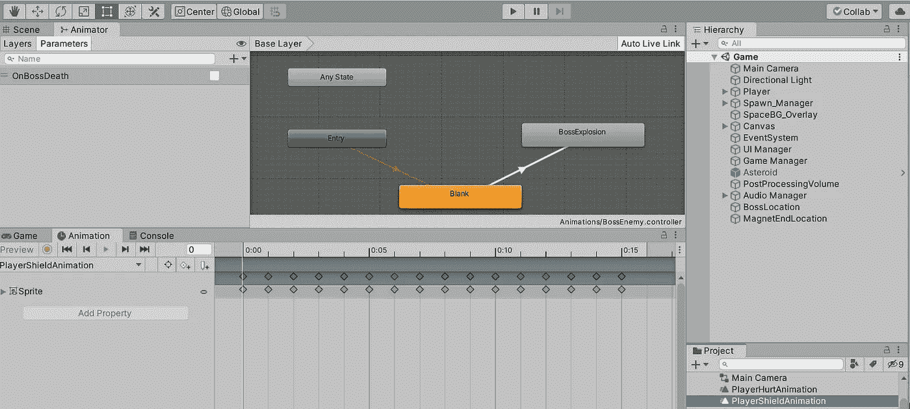
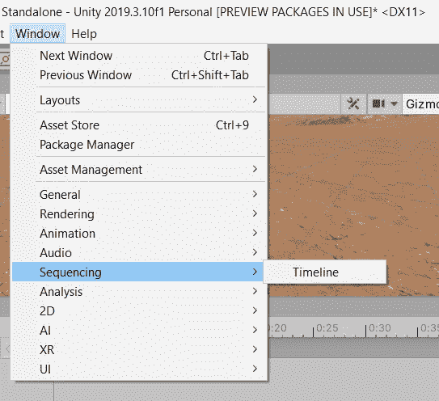
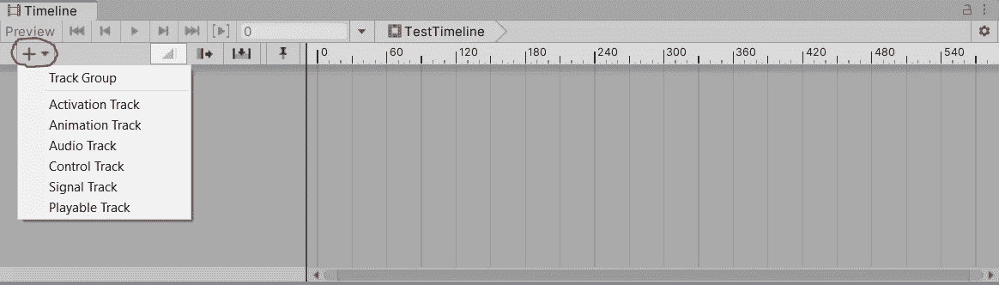
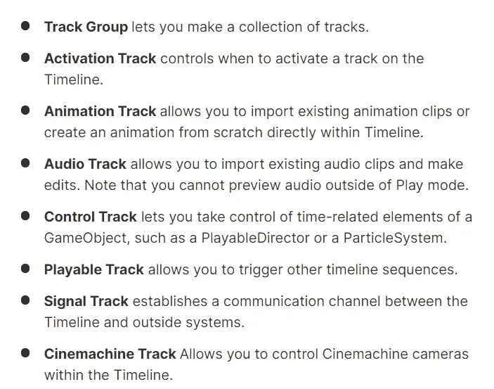
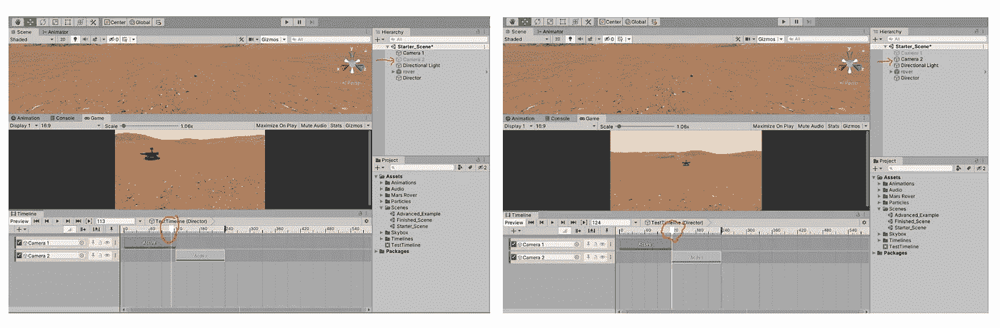
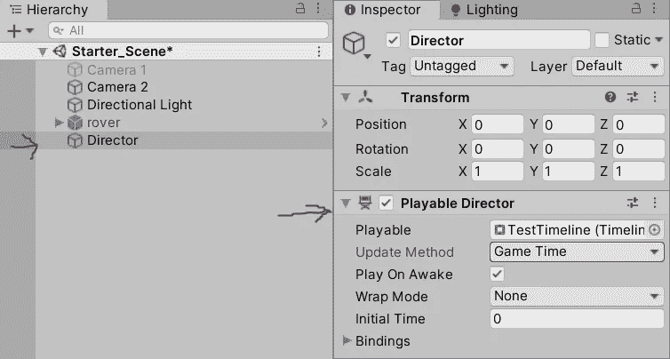

# 简介 Unity 中的时间线

> 原文：<https://medium.com/geekculture/introduction-timeline-in-unity-1056468377ba?source=collection_archive---------7----------------------->

本文探索了 Unity 中最强大的工具之一，称为时间轴。

首先，当动画选项已经可用时，人们必须理解时间线的需要。

*   一个动画基本上是一个剪辑，代表一个游戏对象的状态，如运行，闲置，行走等。动画制作人坐在控制器的座位上，该控制器基于预定的条件/规则动态地切换它所附着的游戏对象的状态。

因此，可以推断出动画-动画制作者的组合仅限于改变游戏对象的状态。

但是如果你想在不同的时刻以线性顺序撞击几个物体呢？这个问题通过时间线得到解决:)

官方的统一定义如下。

> Unity Timeline 编辑器是一个内置工具，允许您创建和编辑电影内容、游戏序列、音频序列和复杂的粒子效果。您可以在时间线上移动片段，更改它们开始的时间，以及决定它们应该如何与轨道上的其他片段混合和表现。

它是如何工作的？这需要两个要素。

**时间线资产和可选择的导演。**这些组成部分类似于动画制作人和动画师之间的关系。它们的工作方式是一样的:)

*   时间线资源是可以在项目中使用的任何媒体(轨道、剪辑、录制的动画)。它可能是外部文件或图像。它也可以是在 Unity 中创建的资源，如动画控制器资源或混音器资源。
*   一个可玩的导演将这个资产连接到一个游戏对象，产生了一个**时间线实例**。

## 注意:时间轴实例是基于场景的。

下面是你如何进入时间线。

Unity

Unity

接下来是“+”选项，它有一个包含 6 个曲目项的下拉菜单。(如果安装了 cinemachine 的话会是 7。)

那么，什么是赛道呢？

**轨迹是应用于特定游戏对象的动作(片段)。每个轨迹促进不同类型的动作(剪辑)。**

# “O***NE 轨迹只能控制一个对象。”***

这些曲目的一般菜单描述如下。

Unity

请记住，这些课程中的每一个都有自己的主题(尽管它们之间有很好的重叠),因此，本文并不涉及每一个课程。

下面是时间轴中激活轨迹的一个非常简单的用例。

 [## Video.mp4

### 编辑描述

drive.google.com](https://drive.google.com/file/d/1r4iXoZ-bYSRlEOQ8f_b43GwJH7JpQ4_0/view?usp=sharing) 

如上所述，在时间轴点击激活动作之前，摄像机 2 保持非活动状态。另一方面，摄像机 1 同时处于非活动状态。**为了适应这一点，令人惊讶的是，您并不需要编码:)**

Unity

要完成这个循环，您必须在这个游戏对象上看到可玩的 director 组件。

Unity

现在，根据到目前为止的经验，假设当摄像机 2 激活时，任务是播放不同的声音，音轨可以开始播放并适应它。

所有你需要的是另一个带有音频源组件的空游戏对象。然而，音频文件将在音轨中提及，而不是在音频源组件中提及。

 [## AudioTrackDemo.mp4

### 编辑描述

drive.google.com](https://drive.google.com/file/d/1UqrL2UtsavA68qVPh6a_JsWpDanwuSHM/view?usp=sharing) 

让我们再看一个动画的轨道。

正如本文开始部分所解释的，动画是一种基于规则/条件的状态变化。

但是，如果你只是想在其他事情发生的时候让一些事情变得有生气呢？在这个例子中，当摄像机交换时，在地面上移动一下怎么样？

在典型场景中，我可能会寻找某种输入来触发运动动画。然而，时间轴可以进入画面，基本上不需要任何输入就能实现。

 [## AnimationTrackDemo.mp4

### 编辑描述

drive.google.com](https://drive.google.com/file/d/11S2rV8wxKRdy7Y5kfNXJ7a-Mw7TPkDx1/view?usp=sharing) 

如上所述，我们也可以在时间轴中创建动画。显然，也可以附加外部动画。

所以，总的来说，timeline 允许 unity 开发者在电影片场戴上导演的帽子。你有机会按照游戏的要求编排需要发生的事件。而且，所有这些都应该用最少的努力来实现。

时间线是一个非常强大的工具，但是对于介绍的范围来说，这似乎是一个好的开始:)

下一篇文章将介绍使用时间轴的游戏中的电影剪辑:)

回头见。

非常感谢