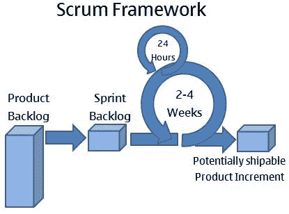
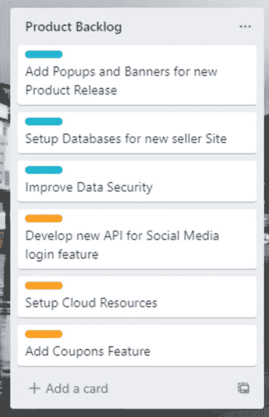
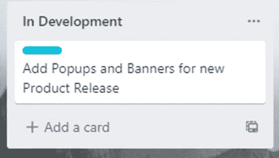
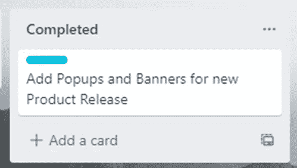
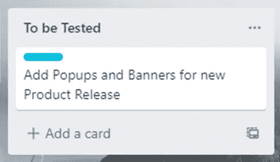
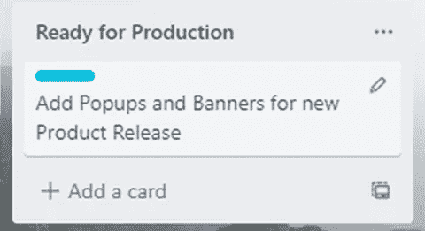
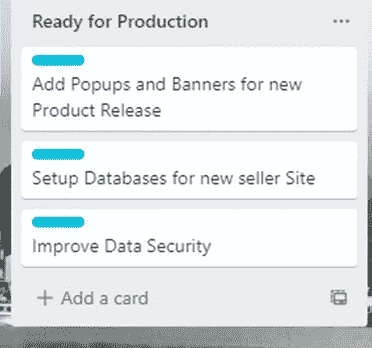
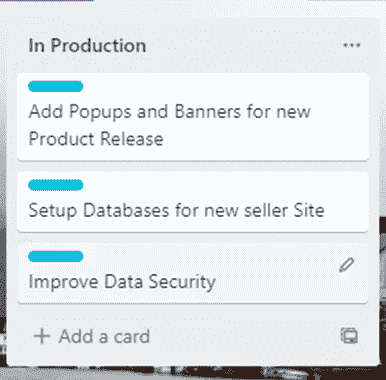

# 使用 Trello 介绍敏捷方法

> 原文：<https://medium.com/geekculture/introduction-to-agile-methodology-with-trello-883e6032caaf?source=collection_archive---------14----------------------->

Diagram of an Agile Process – SCRUM

在过去的十年中，软件开发经历了巨大的发展。工具、技术和开发实践发生了重大变化。其中一个重要的变化就是敏捷方法。作为新时代任何发展活动中最突出的概念，它是 it 行业必须知道的方法论。这篇文章主要关注项目管理网站 Trello 的敏捷方法的基础。

在我们开始一个敏捷项目之前，让我们了解一下敏捷环境的术语和概念。

**什么是敏捷？**

敏捷是一种专注于**迭代开发**的开发方法。迭代开发是指软件/产品增量开发和发布的开发行为。最重要和高优先级的特性首先发布，然后是其他特性。这里的目标是首先发布一个最小可行产品(MVP)。MVP 是一个可用的产品，但并不完全具备所有的特性。

**为什么敏捷？**

敏捷确保可以使用的最小产品被发布，其余的特性将很快出现。从客户的角度来看，发布一个 MVP 并添加其余的要比延迟发布整个产品好得多。与僵化和严格的瀑布模型相比，敏捷还使开发过程更加灵活。

**窥探特雷罗**

像敏捷这样的方法论将会利用很多项目管理平台，比如 Azure Devops、吉拉或者 Trello。项目管理软件有助于跟踪工作——待定、进行中和部署。他们保持开发过程在轨道上。

**与 Trello 一起启动一个简单的敏捷项目**

在这个活动中，我们将利用 Trello 平台并启动一个简单的 Scrum 项目。Scrum 是一种敏捷方法，在 sprints 中迭代发布。Sprints 包括 2-4 周的时间跨度，在此期间设计、开发和发布特性。对于我们的项目，我们有以下状态，特征可以穿过这些状态:

- **产品 Backlog:** 产品 Backlog 是计划为整个应用程序开发和发布的所有特性的集合。如果应用程序具有持续的特性更新，那么产品 backlog 也会持续更新。

- **Spring Backlog:** 由于敏捷专注于迭代开发，Spring Backlog 包含了当前 sprint 要开发和发布的所有特性。

- **开发中:**这给出了当前 sprint 中处于开发阶段的所有特性。

- **Completed:** 这给出了在当前 sprint 中已经完成开发，但是还没有进行测试的所有特性。

- **待测试:**这包含了所有必须测试的或者在队列中的特性。

- **在测试中:**这包含了当前 sprint 中正在测试的所有特性。

- **准备生产:**这有所有准备生产的特性，但是在当前的 sprint 中还没有发布。

- **生产中:**这包括所有 sprints 中目前生产中的所有特性。

现在我们已经准备好了董事会和国家，让我们建立一个电子商务 Scrum 项目，看看敏捷过程是如何发生的。

将以上视为我们的产品积压。蓝色标签显示 Sprint 1，橙色标签显示 Sprint 2，依此类推。

**冲刺 1:**

将蓝色标签移至**春季待办事项，开始当前的冲刺。**

既然特性已经被添加到当前的 sprint backlog 中，那么通过将每个特性分配给团队中的一个开发人员来开始开发过程。为了简单起见，让我们一次考虑一个特性。将第一个特征移动到开发状态中的**。**

一旦开发完成，人们必须将其转移到**完成**状态，并等待测试团队接手。

一旦测试团队准备好接受它，该特性必须转移到**待测试**状态。

测试团队将拿起它并移动到测试状态的**。在这一点上，某些有缺陷的特性可能会被分配给开发人员来修复缺陷。一旦测试完成并准备就绪，该功能将进入**准备生产**状态。**

Sprint Backlog 中的所有项目都经历相同的阶段，直到这个 Sprint 的所有 Backlog 都处于生产就绪状态。

一旦所有的特性都准备好发布，它们就会在每个 sprint 结束时投入生产。

这就是敏捷过程(Scrum)是如何发生的。上面的例子强调了一个基本的流程，尽管在实践中，企业平台充满了更多的特性。

感谢您的阅读！

## 有用的链接:

*   在 LinkedIn 上找到我:[https://linkedin.com/in/vishnuu0399](https://linkedin.com/in/vishnuu0399)
*   更了解我:[https://bit.ly/vishnu-u](https://bit.ly/vishnu-u)
*   项目管理工具:[特雷罗](http://www.trello.com)，[吉拉](https://www.atlassian.com/software/jira)， [Azure Devops](https://azure.microsoft.com/en-us/services/devops/?nav=min#overview)