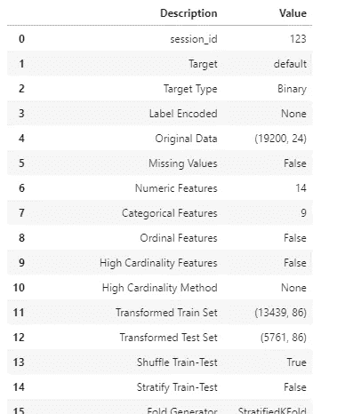
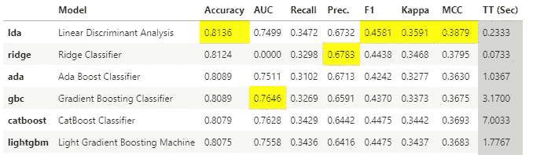
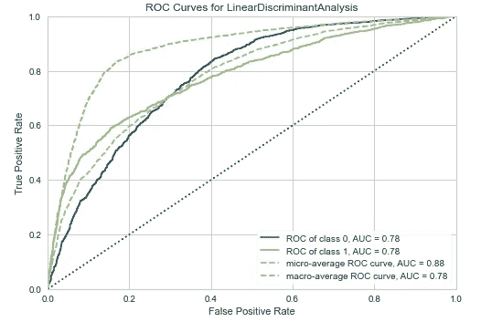
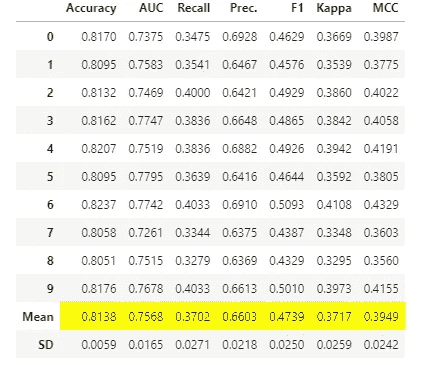

# 使用 PyCaret 的 AutoML 简介

> 原文：<https://medium.com/geekculture/introduction-to-automl-using-pycaret-3c9d4f83aaae?source=collection_archive---------5----------------------->

## Python 中自学模型的世界之旅


Photo by [Pavel Danilyuk](https://www.pexels.com/@pavel-danilyuk?utm_content=attributionCopyText&utm_medium=referral&utm_source=pexels) from [Pexels](https://www.pexels.com/photo/black-and-silver-video-camera-on-brown-wooden-table-8438868/?utm_content=attributionCopyText&utm_medium=referral&utm_source=pexels)

# 1.为什么是 AutoML？

曾几何时，自动训练的机器学习模型是数据科学家的梦想。数据科学家的典型工作是识别—理解—获取—分析—准备—培训—评估—传达。但是他们的大部分时间将只花在准备、训练和评估阶段。有时它可能是一个无限的 while 循环！

随着越来越多的企业转向机器学习来解决他们的关键问题，数据科学家被期望在更短的时间内提供结果。这就产生了将数据科学项目中的关键步骤自动化的需求，以便数据科学家可以专注于实际问题，而不是编写数百行代码来寻找最佳模型。然后出现了一个流行词，镇上的谈论。

# 2.如何做到这一点？

近年来，许多 AutoML 软件包开始出现，有些甚至是由所谓的**MAGNA**(Meta-Apple-Google-网飞 Amazon)公司开发的，并作为其云服务的一部分提供，如 Google 的 Cloud AutoML。

一些开源软件有:AutoWEKA，Auto-sklearn，Auto-PyTorch，PyCaret，H2O AutoML 等等。，我们将在这篇博客中研究它的 PyCaret 实现。

**PyCaret** 是一个开源、低代码的机器学习库，帮助数据科学家自动化他们的机器学习工作流程。它简化了模型实验阶段，从而允许他们用最少的代码获得想要的结果。

> **注意:**我假设 PyCaret 已经安装在您的机器上。你可以通过这个命令安装***pip install py caret***

我将使用 PyCaret 提供的样本数据集向您展示这个过程。这是一个分类问题，我们将预测客户是否会违约。您可以使用 get_data()函数导入数据

```
from pycaret.datasets import get_data# Import the data
df = get_data("credit")
```


PyCaret displaying the head of the loaded dataset automatically

我们可以检查数据集的形状，并将数据分为知识(将从中获得训练、验证和测试集)和有效载荷数据集。

```
# Prints the shape of the dataframe
df.shape# Preparing Knowledge set
knowledge = df.sample(frac=.8, random_state=seed)
knowledge.reset_index(inplace=True, drop=True)
knowledge.shape# Preparing Payload set
payload = df.drop(knowledge.index)
payload.reset_index(inplace=True, drop=True)
payload.shape
```

PyCaret 包括多种分类问题的算法。我们可以通过进口来利用它们。

```
from pycaret.classification import *
```

接下来，我们需要初始化环境和转换管道。这可以在 setup()函数的帮助下完成。该函数负责所有的预处理步骤，以便根据需要准备数据。我们也可以通过在调用时指定缺省参数来手动覆盖它们。我们只需要传递数据集和目标列，其他所有参数都是可选的。

```
clf = setup(data=knowledge, target="default", session_id=123)
```

在笔记本中执行此操作后，系统会提示我们指定检测到的列数据类型是否正确。按回车键确认，PyCaret 将显示以下一组信息。



现在，我们可以使用 compare_models()函数比较不同模型在我们的训练集上的表现

```
best_model = compare_models(fold=3)
```

下表显示了不同模型在我们的数据集中的表现，默认情况下根据准确性进行排序。



我们可以使用 plot_model()函数来可视化模型性能

```
plot_model(best_model, plot="auc")
```



借助 tune_model()，我们可以轻松地执行超参数调优

```
tuned = tune_model(best_model)
```



一旦我们对模型满意了，我们就可以使用该模型来预测有效负载数据，以了解它如何使用 predict_model()函数来预测看不见的数据

```
predictions = predict_model(final_model, data=payload)
```

PyCaret 还允许我们以. pkl 文件的形式保存模型，这样就可以进一步部署它以服务于生产管道。

```
save_model(final_model,'Tuned Model 13 Nov 2021')
```

正如我们可以看到的，我们用非常少的代码对数据进行了预处理，用超过 15 种算法进行了实验，并生成了我们的模型工件，可以部署这些工件以服务于实时预测。这就是使用 PyCaret 进行数据科学项目是多么容易。PyCaret 还允许我们执行先进的技术，如装袋，增压和堆叠各自的功能。

# 完整代码

# 3.它带来了什么？

**AutoML** 通过自动训练和调整模型来简化数据科学家的任务，以便根据提供给它的数据实现最佳准确性。这乍一看似乎很神奇，但它所做的只是使用不同的算法训练不同的模型，并使用网格搜索调整参数。对于一个懒惰的数据科学家来说，这绝对是梦想成真的时刻。

AutoML 仍然需要很多改进，但它绝对是机器学习领域的一个进步。作为 it 数据的结果，科学家可以专注于带来高质量的数据来解决问题。一天结束时，你花在获取高质量数据上的时间越多，你需要从中创建最佳模型的时间就越少！

# 参考

[PyCaret — pycaret 2.2.0 文档](https://pycaret.readthedocs.io/en/latest/index.html)

[安装— pycaret 2.2.0 文档](https://pycaret.readthedocs.io/en/latest/installation.html)

[为什么 AutoML 将成为人工智能的未来](https://www.forbes.com/sites/janakirammsv/2018/04/15/why-automl-is-set-to-become-the-future-of-artificial-intelligence/?sh=56e16d99780a)

[AutoML 如何帮助创建机器学习模型](https://www.cmswire.com/digital-workplace/why-automl-is-emerging-as-a-key-digital-workplace-technology/)