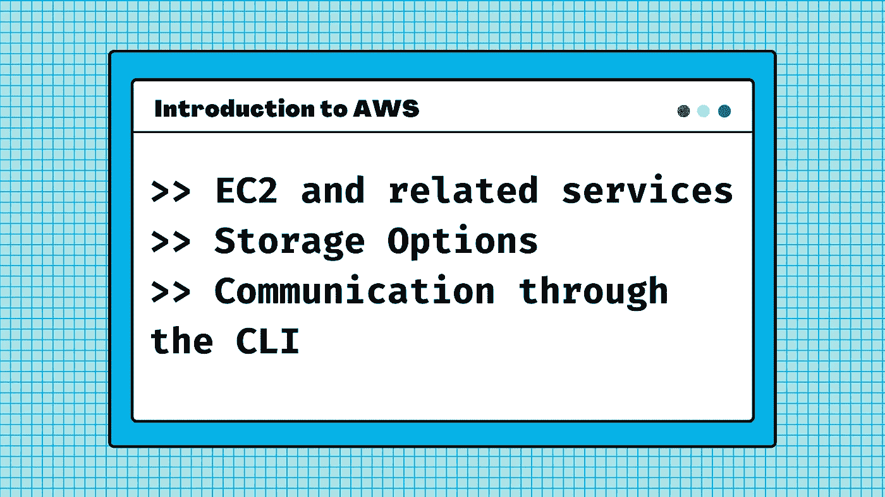
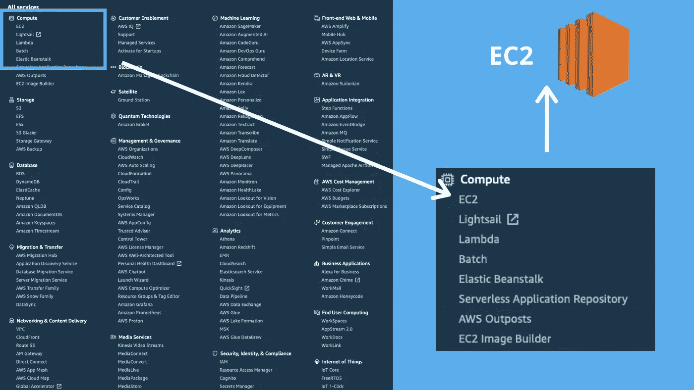
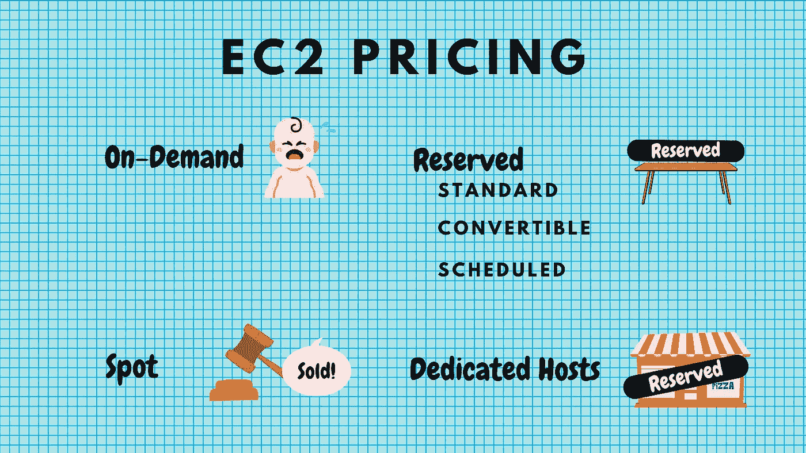
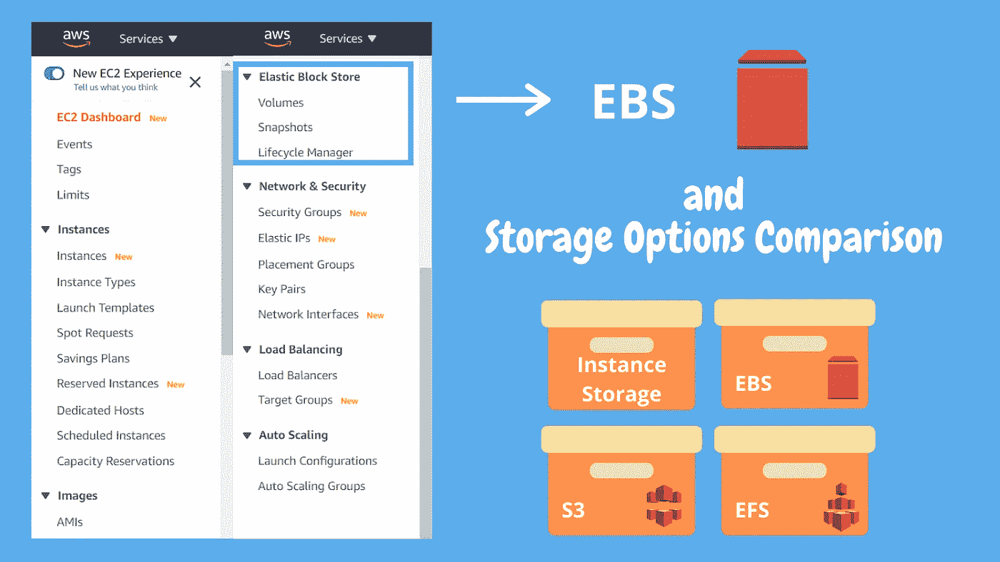
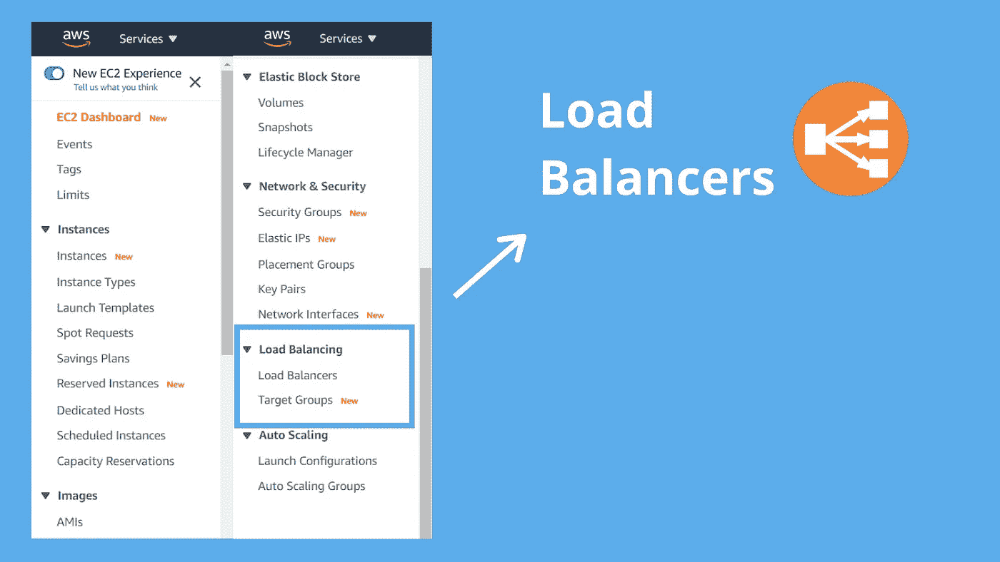
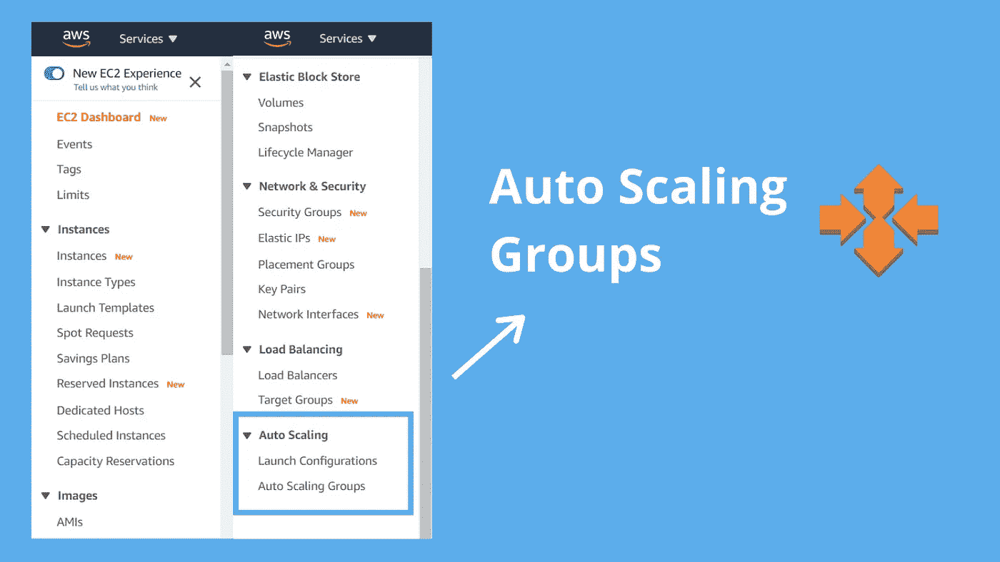

# AWS 简介:EC2、相关服务和通过 CLI 的 AWS

> 原文：<https://medium.com/geekculture/introduction-to-aws-ec2-related-services-and-cli-cfbae53c3409?source=collection_archive---------24----------------------->

## 相关的服务有弹性块存储、负载平衡和自动伸缩



在[之前的博文](https://cupofcode.blog/aws-iam-cloudfront-s3/)中，我提到 AWS 服务相互依赖，这使得很难决定以何种顺序呈现它们。

AWS 的大明星，所有教程都提到的那个，是 EC2，所以我们就从那里开始。这会很有趣的！

让我们看一个有趣的迷因，然后马上投入进去！


# EC2 —弹性计算云

## 实例类型、定价模型和实际操作示例



*弹性计算云(EC2)* 是云中的虚拟服务器。Amazon EC2 将获取和启动新服务器实例所需的时间缩短到了几分钟，使您能够随着计算需求的变化快速上下扩展容量。

一个常见的错误是认为 EC2 是无服务器的。实际上，EC2 是一个基于计算的服务，这意味着它是一个服务器！所以不是无服务器。

请注意，您应该总是针对故障进行设计，并且在每个 AZ 中有一个 EC2 实例。还记得 AZ 是什么吗？我们在[的第一篇博文](https://cupofcode.blog/cloud-computing-and-aws/)中谈到了这个问题。

## EC2 实例类型

Amazon EC2 提供了广泛的实例类型选择，并针对不同的目的进行了优化。实例类型包括 CPU、内存、存储和网络容量的各种组合，使您可以灵活地为您的应用程序选择适当的资源组合。

实例类型分为 5 组:

1.  通用的
2.  计算优化
3.  内存优化
4.  加速计算
5.  存储优化


让我们以上面的迷因为例:

以下是这两种类型的规格，它们都属于一般用途:

```
**Type     | vCPU* | Mem(GiB) | Storage  | Network** m4 large |   2   |    8     | EBS-Only | Moderate
t2 large |   1   |    8     | EBS-Only | Low to Moderate
```

嗯，看起来 m4 大号更好，那么为什么他要看 t2 大号呢？显然，这是因为它的可突发计算单元，更适合他的项目。点击[这里](https://www.apptio.com/blog/comparing-aws-t2-large-and-m4-large-ec2-instances/)如果你想了解更多，点击[这里](https://aws.amazon.com/ec2/instance-types/?trkCampaign=acq_paid_search_brand&sc_channel=PS&sc_campaign=acquisition_IE&sc_publisher=Google&sc_category=Cloud%20Computing&sc_country=IE&sc_geo=EMEA&sc_outcome=acq&sc_detail=ec2%20instance%20types&sc_content={ad%20group}&sc_matchtype=e&sc_segment=489284072828&sc_medium=ACQ-P|PS-GO|Brand|Desktop|SU|Cloud%20Computing|EC2|IE|EN|Sitelink&s_kwcid=AL!4422!3!489284072828!e!!g!!ec2%20instance%20types&ef_id=Cj0KCQjwsqmEBhDiARIsANV8H3YCRUMwrDF3z3LD0oEfZNpxRkS273vEbMlGT0GBhFbc3pnAO3PZRhQaApdaEALw_wcB:G:s&s_kwcid=AL!4422!3!489284072828!e!!g!!ec2%20instance%20types)如果你想了解更多 EC2 实例类型。

现在，让我们来谈谈钱吧！

## **EC2 有四种定价模式**

1.  **按需:**这允许你按小时(或秒)支付固定费用，没有任何承诺。
2.  **Reserved:** 为您提供容量预订，并为实例的每小时费用提供显著的折扣(比如提前一年预订酒店房间)。合同期限为 1 年或 3 年。
3.  **Spot:** 使您可以对任何价格(例如容量)进行投标，如果您的应用程序具有灵活的开始和结束时间，则可以节省更多成本。
4.  **专用主机:**专用于您的物理 EC2 服务器。专用主机允许您使用现有的服务器绑定软件许可证，从而帮助您降低成本。

让我们深入研究一下，看看什么时候应该使用哪个:

**1。按需定价适用于:**

*   想要 Amazon EC2 的低成本和灵活性而无需任何预付或长期承诺的用户。
*   无法中断的短期、峰值或不可预测工作负载的应用程序。
*   首次在 Amazon EC2 上开发或测试的应用。

**2。保留定价适用于:**

*   使用情况稳定或可预测的应用。
*   需要预留容量的应用。
*   能够指定预付费用以进一步降低总计算成本的用户。

**预留定价类型:**

1.  标准保留实例:这些实例提供高达 75%的按需实例折扣。预付越多，合同越长，折扣就越大。
2.  **可转换的**保留实例:这些实例提供高达 75%的按需修改 RIA 属性的能力，只要交换导致保留实例的创建具有相同或更大的价值。
3.  **预定的**保留的实例:这些实例可以在您保留的时间窗口内启动。此选项允许您将容量预留与可预测的重复计划相匹配，该计划只需要一天、一周或一个月的一部分。

**3。现货定价适用于:**

*   具有灵活开始和结束时间的应用程序
*   只能以非常低的计算价格运行的应用程序
*   迫切需要大量额外容量的用户
*   如果 spot 实例被 EC2 终止，您将不被收取部分小时的使用费。但是，如果您自己终止实例，您将为实例运行的任何时间付费。

**4。专用主机定价适用于:**

*   可能不支持多租户虚拟化的法规要求
*   不支持多租户或云部署的许可。提示:任何关于特殊许可要求的问题—都是关于专用主机的！
*   可以按需购买(每小时)
*   可作为预订购买，价格比点播价格低 70%



## EC2 实践:创建 EC2 实例并连接到它

当您想要启动一个新的 EC2 实例时，您需要配置一些东西:

*   地区:因为这是按地区服务。
*   Amazon 机器映像(AMI)，它提供启动实例所需的信息。
*   实例类型:t2.micro 位于自由层之下
*   添加存储— EBS —我们将很快更深入地讨论这一点。
*   安全组——**安全组**充当您的 **EC2** 实例的虚拟防火墙，以控制传入和传出流量。 *0.0.0.0/0* 一切， *W.X.Y.Z/32* 只允许 1 个 IP 地址。
    进出流量由端口控制。**端口是计算机通信的方式:**眼见为实，耳听为虚，所以它与端口一起工作:Linux 通过 SSH(端口 22)，微软通过远程桌面协议(协议 3389)，HTTP 通过端口 80，HTTPS 通过端口 443。

在您点击*启动*之后，它将创建一个密钥对，允许我们登录到我们的 EC2 机器。下载密钥对文件`MyPrivateKey.pem`后，您需要使用以下命令更改其权限:

```
chmod 400 MyPrivateKey.pem
```

现在，您可以通过键入以下命令，通过 CLI 连接到 ec2 实例:

```
ssh ec2-user@34.229.236.39 -i MyPrivateKey.pem
```

放心吧！我们将很快讨论通过 CLI 的连接！

**重要提示！如果超时，你应该检查安全组权限！**

# EBS 和存储选项比较



之前，在 EC2 的动手示例中，有这样一个零件:

> 添加存储— EBS —我们将很快更深入地讨论这一点。

很快就到了！

但是在我们讨论 AWS TLA(三个字母的缩写)之前，让我们从最简单的存储选项开始:实例存储。

## 实例存储

一些亚马逊弹性计算云(Amazon EC2)实例类型带有一种直接连接的块设备存储形式，称为[实例存储](https://docs.aws.amazon.com/AWSEC2/latest/UserGuide/InstanceStorage.html)。实例存储是临时存储的理想选择，因为存储在实例存储卷中的数据不会在实例停止、终止或硬件故障时保持不变。

## EBS:云中的虚拟磁盘

在 EC2 服务中，你会看到一个标签，上面写着*弹性块商店。*

EBS 允许您创建存储卷并将其附加到 EC2 实例。连接后，您可以在这些卷上创建一个文件系统，运行一个数据库，或者以您使用数据块服务的任何其他方式使用它们。EBS 卷被放在一个特定的 AZ 中，在那里它们被自动复制以保护您免受单个组件故障的影响。

**EBS 存储类型**

固态硬盘:

*   通用固态硬盘(GP2) —平衡各种工作负载的性能。
*   调配的 IOPS 固态硬盘(IO1) —最高性能的固态硬盘卷，适用于任务关键型低延迟或高吞吐量工作负载。

磁性:

*   吞吐量优化硬盘(ST1) —低成本硬盘卷，专为频繁访问的吞吐量密集型工作负载而设计。
*   冷硬盘(SC1) —为频繁访问的工作负载(文件服务器)设计的最低成本硬盘卷。
*   磁性—上一代产品。

## S3 vs EBS vs EFS 比较

好吧，在我们比较它们和看它们的区别之前，让我们打开那三个字母的缩写。

**S3 =简单存储服务**

我们在[之前的博客文章](https://cupofcode.blog/aws-iam-cloudfront-s3/)中了解了 S3，所以这里有一个非常简短的总结:

S3 为开发人员和 IT 团队提供安全、持久、高度可扩展的对象存储。亚马逊 S3 易于使用，有一个简单的网络服务界面来存储和检索网络上任何地方的任何数量的数据。

*   S3 是存放文件的安全地方。
*   它是基于对象的存储。
*   数据分布在多个设备和设施中。

**EFS=弹性文件存储**

非常适合文件服务器。多个 ec2 实例可以访问同一个存储。

EFS 是 EC2 实例的文件存储服务。

它易于使用，并提供了一个简单的界面，允许您快速轻松地创建和配置文件系统。

S3 vs EBS vs EFS

1.  **S3** 用于存储平面文件(对象)，如图片、文档、视频等。您不需要为它安装操作系统或数据库。
2.  **EBS** 是一个可以连接到 EC2 的虚拟磁盘。磁盘的大小可以改变，但这不是自动完成的。
3.  **EFS** 是一个可以连接到 EC2 的虚拟磁盘，磁盘的大小是有弹性的(根据使用情况可伸缩)。

# 弹性负载平衡器



弹性负载平衡自动将传入的应用程序流量分布在多个目标上，例如 Amazon EC2 实例、容器、IP 地址、Lambda 函数和虚拟设备。它可以处理单个可用性区域或多个可用性区域中应用程序流量的变化负载。

当你点击`Create Load Balancer`时，你会看到有 3 种类型(现在有 4 种，包括*网关负载均衡器*，但在任何课程中都没有提到):

*   **应用 LB (ALB)** —应用感知，这意味着它可以洞察 [*第 7 层*](https://en.wikipedia.org/wiki/OSI_model#Layer_7:_Application_Layer) ，并做出智能路由决策。
*   **网络 LB (NLB)** —当您需要超高性能和静态 IP 地址时使用。
*   经典——V1，慢慢被淘汰。有利于测试和开发，或者保持低成本。

负载平衡器配置包含:

*   我们之前提到过的安全组。
*   目标组，即它平衡的 EC2 实例组。
*   健康检查，负载平衡器通过它来确保实例是健康的，如果不健康就替换它们。

# 自动缩放组



先说问题，再看解决办法。考虑到:

*   默认情况下，ALB 是冗余的，因此跨多个 az 分布。
*   假设我们有一个数据库。正如您将在下一篇博文中了解到的，我们在另一个 AZ 中有主数据库和辅助数据库。
*   我们有一个 EC2 实例。

所以我们的问题是 EC2 实例是我们的单点故障。

解决方案是自动扩展组。ASG 是一组 EC2 实例，根据负载或运行状况进行伸缩。
基于负载意味着在流量大的时候保留很多实例，在流量不大的时候删除实例。
基于运行状况意味着，如果您的 EC2 实例之一关闭(=未通过运行状况检查)，您的 ASG 将创建一个新实例来替换它。

在 AWS 控制台中，`Auto Scaling`下有两个选项卡:`Launch Configurations`和`Auto Scaling Groups`。没有启动配置，你不能创建 ASG。启动配置使用 AMI(亚马逊机器映像)，这是 EC2 的截图。

# 使用命令行

我们在 EC2 实践中先睹为快，其中包括:

```
ssh ec2-user@34.229.236.39 -i MyPrivateKey.pem
```

现在我们将了解它是如何工作的！

可以通过三种方式与 AWS 交互:AWS 控制台、 [CLI](https://www.w3schools.com/whatis/whatis_cli.asp) 和 SDK。***SDK***(软件开发工具包)是一种通过代码与 AWS 交流的方式，不在这篇博文的讨论范围之内。

通过 AWS 控制台连接到 EC2 实例非常简单: *ec2- >实例- >点击它- >连接*。
但是，如何通过 CLI 进行连接呢？这是我们回顾上一篇博文中 IAM 服务的地方！

## 如何通过 CLI 启用通信？

1.  AWS 控制台-> IAM
2.  创建一个用户，并授予他们管理员访问权限。
3.  转到用户->点击您的用户->安全凭证->访问密钥->下载。
    您只能获得一次下载访问密钥**的权限，因此如果您丢失了它，您可以将其停用并删除，然后创建一个新的。**
4.  在 CLI 中键入:

```
ssh ec2-user@34.229.236.39 -i **MyPrivateKey.pem**
```

***myprivatekey . PEM****是您下载的安全凭证文件！*

## *配置通信:*

*通过 CLI 进行 AWS 通信:`aws <SERVICE>`*

*例如:`aws s3 mb s3://cupofcodeblog`创建一个新的桶*

*但是如果你尝试这样做，你会得到错误:*

```
*make_bucket failed: s3://cupofcodeblog unable to locate credentials*
```

*这是因为您需要配置这个 EC2 实例来与 s3 对话，有两种方法可以做到这一点:*

1.  *给它管理员 IAM 用户的**凭证***
2.  *使用**角色***
3.  ***配置凭证:***

*键入`aws configure`并给它*访问密钥 ID* 和*秘密访问密钥*:*

```
*> **aws configure**
Access key ID = **username**
secret access key = **password**
default region name
default output format = enter.*
```

*现在，当我们尝试:*

```
*aws s3 mb s3://cupofcodeblog*
```

*我们做了一个桶！而且我们输入`aws s3 ls`就能看到。*

***2。使用角色***

1.  *创建 s3AdminAccess 角色:转到 AWS 控制台-> IAM ->角色。在配置时，您选择将使用此角色的服务是 EC2。*

*2.将角色附加到特定的 EC2 实例:转到实例->勾选一个->操作->实例设置->附加或替换 IAM 角色*

*现在，您可以 ssh 到实例中，毫无问题地创建一个 bucket。*

***为什么角色更好？***

*角色是比在 ec2 实例上保存凭证更安全的选择。对于角色，如果有人攻击了您的 ec2 实例，他们仍将拥有从该 ec2 实例进入 S3 的管理权限，**但是**他们将没有对 AWS 环境的完全管理权限。这意味着当我们删除被攻击的实例时，它们失去了对 AWS env 的访问。*

*角色也更易于管理，只需添加或修改策略即可。*

*重要提示:与 IAM 用户一样，角色是全局的，而不是区域性的。*

*就是这样！没那么难吧。*

**

*今天，我们学习了 EC2 及其所有类型和定价模式。我们还了解了四种储物选项以及它们之间的区别。我们学习了负载平衡器和自动扩展组，并通过 CLI 完成了通信。*

**

*[https://cupofcode.blog/](https://cupofcode.blog/)*

*如果你读到这里，你已经到了博文的结尾，我很想听听你的想法！我有帮助吗？你在工作中也使用 AWS 吗？以下是联系方式:
https://www.facebook.com/cupofcode.blog/:[脸书](https://www.facebook.com/cupofcode.blog/)insta gram:[https://www.instagram.com/cupofcode.blog/](https://www.instagram.com/cupofcode.blog/)邮箱:cupofcode.blog@gmail.com*