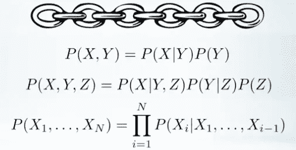
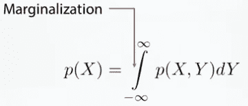
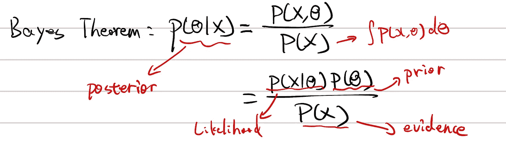
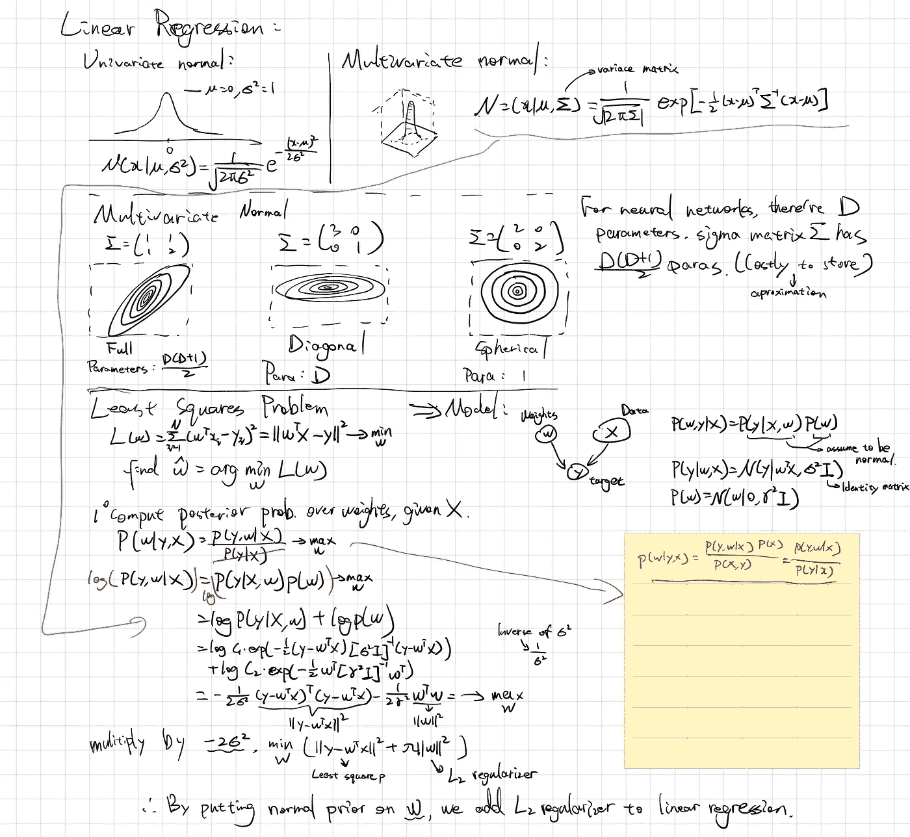
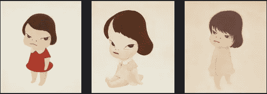

# 贝叶斯方法介绍

> 原文：<https://medium.com/geekculture/introduction-to-bayesian-methods-9e31eaab5978?source=collection_archive---------15----------------------->

这篇文章是用最简单的话向机器学习从业者介绍贝叶斯方法。先来一张图，一个问题。

## 贝叶斯思维的原则

Photo by [Nathanaël Desmeules](https://unsplash.com/@nathanael240606?utm_source=unsplash&utm_medium=referral&utm_content=creditCopyText) on [Unsplash](https://unsplash.com/t/athletics?utm_source=unsplash&utm_medium=referral&utm_content=creditCopyText)

这个男人为什么骑自行车？有几种可能的答案:

*   他正在参加一场体育比赛。
*   他在去上班的路上。
*   他被一条龙追赶。

从他的职业运动服来看，我会选择第一个答案。当然，第二个和第三个答案可能是真的(例如在电影场景中)，但我们只根据图片中的信息做出预测。贝叶斯思维的几个原则是:

1.  利用先前的知识。(除了在比赛中，人们通常不穿专业的自行车装备)
2.  选择最能解释观察结果的。(图中没有工作的迹象，也没有龙)
3.  避免做额外的假设。(如果没有龙，我们就不假设这张图的框架外有龙存在)

## 贝叶斯定理

在著名的核心函数之前，我们需要知道两个规则:链式规则和求和规则。链式法则表明，联合概率分布可以分解成一系列条件分布。

[https://www.coursera.org/learn/bayesian-methods-in-machine-learning/lecture/rPZgT/think-bayesian-statistics-review](https://www.coursera.org/learn/bayesian-methods-in-machine-learning/lecture/rPZgT/think-bayesian-statistics-review)

求和规则说，给定一个联合概率分布，我们可以得到一个随机变量的分布，如果我们对另一个进行积分，如下所示。

[https://www.coursera.org/learn/bayesian-methods-in-machine-learning/lecture/rPZgT/think-bayesian-statistics-review](https://www.coursera.org/learn/bayesian-methods-in-machine-learning/lecture/rPZgT/think-bayesian-statistics-review)

然后，我们有下面显示的最重要和非常简单的贝叶斯定理公式，其中θ表示模型中的一组参数，X 表示观察数据。

这个公式是如此重要，以至于我们对公式中的每个部分都有正式的名称，即后验、先验、似然和证据。

*   先验:我们对参数的假设。请注意，在最简单的情况下，我们只有一个标量参数，假设该值受标准正态分布控制。
*   证据:观察数据的分布。同样，它是高度抽象的，证据可以用多种方式表达:图片的像素值数组，句子的一键编码序列，等等。
*   可能性:我们的参数如何解释观察到的数据。
*   后验:给定观测数据，这组参数在现实世界中发生的概率有多大？

如上图所标注的，证据概率分布也可以通过求和规则来计算。但是只要想想我们现在的深度学习模型有多复杂(一个简单的任务就有几百万个参数)。大多数时候都很棘手。

## 作为正则项的先验假设

下图是我对单变量/多变量正态分布及其概率密度分布的注释。此外，我还展示了具有选定先验的贝叶斯网络(不是贝叶斯神经网络)如何与具有 L2 正则化的最小二乘问题完全相同。

最小二乘问题就像机器学习的 Hello World，在这里，您希望用一条线来拟合 2D 平面上的一组数据点。我不应该浪费你的时间，因为这里有一个完美的视觉效果。最小二乘问题是带有平方损失的第一次回归。

从我的笔记中，你可以看到贝叶斯网络是一个有向图。我们用此图建立了最小二乘问题的模型:权重和数据都会影响目标值(因此有指向箭头)。我们假设先验服从正态分布。

如果你不想看方程，我希望你有这样的收获:正态分布假设意味着权重是围绕平均值形成的，并由标准差控制，这在直觉上与 L2 正则化相同。

## 分析推理

让我们重温一下贝叶斯定理来评估计算证据概率分布的困难性。

例如，我们正在对奈良美智的画做一些工作。主要目标可以是任何东西，比如那些孩子的性别？(如果我们有图片的标签，就可以进行监督学习)在我们最大化参数的后验概率之前(假设在深度神经网络中)，我们要计算 P(X)，这本身就是一个非常难的问题。

Yoshitomo Nara is famous for drawing kids

这是深度学习模型解决的普遍生成任务，如或[甘](https://en.wikipedia.org/wiki/Generative_adversarial_network)。为了学习一个 P(X ),我们正在重建一个机器画家，他画的和奈良美智一模一样。为什么我们要为了完成简单的任务而去实现困难的目标呢？

因此，我们求助于最大后验概率(MAP)估计来避免计算证据。我们想计算贝叶斯公式中后验概率的 arg max/Theta。如果你想清楚了，P(X)在这个任务中是无关紧要的，我们可以忽略它。你想对 P(X|Theta)P(Theta)求导，让它为零。然后你会得到θ的点估计。

我在这里跳到地图的反面。

*   对于重新参数化不是不变的。(将 sigmoid 函数放到标准正态分布上，你会发现最大值发生了变化)
*   不能作为先验，因为这是点估计。
*   这很可能是一个不典型的点。(容易出现异常值)

## 共轭先验

我们还可以通过选择共轭先验来避免计算证据概率分布。维基百科的定义如下，

> 在[贝叶斯概率](https://en.wikipedia.org/wiki/Bayesian_probability)理论中，如果[后验分布](https://en.wikipedia.org/wiki/Posterior_probability)*p*(*θ*|*x*)与[先验概率分布](https://en.wikipedia.org/wiki/Prior_probability_distribution) *p* (θ)在同一个[概率分布族](https://en.wikipedia.org/wiki/List_of_probability_distributions)中，则先验和后验称为**共轭分布，**和先验称为**共轭先验**
> 
> ——[https://en.wikipedia.org/wiki/Conjugate_prior](https://en.wikipedia.org/wiki/Conjugate_prior)

用一句话来说，如果它看起来(字面上)像一个先验，你检查后验。共轭关系是先验和似然之间的关系。如果我们有共轭先验，我们就能有精确的后验，这真是太棒了。唯一的缺陷是，我们只有几对共轭关系，大多数时候，它们不足以解决我们的问题。

这里列出了一些常见的分布:伽玛/贝塔/伯努利/正态/等等。

## 参考

 [## 机器学习的贝叶斯方法

### 人们在许多领域应用贝叶斯方法:从游戏开发到药物发现。他们给了很多人超能力…

www.coursera.org](https://www.coursera.org/learn/bayesian-methods-in-machine-learning)