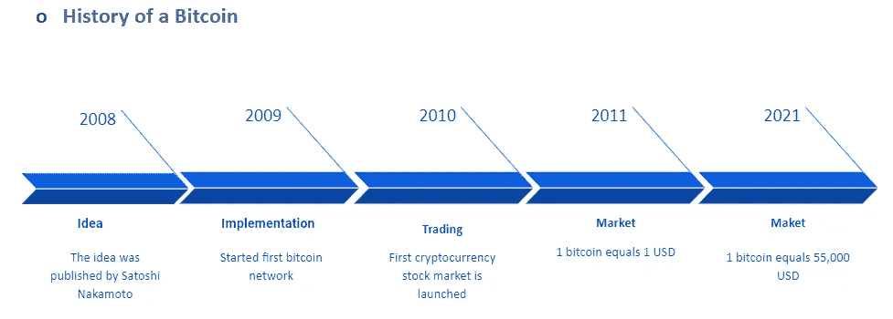
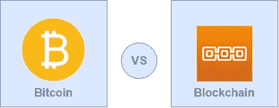
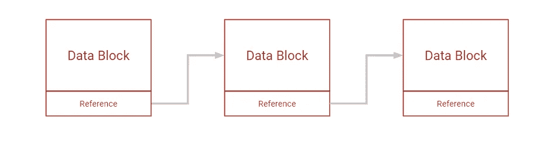
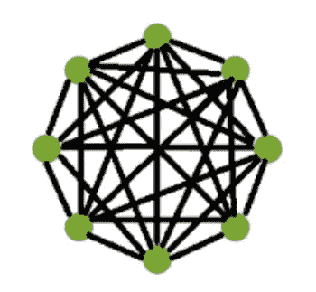
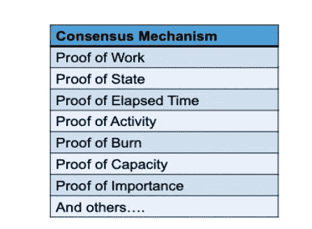
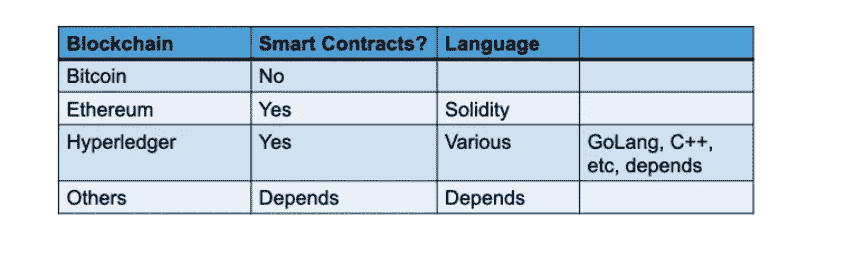

# 比特币和区块链简介

> 原文：<https://medium.com/geekculture/introduction-to-bitcoin-and-blockchain-731c66a0831d?source=collection_archive---------10----------------------->

## 介绍

在本文中，我们将讨论比特币和区块链网络的一些概念。

## 观众

区块链初学者，密码交易员。

## 历史

区块链继续受到关注，它是数字加密货币比特币的骨干技术。区块链的概念首次出名是在 2008 年 10 月，作为比特币提案的一部分，旨在创造没有银行的 P2P 货币。

下图是比特币的演变过程。

Evolution of bitcoin

比特币网络由大量计算机(节点)组成。每个节点都有一个比特币区块链的副本。与流行的支付网关相比，比特币的交易费用相当低。首要的是得到一个比特币钱包。钱包类似于你的银行账户，用来发送、接收和安全地存储资金。

## 比特币是区块链？？

如今，许多人通过加密货币赚了很多钱。然而，他们仍然分不清比特币和区块链。

Bitcoin vs Blockchain

比特币是区块链科技的**应用**。区块链是**底层框架**，可以用于很多东西，包括加密货币。比特币建立在区块链框架之上。

## 什么是区块链？？

区块链看起来很复杂，它肯定是复杂的，但它的核心概念真的很简单。区块链是一种在数据块列表中不断增长的数据库。数据块被链接在一起，使得旧块不能被移除或改变。

Blockchain(Chain of data blocks)

区块链是一种 DLT，其中交易用不可变的加密签名记录，称为哈希。

## 区块链是一个由以下部分组成的系统

*   **事务:**我们写入块中的任何数据都称为事务。以下是一些交易用例。
*   个人身份证明:更换出生/死亡证明、驾驶执照
*   银行业务:银行对账单、银行交易、后台记录。
*   **不可变账本:**与现有数据库一样，区块链通过交易保留数据。事务是不可变的。用 DBA 术语来说，区块链只支持**写**和**读**操作。您不能更新和删除数据。你可能会有疑问，如果我们误写了错误的数据怎么办？？要解决这个问题，我们必须创建一个新的事务，并将其写入区块链。
*   **分散节点:**完整的**节点**基本上是一个设备(像计算机一样),它包含了**区块链**的事务历史的完整副本
*   区块链是一个去中心化的点对点网络。**这里每个节点都有一份总账。**在下图中我们可以看到，每个节点都连接到网络中所有的现有节点。

Decentralized blockchain network

*   加密过程:区块链使用两种加密算法，非对称密钥算法和散列函数。哈希函数用于向每个参与者提供区块链的单一视图功能。
*   区块链通常使用 SHA-256 散列算法作为他们的散列函数。一些区块链允许“BYOE”(自带加密)。所有块都加密了。有些区块链是公共的，有些是私有的。公共区块链仍然是加密的，但公众可以查看。前任。比特币、以太坊等。
*   **共识机制:**共识算法是所有区块链网络节点就分布式账本的当前状态达成**共识**的过程。
*   通过这种方式，共识算法在区块链网络中实现了可靠性，并在分布式计算环境中的未知对等体之间建立了信任。
*   此外，它确保区块链中的下一个块是真实的唯一版本。有许多共识算法可用，每一个都有一些优点和缺点。以下是一些共识算法的列表。

*   智能合同:智能合同是自动执行的合同，包含对等方之间协议的条款和条件。协议的条款和条件被写成了代码。这些协议促进了货币、股票、财产或任何资产的交换。基本上，我们在这里实现我们的业务逻辑。
*   下表包含了一些“了解区块链”的框架。

## 摘要

我们已经讨论了什么是比特币、区块链、智能合约、共识、账本、交易等。