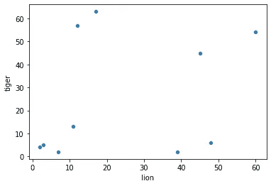

# 集群简介

> 原文：<https://medium.com/geekculture/introduction-to-clustering-ff905d79bef9?source=collection_archive---------43----------------------->

围绕数据科学的许多讨论都集中在它的预测能力上，即创建模型的能力，这种模型可以区分预先存在的类别并估计未知。然而，数据科学还有其他应用，这些应用可以促进预测建模，或者独立于预测建模而存在。一种这样的应用是聚类，或者用算法将观察结果分组到先前没有定义的类别中。简而言之，聚类就是使用数学将事物分组，由数学(而不是您)来决定分组应该是什么。

在之前的一篇关于远程阅读的文章中，我用了一个例子，根据书中提到狮子和老虎的次数来对书进行分类(见下图)。一组假想的书被放在散点图上，一个轴是单词“tiger”出现的次数，另一个轴是单词“lion”出现的次数。在情节上，这些点在角落处明显形成明显的群体，我推测会是(从左上顺时针方向)关于老虎的书，关于大型猫科动物的书，关于狮子的书，以及关于其他东西的书。这是群集背后概念的基本说明。使用单词“lion”和“tiger”的实例作为我们的度量，我们已经将这些书籍分类到上面列出的四个集群中。

在我开始定义比上面使用的“当我看到它时我就知道”方法更精确的聚类之前，似乎有必要解释一下*为什么*聚类对分析有用。将事物分组固然很好，但是集群的真正价值来自于比较这些组的能力。充分利用聚类潜力的一个极好的分析例子是[皮尤研究中心 2018 年的宗教类型分析](https://www.pewforum.org/2018/08/29/the-religious-typology/)。皮尤定期收集和分析包括美国宗教在内的主题信息，但自我认定的宗教分类可能很模糊，包含完全不同的群体。例如，天主教会是一个中央集权的组织，有着鲜明的官方教义，但自认为是美国天主教徒的人范围广泛，从每天认真遵循梵蒂冈公告的高度虔诚的教徒，到很少参加服务并更自由地解释教义的人，白人和西班牙裔天主教徒的文化和传统如此不同，以至于调查经常将两者分开。同样，即使在一个自我认同的宗教团体中表达相似宗教信仰水平的人，对新时代信仰(如通灵学)的坚持程度也可能大相径庭，不同的实践模式最好作为单独的团体对待。为了缓解这种情况，皮尤研究小组根据对宗教信仰和实践调查的回应，使用聚类对个人进行重新分组。由此产生的分组比自我确定的分类更能反映宗教信仰和实践的类型和水平(例如，犹太教在最重要和最不重要的宗教类别中都有大量成员)，并揭示了数据的一个新层面。对新集群的分析揭示了集群之间在人口统计和政治信仰方面的明显差异，例如接受新时代信仰的集群成员更有可能是女性，并且在所有宗教信仰层面都倾向于自由派，而拒绝新时代信仰的两个高度宗教化集群倾向于保守派，尽管*也倾向于女性。当可用的标签无法捕捉动态时，像这样的重新分组可以帮助理解大型、复杂的组。*

对数据进行聚类有几种不同的方法，为了对它们进行比较，您必须首先了解什么是“好”的聚类。因为聚类与预定义的组不一致，所以我们不能像预测那样根据测试集来评估它们。相反，我们主要依靠对它们“聚集”程度的测量，尤其是**内聚**和**分离**。简单来说，内聚性度量的是一个簇内的点的紧密程度，而分离性度量的是簇之间的距离。这些指标帮助我们确定我们的集群工作得有多好，以及应该有多少个集群。在上面的书籍示例中，我们可以只定义两个聚类，图左侧的点(没有很多狮子的书籍)和右侧的点(有很多狮子的书籍)，但是由于聚类底部和顶部的点之间的间隙，聚类的内聚性较低。然而，对于四个聚类，内聚性显著提高而没有损失太多的分离，这表明这可能是用于分析的更好的聚类。内聚性和分离性通常结合在一个单一的度量中，轮廓系数(或轮廓分数)的范围从-1 到 1，分数越接近 1 表示分离性和内聚性越好。一般来说，轮廓分数越高，聚类越好。

从数学上来说，聚类通过计算点之间的超维度距离来工作。这意味着，如果我们使用数学规则来分组点，而不是简单地“目测”，我们可以扩展到包括更多的维度。在我们的书籍示例中，我们只在二维空间中绘制点，然后通过将点与附近的其他点分组来确定聚类一旦我们增加了第三个和第四个维度(比如，每本书提到熊的次数和短语“哦，我的”出现的次数)，我们就不能在物理空间中绘制这些点，但我们仍然可以计算它们之间的理论距离。聚类算法只是使用这些距离来确定哪些点属于同一个聚类，哪些点应该分开。一个重要的注意事项:为了使距离有意义，它们都需要在相同的范围内。如果我们绘制不同跑步者完成一场马拉松所用的秒数与他们身高(英尺)的关系图，这些点将沿着“秒”轴分散开来，以至于没有任何实际的身高变化会使他们之间的距离产生显著差异。为了解决这个问题，通常最好是在聚类之前将所有数据按照平均值的标准偏差数进行分类。一只脚的高度差和五千秒的马拉松时差代表了相似数量的标准差，因此在计算距离时，它们应该被视为相似的数量，而不是相差几个数量级。

聚类有许多类型，但这里只讨论其中的两种。这两种中的第一种是基于中心的聚类，以最常见的聚类方法为例: [k-means](https://scikit-learn.org/stable/modules/clustering.html#k-means) 。基于中心的聚类根据点与中心点的距离将点组合在一起。如果一个点比其他任何点都更靠近一个中心，那么它属于该中心的簇。有不同的方法来确定这些中心，其中之一是前面提到的 k-means。在 k-means 聚类中，任意数量(由 *k* 表示)的质心被放置在数据点之间。将每个数据点分配给最近的质心，然后质心位置更新为分配给它们的所有点的平均值(因此“k-means”)，并且重复这些步骤，直到质心不再显著移动。一旦质心确定下来，它们就定义了每个簇的中心点，距离它们比距离其他中心更近的点就是该簇的成员。我会把这个过程可视化来帮助解释，但是[纳夫塔利·哈里斯已经比我做得更好了。K-means 有一些明显的缺点——它需要你预先选择聚类的数量，并且很难识别一些不规则形状的聚类——但是它简单、快速、有效。通常，即使对于复杂的应用程序，迭代不同数量的聚类的 k-means 以找到一个具有良好的内聚性、分离性和分析价值的聚类也是一种可行的方法。例如，皮尤研究中心的宗教类型学分析](https://www.naftaliharris.com/blog/visualizing-k-means-clustering/)[使用 k-means 来定义其聚类](https://www.pewforum.org/2018/08/29/appendix-a-about-the-religious-typology/)。

我将在这里描述的第二种类型的集群是基于密度的集群，例如常用的方法 [DBSCAN](https://scikit-learn.org/stable/modules/clustering.html#dbscan) 。基于密度的聚类不是使用距中心点的距离来定义聚类，而是将聚类定义为紧密聚集在一起的点的区域，这些点通过具有较少点的低密度区域彼此分开。由于这种不同的定义，基于密度的聚类通常比基于中心的方法更慢，计算更复杂，但在识别不规则形状和紧密交织的聚类方面更好。与 k-means 不同，DBSCAN 不需要设定数量的聚类，而是需要一个预设的距离值(称为*ε*)，该距离值决定 DBSCAN 将连接的点相距多远。对于每个点，ε半径内的所有其他点都被认为是连通的，因此都在同一个聚类中。由于点与它们的近邻相连，聚类会在密集区域中传播，并在达到大于ε值的间隙时停止。为了防止少量的点形成大量无关紧要的聚类，可以为形成正式聚类所需的连接点的数量设置最小值。同样， [Naftali Harris 对这种聚类过程有着极好的可视化。由于其能够分离不规则、交织的簇并排除噪声，DBSCAN 非常适合具有噪声和统计异常值的复杂数据——事实上，DBSCAN 代表“**D**en sity-**B**ased**S**partial**C**lustering of**A**应用程序 with **N** oise。”值得注意的是，因为它们强调连续性而不是紧凑性，所以基于密度的算法的解决方案可能会由于密集、细长集群的末端之间的距离而获得令人惊讶的低轮廓分数。没有能为您提供所有答案的灵丹妙药，始终保持对您的数据和应用于数据的流程的理解是非常重要的。](https://www.naftaliharris.com/blog/visualizing-dbscan-clustering/)

关于聚类还有很多很多东西需要学习(分区与层次、硬与模糊、排他与重叠、异质与同质，以及 Birch、光学、光谱、仿射传播、HDBSCAN 和均值漂移等方法)，但这应该是对什么是聚类、为什么要这样做以及可以采用的一些方法的基本介绍。它可能不像预测建模那样花哨，但聚类是一种强大而通用的工具。当处理复杂的数据集时，尤其是具有不明确或自相矛盾的类别的数据集时，聚类有助于使混乱变得有序，并极大地支持分析。