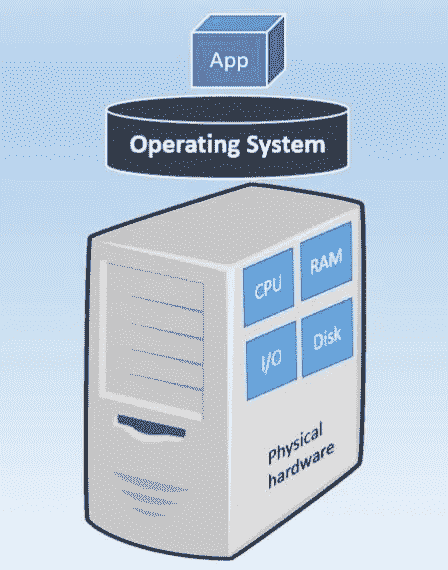
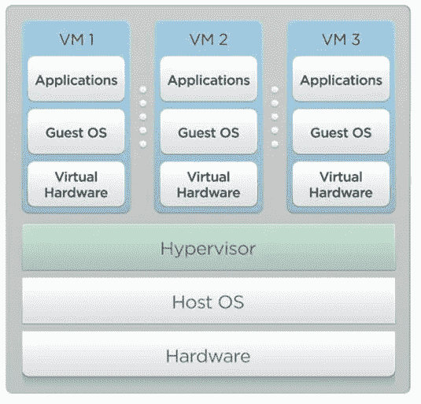
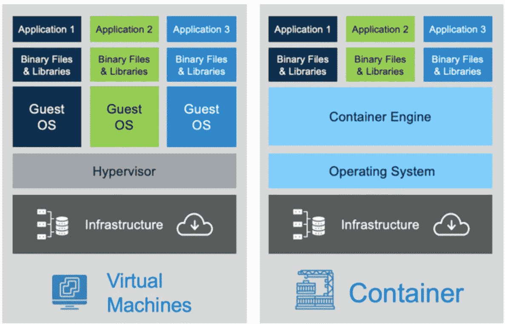
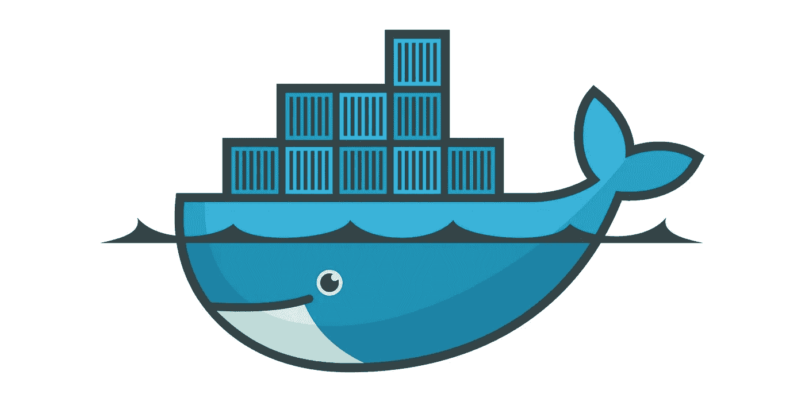
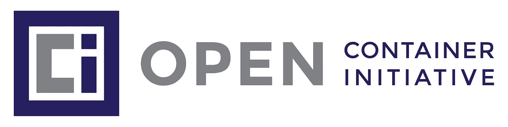

# 基于容器的应用程序开发简介

> 原文：<https://medium.com/geekculture/introduction-to-container-based-application-development-8ac4a7522858?source=collection_archive---------6----------------------->

Fig 1: Containers (Source: Google)

# 应用架构的演变

# 第 1 代:黑暗时代

> 一台物理服务器—一个应用程序

Fig 2: 1st Generation

第一代系统由一个物理服务器和一个应用程序组成。物理服务器是为单个用户设计的，不能在其他用户之间共享。**一个** **单一操作系统在物理硬件**之上。应用程序运行在这个操作系统之上。这种实现有许多缺点，

## 不足之处

*   浪费资源。
*   维护成本巨大。
*   部署缓慢。
*   更难扩展。
*   难以迁移。

# 第 2 代:基于虚拟机管理程序的虚拟化

> *一台物理服务器—多台虚拟机*
> 
> *一个虚拟机—一个应用*

Fig 3: 2nd Generation

## 重要术语

*   **虚拟化:**创建一个没有实体的虚拟版本。
*   **虚拟机:**计算机系统的虚拟化。
*   **Hypervisor** :能够创建和运行虚拟机的软件。

这使得我们能够在一台物理服务器上运行多个虚拟机。这些虚拟机中的每一个都有一个单独的操作系统，并分配有一定数量的内存。让我们讨论一下这种实现的优缺点。

## 优势

*   更好地利用资源。
*   缩放相对容易。

## 不足之处

*   多个虚拟机需要多种资源。
*   便携性较差。
*   管理和配置不同的虚拟机。

# 第三代:容器

容器作为上述问题的解决方案出现了。容器基本上帮助软件在不同的计算环境中可靠地运行。容器和虚拟机都有类似的资源隔离和分配优势，但容器更加便携和高效。

Fig 4: VMs vs Containers

> **容器虚拟化操作系统而不是硬件。**

# 码头工人

Fig 5: Docker

> ***一个可以用来容器化应用的工具。***

Docker 基本上是一个容器引擎，在 Linux 内核特性的帮助下，可以用来在现有操作系统之上生成容器。它是一个开源项目，为开发人员提供了一种机制，可以轻松地将应用程序从基础设施中分离出来，以便快速可靠地交付软件。开发人员可以使用或不使用 docker 来创建容器。然而，docker 使它更容易构建，并具有许多不同的优点。

*   易于扩展。
*   高度可用。
*   易于部署。
*   易于管理的应用程序。

其他关键方面，

*   Docker 是轻量级的 T21，因为它只包含必需的操作系统进程和依赖关系。普通的 VMs 容器必须支持整个操作系统实例的有效负载。
*   Docker 通过提供简单的部署、供应和重启机制，显著提高了开发人员的生产力。
*   Docker 为**提供了巨大的资源效率**，因为开发者可以在相同的硬件上运行应用程序的不同副本。

让我们详细看看与 Docker 相关的一些概念。

## Docker 图像

这是 docker 中的关键组件之一。它基本上是一个带有一组指令的模板，可用于创建 docker 容器。docker 图像可以包含诸如，

*   应用程序代码。
*   图书馆
*   工具
*   依赖性等等。

Docker 映像能够拥有一个或多个特定容器的实例。创建 docker 映像有两种主要方式。

*   **交互**:从现有的 Docker 映像运行一个容器。
*   **Docker 文件**

## Docker 文件

开发人员可以从 docker hub 下载 docker 映像并使用它们。然而，在有些情况下，开发人员需要创建定制的 Docker 图像。docker 文件是一个文本文件，它解释了自己构建 Docker 映像的过程。

## 码头引擎

指 Docker 的核心产品。Docker 引擎是负责使用其服务和元素构建和运行容器的主要组件。该引擎包含 Docker 守护程序和 Docker CLI。这基本上是一种用于构建容器化应用程序的容器化技术。

## Docker 注册表

指能够存储和分发 Docker 图像的服务器端应用程序。这个应用程序是开源的，高度可伸缩的。

何时使用 docker 注册表？

*   当需要控制 Docker 图像的存储位置时。
*   拥有图像分发管道的全部所有权。
*   将图像存储集成到内部开发工作流程中。

**Docker Hub** 可以作为 Docker Registry 的替代品。它包含零维护的现成解决方案。

## Docker 编排

这指的是将所有 docker 实例集合在一起并追求共同目标的过程。它基本上是一个工具—

*   将应用程序打包并作为容器运行。
*   查找现有的容器图像。
*   部署容器。

例如，一个应用程序可能有几个组件，如 HTTP 引擎、HTTP 授权等。可能有几个容器来执行这些活动。Docker 编排将决定容器应该放在哪里，需要什么依赖关系，等等。

有各种框架可以用来执行这个编排过程。

## **Kubernetes ( k8s )**

一个流行的开源容器编排平台。Kubernetes 自动化了容器编排中涉及的手动流程(部署、管理和扩展)。这是通过将可用的应用程序容器分组到逻辑单元中来实现的，以便于管理和发现。

**Kubernetes 的特点**

*   存储协调。
*   自动推出和回滚。
*   服务发现和负载平衡。
*   水平缩放。
*   批量执行。

Docker 是一项持久的技术。特定容器中的文件即使在容器停止执行后也是持久的。Docker 可以用于现有的应用程序和新的应用程序。然而，为了充分利用 Docker 的功能，应用程序应该适合正确的架构。这意味着即使是遗留应用程序也可以使用 docker。然而，它们可能无法发挥 docker 的全部功能。

# 开放集装箱倡议(OCI)

Docker Inc 公司在 2011 年引入了 Docker 的技术。另一家公司开始使用这个 docker 概念，他们发现它不适合他们的架构和业务需求。因此他们实现了一个叫做 Rocket 的类似框架。后来，这造成了许多不同的管理和技术问题。因此，多克和火箭达成协议，成立 OCI。

OCI 是一个开放的治理结构，其明确目的是围绕容器格式和运行时创建开放的行业标准。包含 2 个主要规格。

*   运行时规范
*   图像规格

我使用了 Krishntha Dinesh 先生的以下视频来收集所需的信息。

# 参考

 [## Docker 注册表

### 这个页面包含了关于使用开源 Docker 注册表托管你自己的注册表的信息。供参考…

docs.docker.com](https://docs.docker.com/registry/#:~:text=The%20Registry%20is%20a%20stateless,under%20the%20permissive%20Apache%20license)  [## 开放容器倡议-维基百科

### 开放容器倡议(OCI)是一个 Linux 基金会项目，由 Docker 于 2015 年 6 月启动，旨在设计开放的…

en.wikipedia.org](https://en.wikipedia.org/wiki/Open_Container_Initiative)  [## 基于虚拟机管理程序的虚拟化

### 与基于虚拟机管理程序的虚拟化相比，操作系统级虚拟化或容器具有以下区别…

www.sciencedirect.com](https://www.sciencedirect.com/topics/computer-science/hypervisor-based-virtualization)  [## 什么是码头集装箱注册

### 容器是一种打包格式，它以标准格式打包应用程序的所有代码和依赖项…

www.oracle.com](https://www.oracle.com/it/cloud-native/container-registry/what-is-docker/)