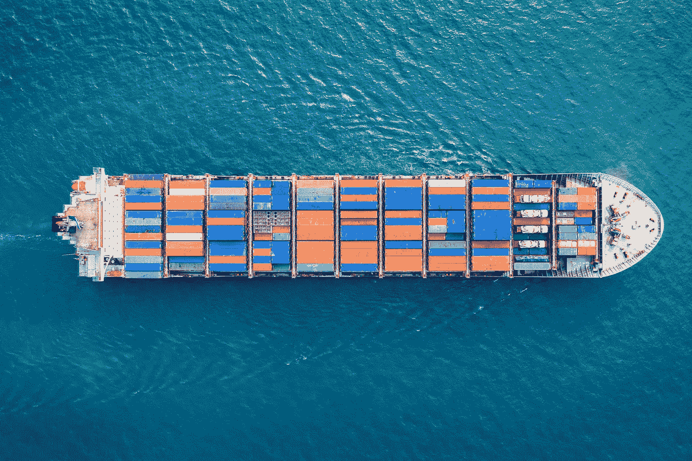
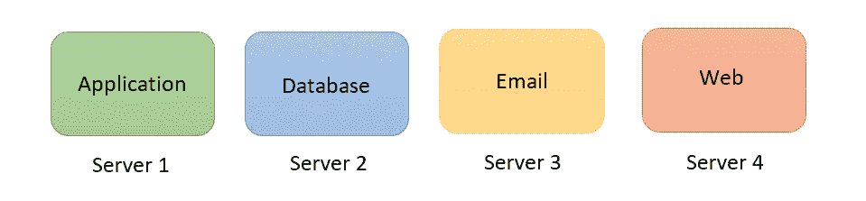
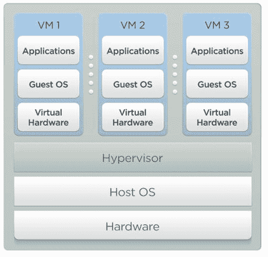
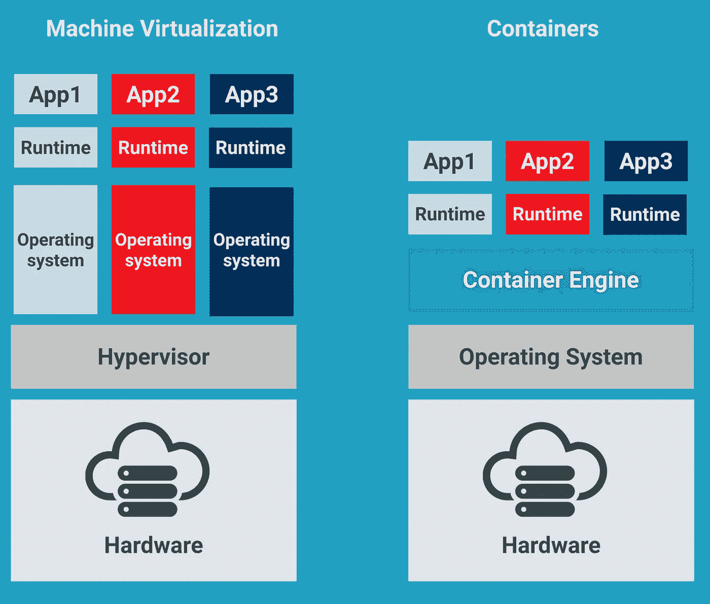
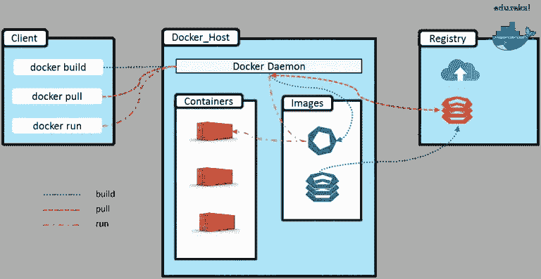
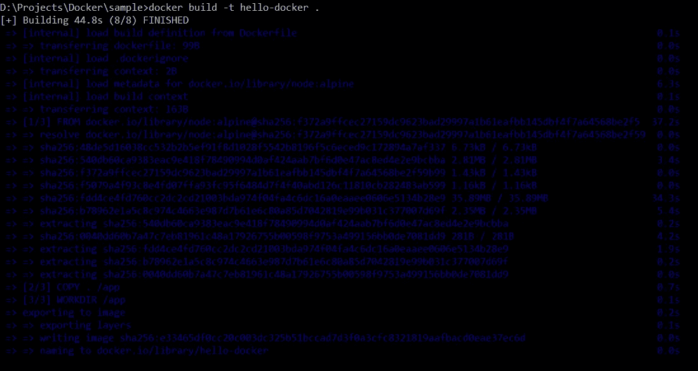
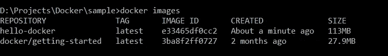
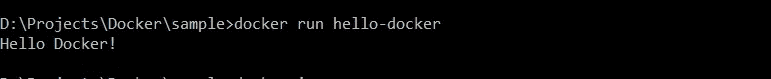

# 介绍容器化的应用程序并在 Docker 上部署简单的应用程序

> 原文：<https://medium.com/geekculture/introduction-to-containerized-applications-and-deploy-simple-application-on-docker-f0d85952867b?source=collection_archive---------17----------------------->



如果你是一名软件工程师，你必须知道你的应用程序部署在哪里。几年前，web 应用程序部署在专用的物理服务器上。应用程序部署的发展可以被认为是三代。为了你的知识，我们来探讨一下吧。

# 第 1 代—专用物理服务器

早期，应用程序部署在专用物理服务器上。您可能认为现在也部署在物理服务器上。但这是一个不同的故事。例如，如果您的应用程序需要不同的服务器，如应用服务器、数据库服务器、邮件服务器和 web 服务器，您必须有四个不同的硬件设备(物理服务器)来部署这个应用程序。



这些服务器有许多缺点。

*   服务器空间(服务器机房)
*   维护成本(空调房、安全、服务)
*   独立网络
*   操作系统
*   资源浪费(服务器没有使用 100%的处理能力/内存)

# 第 2 代—虚拟机管理程序

在这一代，**虚拟机**解决了上一代的几个缺点。虚拟机是物理机(硬件)的抽象。因此，很少有虚拟机可以在物理机上运行。让我们看看虚拟机的创建。首先，**虚拟机管理程序**安装在高性能服务器(物理机)之上。虚拟机管理程序是一种用于创建和管理虚拟机的软件。有许多虚拟机管理程序，如 VirtualBox、VMware、Hyper-V 等。

安装虚拟机管理程序后，将在虚拟机管理程序上安装单独的虚拟机。这些虚拟机根据服务器要求进行配置。例如，应用服务器可能使用 20%的处理能力，数据库服务器可能使用 20%的处理能力，而 web 服务器可能使用 10%的处理能力。因此，我们可以根据需求来管理资源。



Hypervisor Architecture

接下来，我们需要在虚拟机上安装操作系统。然后应用程序被安装在操作系统上。这就是所谓的虚拟化环境。虽然解决了资源浪费问题，但是仍然存在一些缺点。

*   新虚拟机的安装成本(操作系统许可证成本、安装时间)。
*   操作系统的维护(应妥善管理操作系统的补丁和更新)。
*   虚拟机的启动时间很长。
*   虚拟机是资源密集型的(每个虚拟机占用一部分实际硬件资源，如 CPU、内存)。

# 第三代——集装箱化

为了克服这些缺点，世界上引入了集装箱化。容器化意味着每个应用程序都运行在一个被称为**容器**的**隔离环境**中。它们允许独立运行多个应用程序。集装箱是**轻型**。这意味着他们不需要完整的操作系统。单台机器上的所有容器共享主机的相同操作系统。这意味着我们需要许可、修补和更新单个操作系统。此外，操作系统已经在主机上启动，容器可以快速启动。此外，这些容器不保留任何硬件资源。所以，我们不想给他们特定数量的 CPU 核心，一片内存空间。



Virtual machines vs Containers

容器广泛应用于**微服务**。它提供了作为独立服务进行构建和部署的能力。微服务应该根据需求来处理可伸缩性。与虚拟机不同，这些容器可以根据需要在同一台服务器上轻松创建和配置。

# 码头工人


作为市场第一和领先的软件之一，大多数开发者都知道 Docker 而不是 containers。Docker 是一个以一致的方式构建、运行和发布应用程序的平台。因此，如果一个应用程序在您的开发机器上运行，它可以在其他机器上以同样的方式运行和工作。您可能有这样的经历:一个应用程序完全可以在您的开发机器上运行，但在其他地方却不能运行。发生这种情况有三个原因。

*   一个或多个文件未包含在您的部署中。
*   目标机器正在运行不同版本的软件。
*   这些机器的配置设置或环境变量是不同的。

Docker 可以用来克服这个问题。它可以简单地打包并执行我们的应用程序和所有需要的东西。您可以在任何运行 Docker 的机器上运行这个包。

Docker 是一个隔离的环境，允许多个应用程序并行使用某些软件的不同版本。当我们在不同的项目上工作时，我们的开发机器被不同的应用程序使用的如此多的库和工具弄得混乱不堪。所以，我们不知道哪些工具可以去掉。因为它可能会与其他应用程序混淆。有了 Docker，我们就不用担心了。因为每个应用程序都在一个隔离的环境中运行，所以我们可以安全地删除具有所有这些依赖性的应用程序来清理我们的机器。

## 码头建筑

Docker 使用了一种**客户端-服务器架构**。因此，它有一个使用 RESTful API 与服务器组件对话的客户端组件。服务器也称为 docker 引擎，位于后台，负责构建和运行 Docker 容器。从技术上讲，容器是一个过程。正如我上面解释的，容器不包含完整的棕色操作系统。相反，主机上的所有容器共享主机的操作系统。其实是主机的**内核**。

**内核** —它是操作系统的核心。它是管理所有应用程序以及内存和 CPU 等硬件资源的部分。每个操作系统都有自己的内核或引擎，这些内核有不同的 API。因此，我们不能在 Linux 上运行 Windows 应用程序。在底层，这些应用程序与底层操作系统的内核对话。



Docker Architecture

**Docker 守护进程**—它通过监听 Docker API 请求来处理图像、容器、网络和卷等 Docker 对象。

**Docker 客户端—** 许多 Docker 用户通过 Docker 客户端与 Docker 进行交互。当您使用像`docker run`这样的 docker 命令时，客户端将它们发送给`dockerd`，后者执行它们。Docker API 由`docker`命令使用。Docker 客户端能够与许多守护进程通信。

**Docker 注册表** —这是存储所有 Docker 图像的地方。`docker pull`或`docker run`命令用于从您配置的注册表中提取所需的映像。并且，`docker push`命令用于推送到您配置的注册表。

**Docker 对象—** 它包括图像、容器、网络、卷、插件和其他对象。

**Docker 映像** —这是一个只读模板，包含一组创建 Docker 容器的指令。通常，一个图像基于另一个图像，并有一些额外的定制。

Docker 容器 —它是一个图像的可运行实例。您可以使用 Docker API 或 CLI 创建、启动、停止、移动或删除容器。

# 在 Docker 上创建并部署一个简单的 JavaScript 项目

我知道这篇文章因为大量的理论而变得有些无聊。所以，让我们从实际出发。我们将创建一个 JavaScript 项目，并用 Docker 执行它。

首先，我用一行代码创建了一个 JavaScript 文件。它只是控制台上的一个打印语句。

这是将在此过程结束时归档的应用程序。因此，我们希望使用 Docker 来构建、运行和发布它。通常，如果您想要发布这个应用程序并在另一台计算机上运行它，我们需要在那台计算机上安装 Node。然后，这个应用程序可以通过下面的命令在终端上运行。

```
node app.js
```

因此，下面是在没有 Docker 的情况下发布和运行该应用程序的说明。

*   从操作系统开始
*   安装节点
*   复制应用程序文件
*   运行`node app.js`

如果我们使用 Docker，我们可以将这些指令写在**Docker 文件**中。让 Docker 打包我们的申请。

创建 Dockerfile 文件从基础映像开始。这个基础映像有一堆文件。因此，我们获取这些文件，并对它们进行额外的定制。我使用了构建在 Linux 映像之上的节点映像。你可以从 [docker hub](https://hub.docker.com/) 找到任何官方图片。

从-定义基础图像

复制—将文件从当前目录复制到映像中的/app 目录

工作目录—设置映像中的当前工作目录

CMD —编写应该执行的命令(这里，我执行 node 命令)

然后我们需要执行如下命令。它将为我们的应用程序构建 Docker 包。

```
docker build -t hello-docker .
```

`-t`是识别图像的标签。然后，`hello-docker`是一个可以用来访问它的特定名称。最后，这个命令提到了 Dockerfile 目录(`.`表示当前目录)。



然后，我可以用这个命令看到我电脑上的所有图像。

```
docker images
```



现在，我可以在任何运行 Docker 的计算机上运行这个图像。让我们用这个命令运行它。

```
docker run hello-docker
```



所以，你可以在终端上看到消息。成功！

如果我在 Docker-hub 上发布这张图片，任何人都可以使用这张图片。因此，我们可以获得任何应用程序，并通过添加 Dockerfile 对其进行 dockerized。该 docker 文件包含将应用程序打包成映像的说明。一旦我们有了图像，我们就可以用 Docker 在任何地方运行它。

所以，这里你就到了这篇文章的结尾。我希望你能学到新的东西。如果我错过了任何一点，请让我在评论区。快乐学习！

# 参考

[](https://codewithmosh.com/p/the-ultimate-docker-course) [## 码头工人终极课程

### Docker 是一个轻松构建、运行和发布应用程序的平台。这就是为什么大多数公司使用它和…

codewithmosh.com](https://codewithmosh.com/p/the-ultimate-docker-course) [](https://docs.docker.com/get-started/overview/) [## Docker 概述

### Docker 是一个开发、发布和运行应用程序的开放平台。Docker 使您能够分离您的…

docs.docker.com](https://docs.docker.com/get-started/overview/) [](https://docs.docker.com/engine/reference/builder/) [## Dockerfile 文件参考

### 本页描述了您可以在 Dockerfile 文件中使用的命令。当您阅读完本页后，请参阅…

docs.docker.com](https://docs.docker.com/engine/reference/builder/)