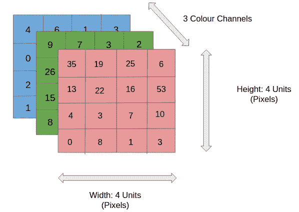
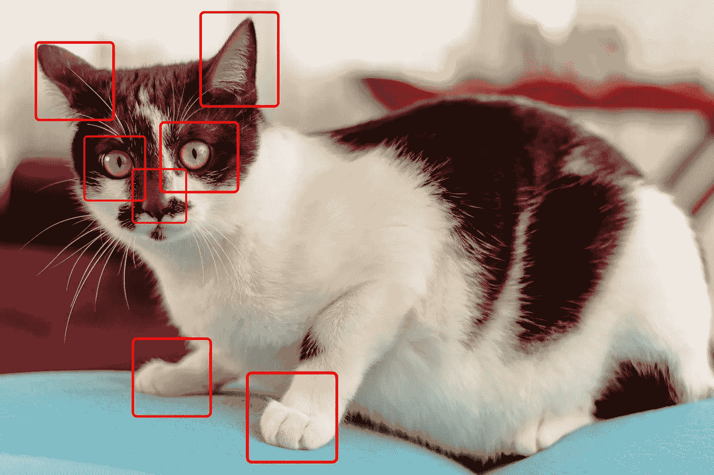
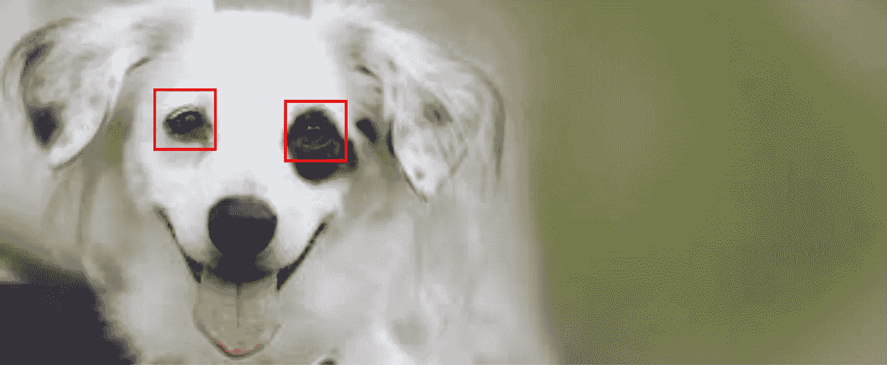
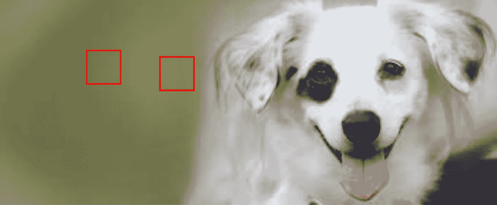
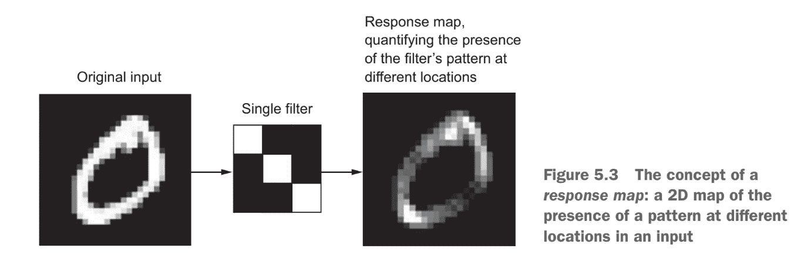
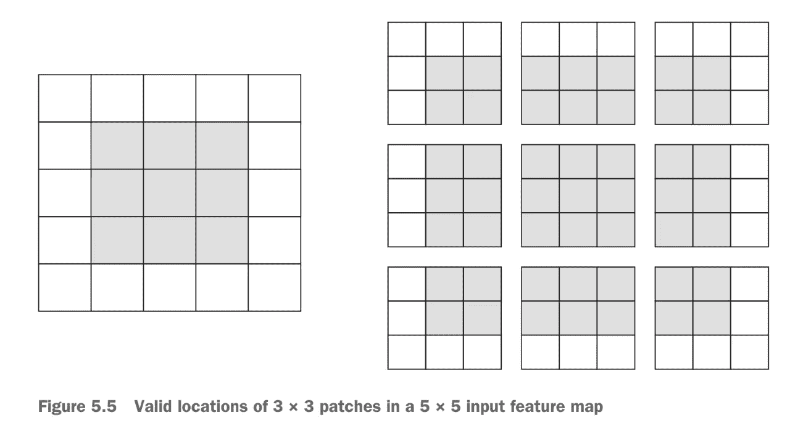

# 具有张量流和 Keras 的卷积神经网络

> 原文：<https://medium.com/geekculture/introduction-to-convolutional-neural-network-with-tensorflow-and-keras-cb52cdc66eaf?source=collection_archive---------1----------------------->


在本指南中，我们将学习如何使用**卷积神经网络**进行*图像分类和对象检测/识别*。用一种叫做计算机视觉的东西

我们的卷积神经网络的目标将是分类和检测图像或图像中的特定对象。我们将使用图像数据作为我们的特征，并将这些图像的标签作为我们的标签或输出。

我们已经知道神经网络是如何工作的，所以我们可以跳过基础知识，直接解释以下概念。

*   图像数据
*   卷积层
*   汇集层
*   CNN 架构

我们将要看到的这些类型的神经网络的主要区别是组成它们的层。

# 图像数据

现在我们将要处理通常由 3 维组成的图像数据。这三个维度如下:

*   图像高度
*   图像宽度
*   颜色通道

上面列表中唯一你可能不明白的是**颜色通道**。颜色通道的数量代表图像的深度，并与图像中使用的颜色相关。例如，具有三个通道的图像可能由 rgb(红、绿、蓝)像素组成。因此，对于每个像素，我们有三个数值在 0-255 的范围内定义它的颜色。对于颜色深度为 1 的图像，我们可能会有一个灰度图像，用一个值定义每个像素，也是在 0–255 的范围内。



Keep this in mind as we discuss how our network works and the input/output of each layer.

# 卷积神经网络

**注:**我将互换使用术语 *convnet* 和卷积神经网络。

每个卷积神经网络由一个或多个卷积层组成。这些层不同于我们之前看到的*密集*层。他们的目标是从图像中找到可以用来对图像或图像的一部分进行分类的模式。但这听起来可能与我们在上一节中密集连接的神经网络所做的事情很相似，因为确实如此。

密集层和卷积层之间的根本区别在于，密集层检测全局模式，而卷积层检测局部模式。当我们有一个密集连接的层时，该层中的每个节点都可以看到前一层的所有数据。这意味着这一层查看所有的信息，并且只能在全局范围内分析数据。然而，我们的卷积层不会紧密连接，这意味着它可以使用该层的部分输入数据来检测局部模式。

*让我们来看看密集连接层与卷积层对图像的看法。*

这是我们的形象；我们网络的目标将是确定这个图像是否是一只猫。


**密集层:**密集层会考虑整个图像。它会查看所有像素，并使用这些信息来生成一些输出。

**卷积层:**卷积层会查看图像的特定部分。在这个例子中，假设它分析下面突出显示的部分并检测那里的模式。



你能看出为什么这会让这些网络更有用吗？

# 它们是如何工作的

密集的神经网络学习出现在图像的一个特定区域中的模式。这意味着，如果网络知道的模式出现在图像的不同区域，它必须在新的区域再次学习该模式，才能检测到它。

*让我们用一个例子来更好地说明这一点。*

我们会认为我们有一个密集的神经网络，它已经从狗的图像样本中学习了眼睛的样子。



比方说，如果在上面的图像中，有一只眼睛出现在被框住的位置，那么可以确定该图像可能是一只狗。

现在让我们翻转图像。



由于我们紧密相连的网络只能识别全球范围内的模式，因此它会寻找它认为眼睛应该出现的地方。显然，它没有在那里找到它们，因此可能会确定这个图像不是一只狗。尽管眼睛的模式是存在的，但它只是在不同的位置。

由于卷积层从图像的不同区域学习和检测模式，它们在我们刚刚说明的例子中没有问题。他们知道眼睛是什么样的，通过分析图像的不同部分，可以找到眼睛的位置。

# 多重卷积层

在我们的模型中，有一个以上的卷积层是很常见的。甚至我们将在本指南中使用的基本示例也将由 3 个卷积层组成。这些层通过增加每个后续层的复杂性和抽象性来协同工作。第一层可能负责拾取边缘和短线，而第二层将这些线作为输入，并开始形成形状或多边形。最后，最后一层可能会采用这些形状，并确定哪些组合构成了特定的图像。

# 特征地图

你可能会看到我在整个教程中使用术语*特征映射*。这个术语简单地代表具有两个特殊轴(宽度和高度)和一个深度轴的 3D 张量。我们的卷积层将特征图作为它们的输入，并返回一个新的特征图，该新的特征图表示来自先前特征图的特定滤波器的存在。这些就是我们所说的*反应图*。

# 层参数

卷积层由两个关键参数定义。

## 过滤

滤镜是我们在图像中寻找的 m x n 像素模式。卷积层中滤波器的数量代表了每一层寻找多少模式，以及我们的响应图的深度。如果我们正在寻找 32 种不同的模式/过滤器，那么我们的输出特征图(又名响应图)的深度将是 32。32 层深度中的每一层都将是某种大小的矩阵，包含指示过滤器是否存在于该位置的值。

这是 Francois Chollet 的书《用 Python 进行深度学习》中的一个很好的例子(第 124 页)。



## 样本量

这不是描述这一点的最佳术语，但每个卷积层将检查每个图像中的 n x m 个像素块。通常，我们会考虑 3x3 或 5x5 块。在上面的例子中，我们使用 3x3 的“样本大小”。这个尺寸将与我们的过滤器的尺寸相同。

我们的图层通过在图像中的每个可能位置上滑动这些 n x m 像素的过滤器，并填充新的特征图/响应图来指示过滤器是否出现在每个位置。

# 边框和填充

你可能已经意识到，如果我们在图像上滑动一个大小为 3x3 的滤镜，我们可以考虑比输入像素更少的滤镜位置。看看下面的例子。

图片来自 Francois Chollet 的“用 Python 进行深度学习”(第 126 页)。



这意味着我们的响应图的宽度和高度将比原始图像略小。这很好，但有时我们希望我们的响应图有相同的维度。我们可以通过使用叫做*填充*的东西来完成这个任务。

**填充**是简单地将适当数量的行和/或列添加到您的输入数据中，这样每个像素都可以被过滤器居中。

# 大步

在前面的部分中，我们假设过滤器将连续地滑过图像，从而覆盖每个可能的位置。这很常见，但有时我们会在卷积层引入一个**步长**的概念。步长表示我们每次将移动过滤器多少行/列。这些不经常使用，所以我们将继续。

# 联营

您可能还记得，我们的 convnets 是由卷积层和池层的堆栈组成的。

池化图层背后的想法是对我们的要素地图进行向下采样并降低其维度。它们的工作方式类似于卷积层，从特征图中提取窗口，并返回每个通道的最大值、最小值或平均值的响应图。通常使用大小为 2x2、跨度为 2 的窗口来完成池化。这将使特征图的大小减少一半，并返回一个小两倍的响应图。

# 更详细的外观

请参考传奇人物安德鲁·吴的视频来了解这一切是如何在较低层次发生的！

# 创建一个通信网

现在是时候创建我们的第一个 convnet 了！这个例子是为了熟悉 CNN 的架构，我们将在后面讨论如何提高它的性能。

*本教程基于 TensorFlow 文档中的以下指南:*[*https://www.tensorflow.org/tutorials/images/cnn*](https://www.tensorflow.org/tutorials/images/cnn)

# 资料组

这里我们要考虑的问题是对 10 种不同的日常物品进行分类。我们将使用的数据集内置在 tensorflow 中，称为 [**CIFAR 图像数据集。**](https://www.cs.toronto.edu/~kriz/cifar.html) 包含 60000 张 32x32 的彩色图像，每类 6000 张。

该数据集中的标注如下:

*   飞机
*   汽车
*   伯德
*   猫
*   鹿
*   狗
*   青蛙
*   马
*   船
*   卡车

我们将加载数据集，看看下面的一些图像。

```
%tensorflow_version 2.x  # this line is not required unless you are in a notebookimport tensorflow as tffrom tensorflow.keras import datasets, layers, modelsimport matplotlib.pyplot as plt#  LOAD AND SPLIT DATASET(train_images, train_labels), (test_images, test_labels) = datasets.cifar10.load_data()# Normalize pixel values to be between 0 and 1train_images, test_images = train_images / 255.0, test_images / 255.0class_names = ['airplane', 'automobile', 'bird', 'cat', 'deer','dog', 'frog', 'horse', 'ship', 'truck']
IMG_INDEX = 7  # change this to look at other imagesplt.imshow(train_images[IMG_INDEX] ,cmap=plt.cm.binary)plt.xlabel(class_names[train_labels[IMG_INDEX][0]])plt.show()
```

# CNN 架构

CNN 的常见架构是 Conv2D 和 MaxPooling2D 层的堆栈，后跟几个紧密连接的层。我们的想法是，卷积层和最大池层的堆栈从图像中提取特征。然后，这些特征被展平并馈送到密集连接的层，这些层基于特征的存在来确定图像的类别。

我们将从构建**卷积库**开始。

```
model = models.Sequential()model.add(layers.Conv2D(32, (3, 3), activation=’relu’, input_shape=(32, 32, 3)))model.add(layers.MaxPooling2D((2, 2)))model.add(layers.Conv2D(64, (3, 3), activation=’relu’))model.add(layers.MaxPooling2D((2, 2)))model.add(layers.Conv2D(64, (3, 3), activation=’relu’))
```

**第一层**

我们的数据的输入形状将是 32，32，3，我们将在我们的输入数据上处理 32 个大小为 3x3 的过滤器。我们还将激活函数 relu 应用于每个卷积运算的输出。

**第二层**

该层将使用 2x2 样本和 2 的跨距执行最大池化操作。

**其他图层**

下一组图层执行非常相似的操作，但将前一图层的要素地图作为输入。他们还将过滤器的频率从 32 增加到 64。我们可以这样做，因为我们的数据在通过各层时会在特殊维度上收缩，这意味着我们可以(在计算上)增加更多深度。

```
model.summary() # let’s have a look at our model so far
```

看完摘要后，你应该会注意到我们的图像深度增加了，但是特殊尺寸却大大减少了。

# 添加密集层

至此，我们刚刚完成了**卷积基**。现在，我们需要提取这些特征，并添加一种方法来对它们进行分类。这就是为什么我们在我们的模型中添加了下面的层。

```
model.add(layers.Flatten())model.add(layers.Dense(64, activation=’relu’))model.add(layers.Dense(10))
model.summary()
```

我们可以看到，flatten 层改变了我们数据的形状，以便我们可以将它馈送到 64 节点密集层，然后是 10 个神经元的最终输出层(每个类一个)。

# 培养

现在，我们将使用 tensorflow 推荐的超参数来训练和编译模型。

注意:这将比以前的型号花费更长的时间！

```
model.compile(optimizer=’adam’,loss=tf.keras.losses.SparseCategoricalCrossentropy(from_logits=True),metrics=[‘accuracy’])history = model.fit(train_images, train_labels, epochs=4,validation_data=(test_images, test_labels))
```

# 评估模型

我们可以通过查看模型在测试数据集上的表现来确定模型的表现

```
est_loss, test_acc = model.evaluate(test_images, test_labels, verbose=2)print(test_acc)
```

你应该得到大约 70%的准确率。对于这样一个简单的模型来说，这并不坏，但我们将在下面探讨一些更好的计算机视觉方法。

# 使用小型数据集

在没有数百万张图片的情况下，很难从头开始训练一个表现良好的 CNN。这就是为什么我们将学习一些技术，我们可以使用这些技术在只有几千张图片的小数据集上训练 CNN。

# 数据扩充

为了避免过度拟合并从较小的数据集创建较大的数据集，我们可以使用一种称为数据扩充的技术。这只是在我们的图像上执行随机变换，以便我们的模型可以更好地概括。这些变换可以是压缩、旋转、拉伸，甚至是颜色变化。

幸运的是，keras 可以帮助我们做到这一点。请看下面的代码，这是一个数据扩充的例子。

```
from keras.preprocessing import imagefrom keras.preprocessing.image import ImageDataGenerator# creates a data generator object that transforms imagesdatagen = ImageDataGenerator(rotation_range=40,width_shift_range=0.2,height_shift_range=0.2,shear_range=0.2,zoom_range=0.2,horizontal_flip=True,fill_mode=’nearest’)# pick an image to transformtest_img = train_images[20]img = image.img_to_array(test_img) # convert image to numpy arryimg = img.reshape((1,) + img.shape) # reshape imagei = 0for batch in datagen.flow(img, save_prefix=’test’, save_format=’jpeg’): # this loops runs forever until we break, saving images to current directory with specified prefixplt.figure(i)plot = plt.imshow(image.img_to_array(batch[0]))i += 1if i > 4: # show 4 imagesbreakplt.show()
```

# 迁移学习

您可能已经注意到，上面的模型需要几分钟来训练，并且只能给出大约 70%的准确率。这没问题，但肯定有改进的方法。

在本节中，我们将讨论使用预训练的 CNN 作为我们自定义网络的一部分，以提高我们模型的准确性。我们知道 CNN 本身(没有密集层)除了从我们的输入中映射特征的存在之外不做任何事情。这意味着我们可以使用一个预训练的 CNN，一个在数百万张图像上训练过的 CNN，作为我们模型的开始。这将使我们在最后添加自己的密集分层分类器之前，有一个非常好的卷积基础。事实上，通过使用这种技术，我们可以为相对较小的数据集(< 10，000 张图像)训练一个非常好的分类器。这是因为 convnet 已经非常清楚在图像中寻找什么特征，并且能够非常有效地找到它们。因此，如果我们可以确定特征的存在，那么模型的其余部分需要做的就是确定哪种特征组合构成了特定的图像。

# 微调

当我们使用上面定义的技术时，我们经常想要调整卷积基础的最后几层，以便更好地解决我们的特定问题。这包括不接触或重新训练我们的卷积基中的早期层，而只调整最后几层。我们这样做是因为我们基层的第一层非常擅长提取低层次的特征李乐线和边缘，这对于任何类型的图像都是相似的。其中后面的层更擅长拾取非常特殊的特征，如形状甚至眼睛。如果我们调整最终层，那么我们可以只寻找与我们非常具体的问题相关的特征。

# 使用预训练模型

在这一节中，我们将结合我们在上面学到的技术，使用一个预训练的模型和微调来使用一个小数据集对狗和猫的图像进行分类。

*本教程基于 TensorFlow 文档中的以下指南:*[*https://www . tensor flow . org/tutorials/images/transfer _ learning*](https://www.tensorflow.org/tutorials/images/transfer_learning)

```
#Importsimport osimport numpy as npimport matplotlib.pyplot as pltimport tensorflow as tfkeras = tf.keras
```

# 资料组

我们将从 modoule tensorflow_datatsets 加载 *cats_vs_dogs* 数据集。

该数据集包含(图像，标签)对，其中图像具有不同的维度和 3 个颜色通道。

```
import tensorflow_datasets as tfdstfds.disable_progress_bar()# split the data manually into 80% training, 10% testing, 10% validation(raw_train, raw_validation, raw_test), metadata = tfds.load(‘cats_vs_dogs’,split=[‘train[:80%]’, ‘train[80%:90%]’, ‘train[90%:]’],with_info=True,as_supervised=True,
)get_label_name = metadata.features['label'].int2str  # creates a function object that we can use to get labels# display 2 images from the datasetfor image, label in raw_train.take(5):plt.figure()plt.imshow(image)plt.title(get_label_name(label))
```

# 数据预处理

由于我们的图像大小都不一样，我们需要将它们转换成相同的大小。我们可以在下面创建一个函数来完成这项工作。

```
IMG_SIZE = 160 # All images will be resized to 160x160def format_example(image, label):“””returns an image that is reshaped to IMG_SIZE“””image = tf.cast(image, tf.float32)image = (image/127.5) — 1image = tf.image.resize(image, (IMG_SIZE, IMG_SIZE))return image, label
```

现在我们可以使用`.map()`将这个函数应用到我们所有的图像上。

```
train = raw_train.map(format_example)validation = raw_validation.map(format_example)test = raw_test.map(format_example)
```

现在让我们来看看我们的图像。

[ ]

对于图像，在 train.take(2)中标记:

```
plt.figure()plt.imshow(image)plt.title(get_label_name(label))Finally we will shuffle and batch the images.[ ]BATCH_SIZE = 32SHUFFLE_BUFFER_SIZE = 1000train_batches = train.shuffle(SHUFFLE_BUFFER_SIZE).batch(BATCH_SIZE)validation_batches = validation.batch(BATCH_SIZE)test_batches = test.batch(BATCH_SIZE)
```

现在，如果我们观察原始图像与新图像的形状，我们会发现它已经发生了变化。

[ ]

```
for img, label in raw_train.take(2):print(“Original shape:”, img.shape)for img, label in train.take(2):print(“New shape:”, img.shape)
```

# 选择预训练模型

我们将用作我们模型卷积基础的模型是谷歌开发的**移动互联网 V2** 。这个模型在 140 万幅图像上进行训练，有 1000 个不同的类别。

我们想使用这个模型，但只是它的卷积基础。因此，当我们加载模型时，我们将指定我们不想加载顶层(分类)层。我们将告诉模型预期的输入形状，并使用来自 *imagenet* (谷歌数据集)的预定权重。

```
IMG_SHAPE = (IMG_SIZE, IMG_SIZE, 3)# Create the base model from the pre-trained model MobileNet V2base_model = tf.keras.applications.MobileNetV2(input_shape=IMG_SHAPE,include_top=False,weights=’imagenet’)base_model.summary()
```

此时，这个 *base_model* 将简单地输出一个形状(32，5，5，1280)张量，这是从我们的原始(1，160，160，3)图像中提取的特征。32 意味着我们有 32 层不同的过滤器/特征。

```
for image, _ in train_batches.take(1):passfeature_batch = base_model(image)print(feature_batch.shape)
```

# 冻结底座

术语**冻结**是指禁用一个层的训练属性。这仅仅意味着我们不会对训练期间冻结的任何层的权重进行任何更改。这很重要，因为我们不想改变已经学习了权重的卷积基。

```
base_model.trainable = Falsebase_model.summary()
```

# 添加我们的分类器

现在我们有了基础层设置，我们可以添加分类器了。我们将使用全局平均池层，而不是展平基础图层的要素地图，该池层将对每个 2D 要素地图的整个 5x5 区域进行平均，并为我们返回每个过滤器的单个 1280 元素矢量。

```
global_average_layer = tf.keras.layers.GlobalAveragePooling2D()
```

最后，我们将添加预测层，这将是一个单一的密集神经元。我们可以这样做，因为我们只有两个类要预测。

```
prediction_layer = keras.layers.Dense(1)
```

现在我们将把这些层组合在一个模型中。

```
model = tf.keras.Sequential([base_model,global_average_layer,prediction_layer])model.summary()
```

# 训练模型

现在我们将训练和编译模型。我们将使用一个非常小的学习率来确保模型不会有任何大的改变。

```
base_learning_rate = 0.0001model.compile(optimizer=tf.keras.optimizers.RMSprop(lr=base_learning_rate),loss=tf.keras.losses.BinaryCrossentropy(from_logits=True),metrics=[‘accuracy’])# We can evaluate the model right now to see how it does before training it on our new imagesinitial_epochs = 3validation_steps=20loss0,accuracy0 = model.evaluate(validation_batches, steps = validation_steps)# Now we can train it on our imageshistory = model.fit(train_batches,epochs=initial_epochs,validation_data=validation_batches)acc = history.history[‘accuracy’]print(acc)model.save(“dogs_vs_cats.h5”) # we can save the model and reload it at anytime in the futurenew_model = tf.keras.models.load_model(‘dogs_vs_cats.h5’)
```

这就是计算机视觉部分的全部内容！

# 目标检测

如果您想了解如何使用 tensorflow 进行物体检测和识别，请查看下面的指南。

[https://github . com/tensor flow/models/tree/master/research/object _ detection](https://github.com/tensorflow/models/tree/master/research/object_detection)

# 来源

*   "卷积神经网络(CNN):张量流核心."张量流，【www.tensorflow.org/tutorials/images/cnn】T2。
*   "用预训练的 ConvNet 进行迁移学习:TensorFlow 核心."张量流，【www.tensorflow.org/tutorials/images/transfer_learning】的。
*   乔莱·françois.用 Python 进行深度学习。曼宁出版公司，2018。