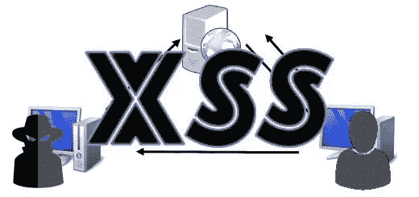
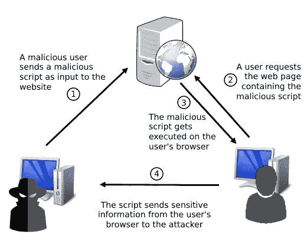

# 跨站点脚本简介(XSS)

> 原文：<https://medium.com/geekculture/introduction-to-cross-site-scripting-xss-e2c001ad9132?source=collection_archive---------6----------------------->

本文为试图学习跨站点脚本(或 XSS)的人提供了一个很好的介绍。你不需要成为一个专家来跟随。然而，为了从本文中获得最大收益，您需要了解一些关于 web 如何工作的基础知识。

我们将首先学习什么是跨站点脚本以及它的类型。然后，我们将探索进行 XSS 攻击的过程。最后，我们将列出一些好的做法，我们可以遵循，以防止它。



*免责声明:请注意，本文中教授的信息不会用于合法和道德目的之外的任何目的。和我所有的其他文章一样，这里的目标是进一步扩展安全文化，并帮助防御和保护信息系统免受恶意行为者的攻击。*

所以，话虽如此，我们开始吧！

# 什么是跨站点脚本(XSS)？

**跨站脚本** ( **XSS** )是一种影响 web 应用的漏洞。它允许攻击者向网站发送恶意代码。然后，相同的代码被发送给其他用户，在他们的浏览器上执行。

一旦成功，XSS 攻击可以为攻击者提供来自其他用户浏览器的敏感信息。例如，攻击者可以检索用户 cookies 和会话令牌，然后利用它们来执行会话劫持。

这里有一个插图，可以帮助您更好地理解攻击的过程。



考虑到最终用户通常信任易受攻击的网站，如果攻击发生在他们身上，他们会毫无防备。

# XSS 类型

跨站脚本攻击主要有两种:**持久**和**反射**。

## 执着的 XSS

一种**持续型**(也叫**储存型** ) XSS 攻击是两种类型中最危险的。当攻击者提供的恶意脚本存储在 web 应用程序的服务器端时，就会发生这种情况。然后，每当其他用户请求与之相关的内容时，该代码就会被发送给他们。

例如，注释部分是一个可能出现持久 XSS 的地方。这是因为网站将评论存储在服务器端的数据库中，用户每次访问该部分时，网站都会检索并显示这些评论。

上图是 XSS 持续攻击的一个例子。

## 反映了 XSS

一次**反射** XSS 攻击是两种类型中最不危险的。在反射 XSS 场景中，恶意脚本被发送到 web 应用程序，然后呈现给提交请求的用户，并且只呈现给该用户。网站不在服务器端存储任何东西。

反射 XSS 攻击可能发生的一个很好的例子是搜索表单。因为只有在搜索表单中提供字符串的用户才能在响应中看到该字符串，所以攻击者无法执行持续的 XSS 攻击。他们所能做的最糟糕的事情就是发动一次反射式的 XSS 袭击。

这乍一看似乎并不危险，但是如果恶意行为者将它与网络钓鱼攻击结合起来，他们就可以利用它从其他用户那里检索敏感信息。

# 如何执行跨站点脚本攻击

现在我们知道了什么是跨站点脚本攻击，让我们看看我们如何执行一个。

首先，我们需要确定我们的目标网站是否容易受到 XSS 的攻击。要做到这一点，我们需要考虑网站上用户可以提供输入的所有方面。

对于每个点，我们可以运行一个概念验证有效负载，以确认我们是否存在 XSS 漏洞。大多数情况下，我们可以在脚本中使用“*alert()*”Javascript 函数。

```
<script>alert(“XSS!”);</script>
```

如果该网站易受 XSS 攻击，则会弹出一条带有“ *XSS”的警告消息！*“消息。这就是我们需要确认目标脆弱性的所有证据。

您应该注意，大多数网站可能会检测并阻止上述有效载荷。这并不意味着这些网站不容易受到攻击，这只是意味着你需要混淆有效载荷，以逃避检测。

一旦我们确定了网站的漏洞，您就可以运行一个有效负载，将用户的 cookie 发送到您控制的网页。

```
<script>
document.write('');
</script>
```

上述有效负载将尝试从攻击者控制的网站加载图像。图像的链接包含目标用户的 cookie 值。所以，当它收到这个请求时，恶意网站会记录这个值。

然后，攻击者可以检查日志来检索连接到该网站的所有用户的 cookies。

# 抵御 XSS

这里有一些好的做法，你应该遵循，以保护您的网站免受 XSS 攻击:

*   web 应用程序应该总是**验证用户输入**，也就是说，验证用户提供的每一个数据。这个过程包括确保所提供的输入是预期的格式。例如，如果您在输入字段中询问用户的年龄，那么您应该期望提供的数据是小于 120 的正整数。任何超出这个范围的值都不应该被接受。
*   Web 应用程序也可以使用**编码**来转义某些不应该由 web 浏览器处理的字符。例如，如果我们想将用户提供的输入嵌入到 HTML 元素中，我们需要对它进行 HTML 编码。也就是说，我们需要将 HTML 保留字符转换成 HTML 实体(例如，'<'将被转换成'&lt；').同样，如果我们想将用户提供的输入嵌入到 Javascript 数据值中，我们需要对它进行 Javascript 编码。
*   HTTP 头也可以提供一个很好的防御 XSS 的层。在响应头中使用“*内容类型*和“ *X 内容类型选项*”可以限制网页上脚本的执行。

我们已经在这篇文章中介绍了要点。现在，您应该对跨站点脚本有了基本的了解。

然而，XSS 还有比我们在这里所介绍的更多的东西。所以你不应该满足。至少现在还没有。我邀请你在我们这里讨论的基础上，从网络上的其他资源中学习。例如， [OWASP](https://owasp.org/www-community/attacks/xss/) 和 [PortSwigger](https://portswigger.net/web-security/cross-site-scripting) 网站为这个主题提供了很好的参考。

*原载于 2021 年 8 月 13 日 https://patchthenet.com*[](https://patchthenet.com/articles/introduction-to-cross-site-scripting-xss/)**。**