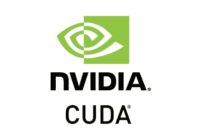

# CUDA 简介

> 原文：<https://medium.com/geekculture/introduction-to-cuda-7bf6909ea57c?source=collection_archive---------9----------------------->

使用 CUDA 进行 GPU 编程。

source: [https://mr-technologies.com/image-flow-framework/cuda-sdk/](https://mr-technologies.com/image-flow-framework/cuda-sdk/)

## 什么是 CUDA？

CUDA 代表计算统一设备架构*。* CUDA 是一种来自 NVIDIA 的异构编程语言，为通用程序提供 GPU。异构编程意味着代码运行在两个不同的平台上:主机(CPU)和设备(NVDIA GPU 设备)。

## 为什么要用 GPU？