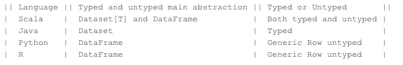

# Spark 中的数据集

> 原文：<https://medium.com/geekculture/introduction-to-datasets-in-spark-79a7d94d9158?source=collection_archive---------1----------------------->

Spark 已经成为无处不在的数据处理平台，并取代了传统的 MapReduce 框架。事实上，一些技术专家甚至会宣布 MapReduce 已死。在众多的基准测试和性能研究中，Spark 已经被证明比 MapReduce 高出几个数量级。下面，我们简单叙述一下 Spark 在大数据领域占据主导地位背后的历史。

在本文中，我们将简要介绍 Spark 数据集

Photo by [Lukas Blazek](https://unsplash.com/@goumbik?utm_source=medium&utm_medium=referral) on [Unsplash](https://unsplash.com?utm_source=medium&utm_medium=referral)

以下是官方数据块文档中数据集的定义:

> 数据集是映射到关系架构的强类型、不可变的对象集合。数据集是一种类型安全的结构化 API，可以在静态类型、Spark 支持的语言 Java 和 Scala 中使用。数据集是严格意义上的 JVM 语言特性。R 和 Python 不支持数据集，因为这些语言是动态类型语言”。

## 概观

数据集是 [SparkSQL](https://data-flair.training/blogs/spark-sql-tutorial/) 中的一种数据结构，它是强类型的，是关系模式的映射。它用编码器表示结构化查询。它是数据框架 API 的扩展。Spark 数据集提供了类型安全和面向对象的编程接口。
数据集集合了 [RDD](https://data-flair.training/blogs/rdd-in-apache-spark/) 和[数据帧](https://data-flair.training/blogs/apache-spark-sql-dataframe-tutorial/)的特征。它提供:

*   RDD 的便利。
*   数据帧的性能优化。
*   [Scala](https://data-flair.training/blogs/why-you-should-learn-scala-introductory-tutorial/) 的静态类型安全。

在 Spark 2.0 之后，RDD 被 Dataset 取代，Dataset 像 RDD 一样是强类型的，但是在底层有更丰富的优化。

DataFrame and Dataset in spark

在 Scala 的上下文中，我们可以将 DataFrame 看作是一组通用对象的别名，表示为`Dataset[Row]`。`Row`对象是非类型化的，是一个通用的 JVM 对象，可以保存不同类型的字段。相比之下，数据集是 Scala 中强类型 JVM 对象的集合，或者是 Java 中的一个类。公平地说，Scala 中的每个数据集都有一个名为 DataFrame 的非类型化视图，它是`Row`的数据集。下表捕捉了各种 Spark 支持的语言中数据集和数据帧的概念。

数据集之所以成为可能，是因为有一个称为编码器的特性，它将 JVM 类型转换成 Spark SQL 的专用内部(表格)表示。编码器是高度专业化和优化的代码生成器，它为数据的序列化和反序列化生成定制的字节码。所有数据集都需要编码器。编码器将特定于域的类型映射到 Spark 对该类型的内部表示。例如，对于 Scala 或 Java 和 Python，作为`Row`中的一个字段的`Int`将分别被映射或转换为`IntegerType`或`IntegerType()`。特定于域的类型可以表示为 Java 的 beans 和 Scala 的 case 类。表格表示使用 Spark 的内部钨二进制格式存储，允许对序列化数据进行操作并提高内存利用率。在使用数据集 API 时，Spark 在运行时生成代码，将 Java 对象序列化为内部二进制结构，反之亦然。这种转换可能对性能有轻微的影响，但是有几个好处。例如，Spark 理解数据集中的数据结构，它可以在缓存数据集时在内存中创建更优化的布局。

Photo by [nting xie](https://unsplash.com/@shieldxie?utm_source=medium&utm_medium=referral) on [Unsplash](https://unsplash.com?utm_source=medium&utm_medium=referral)

# Spark 中数据集的特性

介绍完数据集之后，现在让我们讨论一下 Spark 数据集的各种特性

## 优化查询

Spark 中的数据集使用 [Catalyst 查询优化器](https://data-flair.training/blogs/spark-sql-optimization-catalyst-optimizer/)和钨提供优化的查询。Catalyst 查询优化器是一个与执行无关的框架。它表示和操作数据流图。数据流图是表达式和关系运算符的树。通过优化火花工作，钨提高了执行力。钨强调 Apache Spark 运行平台的硬件架构。

## 编译时分析

使用数据集，我们可以在编译时检查语法和分析。使用数据帧、rdd 或常规 SQL 查询是不可能的。

## 持久存储

Spark 数据集既是可序列化的，也是可查询的。因此，我们可以将它保存到永久存储器中。

## 更快的计算

数据集的实现比 RDD 的实现快得多。从而提高了系统的性能。对于使用 RDD 的相同性能，用户手动考虑如何以最佳方式表达并行计算。

# 与数据帧的差异

我们需要对比数据框架和数据集，以便更好地理解这两者。数据集在编译时检查类型是否符合规范。数据帧并不是真正无类型的，因为它们的类型是由 Spark 维护的，但是验证类型是否符合模式中的规范是在运行时完成的。换句话说，数据帧可以被认为是“行”类型的数据集，这是 Spark 内部优化的内存计算表示。拥有自己的内部类型表示允许 Spark 跳过实例化速度慢且有垃圾收集成本的 JVM 类型。

# 数据集的用例

当我们已经有数据框架时，拥有数据集似乎是多余的，但在某些情况下，数据集比数据框架更合适。也就是说，有些操作不能用数据帧来表达，只能用数据集来表达。还要考虑对类型安全的需求。例如，试图在代码中将两个字符串变量相乘将在编译时失败，而不是在运行时失败。此外，开发可能是有帮助的，因为当对象是强类型时，ide 和其他工具可以提供自动完成和其他提示。使用数据集的另一个原因是如果所有的数据和转换都接受 case 类(Scala)；对于分布式和本地工作负载来说，重用它们是微不足道的。

在本文中，我们已经触及了 Spark 数据集所能提供的一些皮毛。希望，这是一篇有帮助的入门文章，下次再见！