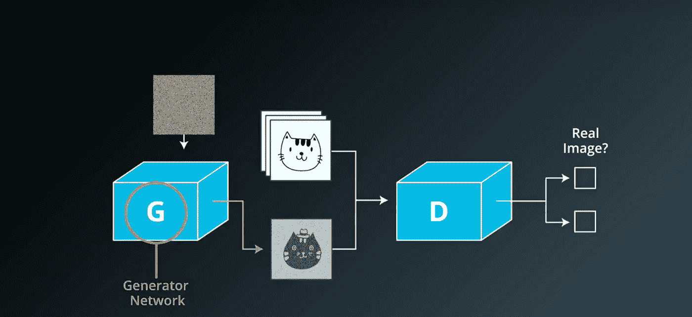
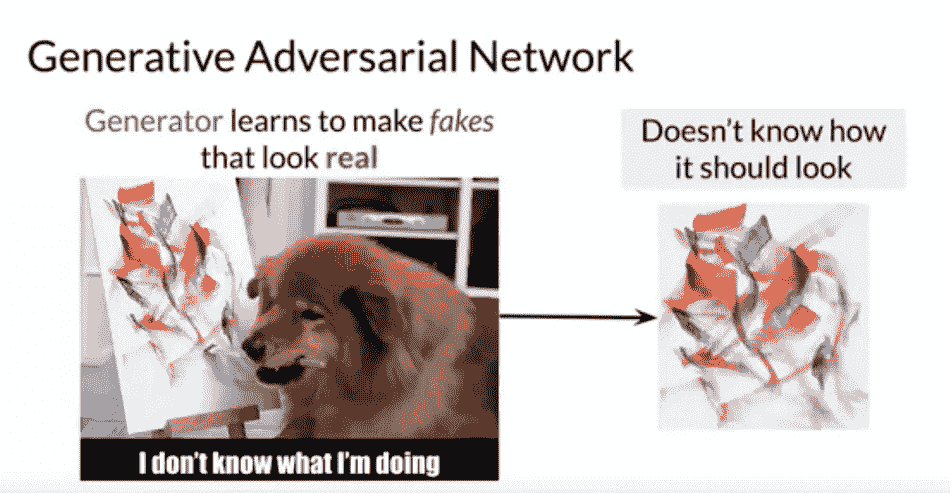
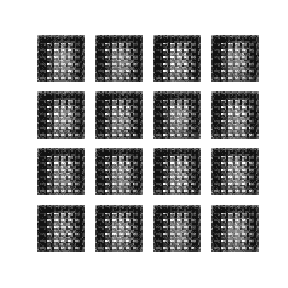
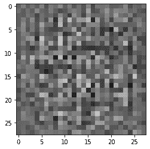
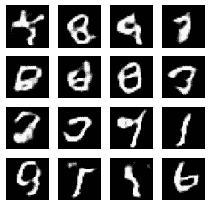
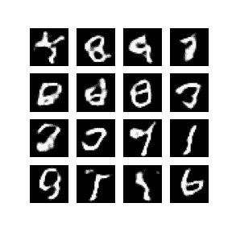
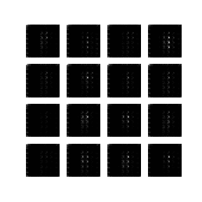

# 使用 Tensorflow 和 Keras 介绍深度卷积 GAN

> 原文：<https://medium.com/geekculture/introduction-to-deep-convolutional-gans-using-tensorflow-and-keras-3af58f5b2696?source=collection_archive---------22----------------------->

本教程演示了如何使用深度卷积生成对抗网络 (DCGAN)来生成手写数字的图像。代码是使用带有`[tf.GradientTape](https://www.tensorflow.org/api_docs/python/tf/GradientTape)`训练循环的 [Keras 顺序 API](https://www.tensorflow.org/guide/keras) 编写的。

# 什么是甘？

生成对抗网络是当今计算机科学中最有趣的想法之一。两个模型通过对抗过程同时被训练。一个*生成器*(“艺术家”)学习创造看起来真实的图像，而一个*鉴别器*(“艺术评论家”)学习区分真实图像和赝品。



在训练期间，*发生器*逐渐变得更擅长创建看起来真实的图像，而*鉴别器*变得更擅长区分它们。当*鉴别器*不再能够区分真实图像和赝品时，该过程达到平衡。



最好的类比是把 genrator 想象成一个刚刚起步不知道自己在做什么的艺术家，把 discriminator 想象成一个也在从事自己工作的艺术评论家，两者都试图赢得对方，也互相学习。

本教程在 MNIST 数据集上演示了这一过程。下面的动画显示了*发生器*经过 50 个时期的训练后产生的一系列图像。这些图像开始是随机噪声，随着时间的推移越来越像手写数字。



我告诉你的只是生成性敌对网络的冰山一角

# 设置

```
import tensorflow as tftf.__version__
'2.4.1'# To generate GIFs
pip install -q imageio
pip install -q git+https://github.com/tensorflow/docsimport glob
import imageio
import matplotlib.pyplot as plt
import numpy as np
import os
import PIL
from tensorflow.keras import layers
import timefrom IPython import display
```

# 加载并准备数据集

您将使用 MNIST 数据集来训练生成器和鉴别器。生成器将生成类似 MNIST 数据的手写数字。

```
(train_images, train_labels), (_, _) = tf.keras.datasets.mnist.load_data()Downloading data from [https://storage.googleapis.com/tensorflow/tf-keras-datasets/mnist.npz](https://storage.googleapis.com/tensorflow/tf-keras-datasets/mnist.npz)
11493376/11490434 [==============================] - 0s 0us/steptrain_images = train_images.reshape(train_images.shape[0], 28, 28, 1).astype('float32')
train_images = (train_images - 127.5) / 127.5  # Normalize the images to [-1, 1]BUFFER_SIZE = 60000
BATCH_SIZE = 256# Batch and shuffle the data
train_dataset = tf.data.Dataset.from_tensor_slices(train_images).shuffle(BUFFER_SIZE).batch(BATCH_SIZE)
```

# 创建模型

使用 [Keras 顺序 API](https://www.tensorflow.org/guide/keras#sequential_model) 定义生成器和鉴别器。

# 发电机

生成器使用`[tf.keras.layers.Conv2DTranspose](https://www.tensorflow.org/api_docs/python/tf/keras/layers/Conv2DTranspose)`(上采样)层从种子(随机噪声)生成图像。以这个种子作为输入的`Dense`层开始，然后向上采样几次，直到你达到想要的 28x28x1 的图像尺寸。注意每一层的`[tf.keras.layers.LeakyReLU](https://www.tensorflow.org/api_docs/python/tf/keras/layers/LeakyReLU)`激活，除了使用 tanh 的输出层。

```
def make_generator_model():
    model = tf.keras.Sequential()
    model.add(layers.Dense(7*7*256, use_bias=False, input_shape=(100,)))
    model.add(layers.BatchNormalization())
    model.add(layers.LeakyReLU()) model.add(layers.Reshape((7, 7, 256)))
    assert model.output_shape == (None, 7, 7, 256)  # Note: None is the batch size model.add(layers.Conv2DTranspose(128, (5, 5), strides=(1, 1), padding='same', use_bias=False))
    assert model.output_shape == (None, 7, 7, 128)
    model.add(layers.BatchNormalization())
    model.add(layers.LeakyReLU()) model.add(layers.Conv2DTranspose(64, (5, 5), strides=(2, 2), padding='same', use_bias=False))
    assert model.output_shape == (None, 14, 14, 64)
    model.add(layers.BatchNormalization())
    model.add(layers.LeakyReLU()) model.add(layers.Conv2DTranspose(1, (5, 5), strides=(2, 2), padding='same', use_bias=False, activation='tanh'))
    assert model.output_shape == (None, 28, 28, 1) return model
```

使用(尚未训练的)生成器创建一个图像。

```
generator = make_generator_model()noise = tf.random.normal([1, 100])
generated_image = generator(noise, training=False)plt.imshow(generated_image[0, :, :, 0], cmap='gray')<matplotlib.image.AxesImage at 0x7f3740747390>
```



# 鉴别器

鉴别器是基于 CNN 的图像分类器。

```
def make_discriminator_model():
    model = tf.keras.Sequential()
    model.add(layers.Conv2D(64, (5, 5), strides=(2, 2), padding='same',
                                     input_shape=[28, 28, 1]))
    model.add(layers.LeakyReLU())
    model.add(layers.Dropout(0.3)) model.add(layers.Conv2D(128, (5, 5), strides=(2, 2), padding='same'))
    model.add(layers.LeakyReLU())
    model.add(layers.Dropout(0.3)) model.add(layers.Flatten())
    model.add(layers.Dense(1)) return model
```

使用(尚未训练的)鉴别器将生成的图像分类为真实或伪造。该模型将被训练为对真实图像输出正值，对虚假图像输出负值。

```
discriminator = make_discriminator_model()
decision = discriminator(generated_image)
print (decision)tf.Tensor([[-0.00033125]], shape=(1, 1), dtype=float32)
```

# 定义损失和优化器

为两个模型定义损失函数和优化器。

```
# This method returns a helper function to compute cross entropy loss
cross_entropy = tf.keras.losses.BinaryCrossentropy(from_logits=True)
```

# 鉴频器损耗

这种方法量化了鉴别器区分真实图像和赝品的能力。它将鉴别器对真实图像的预测与 1 的数组进行比较，并将鉴别器对伪造(生成)图像的预测与 0 的数组进行比较。

```
def discriminator_loss(real_output, fake_output):
    real_loss = cross_entropy(tf.ones_like(real_output), real_output)
    fake_loss = cross_entropy(tf.zeros_like(fake_output), fake_output)
    total_loss = real_loss + fake_loss
    return total_loss
```

# 发电机损耗

发电机的损耗量化了它欺骗鉴别器的能力。直观地说，如果生成器运行良好，鉴别器会将假图像分类为真实图像(或 1)。这里，将鉴别者对生成的图像的决定与 1 的数组进行比较。

```
def generator_loss(fake_output):
    return cross_entropy(tf.ones_like(fake_output), fake_output)
```

鉴别器和生成器优化器是不同的，因为您将分别训练两个网络。

```
generator_optimizer = tf.keras.optimizers.Adam(1e-4)
discriminator_optimizer = tf.keras.optimizers.Adam(1e-4)
```

# 保存检查点

本笔记本还演示了如何保存和恢复模型，这在长时间运行的培训任务被中断时会很有帮助。

```
checkpoint_dir = './training_checkpoints'
checkpoint_prefix = os.path.join(checkpoint_dir, "ckpt")
checkpoint = tf.train.Checkpoint(generator_optimizer=generator_optimizer,
                                 discriminator_optimizer=discriminator_optimizer,
                                 generator=generator,
                                 discriminator=discriminator)
```

# 定义训练循环

```
EPOCHS = 50
noise_dim = 100
num_examples_to_generate = 16# You will reuse this seed overtime (so it's easier)
# to visualize progress in the animated GIF)
seed = tf.random.normal([num_examples_to_generate, noise_dim])
```

训练循环从生成器接收随机种子作为输入开始。那颗种子被用来制作图像。然后使用鉴别器对真实图像(从训练集中提取)和伪图像(由生成器生成)进行分类。为这些模型中的每一个计算损耗，并且梯度用于更新发生器和鉴别器。

```
# Notice the use of `tf.function`
# This annotation causes the function to be "compiled".
@tf.function
def train_step(images):
    noise = tf.random.normal([BATCH_SIZE, noise_dim]) with tf.GradientTape() as gen_tape, tf.GradientTape() as disc_tape:
      generated_images = generator(noise, training=True) real_output = discriminator(images, training=True)
      fake_output = discriminator(generated_images, training=True) gen_loss = generator_loss(fake_output)
      disc_loss = discriminator_loss(real_output, fake_output) gradients_of_generator = gen_tape.gradient(gen_loss, generator.trainable_variables)
    gradients_of_discriminator = disc_tape.gradient(disc_loss, discriminator.trainable_variables) generator_optimizer.apply_gradients(zip(gradients_of_generator, generator.trainable_variables))
    discriminator_optimizer.apply_gradients(zip(gradients_of_discriminator, discriminator.trainable_variables))def train(dataset, epochs):
  for epoch in range(epochs):
    start = time.time() for image_batch in dataset:
      train_step(image_batch) # Produce images for the GIF as you go
    display.clear_output(wait=True)
    generate_and_save_images(generator,
                             epoch + 1,
                             seed) # Save the model every 15 epochs
    if (epoch + 1) % 15 == 0:
      checkpoint.save(file_prefix = checkpoint_prefix) print ('Time for epoch {} is {} sec'.format(epoch + 1, time.time()-start)) # Generate after the final epoch
  display.clear_output(wait=True)
  generate_and_save_images(generator,
                           epochs,
                           seed)
```

**生成并保存图像**

```
def generate_and_save_images(model, epoch, test_input):
  # Notice `training` is set to False.
  # This is so all layers run in inference mode (batchnorm).
  predictions = model(test_input, training=False) fig = plt.figure(figsize=(4, 4)) for i in range(predictions.shape[0]):
      plt.subplot(4, 4, i+1)
      plt.imshow(predictions[i, :, :, 0] * 127.5 + 127.5, cmap='gray')
      plt.axis('off') plt.savefig('image_at_epoch_{:04d}.png'.format(epoch))
  plt.show()
```

# 训练模型

调用上面定义的`train()`方法同时训练生成器和鉴别器。注意，训练甘斯可能很棘手。重要的是发生器和鉴别器不要超过对方(例如，它们以相似的速率训练)。

在训练开始时，生成的图像看起来像随机噪声。随着训练的进行，生成的数字会越来越真实。大约 50 个纪元后，它们类似于 MNIST 数字。根据 Colab 的默认设置，这可能需要大约一分钟/时段。

```
train(train_dataset, EPOCHS)
```



恢复最新的检查点。

```
checkpoint.restore(tf.train.latest_checkpoint(checkpoint_dir))<tensorflow.python.training.tracking.util.CheckpointLoadStatus at 0x7f371f792c88>
```

# 创建 GIF

```
# Display a single image using the epoch number
def display_image(epoch_no):
  return PIL.Image.open('image_at_epoch_{:04d}.png'.format(epoch_no))display_image(EPOCHS)
```



使用`imageio`用训练期间保存的图像创建一个动画 gif。

```
anim_file = 'dcgan.gif'with imageio.get_writer(anim_file, mode='I') as writer:
  filenames = glob.glob('image*.png')
  filenames = sorted(filenames)
  for filename in filenames:
    image = imageio.imread(filename)
    writer.append_data(image)
  image = imageio.imread(filename)
  writer.append_data(image)import tensorflow_docs.vis.embed as embed
embed.embed_file(anim_file)
```



来源:tensorflow、wike、google:“)