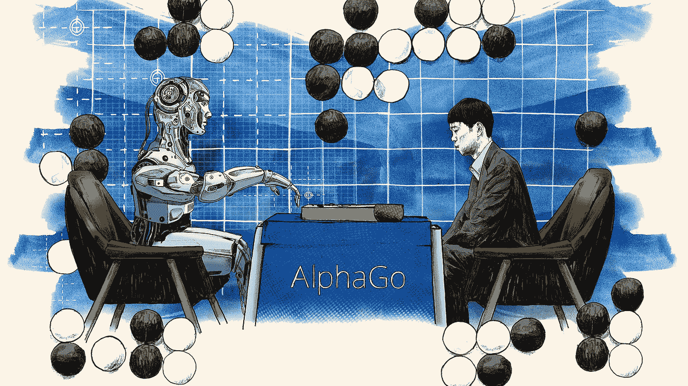
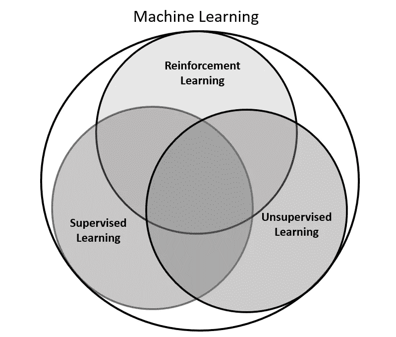
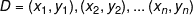
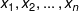
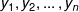
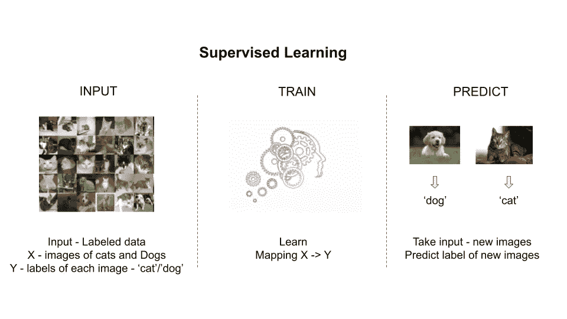
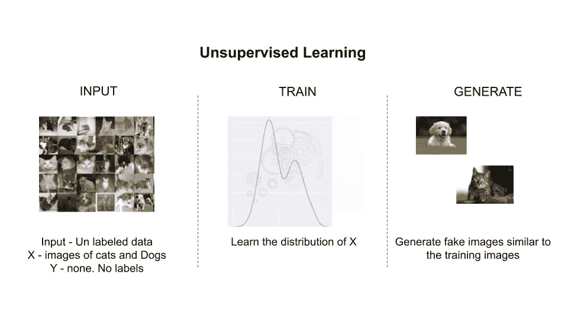
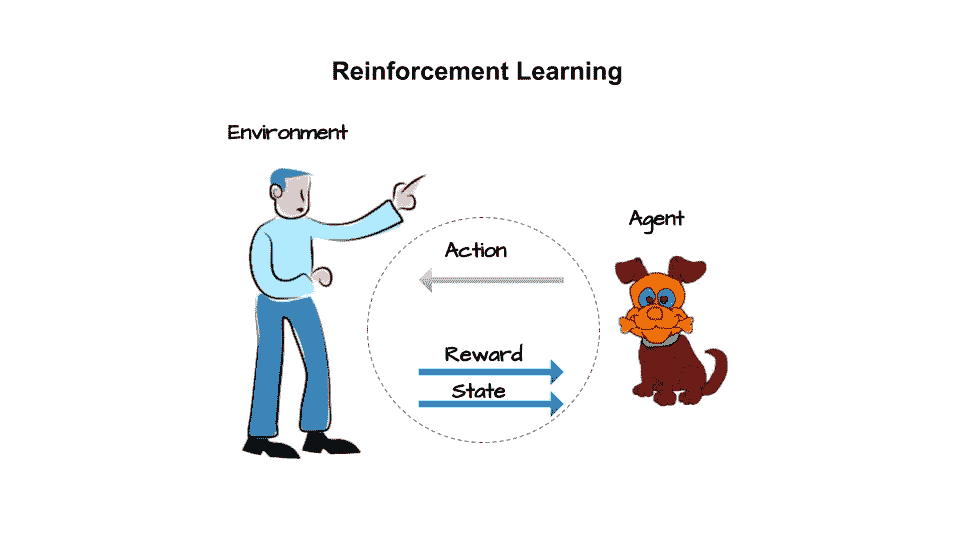
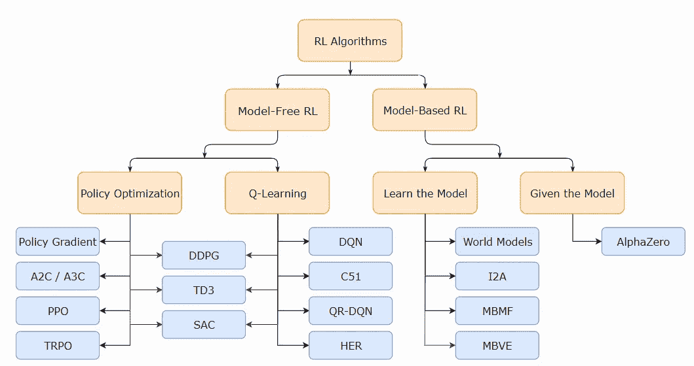

# 深度强化学习简介

> 原文：<https://medium.com/geekculture/introduction-to-deep-reinforcement-learning-268ebd44b23?source=collection_archive---------16----------------------->

Image credit: [FT](http://prod-upp-image-read.ft.com/4bb1cd86-0a48-11e7-ac5a-903b21361b43)

在这篇博客中，我将介绍强化学习(RL)领域，如何以及何时使用这种形式的机器学习。我还会谈到你应该遵循的途径，以建立在 RL 领域的专业知识。

**1。简介**

强化学习是机器学习的一个子课题。这是帮助人工智能成为现实的发展最快的学科之一。将深度学习与强化学习相结合已经导致了许多重大进步，这些进步越来越多地让机器更接近人类的行为方式。所有的智慧生物都是从一个小知识开始的。然而，随着他们与世界互动并获得经验，他们学会适应环境，变得更擅长做事。

强化学习的现代概念是两种不同的思路通过各自的发展结合起来。

-首先是最优控制的概念，尤其是理查德·贝尔曼在 1950 年提出的**动态规划**学科。这是所有关于规划通过空间的各种选择使用贝尔曼递归方程。

-第二条主线是**通过试错学习**，它起源于动物训练心理学。爱德华·桑戴克是第一个明确表达“试错法”概念的人。用他的话说:

在 20 世纪 80 年代，这两个领域合并在一起，形成了现代强化学习领域。在过去十年中，随着强大的深度学习方法的出现，强化学习与深度学习相结合，正在产生非常强大的算法，这些算法可以在未来的时代实现人工智能。

**1.1 机器学习分支**

机器学习涉及从提供给系统的数据中学习，以便系统可以执行指定的任务。系统没有被明确告知如何完成任务。更确切地说，它与数据一起呈现，系统学习基于定义的目标执行一些任务。

机器学习方法通常分为三大类，如下图 1 所示:

*Figure 1: Branches of Machine Learning*

机器学习的三个分支在学习系统可用的“反馈”方面有所不同。

**1.2 监督学习**

在监督学习中，向系统呈现已标记的数据，目标是概括知识，以便可以标记新的未标记数据。考虑将猫和狗的图像连同哪个图像显示猫或狗的标签一起呈现给系统。

输入数据表示为一组数据:

pixel values of individual images

lables of the respective images: 0 for cat image and 1 for dog image

该系统接受该输入，并学习从图像 x 到标签 y 的映射。一旦训练完毕，向该系统呈现新的图像 x’，以根据该图像是猫还是狗来获得标签 y’= 0 或 1 的预测。这是一个分类问题，系统学习将输入分类到正确的类别。我们有类似的回归设置，我们希望根据输入值 x 的向量来预测连续的输出 y。

*Figure 2: Supervised Machine Learning*

**1.3 无监督学习**

第二个分支是无监督学习。无监督学习没有标签。它只有输入 D= x1，x2，…，xn，没有标签。系统使用这些数据来学习数据的隐藏结构，从而可以将数据聚类/分类到一些大的类别中。学习后，当系统呈现新的数据点 x '时，它可以将新的数据点匹配到一个已学习的聚类。与监督学习不同，每个类别没有明确定义的含义。一旦数据被分类，基于一个分类中最常见的属性，我们可以赋予它一些意义。无监督学习的另一个用途是利用基础输入数据来学习数据分布，以便随后可以查询系统来产生新的合成数据点。

*Figure 3: Unsupervised Machine Learning*

**1.4 强化学习(RL)**

监督学习是在一个**老师** — *的指导下学习，标签数据*告诉系统从输入 x 到输出 y 的映射是什么，而 RL 更像是在一个**评论家**的指导下学习。**评论家**向学习者(模型)反馈他的知识好坏。学习者使用这种反馈来迭代地改进其知识。

让我们先看一个例子。假设我们正在设计一辆可以自己驾驶的自动驾驶汽车。我们有一辆汽车，我们将称之为 ***代理*** ，即一个系统或算法，它倾向于自己驾驶。它正在学习一种 ***行为*** 驾驶。它当前的坐标、速度、运动方向当组合在一起成为一个矢量数字时就被称为它的 ***当前状态*** 。代理使用其当前状态来决定是应用制动还是踩下油门踏板。它还利用这些信息来转动方向盘，以改变汽车的运动方向。“刹车/加速”和“驾驶汽车”的组合决定被称为 ***动作*** 。特定当前状态到特定动作的映射称为 ***策略*** 。代理人的行为在好的时候会产生一个快乐的结果，而在坏的时候会导致一个不快乐的结果。代理使用这种结果反馈来评估其行动的有效性。作为反馈的结果被称为 ***奖励*** ，即代理人在特定状态下以特定方式行动所获得的奖励。基于当前状态及其动作，汽车达到一组新的坐标、速度和方向。这是代理根据其在上一步中的行为发现自己所处的 ***新状态*** 。谁提供这个结果并决定新的状态？它是汽车的周围环境，是汽车/代理商无法控制的。代理不控制的所有其他事物被称为 ***环境*** 。

*Figure 4: Reinforcement Learning*

在强化学习中，主体没有系统的先验知识。它收集反馈，并使用反馈来计划/学习行动，以最大限度地实现特定目标。由于它最初没有足够的关于环境的信息，它必须探索以收集洞察力。一旦它收集了“足够”的知识，它需要利用这些知识来开始调整它的行为，以最大化它所追求的目标。难的是没有办法知道什么时候探索“够了”。如果代理即使在获得了完美的知识后还继续探索，那么它试图收集没有剩余的新信息就是在浪费资源。另一方面，如果代理过早地认为它已经收集了足够的知识，它可能会基于不完整的信息进行优化，并且可能表现不佳。这种 ***何时探索、何时利用*** 的困境，是强化学习算法的核心重复主题。

2014 年，DeepMind 成功地将深度学习技术与强化学习相结合，训练了一个玩游戏的代理，它可以根据游戏的图像玩雅达利游戏，而无需事先了解雅达利游戏的规则。

为了进一步激励，让我们看一些今天 RL 如何被使用的例子:

- **自动驾驶汽车(AV)** :自动驾驶汽车有像激光雷达、雷达、摄像机等传感器。，利用这些 AVs 感知它们附近的环境。将原始感觉数据和对象检测相结合以获得统一的场景表示，用于规划出到达目的地的路径。像超车、变道、自动泊车这样的行为也利用了强化学习的各个部分来将智能构建到行为中。另一种选择是手工制定各种各样的规则，这永远不可能是详尽的或灵活的。

- **机器人**:使用计算机视觉和自然语言处理或使用深度学习技术的语音识别，为自主机器人增加了类似人类的感知能力。此外，深度学习和强化学习相结合的方法已经导致教会机器人像人类一样走路、挑选和操纵物体，或者通过相机观察人类行为，并学习像人类一样表演。

- **推荐系统**:今天我们到处都能看到推荐系统。YouTube 和脸书等视频共享/托管应用程序会根据我们的观看历史向我们推荐我们想看的视频。所有这些推荐引擎越来越受到基于强化学习的系统的驱动。这些系统不断地从用户对引擎给出的建议的反应中学习。根据建议采取行动的用户在给定的上下文中将这些行动强化为好的行动。

- **金融和交易**:由于其顺序行动优化重点，其中过去的状态和行动影响未来的结果；强化学习在时间序列分析中有着重要的用途，尤其是在金融和股票交易领域。许多自动化交易策略使用强化学习方法，根据过去行动的反馈不断改进和微调交易算法。

- **玩游戏**:最后，基于 RL 的代理能够在许多棋盘游戏中击败人类玩家。虽然设计能玩游戏的代理看起来有些浪费，但这是有原因的。游戏提供了一个更简单的理想化世界，使设计、训练和比较方法变得更容易。在这种理想化的环境/设置下学习的方法可以随后被增强，以使代理在真实世界的情况下表现良好。游戏提供了一个控制良好的环境来更深入地研究这个领域。

**2。RL 中算法/方法的类型**

让我们简单看一下构成 RL 系统的核心要素:

***政策*** 是什么形成了智能体。代理开始与环境交互以感知环境的当前状态，例如，机器人从系统获得视觉和其他感官输入。像智能实体一样，机器人使用当前信息来决定下一步做什么，即执行什么动作。策略将状态映射到动作。策略可以是确定性的，即，对于给定的环境状态，代理采取固定的动作。有时策略可以是随机的，即对于给定的状态，代理可以采取多种可能的行动。

***奖励*** 是指代理人试图达到的目标/目的。假设一个机器人试图从 A 点到 b 点，它感应到当前位置并采取行动。如果这个行动使它更接近目标 B，我们期望回报是正的。如果它把机器人从 B 点带走，这是一个不利的结果，我们期望回报是负的。奖励是一个数值，表示代理所采取行动的好坏，是代理调整其行为的主要方式，即优化其正在学习的策略。

***价值函数*** 类似于长期报酬，不仅受环境影响，还受代理人遵循的政策影响。价值因为奖励而存在。代理在遵循策略时累积奖励，并使用该累积奖励来评估州中的值。然后，它改变其政策，以增加国家的价值。

最后一个组件是 ***环境的模型*** 。在一些寻找最佳行为的方法中，代理使用与环境的交互来形成环境的内部模型。这种内部模型有助于代理人进行计划，即考虑一个或多个动作链来评估最佳动作序列。这种方法叫做**基于模型的学习**。与此同时，还有其他完全基于试错法的方法。这种方法不形成任何环境模型。因此这些被称为**无模型方法**。大多数代理使用基于模型和无模型方法的组合来寻找最优策略。

在强化学习设置和贝尔曼方程的背景下，是时候看看强化学习世界中算法的前景了。图 5 示出了 RL 空间中各种类型的学习算法的高级景观。

*Figure 5:* [*Mind map of algorithms*](https://spinningup.openai.com/en/latest/spinningup/rl_intro2.html) *in reinforcement learning. It is a high level map showing only broad categorization.*

算法的第一个宽泛的分类可以基于模型的知识(或缺乏知识)来完成，即基于 ***模型的*** 和无 ***模型的*** 算法的分类。

***基于模型的*** 算法可以进一步分为两类——一类是给我们的模型，例如“围棋”或“象棋”游戏，第二类是代理需要探索和学习的模型。“学习模型”下的一些流行方法是**世界模型**，想象力增强代理 **(I2A)** ，基于模型的 RL 与模型自由微调 **(MBMF)** 和基于模型的价值探索 **(MBVE)** 。

回到 ***无模型*** 设置，有一套算法直接优化策略，使长期累积回报最大化。这一类别下一些流行的是**政策梯度**、演员评论家及其变体( **A2C / A3C** )、邻近政策优化( **PPO** )和信任区域政策优化( **TRPO** )。

还有另一组算法使用贝尔曼动态规划来学习随机策略的质量，然后使用价值函数来迭代地改进策略。 **Q-learning** 构成了无模型贝尔曼驱动状态/动作值优化的主要部分。这种方法下的流行变体是深度 Q 网络( **DQN** )及其各种变体，分类 51 原子 DQN ( **C51** )，分位数回归 DQN ( **QR-DQN** )和后见之明经验回放(**她的**)。

最后，有一组算法位于 Q 学习和策略优化之间。这一类别中最受欢迎的是深度确定性政策梯度( **DDPG** )、孪生延迟 DDPG ( **TD3** )和软演员评论家( **SAC** )。

以上分类只是为了帮助你理解不同的方法和流行的算法。然而，清单和分类并不详尽。强化学习领域正在迅速发展，新的方法也在不断增加。请将上述思维导图仅用作高级指导。

**3。如何入门**

像机器学习的任何其他学科一样，掌握 RL 涉及两个方面:理论和算法实现。我将首先浏览我写的这本书，这本书形成了掌握 RL 的端到端学习产品。接下来，我将介绍一些来自各个顶级大学和研究机构的领先专家的替代资源、课程和书籍。

**3.1 跟随我的书——用 Python 进行深度强化学习**

你可以在这里查看详情。

我写了一本书，涵盖了结合深度学习的 RL 的所有方面，涵盖了从非常基础的算法到高级算法的理论和实现，如图 5 中的思维导图所示。它采用线性方法来深入研究每个分支下的各种 RL 设置和流行算法。它正准备在即将到来的四月出版。

虽然这本书假设没有强化学习领域的先验知识，但它期望读者熟悉机器学习特别是监督学习的基础知识。你之前用 Python 编码过吗？你喜欢使用像 NumPy 和 scikit-learn 这样的库吗？你听说过深度学习，并在 PyTorch 或 TensorFlow 中探索过训练简单模型的基本构建模块吗？你应该对以上所有的问题都回答是，这样才能从本书中获得最大的收获。如果没有，我建议你先更新一下这些概念，不要太深，任何介绍性的在线教程或来自出版社的关于上述主题的书就足够了。

像这样的学科，数学是不可避免的。不过，我已经尽力做到最小化了。这本书引用了大量的研究论文，对所采用的方法做了简短的解释。想要更深入理解该理论的读者应该浏览这些研究论文。这本书的目的是向从业者介绍这个领域中许多最新技术背后的动机和高层次的方法。然而，这绝不意味着提供对这些技术的完整的理论理解，最好通过阅读原始论文来获得。

这本书分为十章。

**章节** — *强化学习简介*，是对主题的介绍，设置背景，用真实世界的例子激励读者。它还包括 python 和相关库的安装，以便能够运行本书附带的代码。

**第 2 章** — *马尔可夫决策过程*，详细定义了我们要在 RL 中解决的问题。它深入探讨了报酬的构成、价值函数、模型和政策。它介绍了各种风格的马尔可夫过程，作为动态规划的一部分，由理查德·贝尔曼建立方程。

**第 3 章** — *基于模型的算法*，重点介绍给定模型的设置，以及代理计划其行动以获得最佳结果。它介绍了 OpenAI Gym 环境库，该环境库在整本书中用于编码和测试算法。最后，它探讨了规划的价值和策略迭代方法。

**第四章** — *无模型方法*，讲述无模型学习方法。在这种设置下，代理不了解环境/模型。它与环境相互作用，并通过试错法使用奖励来学习最佳策略。它特别关注学习的蒙特卡罗(MC)方法和时间差异(TD)方法，首先单独研究这些方法，然后在 n 步回报和合格跟踪的概念下将两者结合起来。

**第 5 章** — *函数逼近和深度学习*，转到查看系统状态从离散(直到第 4 章都是这种情况)变为连续的设置。接下来，它探索了使用参数化函数来表示状态并带来可扩展性的概念-首先使用手工制作的函数逼近的传统方法，然后使用基于深度学习的模型作为非线性函数逼近器。

**第 6 章**—*Deep Q Learning(DQN)*，深入探讨了 DeepMind 采用的方法，该方法成功演示了深度学习与强化学习一起使用，设计了可以学习玩视频游戏(如雅达利游戏)的代理。它探索了 DQN 是如何工作的，以及需要做哪些调整才能让它学习。接下来是对各种 DQN 风格的调查，包括 PyTorch 和 TensorFlow 中的详细代码示例。

**第 7 章** — *策略梯度算法*，切换焦点探讨在无模型设置中直接学习好策略的方法。前面章节中的方法基于首先学习价值函数，然后使用这些价值函数来优化策略。在这一章中，我们首先讨论直接政策优化方法的理论基础。在建立基础之后，我们讨论各种方法，包括一些最近非常成功的算法，以及在 PyTorch 和 TensorFlow 中的实现。

**第 8 章** — *结合政策梯度和 Q-Learning* 顾名思义，处理结合基于价值的 DQN 和政策梯度方法的方法，以便利用两种方法的优点。它还使我们能够设计可以在连续动作空间中操作的代理。我们特别关注三种非常流行的方法——深度确定性策略梯度(DDPG)、双延迟 DDPG (TD3)和软行动者批评(SAC)。像以前一样，PyTorch 和 TensorFlow 提供了全面的实现来帮助读者掌握这个主题。

**第 9 章**—*综合规划和学习，是关于结合第 3 章的基于模型的方法和第 4 章到第 8 章的无模型方法。它探讨了使这种整合成为可能的一般框架。最后，它解释了蒙特卡罗树搜索(MCTS)以及如何将其用于训练 AlphaGo，以击败出口人类围棋选手。*

***第 10 章** — *进一步探索和后续步骤*，概述了强化学习的各种其他扩展，如可扩展的基于模型的方法、模仿和逆向学习、无导数方法、迁移和多任务学习以及元学习等概念。这里的覆盖范围是在 30，000 英尺，让读者接触到新的和相关的概念，而不会迷失在细节中。这一章最后谈到了读者应该继续探索和学习的方式，而不仅仅是本书所涵盖的内容。*

***3.2 其他课程和链接***

*最后，我列出了一些课程和链接，可以帮助你进一步探索理论和高级主题。我在下面不分先后地列举了它们:*

*1.课本— [强化学习:理查德·萨顿和安德鲁·g·巴尔托的介绍](http://incompleteideas.net/book/the-book.html)。这是任何 RL 从业者的必读之作。这本书分为三个部分，我强烈建议通读第一和第二部分。标有(*)的部分在初读时可以跳过。如果你点击[这个](http://incompleteideas.net/book/code/code2nd.html)，你会看到书中包含的例子和练习的 python 和 Matlab 实现的链接。*

*2.David Silver 的视频讲座。这些讲座很精彩，也很容易理解 RL 的介绍，基础知识和一些高级主题。我强烈建议按顺序观看这些。*

*3.加州大学伯克利分校助理教授 Sergey Levine 的深度 RL 课程。到目前为止，你已经为 2020 年秋季课程准备了完整的视频讲座、幻灯片和 python 作业。它更深入地研究了推导，并且有重要的数学意义。然而，如果你有很好的线性代数、概率论和微积分背景，通读这些材料将是非常有益的。*

*4.阿尔贝拉大学提供的 Coursera 强化学习专业化课程，萨顿和巴尔托都是该大学的教授。*

*5.[深度 RL Bootcamp — 2017](https://sites.google.com/view/deep-rl-bootcamp/lectures) 。这些是 2017 年在加州大学伯克利分校由 Pieter Abbeel 教授组织的为期 2 天的训练营的视频记录。一组很好的录像，与谢尔盖·莱文的课程内容有相当的重叠。*

*6.[斯坦福的强化学习课程](https://web.stanford.edu/class/cs234/)。这又是对强化学习领域的一个极好的介绍。虽然该材料可用于目前正在进行的 2021 年冬季课程，包括演示文稿、笔记和作业，但视频不可免费观看。你可以在这里查看 2019 跑步[的视频](https://www.youtube.com/watch?v=FgzM3zpZ55o)。*

*7.[莫斯科 HSE 大学的实用强化学习课程](https://www.coursera.org/learn/practical-rl)。这是一门节奏非常快的课程，涵盖了推进主题的基础知识。然而，有时我发现材料的覆盖范围对我的喜好来说有点太高了。尽管他们的编码练习很棒。你也可以在 github[查看他们最新的课程版本。](https://github.com/yandexdataschool/Practical_RL)*

*8.[高级深度学习和强化学习](https://deepmind.com/learning-resources/reinforcement-learning-lectures-series-2018)由伦敦大学学院(UCL)的 DeepMind 科学家讲授。它还涵盖了基础和高级主题。该材料与 David Silver 的视频讲座中涵盖的材料有很好的重叠。*

*9.[在 Deep RL](https://spinningup.openai.com/) 中旋转，这是一个由 OpenAI 托管的带有 python 库的网页，是深入 RL 的另一个很好的资源。在我看来，在完成基础课程后，这份材料是巩固你理解的绝佳资源。或者，如果你对深度学习和 PyTorch 或 TensorFlow 感到舒服，你可以一头扎进去。*

***4。结论***

*强化学习正取得重大进展。我在本书的最后一章中介绍了更多关于基础 RL 的内容。有不断发展的学科，如模仿和逆向学习、无导数方法、迁移和多任务学习以及元学习。*

*RL 在医疗保健、自动驾驶汽车、机器人、金融和电子商务以及其他各种领域的应用越来越多。*

*在这篇博客中，我尝试着介绍了 RL 领域，并分享了可以用来掌握这一领域的各种在线资源的链接。*

*我将非常高兴得到您的反馈，以便我可以进一步改进它。*