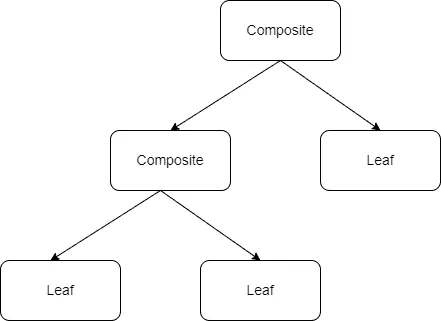
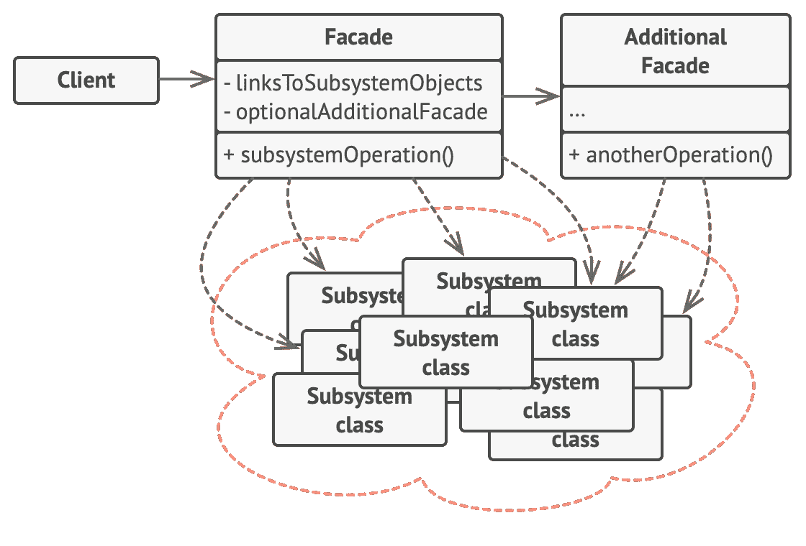

# 设计模式介绍:第 3 部分

> 原文：<https://medium.com/geekculture/introduction-to-design-patterns-part-3-7fcad12860e5?source=collection_archive---------18----------------------->


Photo by [amin khorsand](https://unsplash.com/@hero92?utm_source=unsplash&utm_medium=referral&utm_content=creditCopyText) on [Unsplash](https://unsplash.com/collections/335434/coding?utm_source=unsplash&utm_medium=referral&utm_content=creditCopyText)

在本文中，我们将介绍 7 种结构设计模式。在本系列的最后一期[中，我们已经看到了创造性设计模式的例子。正如在](/@myac.abhijit/introduction-to-design-patterns-part-2-c01ef87ac74e)[第一部分中所讨论的，](/@myac.abhijit/introduction-to-design-patterns-part-2-c01ef87ac74e)结构设计模式处理类和相关对象的组织。

## **适配器模式**

## 问题

在某些情况下，我们必须使用不兼容类型的接口或类。例如，在 MP4 播放器上处理 VLC 内容。转换并不总是容易的，因为我们并不总是能够访问要修改的对象所属的类。

## 解决办法

适配器模式是一个实现相同接口的类，这是客户机所需要的。适配器对象接受要适配的对象。例如，如果我们将 VLC 转换成 MP4，适配器类将实现 MP4，并有一个 VLC 对象作为其数据成员。我们只需要创建适配器类的对象，然后使用它的功能。由于所需的类和适配器类都实现了相同的功能接口，就像包装器一样，它不会妨碍任何功能，并且工作顺利。因此，适配器类的函数依次进行适配，并且只调用要适配的类的那个函数。

## 代码片段

```
public interface IMediaPlayer
{
      public void play();
}

public class VLC : IMediaPlayer
{
       private Object Video;

       public VLC(Object video)
       {
             Video = video;
       }

       public void play()
       {
             print("Playing VLC")
             playVLC();
        }
}

public class MP4 : IMediaPlayer
{
       private Object Video;

       public MP4(Object video)
       {
             Video = video;
       }

       public void play()
       {
             print("Playing MP4")
             playMP4();
        }
}

public class MP4Adapter : IMediaPlayer
{
     private VLC vlcVideo;

     public MP4Adapter(VLC video)
     {
          vlcVideo = video
     }

     public void play()
     {
         new MP4Adapter(Adapt()).play();
     }

     private Object Adapt()
         => DoSomething(vlcVideo);
}

VLC vlcVideo = new VLC(obj);
MP4 video = new MP4Adapter(vlcVideo);

video.play();
```

## **桥接模式**

## 问题

在我们的日常生活中，我们以多种形式使用网飞等网站，例如网络应用、桌面应用、网站和 android/IOS 应用。这些是托管平台的变体。类似地，在后端有几种方法来实现或运行应用程序，例如，后端托管可以在 Unix、Windows 或 MacOS 环境中完成。在这一点上，如果我们尝试进行组合，我们可以在 Unix 环境下拥有后端的 web 应用程序等等。这种组合的数量可能非常多，如果我们开始为每一种组合声明类，这在某种程度上会很棘手。此外，维护所有这些不同的组合将会由于过于紧密的耦合而造成巨大的混乱。

## 解决办法

桥模式试图通过分离“抽象”和“实现”来解决这个问题。

“抽象”是指包含客户端或前端所需功能的接口。例如在我们上面的例子中，网络应用、桌面应用、网站和 android/IOS 应用都是前端。所有这些都可以通过实现一个接口 IPlatforms 来统一，该接口可以具有类似 DisplayContent()的功能。

“实现”处理实现的变化，例如，后端托管可以在 Unix、Windows 或 MacOS 环境中完成。现在，所有这些变化都可以通过实现 IBackEnd 接口统一起来，它具有 SendContent()功能。

每个实现 IPlatforms 的平台都有一个 IBackend 实现者的实例。现在，由于成员将属于 IBackend 接口，我们可以决定在运行时使用哪种类型的实现者。这种实现将应用程序的发展分为两个方向，一个是平台端，另一个是实现者端，两者通过中间的桥梁连接起来。该桥基本上由两个接口组成，这有助于交互。

这种分离降低了维护的复杂性，并且可以在两侧轻松地进行修改。如图所示，左图是整体建筑，右图是桥梁。


Photo by [Refactoring Guru](https://refactoring.guru/)

我发现这个极好的图像描绘了桥模式在这里的重要性。将这两个方面分开，可以很容易地扩展和修改每个方面，而不会妨碍其他方面。

## 代码片段

```
// Abstraction

public interface IDestination
{
      public void Reached();
}

// Implementation

public interface ITravelMode
{
        public void TravelledBy();
}

public class Mumbai: IDestination
{
      private ITravelMode TravelMode;     // Abstraction class has an instance of the implementer.

      public Mumbai(ITravelMode travelMode)
      {
             TravelMode = travelMode;
      }

      public void Reached()
      {
            print("Reached Mumbai");
            travelMode.TravelledBy();
      }
}

public class Bangalore: IDestination
{
      private ITravelMode TravelMode;

      public Mumbai(ITravelMode travelMode)
      {
             TravelMode = travelMode;
      }

      public void Reached()
      {
            print("Reached Bangalore");
            travelMode.TravelledBy();
      }
}

public class TravelByAir : ITravelMode
{
     public void TravelledBy()
        => print("Travelled by air");
}

public class TravelByRoad : ITravelMode
{
     public void TravelledBy()
        => print("Travelled by road");
}

// Using them is easy.

var ReachedMumbaiByAir = new Mumbai(new TravelByAir());
var ReachedBangaloreByRoad = new Bangalore(new TravelByRoad());
```

使用这个组合变得容易，否则，我们必须为 4 个组合定义 4 个类。现在，如果我们想添加 TravelByRail 类和另一个目的地类，我们只需再添加 2 个类，而不是 9 个组合(3 x 3 笛卡尔积)的 5 个其他类。

如果一个类扩展了一个实现者类，它们被称为具体实现者，同样，对于扩展抽象，它们被称为精化抽象。

## **装饰图案**

## 问题

有时我们有一个类，它的实例解决一个特定的任务，例如一个电视显示内容。但现在，我们希望它应该做一些额外的事情，像可能是调整图像质量或添加字幕本身。这些是完全独立的功能。因此，最简单的解决方案是扩展基本的 TV 类，增加两个子类 AdjustPictureTV 和 SubtitlesTV，覆盖基本类。

在这一点上，这似乎是可行的，但是假设我们想在一些其他显示设备(如移动电话)中进行这种修改，那么对于该类，我们必须引入 2 个以上的子类，因为继承本质上是静态的，在运行时不能改变。慢慢地，这将变得棘手。

## 解决办法

我们从这个问题中认识到，我们只需要我们对象的包装器，这将以某种方式修改基本功能。在这种情况下，装饰模式引入了一个包装器，它实现了基本对象实现的相同接口。包装对象有一个基本对象的实例。包装对象的功能又调用被包装的基本对象的相应功能。在调用基对象修改它之前或之后，它要么修改对象，要么修改结果。

## 代码片段

```
public interface IDisplay
{
     public void display();
}

// Basic Objects

public class TV : IDisplay
{
    public void display()
    {
          print("Displaying on TV");
    }
}

public class Mobile : IDisplay
{
    public void display()
    {
          print("Displaying on Mobile");
    }
}

//Decorators

public class AdjustPictureQuality : IDisplay
{
     private IDisplay Device;

     public AdjustPictureQuality(IDisplay device)
     {
           Device = device;
     }

    public void display()
    {
          Device.display();
          adjustpicture()l;
    }

    private void adjustpicture()
    {
        print("Adjusting Picture Quality")
    }
}

public class AddSubtitles : IDisplay
{
     private IDisplay Device;

     public AddSubtitles(IDisplay device)
     {
           Device = device;
     }

    public void display()
    {
          Device.display();
          addSubtitles()l;
    }

    private void addSubtitles()
    {
        print("adding subtitles")
    }
}

// Application

var device = new TV();
var decoratedDevice = new AddSubtitles(device);

decoratedDevice.display();
```

## **复合图案**

## 问题

在某些情况下，我们有一些类，这些类下有更多其他类的实例。例如在一支军队中，它由几个师组成；师是一组旅，旅由排组成，排可以分解为班。因此，在一个对象 A 下，可以有一组其他对象或没有子类的单个对象 B。如此无序，很难管理，因为我们必须管理单个实例。

## 解决办法

为了解决这个问题，复合模式将几个对象组合在一起，形成树状结构，并将每个结构视为单独的对象。因此，在一个层面上，如果是一个旅，一个班或一个士兵，行为保持不变。为此，引入了一个接口，它表示客户端使用的功能。该接口被称为组件。

在树状结构中，使用了一些术语

1.  Leaf: Leaf 是复合树层次结构中的最低级别。他们是真正实现功能或工作的对象
2.  组件:客户端使用的接口，由所有组件实现。
3.  复合:树的上层节点。根据复合树的级别或结构，它们可以有一系列叶子或其他复合物。他们将接受任务，并将其委派给子节点或更低的节点。



因此，只需一次调用，整个过程就像一个结构化数据结构。

## 代码片段

```
public interface IWorker
{
    public void work();
}

public class Worker: IWorker
{
    private string Name;

    public Worker(string name)
    {
       Name = name;
    }

    public void work()
    {
         print($"{name} worker is working");
    }
}

public class TeamLead: IWorker
{
    private string Name;
    private IWorker[] Workers;

    public Worker(string name, IWorker[] workers)
    {
       Name = name;
       Workers = workers;
    }

    public void work()
    {
         print($"{name} lead is working");
         foreach(var worker in workers)
             worker.work();
    }
}

public class Manager: IWorker
{
    private string Name;
    private IWorker[] Workers;

    public Worker(string name, IWorker[] workers)
    {
       Name = name;
       Workers = workers;
    }

    public void work()
    {
         print($"{name} manager is working");
         foreach(var worker in workers)
             worker.work();
    }
}

public class Server: IWorker
{
    private string Name;
    private IWorker[] Workers;

    public Worker(string name, IWorker[] workers)
    {
       Name = name;
       Workers = workers;
    }

    public void work()
    {
         print($"{name} server is working");
         foreach(var worker in workers)
             worker.work();
    }
}

/// Implementation

var worker1 = new Worker("Worker1");
var worker2 = new Worker("Worker2");
var worker3 = new Worker("Worker3");
var worker4 = new Worker("Worker4");
var worker5 = new Worker("Worker5");
var worker6 = new Worker("Worker6");

var teamLead1 = new TeamLead("TeamLead1", [worker1, worker2]);
var teamLead2 = new TeamLead("TeamLead2", [worker3, worker4]);

var manager1 = new Manager("Manager1", [teamLead1, worker5]);
var manager2 = new Manager("Manager2", [teamLead2, worker6]);

var server = new Server("Server", [manager1, manager2]);

server.work();
```

## **立面图案**

## 问题

在某些情况下，我们将非常复杂的逻辑和工作流导出到库中。因此，这些库包含极其复杂的代码和用于不同功能的大量类和子类。现在，当我们试图从库中使用这些功能时，我们需要创建子类的实例并维护它们。这项任务变得过于琐碎和复杂。

## 解决办法

Facade 模式说，每个库应该公开非常简单的接口，这些接口应该只包含客户端需要的功能，不包含其他任何东西。客户端代码应该不需要创建库中使用的子类的实例。子类甚至不应该知道外观的存在。

我们可以为一个库声明多个外观。每个 facade 应该只表示用于单一目的的简单接口。外观可以用在其他外观或客户端代码中。

这个想法是隐藏实现的细节，同时保持使用简单。



Photo by [Refactoring Guru](https://refactoring.guru/)

## 代码片段

```
// Facade Interface

public interface IBankATM
{
      public void Withdraw(int amount, Transaction transaction);
}

// Additional Facade 

public interface ISecurity
{
      public bool TransactionSecured();
}

public class Transaction
{
       public ImageObject imageCaptured;    // Other defined object
       public string Password;
       public Account account;             // Other defined object

       public Transaction(ImageObject captured, bool password)
       {
              imageCaptured = captured;
              Password = password;
       }
}

// Security Facade classes

// Main class

public class Security: ISecurity
{
      private Transaction Transaction;

      public Security(Transaction transaction)
      {
           Transaction = transaction;
      }

      public bool TransactionSecured()
            => new CheckImage().IsImageValid(transaction.imageCaptured) 
                   &&  new CheckPassword().(transaction.password, transaction Account);
}

// Subclasses

public class CheckImage
{
      public bool IsImageValid(ImageObject imageCaptured)
          => FaceDetectedInImage(imageCaptured);

      public bool FaceDetectedInImage (ImageObject imageCaptured)
      {
            // do something
      }
}

public class CheckPassword
{
       public bool IsPasswordValid(string password, Account account)
          => account.Password == password;
}

// Main Facade Implementation

public class BankATM : IBankATM
{
      private ISecurity security;

      public void Withdraw(int amount, Tranasaction transaction)
      {
            security = new Security(transaction);

             if(TransactionSecured())
                new AccountManagement( transaction.account ).deduct(amount)
       }
}

// Subclass

public class AccountManagement
{
       private Account Account;

       public AccountManagement(Account account)
       {
             Account = account;
       }

       public void deduct(int amount) 
            => IsBalanceOptimum(mamount) ? Account.UpdateBalance(Account.Balance - amount) : Account;

       private bool IsBalanceOptimum(int amount)
           => amount < Account.Balance;
}
```

## 轻量级模式

## 问题

有时在大规模应用中，经常会有大量的对象。现在，每个对象都占据一定的大小，同样，所有对象放在一起，应用程序的大小会呈指数级增长。最后，大小增长如此之大，以至于超过了 RAM 限制，应用程序开始崩溃。Flyweight 模式提出了一种优化模式来防止这种情况，并显著减少对象的数量和大小。

## 解决办法

经常可以看到，一些或大多数对象有一些共同的成员和相关行为，它们通常是恒定的，不会发生太大的变化。现在，由于几乎所有对象都使用它们，因此存在巨大的冗余，这是由于为多个对象(例如图像)存储相同的值而导致的，这会占用大得多的内存空间。Flyweight 建议将这些属性与对象分开，这样这些属性就可以被单个实例中的多个对象重用。

这种思想将属性分为内在属性和外在属性。内在属性是那些不会发生太大变化的属性，并且是对象内部的属性。他们不是唯一的。外在属性是一个物体在外部刺激下改变的独特属性。

该模式建议将所有内在属性及其相关行为保存在一个称为 Flyweight 类的类中，具有外在属性的类称为上下文类。Flyweight 类实例是不可变的，也就是说，一旦用一些值创建了它们，它们就不能被改变，因为它们同时被多个对象使用。外部类实例是可变的。每个上下文对象根据需求选择一个 flyweight 对象，并且只从 flyweight 类调用它们的功能，但是将所需的外部属性值作为参数传递给函数。

建立了一个称为“flyweight 工厂”的工厂来监控 Flyweight 类实例的创建。基本上，它维护一个已经创建的类实例引用数组。每当有创建新实例的请求时，它首先检查数组。如果已经创建了这样一个对象，它将只返回该实例的引用，或者创建一个新的 flyweight 对象。

## 代理模式

## 问题

在某些情况下，我们使用数据库和网络套接字之类的服务，这些服务占用大量资源，但所有客户端对象都可以访问它们。有时，我们需要保护它免受来自所有客户端的连续点击，或者其他时候，我们不希望创建到那些巨大资源的多个连接对象，或者我们有时可能需要在调用这样的资源之前或之后修改请求或结果。

## 解决办法

顾名思义，代理模式为真实资源对象创建一个代理，它的实例被传递给客户机。代理类和真实类都实现相同的接口，因此每当客户端向代理请求任何操作时，它都通过调用真实实例函数将工作委托给真实资源。

## 代码片段

```
public interface IDatabase
{
     public Data GetData();
     public void PostData(Data data);
}public class Database: IDatabase
{
      private string ConnectionString;
      private DatabaseConnnection ConnectionObject;    

      public Database(string connectionString, DatabaseConnnection connectionObject)
      {
           ConnectionString = connectionString;
           ConnectionObject = connectionObject;      
      }

      public Data GetData()
      {
          return ConnectionObject(connectionString).GetAll();
      }

      public void PostData(Data data)
      {
            ConnectionObject(connectionString).Save(data);
      } }public class ProxyDatabase: IDatabase
{
       private Database Database;

       public ProxyDatabase(Database database)
       {
               Database = database;  
       }

       public Data GetData()
           => Database.GetData()

       public void PostData(Data data)
           => Database.PostData(data);
}// applicationvar database = new Database("http://mongodb/connectXYZ", mongoconnector);var proxy = new ProxyDatabase(database);proxy.getData();
```

## 结论

在本文中，我们已经看到了 7 种结构模式的例子。在本系列的下一篇也是最后一篇[中，我们将看看四人组设计模式的行为模式。](/@myac.abhijit/introduction-to-design-patterns-part-4-1466e0f88a5d)