# 确定性政策梯度介绍(DPG)

> 原文：<https://medium.com/geekculture/introduction-to-deterministic-policy-gradient-dpg-e7229d5248e2?source=collection_archive---------4----------------------->

在这篇文章中，我将探索论文[确定性策略梯度算法](http://proceedings.mlr.press/v32/silver14.pdf) (Silver 等人)之后的概念，实现论文中提出的算法 COPDAC(兼容的非策略确定性参与者-批评家)，并在连续控制环境 MountainCar 上训练代理。

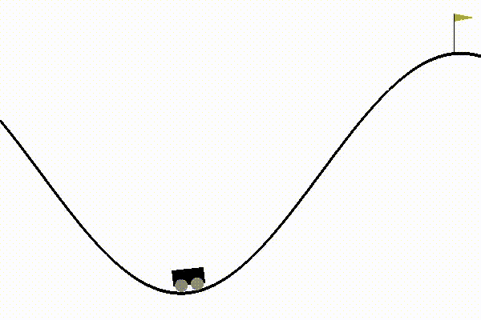

Taken from OpenAI gym documentation

# **简介**

在论文[确定性策略梯度算法](http://proceedings.mlr.press/v32/silver14.pdf)中，Silver 提出了一类处理连续动作空间的新算法。本文从第一性原理推导出确定性政策梯度定理。确定性策略梯度的一个优点是，与随机策略梯度相比，确定性版本更简单，并且可以更有效地计算。然后，论文提出了利用确定性策略梯度的策略上和策略外行动者-批评家算法。这篇论文建立在我已经写过的几个概念之上，比如[政策梯度](/nerd-for-tech/reinforcement-learning-introduction-to-policy-gradients-aa2ff134c1b)、[行动者-批评家方法](/geekculture/actor-critic-implementing-actor-critic-methods-82efb998c273)和[非政策行动者-批评家](https://chengxi600.medium.com/actor-critic-off-policy-actor-critic-algorithm-cca654845558)，所以当它们出现的时候我不会详细讨论它们。

# 确定性政策梯度定理

类似于随机策略梯度，我们的目标是最大化一个性能测量函数 *J(θ) = E[r_γ |π]* ，它是遵循策略π的期望总贴现报酬，其中 *θ* 是我们正在更新的函数的参数。这是一个扩展版本的绩效评估函数，我们对状态分布 *ρ* 和每个状态中的行为的所有奖励进行求和。

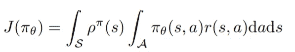

Taken from Determinist Policy Gradient Algorithms (Silver et al. 2014)

对于确定性策略，这有点不同。与随机策略不同，我们将我们的策略定义为函数 *μ_θ: S → A，*，其中μ接受状态空间 *S* 并输出跟随参数 *θ的动作空间 *A* 。*在这里，我们只需要对状态空间求和，而不是对动作进行积分，因为动作是确定的。然后我们可以把它写成一个期望，我们从状态分布 *ρ中抽取一个状态。*

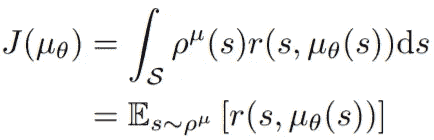

Taken from Determinist Policy Gradient Algorithms (Silver et al. 2014)

大多数无模型学习算法都是基于策略迭代的，一般框架由*策略评估*和*策略改进组成。*策略评估涉及诸如估计动作-状态函数 Q 的方法，而策略改进方法通常涉及根据该动作-状态函数更新策略。这方面的一个例子是当我们为 Q-learning 建立一个策略时。在学习了策略评估函数 Q 之后，我们使用 argmax 构建一个策略来选择具有最高 Q 值的动作。

对于确定性策略，我们将做一些类似的事情。由于我们的行动空间是连续的，我们将在 Q 函数的梯度方向上移动我们的策略。策略将向最大 Q 值收敛，而不是通过采取 argmax 操作来最大化 Q 值。我们可以把这个梯度写成期望值:

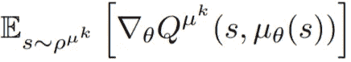

Taken from Determinist Policy Gradient Algorithms (Silver et al. 2014)

然后，我们可以应用一次链式法则，这样我们可以看到 *Q* 相对于动作 *a* 的梯度，以及 *μ* 相对于参数 *θ:* 的梯度

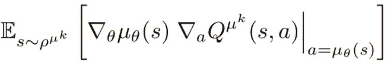

Taken from Determinist Policy Gradient Algorithms (Silver et al. 2014)

这是确定性政策梯度的扩展形式:

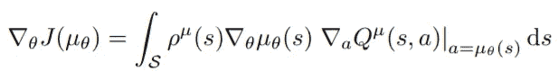

Taken from Determinist Policy Gradient Algorithms (Silver et al. 2014)

这种确定性政策梯度的证明在结构上类似于 [(Sutton et al. 1999)](https://proceedings.neurips.cc/paper/1999/file/464d828b85b0bed98e80ade0a5c43b0f-Paper.pdf) 中详述的政策梯度定理的证明。看看确定性政策梯度，你可能会注意到它有点类似于随机政策梯度。本文引入一个定理，证明确定性政策梯度实际上只是随机政策梯度的一个特例。

回想一下政策梯度定理:

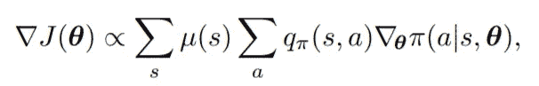

Taken from Sutton & Barto, 2017

我们可以用确定性策略 *μ_θ* 和方差σ来参数化策略函数 *π* ，类似于用于连续动作的策略参数化。定理指出，当σ接近 0 时，π = μ。

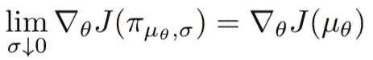

Taken from Determinist Policy Gradient Algorithms (Silver et al. 2014)

这个定理的证明可以在论文的附录 C 中找到。这个定理很重要，因为它表明其他技术，如相容函数近似、自然政策梯度和经验重现，可以应用于确定性政策梯度。

# 确定性策略梯度算法

利用确定性策略梯度，我们可以推导出不同种类的算法，例如针对策略上和策略外的行动者-批评家方法。本文从一个简单的策略算法开始，该算法使用 SARSA 来更新 critical。类似于随机行动者-批评家方法，我们有一个行动者来更新策略，在这种情况下是确定性的，还有一个批评家，它将通过学习一组参数来逼近真实的行动状态函数 Q。以下是算法的更新公式:

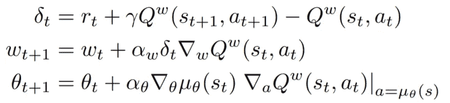

Taken from Determinist Policy Gradient Algorithms (Silver et al. 2014)

类似于策略上的算法，我们也可以将确定性策略梯度用于策略外的算法。我们可以使用静态行为策略来获得我们的动作，而不是使用从策略中采样的轨迹。我们可以用类似于随机政策外行动者评论家的方式推导出绩效评估梯度的期望值，我在我的[上一篇文章](https://chengxi600.medium.com/actor-critic-off-policy-actor-critic-algorithm-cca654845558)中提到过:

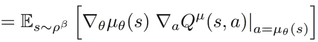

Taken from Determinist Policy Gradient Algorithms (Silver et al. 2014)

这与政策梯度的预期相同，只是状态是从单独的行为政策β中取样的。请注意，策略梯度没有使用重要性权重，因为我们没有对操作进行积分。我们还可以通过使用 Q-learning 来避免批评家的重要性权重:

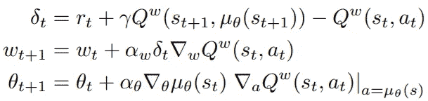

Taken from Determinist Policy Gradient Algorithms (Silver et al. 2014)

在上面提出的两个算法中，还有一个大问题。我们用一个近似值代替了确定性策略梯度中的动作状态函数，但是这并不保证近似梯度将遵循真实梯度。然后，本文提出了一类相容函数逼近器，以确保逼近将遵循真实梯度。

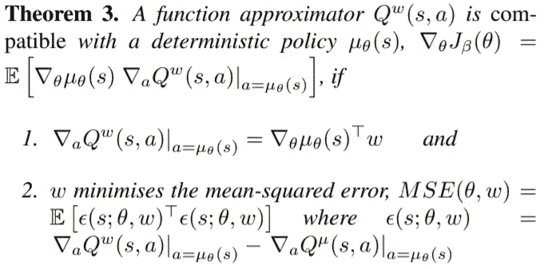

Taken from Determinist Policy Gradient Algorithms (Silver et al. 2014)

这个定理的证明如下:

首先，如果 *w* 最小化 MSE，那么 MSE 相对于 *w* 的梯度为 0。我们知道这一点，因为如果 *w* 使误差最小化，那么 *w* 必定处于最小值，因此，梯度为 0。然后，我们有以下内容:

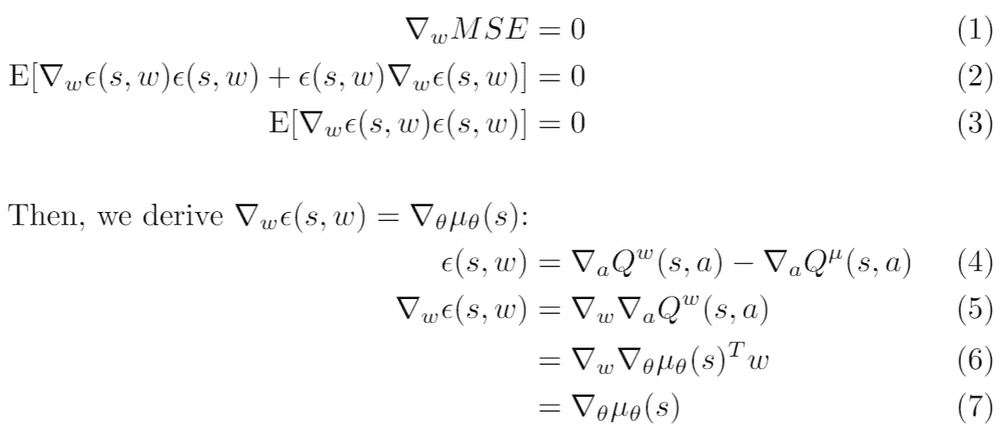

对于第(1)至(3)行，我们扩展了 *MSE* 的梯度。然后，我们证明 *∇_w ϵ(s，w) = ∇_θ μ(s，θ)* 。我们在(4)和(5)中展开ϵ的梯度，然后将定理的条件 1 用于(6)。

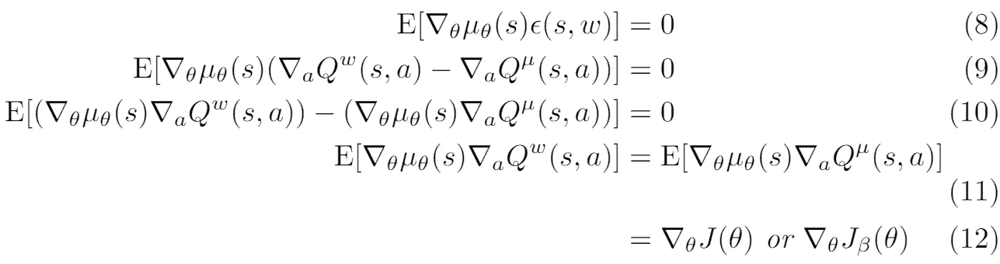

现在，我们可以在(8)中插入 *∇μ* 并在(9)中展开 *ϵ* 。然后，我们将 *∇μ* 分布在(10)中，并使用近似器 *Q_w* 证明确定性策略梯度定理在以下两个条件下是相容的。请注意，兼容函数逼近器也适用于非策略情况！

然后提出了满足定理两个条件的近似子 Q_w 的形式。

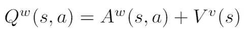

这里，我们有了动作状态函数的基本形式。函数的组成部分很简单:优势函数 *A* 估计选择动作 *a* 相对于 *μ(s* )的优势，价值函数 *V* 是状态 *s* 的值。对于价值函数，我们可以仅使用具有参数 *v* 和状态特征ϕ(s).的线性近似器

对于优势函数，我们也可以使用带有参数 *w* 的线性近似器，并定义动作状态特征ϕ(s，a)。

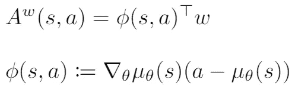

这里的动作-状态特征与采取动作 *a* 相对于 *μ(s)* 的优势成正比，并且还满足相容性定理的条件 1。以下是近似器的完整表格:

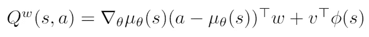

注意，给定一个 *m* 动作空间大小和 *n* 策略参数， *∇μ(s)* 将是一个雅可比矩阵，ϕ(s)将是一个 *n × 1* 向量， *w* 也将是一个 *n × 1* 向量。现在，我们必须满足定理的条件 2， *w* 必须最小化 Q_w 的梯度和真实梯度之间的均方误差。这里的问题类似于学习一个价值函数。由于对真实梯度的无偏值进行采样太难，我们将仅使用近似方法(如 SARSA 或 Q-learning)来近似真实梯度。该论文确实承认，尽管真实梯度的近似不会精确地最小化均方误差，但是该近似仍然可以近似满足第二个条件。

有鉴于此，该论文提出了一种兼容的非策略确定性行动者-批评家算法(COPDAC-Q ),该算法使用 Q 学习批评家:

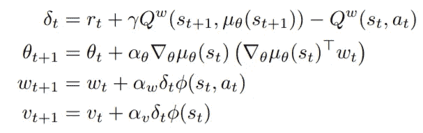

Taken from Determinist Policy Gradient Algorithms (Silver et al. 2014)

你可能注意到的一个问题是，偏离策略的 Q-learning 倾向于发散。我们可以做的一个改进是通过使用梯度时间差分方法，这种方法可以保证在非策略设置中的收敛，就像我们对[非策略行动者-批评家](/geekculture/actor-critic-off-policy-actor-critic-algorithm-cca654845558)所做的一样。然后，该论文提出了另一种算法，COPDAC-GQ 算法，该算法使用梯度 Q 学习评价器:

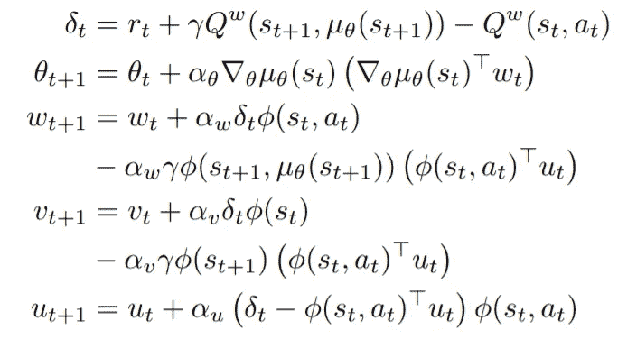

Taken from Determinist Policy Gradient Algorithms (Silver et al. 2014)

最后，本文使用一个[自然政策梯度](https://proceedings.neurips.cc/paper/2001/file/4b86abe48d358ecf194c56c69108433e-Paper.pdf)，它选择相对于费希尔信息度量的最陡梯度上升方向。我们使用费雪信息度量的确定性版本，当随机策略的方差接近 0 时，它是随机版本的特殊极限情况。

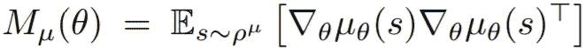

Taken from Determinist Policy Gradient Algorithms (Silver et al. 2014)

幸运的是，通过我们的兼容函数逼近器，我们可以很容易地看到，相对于费希尔信息度量的最陡上升方向就是简单的 *w.*

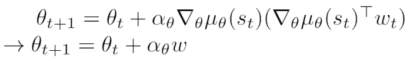

# 实现 COPDAC-Q

现在，让我们试着实现一个 DPG！我将尝试实现一个带有自然政策梯度的 COPDAC-Q。实施是在 Pytorch 中完成的，我们将对策略、Q 函数和值函数使用线性近似。

首先，快速介绍一下登山车的环境。代理是一辆从山脚出发的汽车，想要到达山顶的绿旗。状态空间对于轿厢速度和轿厢位置是连续的，动作空间也是连续的，一个用于计算驱动力的功率系数。到达旗帜的奖励是 100，而不像论文在每一步只有-1 的奖励，并且代理在每一步的能量使用被惩罚。当代理在 100 集内达到 90 分时，环境被视为已解决。

以下是一些使用的超参数:

*   γ(折扣系数)= 0.99
*   最大步数(每集)= 5000
*   已解决 _ 得分= 90
*   α_θ = 0.005
*   α_w = 0.03
*   αv = 0.03
*   BATCH_SIZE = 8
*   Numpy 随机种子= 0
*   Pytorch 随机种子= 0

有趣的是，这里的随机种子确实很重要，因为我无法让我的实现长时间工作，但更改随机种子使它工作了。

对于这个实现，我们将利用经验重放，每 10 步进行一次批量更新。行为策略只是从动作空间中随机抽样。我们还将使用从 10，000 个随机状态采样中获得的平均值和标准差对状态进行标准化。请注意，我们为策略评估选择了较高的学习率，因为我们希望评估比策略收敛得更快，从而使策略朝着正确的方向移动。

先来训练我们的代理，100 集，批量 1。以下是培训历史:

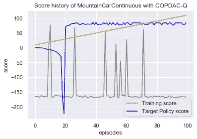

在 100 集之后，我们的代理能够在 10 次播放中获得 82.06 的平均分数，方差为 0.009。由于算法的本质是确定性的，低方差是有意义的，因为唯一的不确定性是代理的随机起始状态。灰线是来自随机获得幸运的行为策略的训练分数，蓝线是我们的目标策略分数。一个有趣的事情是，即使政策最初在 17/18 集左右走向错误的方向，政策仍然能够极快地恢复。我假设这大约是 Q 和值函数开始收敛的时间，因此策略可以快速学习。它看起来是这样的:

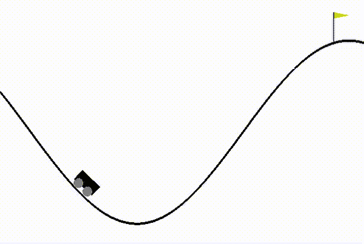

现在，让我们用批量 8 来培训我们的代理。以下是培训历史:

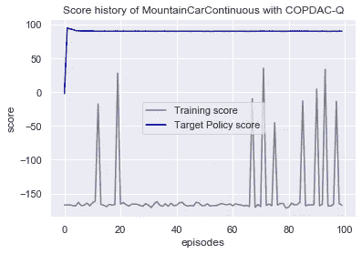

我们的代理能够获得 90.10 的平均分数，方差为 0.0203。看看比分历史，这似乎是一个错误。目标政策 1 集后近 100 的高分起步。然而，在查看了训练参数并确保没有 NaN 值后，我尝试重新训练代理 1 集。令人惊讶的是，该代理的平均分为 98±0.03，可以在短短 1 集内解决登山车环境！它看起来是这样的:

有趣的是。对于单集代理，购物车需要更长的时间才能到达旗帜，但得分更高。如果我们用 DPG 论文的指标来评估，那么它的得分会更低，因为它需要更长的时间才能到达旗帜。然而，手推车在这里使用较少的能量来建立到达旗帜的动力，导致较高的分数和能量使用惩罚。对于 100 集的代理，我猜想代理过度训练，并由于使用 Q-learning 评论家而转向一个次优的解决方案。

还有一点要注意的是，我得到的结果并不总是一致的，因为代理无法解决某些试验的环境。在修改奖励以奖励机械能的变化后，∇me =∇(0.5 毫伏+兆瓦时)，代理人能够始终如一地解决环境问题。

# 最后的想法

我非常兴奋能够处理这个实现，因为我希望能够复制 DPG 论文的结果，而且它也是 DDPG 算法的重要组成部分。最后，我在 Pytorch 中使用线性近似成功地解决了 MountainCar 环境。在这个过程中，我确实学到了一些东西，那就是随机种子确实很重要。我的实现在很长一段时间内都没有工作，直到我更改了种子。我将来要做的一个改变是聚集来自不同种子的结果，因为在一个种子上做所有事情可能会给出有偏见的结果。直觉上，你会认为算法不应该依赖于随机种子，但这是强化学习的本质。在下一篇文章中，我将借鉴 DPG 和 DQN 的概念，探索使用深度学习的 DDPG 算法。

code:[https://github . com/cheng i600/rl stuff/blob/master/Deterministic % 20 policy % 20 gradients/COP DAC-q . ipynb](https://github.com/chengxi600/RLStuff/blob/master/Deterministic%20Policy%20Gradients/COPDAC-Q.ipynb)

参考资料:

*   [确定性政策梯度算法(Silver 等人，2014 年)](http://proceedings.mlr.press/v32/silver14.pdf)
*   [确定性政策梯度算法:补充材料(Silver 等人，2014 年)](http://proceedings.mlr.press/v32/silver14-supp.pdf)