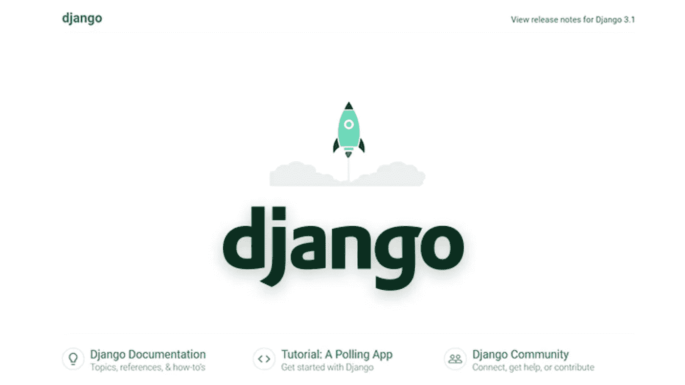

# Django 介绍——一个全栈 Python 框架

> 原文：<https://medium.com/geekculture/introduction-to-django-a-full-stack-python-framework-56796c1b5d2c?source=collection_archive---------12----------------------->


Django 是一个著名的全栈 python 框架，遵循“包含电池”的理念。“包含电池”意味着构建 web 应用程序所需的通用功能与框架一起提供，而不是作为单独的库提供。Spotify、Instagram、YouTube、Pinterest、Quora 等一些热门网站都是使用 Django 构建的。

# 为什么是姜戈？

首先，它是基于 python 的，python 是最广泛接受和最简单的语言之一，以其社区和庞大的库而闻名。

Django 因其性能、稳定性和社区性而闻名。而且他们的官方[文档](https://docs.djangoproject.com/en/4.0/)是软件开发中最好的之一。无论你需要做什么复杂的任务，总会有一些软件包可以帮你完成所有繁重的工作。此外，Django 跟踪每天出现的每个 web 漏洞，并在发现漏洞后立即发布补丁，从而使您的 web 应用程序更加安全。

# 一点历史知识

根据 Django 软件基金会的说法，Django 是“为了满足快速发展的新闻编辑室的最后期限，同时满足有经验的网络开发人员的苛刻要求而发明的。”这个框架是由新闻网站世界在线的开发人员 Adrian Holovaty 和 Simon Willison 发明的。当时，阿德里安和西蒙正在用 PHP 编写。但是由于世界在线网站需要快速更新，很难在截止日期前完成。阿德里安和西蒙需要一些可以快速建立网站的东西。那时他们决定转向 Python。后来，他们开始在 Django 上工作，使编码更加简单和有效。2005 年，Django 已经作为一个开源项目公开发布。今天，姜戈被称为

*为有期限的完美主义者设计的网络框架。*

# 安装

首先，你需要在你的系统中安装 python，如果没有安装的话[现在就安装](https://www.python.org/downloads/)。我强烈建议在做任何 python 项目时使用虚拟环境。

如果您以前从未使用过虚拟环境，请运行

```
python -m pip install --user virtualenv
```

或者结账[这里](https://virtualenv.pypa.io/en/latest/installation.html)。

如果您有较新版本的 python (python 3.5 以上)，建议使用 pipx 安装 virtualenv。它隔离 virtualenv，不影响操作系统的其他部分。

```
pipx install virtualenv
```

现在将 Django 安装到您创建的虚拟环境中。

创建一个虚拟环境

```
virtualenv .env
```

。env 可以是任何名称。现在，将在当前目录中创建一个. env 文件夹。

```
source .env/bin/activate 
```

激活当前虚拟环境。

```
python -m pip install Django
```

要随时停止使用当前的虚拟环境，请运行

```
deactivate
```

创建新的 Django 项目运行

```
django-admin startproject myproject
```

这将给出一个名为 myproject 的文件夹和其中的一些文件。

要运行服务器，请运行命令

```
python manage.py runserver
```

这将在 [http://127.0.0.1:8000/](http://127.0.0.1:8000/) 上打开一个服务器



更多关于 Django 项目结构及其用法的内容将在后续文章中讨论