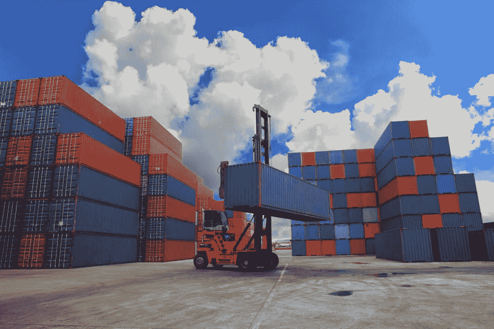
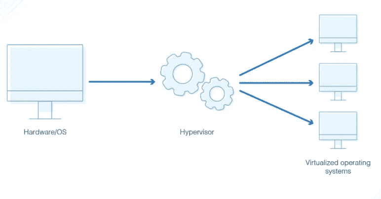
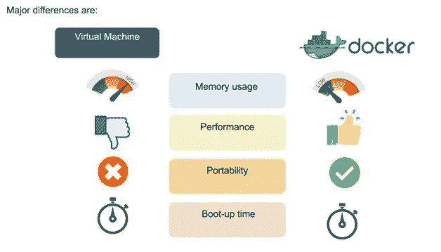
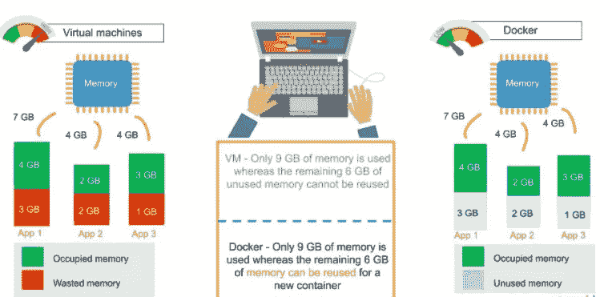
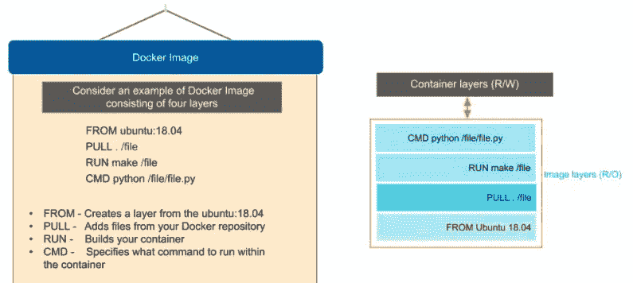

# Docker 和基于容器的开发简介

> 原文：<https://medium.com/geekculture/introduction-to-docker-and-container-based-development-6b04d249ea9?source=collection_archive---------31----------------------->

Photo by Thinkstock

在早期，任何应用程序都将部署在物理服务器上。例如，我们有一个应用服务器、web 服务器和数据库服务器，就像三个不同的服务器。那时，我们使用三个物理硬件箱。说到这一点，将会面临很多问题。我们必须维护它，需要空间，需要单独的网络，操作系统维护，成本，以及更多的浪费。因为我们的应用服务器或我们的 web 服务器和数据库服务器可能不会使用该机器 100%的处理能力和该机器 100%的内存。同样，这也是一种浪费。

所以下一代(第二代)是虚拟机管理程序。

## 什么是 Hypervisor？

虚拟机管理程序是能够创建虚拟机，然后管理和分配资源给它们的硬件、软件或固件。虚拟机是为使用主机资源而设置的机器。您可以任意多次划分这些资源，以容纳必要的虚拟机“来宾”(如果您听说过术语“虚拟机监视器”，您可能会对虚拟机监视器和虚拟机管理程序之间的区别感到好奇。它们是一样的。)

例如，你可能有一台安装了 8GB 内存和 Windows 操作系统的电脑。如果您想运行需要 Linux 的程序，您可以创建一个运行 Linux 的虚拟机，然后使用一个管理程序来管理它的资源——例如，给它分配 2GB 的 RAM。主机的一些资源将运行 Windows 操作系统，一些资源将分配给运行 Linux 的虚拟机。

这是更好的解决方案吗？
没有，因为它还有些问题。

*问题 1* —这里我们有一个不同的操作系统。所以现在有很多成本(许可成本)，路径那些，需要维护，需要更新像很多管理工作要做。

问题 2 —假设我们需要另一台网络服务器。因此，我们需要创建另一个虚拟机。我们需要安装另一个操作系统和另一个网络服务器。所以完成这个过程需要很多时间。

对于所有这些问题，有一个解决方案叫做容器化应用程序(Docker)。这是第三代。

现在，在我们开始使用 Docker/Container 之前，您必须首先了解 Docker 和虚拟机之间的区别。那么，我们开始吧。

# Docker 与虚拟机

Docker Container vs Virtual Machine

Differences between these two

在图像中，您会注意到一些主要差异，包括:

*   虚拟环境有一个管理程序层，而 Docker 有一个 Docker/容器引擎层。
*   对于虚拟机，内存使用率非常高，而在 Docker 环境中，内存使用率非常低。
*   就性能而言，当您开始构建虚拟机时，特别是当您在一台服务器上有多个虚拟机时，性能会变得更差。有了 Docker，由于单 Docker 引擎，性能总是很高。
*   就可移植性而言，虚拟机并不理想。它们仍然依赖于主机操作系统，当您为了可移植性而使用虚拟机时，会发生许多问题。相比之下，Docker 是为便携性而设计的。实际上，您可以在 Docker 容器中构建解决方案，无论托管在哪里，解决方案都保证像您构建的那样工作。
*   与 Docker 环境的启动时间相比，虚拟机的启动时间相当慢，在 Docker 环境中，启动几乎是瞬时的。

*   使用虚拟机的另一个挑战是，如果环境中有未使用的内存，您无法重新分配它。如果您设置了一个有 9gb 内存的环境，其中有 6gb 是空闲的，那么您就不能对这些未使用的内存做任何事情。使用 Docker，如果您有空闲内存，您可以在 Docker 环境中使用的其他容器之间重新分配和重用它。
*   虚拟机的另一个挑战是，在单个环境中运行多个虚拟机会导致不稳定和性能问题。另一方面，Docker 被设计为在同一个环境中运行多个容器——在托管的单个 Docker 引擎中运行更多的容器实际上会变得更好。
*   虚拟机存在可移植性问题；该软件可以在一台机器上运行，但是如果您将该虚拟机移动到另一台机器上，突然有些软件将无法运行，因为有些依赖关系将无法正确继承。Docker 被设计成能够跨多种环境运行，并且可以很容易地跨系统部署。
*   虚拟机的启动时间约为几分钟，而 Docker 环境的启动时间为几毫秒。

现在你已经知道了虚拟机和 docker 之间的区别，让我们通过理解 Docker 实际上是什么，从 Docker 的简要说明开始。

# Docker 是什么？

Docker 是一个操作系统虚拟化软件平台，它允许 IT 组织在 Docker 容器中轻松创建、部署和运行应用程序，Docker 容器中包含所有依赖项。容器本身实际上只是一个非常轻量级的包，其中包含所有的指令和依赖项——比如框架、库和 bin。

# Docker 的优势

1.  投资回报和成本节约
2.  标准化和生产力
3.  兼容性和可维护性
4.  简单快捷的配置
5.  快速部署
6.  持续部署和测试
7.  多云平台
8.  隔离
9.  安全性

# Docker 是如何工作的？

Docker 通过 Docker 引擎工作，该引擎由两个关键元素组成:服务器和客户端；两者之间的通信是通过 REST API 进行的。服务器将指令传送给客户端。在较旧的 Windows 和 Mac 系统上，您可以利用 Docker 工具箱，它允许您使用 Compose 和 Kitematic 控制 Docker 引擎。

# Docker 的组件

1.  Docker 客户端和服务器
2.  Docker 图像
3.  Docker 注册表
4.  码头集装箱

让我们讨论每一个组成部分。

## Docker 客户端和服务器

这是一个命令行指导的解决方案，您可以在 Mac 或 Linux 系统上使用终端从 Docker 客户机向 Docker 守护进程发出命令。Docker 客户机和 Docker 主机之间的通信是通过 REST API 进行的。您可以发出类似的命令，比如 Docker Pull 命令，它会向守护进程发送一条指令，并通过与其他组件(映像、容器、注册表)进行交互来执行操作。Docker 守护进程本身实际上是一个与操作系统交互并执行服务的服务器。正如您所想象的，Docker 守护进程不断地监听 REST API，看它是否需要执行任何特定的请求。如果您想要触发并启动整个过程，您需要在 Docker 守护进程中使用 Dockered 命令，这将启动您的所有表演。然后您有一个 Docker 主机，它允许您运行 Docker 守护进程和注册表。

## Docker 图像

Docker 图像是包含 Docker 容器说明的模板。这个模板是用一种叫做 YAML 的语言编写的，它代表“又一种标记语言”。

Docker 映像构建在 YAML 文件中，然后作为文件托管在 Docker 注册表中。图像有几个关键层，每个层都依赖于它下面的层。图像层是通过执行 Dockerfile 文件中的每个命令创建的，并且是只读格式。您从基础层开始，它通常包含您的基础映像和基础操作系统，然后在基础层之上还有一层依赖关系。这些指令包含在一个只读文件中，这个文件将成为你的 docker 文件。

这里我们有四层指令:From、Pull、Run 和 CMD。它实际上看起来像什么？From 命令基于 Ubuntu 创建一个层，然后我们将 Docker 存储库中的文件添加到该基础层的 base 命令中。

*   Pull:从 Docker 存储库中添加文件
*   运行:构建您的容器
*   CMD:指定在容器中运行哪个命令

在这种情况下，命令是运行 Python。当我们设置多个容器时，将会发生的事情之一是，每个新的容器都在 Docker 环境中添加一个包含新图像的新层。每个容器都与 Docker 环境中的其他容器完全分离，因此您可以在每一层中创建自己独立的读写指令。有趣的是，如果你删除一个层，它上面的层也会被删除。

当你拉进一个层，但核心图像发生了变化，会发生什么？有趣的是，主图像本身是不能修改的。复制图像后，您可以在本地对其进行修改。您永远不能修改实际的基础映像。

## Docker 注册表

Docker registry 是存放各种类型图像的地方，也是分发图像的地方。存储库本身只是 Docker 图像的集合，这些图像建立在用 YAML 语言编写的指令上，非常容易存储和共享。您可以给 Docker 图像命名标签，这样人们就可以很容易地在 Docker 注册表中找到并共享它们。开始管理注册中心的一种方法是使用任何人都可以访问的 Docker hub 注册中心。您也可以创建自己的注册表供内部使用。

您在内部创建的注册表可以包含您创建的公共和私有映像。用于连接注册表的命令是 Push 和 Pull。使用 Push 命令将您从本地管理器节点创建的新容器环境推送到 Docker 注册表，使用 PullL 命令检索从 Docker 注册表创建的新客户机(Docker 映像)。同样，Pull 命令从 Docker 注册表中拉出并检索 Docker 映像，Push 命令允许您获取您创建的新命令，并将其推送到注册表，无论它是 Docker hub 还是您自己的私有注册表。

## 码头集装箱

Docker 容器是捆绑在一起的应用程序及其依赖项的可执行包；它给出了您希望运行的解决方案的所有说明。由于内置的结构冗余，它非常轻便。该容器本身也是便携的。另一个好处是它完全独立运行。即使您运行的是容器，也保证不会受到任何主机操作系统安全性或独特设置的影响，这与虚拟机或非容器化环境不同。Docker 环境的内存可以跨多个容器共享，这非常有用，尤其是当您有一个虚拟机，并且每个环境都有一个确定的内存量时。

Linux 容器促进了高可用性计算的巨大转变，有许多工具集可以帮助您在容器中运行服务(甚至是整个操作系统)。Docker 是众多选项中的一个，由开放容器倡议(OCI)定义，这是一个行业标准组织，旨在鼓励创新，同时避免供应商锁定的危险。他们可以选择容器工具链，包括 Docker、OKD、Podman、rkt、OpenShift 等等。

如果您决定在容器中运行服务，那么您可能需要为托管和管理这些容器而设计的软件。这就是广为人知的容器编排。Kubernetes 为各种容器运行时提供容器编排。

参考资料:

 [## Docker 是什么？

### Docker 是一个工具，旨在通过使用容器来简化应用程序的创建、部署和运行。容器…

opensource.com](https://opensource.com/resources/what-docker)  [## 什么是编排？

### 编排是计算机系统、应用程序和…的自动化配置、管理和协调

www.redhat.com](https://www.redhat.com/en/topics/automation/what-is-orchestration)  [## 什么是 Docker 图像？(还有一个用 IronWorker 怎么用？)| The Iron.io 博客

### 不管你喜不喜欢，容器已经成为运行几乎所有东西的基础设施的一部分。来自…

blog.iron.io](https://blog.iron.io/what-is-a-docker-image/)  [## Docker 是什么？容器革命的火花

### Docker 是一个基于容器构建应用程序的软件平台——小型轻量级执行…

www.infoworld.com](https://www.infoworld.com/article/3204171/what-is-docker-the-spark-for-the-container-revolution.html)