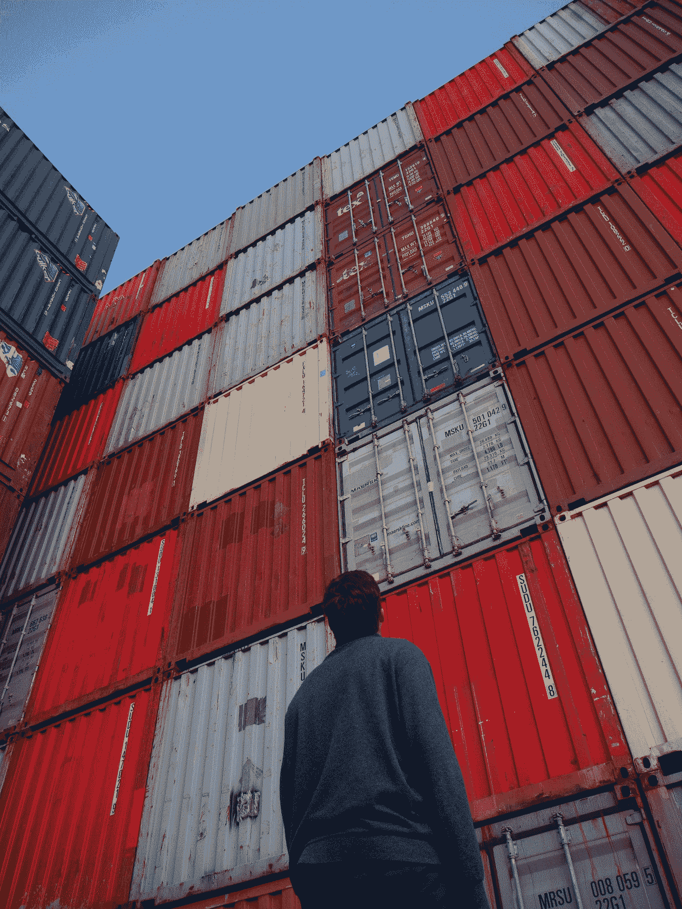
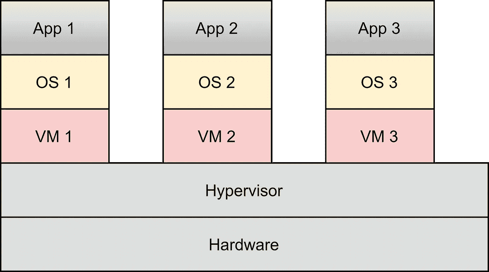
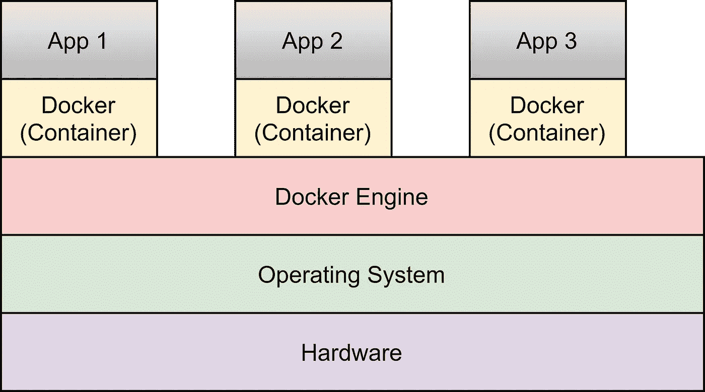
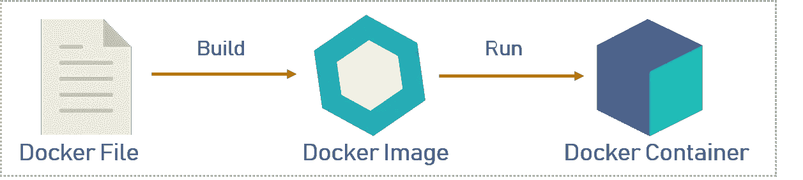

# Docker 和基于容器的开发简介

> 原文：<https://medium.com/geekculture/introduction-to-docker-and-container-based-development-d06a557ce739?source=collection_archive---------41----------------------->

Photo by [Pat Whelen](https://unsplash.com/@patwhelen?utm_source=medium&utm_medium=referral) on [Unsplash](https://unsplash.com?utm_source=medium&utm_medium=referral)

# 历史概述

## 第一代

以前，我们使用多个物理服务器部署我们的应用程序。为了让事情更清楚，当我们有一个需要 web 服务器、数据库和应用服务器来运行的应用程序时，我们使用三个独立的硬件来部署它。

1st generation

**第一代产品的问题**

*   适当的维护是困难的，而且成本很高。
*   需要更多的空间来保存硬件。
*   需要单独的网络。
*   我们将需要为每个硬件设备配备独立的操作系统，这将需要成本，并且我们必须维护它们(例如:补丁、更新)
*   浪费时间，我们可能无法使用每个物理箱提供的所有设施。(例如:应用程序可能不会使用 web 服务器的全部处理能力)

## 第二代

第一代中的大多数问题在第二代中都得到了解决。

我们在第二代迁移到了虚拟机管理程序。在这种情况下，我们使用了一块高性能硬件。在硬件之上，我们安装了一个管理程序。在虚拟机管理程序之上，我们创建了多个虚拟机。然后，在虚拟机之上，我们安装我们需要的各种操作系统。我们的程序可以在操作系统之上运行。看下图，

2nd generation

**虚拟机管理程序的优势**

*   维护很容易，因为我们使用单一硬件。
*   所需空间更少。
*   不需要单独的网络。
*   更少的浪费，因为多个虚拟机可以一起使用单个硬件设备的最大性能。

**第二代的问题**

*   因为我们使用多个虚拟机，所以我们应该安装多个操作系统，这将需要成本，并且我们必须维护它们(例如:补丁、更新)
*   如果我们希望添加新的服务，我们必须首先构建一个新的虚拟机，这需要大量的配置，而且我们不能立即运行服务，因为操作系统需要启动时间。

## 第三代

我们转向基于容器的架构来解决第二代的问题。

在基于容器的设计中，我们也有一个单独的硬件盒。然后，在硬件之上，我们安装单一操作系统。然后，在操作系统之上，我们安装 docker-engine。然后，在 docker-engine 之上，我们创建许多 docker 或容器。然后，在 docker 之上，我们运行我们的应用程序。看下图，

3rd Generation

**集装箱的优点(Docker)**

*   由于我们使用单一操作系统，维护很容易。
*   我们可以添加新的服务，只需添加一个 docker，我们可以立即运行服务，因为不需要启动时间。(因为操作系统已经启动并运行)。

> **注:**
> 
> 码头工人和容器的区别就像可乐和软饮料的区别一样😃。Docker 是产品名称，而 container 是技术的确切术语。
> 
> Docker 是一个项目，由一家名为 dotcloud 的公司创建，该公司后来更名为 Docker，Inc .
> 
> Docker 是一个开源项目，由 Google 的 GO 语言开发。

## 什么是 Docker 引擎？

Docker 引擎是 Docker 架构的核心组件。Docker 引擎管理容器、图像、构建、编排和安全性等。Docker 引擎遵循客户端-服务器架构，由以下子组件组成。

1.  Docker 守护进程:这是运行在主机上的服务器。它管理 Docker 映像、容器、网络等。这也被称为**。**
2.  ****命令行界面(CLI):** 是一个客户端，用于输入 Docker 命令。**
3.  **REST API: 它支持客户端和守护进程之间的交互。**

## **什么是注册表？**

**注册表是存储 Docker 图像的位置。它可以是公共 docker 注册表或私有 docker 注册表。公共 Docker 映像的默认注册表是 **Docker Hub** 。您也可以创建和运行自己的私有注册表。您可以从注册表中提取 docker 图像，也可以将自定义的 Docker 图像推回到注册表中。**

## **Dockerfile、图像和容器之间的关系是什么？**

****

**Image from — [dzone](https://dzone.com/articles/docker-explained-an-introductory-guide-to-docker)**

*   ****Docker 文件:**Docker 文件是一个文本文档，包含用户可以在命令行上调用的所有命令，以组装 Docker 映像。**
*   ****Docker 图像:** Docker 图像可以比作用于创建 Docker 容器的模板。我们可以通过构建适当的 docker 文件来创建 docker 映像。**
*   ****Docker 容器:** Docker 容器是 Docker 映像的一个运行实例，因为它们保存了运行应用程序所需的整个包。当我们运行 docker 映像时，它会创建 docker 容器。**

## **什么是编排？**

**编排是将所有容器组合在一起以实现共同目标的过程。容器的部署、管理、扩展和联网都是通过容器编排实现的。容器编排对于需要部署和管理成百上千个容器和主机的企业非常有用。**编排器**是为容器化应用做编排的工具，最流行的例子是 **Kubernetes** 和 **Docker Swarm** 。**

## **码头工人坚持吗？**

**是的，码头工人天生坚持不懈。如果我们关闭或重启 docker，我们存储在 docker 中的数据和配置不会被破坏。**

## **我们可以将遗留应用程序迁移到 docker 吗？**

**无论是新的还是传统的应用程序，它都应该适合微服务架构，以便获得 dockerization 的完整功能。因此，如果我们可以通过修改或重写来转换遗留应用程序以适应微服务架构，我们就可以将应用程序迁移到 docker 并获得 docker 化的完整功能。**

**即使遗留应用程序不适合微服务架构，您仍然可以将其迁移到 Docker。但是，您可能无法实现完整的功能特性。**

**什么是“开放集装箱倡议”(OCI)？**

**随着 docker 公司的 docker 的推出，其他一些组织也采用了 Docker 的概念。然而，他们发现它并没有满足他们所有的需求和规范，而且它也没有什么架构缺陷。于是，他们开始实现一个类似于 docker 的名为“Rocket”的框架。由于两家不同的公司采取了两种不同的方式来实现几乎相同的计划，他们决定达成一个名为**“OCI”的共同协议。**OCI 由 Docker 和其他几位行业专家于 2015 年创立。OCI 将制定集装箱发展的规范。因此，现在应用程序的所有容器都应该符合 OCI 标准。结果，基于容器的开发变得独立于平台和供应商**

# **继续学习❤️**

# **参考**

** [## Docker 解释-Docker-DZone 云入门指南

### Docker 在这个快速发展的 IT 世界中广受欢迎。组织不断采用 Docker 在…

dzone.com](https://dzone.com/articles/docker-explained-an-introductory-guide-to-docker)  [## 面向初学者的 Docker 体系结构及其组件

### Semrush 是一个一体化的数字营销解决方案，拥有 50 多种搜索引擎优化、社交媒体、竞争对手研究等工具

geekflare.com](https://geekflare.com/docker-architecture/)  [## Docker 介绍:初学者指南

### Docker 是应用程序容器化最流行的工具之一。Docker 提高了效率并减少了…

www.bmc.com](https://www.bmc.com/blogs/docker-101-introduction/)**