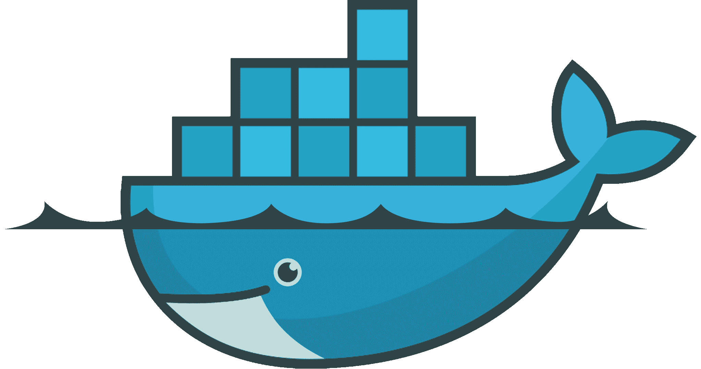
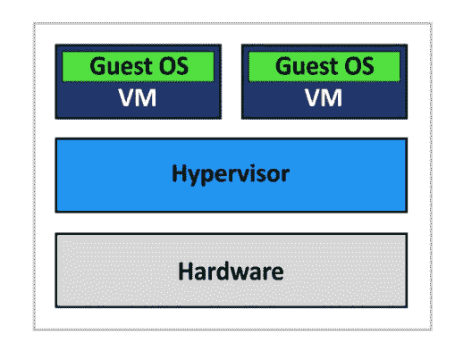
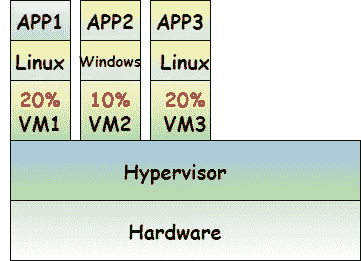
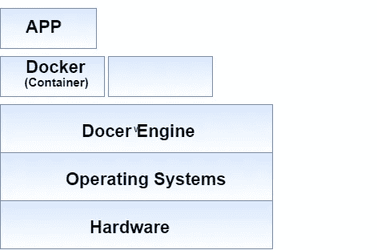
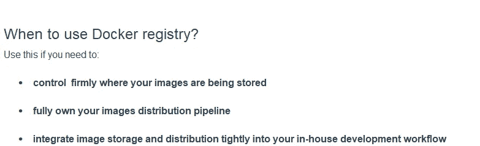
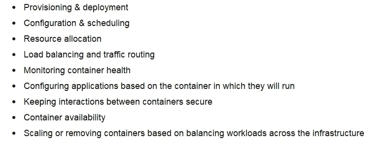
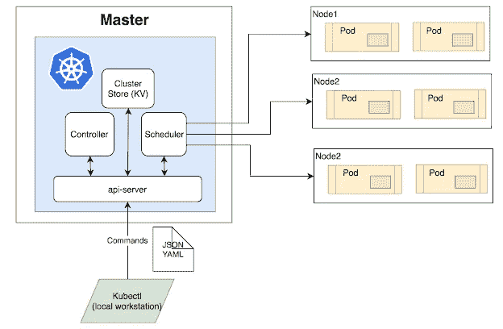

# Docker 和基于容器的开发简介📳

> 原文：<https://medium.com/geekculture/introduction-to-docker-and-container-based-development-microservices-part-1-f41522e91d4a?source=collection_archive---------1----------------------->

Docker 和基于容器的开发的简单概述。

# 第一代— 01

📍早期，我们使用物理服务器部署应用程序。

示例:假设有一个应用程序、数据库和 web 服务器。因此，当时我们为此使用了三种不同的物理硬件设备。

## 这些不同硬件盒的问题🧐

> *必须维护它们。(如果有多台服务器，那么我们需要多人来维护它。)*
> 
> *需要更多的空间。*
> 
> *需要单独的网络。*
> 
> 需要单独的操作系统。
> 
> *成本高。*
> 
> *浪费(因为应用服务器/ web 服务器没有使用 100%的处理能力和机器内存，数据库服务器没有使用 100%的机器空间。)*

让我们看下一代虚拟机管理程序 **⇨⇨⇨⇨**

# 第 2 代—虚拟机管理程序

📍在这一代中，我们使用单个高处理硬件设备，并在其上安装虚拟机管理程序。然后，我们在该虚拟机管理程序之上创建多个虚拟机，如下图所示。

Figure 1

示例:

Figure 2

✹假设 VM1、VM2 和 VM3 分别访问 20%、10%和 20%(图 2)，因此，所有这些虚拟机使用 50%的处理能力，剩余的 50%可用于创建其他多个虚拟机。因此，通过这种方法，我们能够解决浪费问题。

✹:我们在每个虚拟机上安装了操作系统(图 2)，然后在这些操作系统上安装了应用程序。现在这被称为虚拟化环境(第二代)

## 我们解决了所有的问题了吗？🧐

# 不😭

因为还是有一些缺点！

◼️:成本很高，因为有三个操作系统(如图 2 所示)。而且在成本、修补需求、维护和更新方面也有限制。因此它需要如此多的管理工作。

◼️:如果我们需要其他网络服务器，我们需要创建其他虚拟机和其他操作系统。因此，虚拟机的启动过程需要一些时间。

这意味着我们还没有解决我们的问题。**不是吗？** 🧐

# 第三代—集装箱化应用(集装箱)

## 码头集装箱

如果你是程序员或开发人员，你一定听说过 Docker。2013 年，dotCloud 向公众发布了他们的 Docker 容器项目，作为一个名为 **Docker 的开源项目。**所以 docker 是一个开源项目，是由一个叫做 dotCloud 的云平台内部开发的。Docker 是一个基于容器的平台，每个人都可以使用(不仅仅是在 dotCloud 内部)。后来，dotCloud 将其名称改为 Docker，Inc .并且不归 Docker，Inc .所有。这是通过使用 Go 语言作为编程语言开发的。

**优点:**

📍当使用 dockerized 环境或容器时，我们不需要任何单独的操作系统或虚拟机。所以会节省很多空间，可以利用剩余的空间来创建更多的容器。

📍我们不需要多重许可、多重修补..因为没有多个操作系统。

📍因为我们在主机操作系统之上。我们可以快速启动应用程序，因为操作系统已经启动。

📍安全性

📍多云平台

📍兼容性和可维护性

注意:📝Docker 是持久性的——无论何时关闭或启动，您所做的一切都会保留下来，不会被破坏。

> ***Docker 引擎***

Docker 引擎不是 docker 项目。它是非常小的一部分，是核心的协调、安全、注册、服务..所有这些都建立在 docker 引擎之上/周围。这是底层的客户机-服务器技术，通过利用 Docker 的服务和 Docker 的组件来构建和运行容器。

> ***Docker 注册表***

这是我们存储 docker 图像的地方。用户可以通过使用 pull 和 push 命令与注册表进行交互。

一些公共注册管理机构包括:

**♧** 亚马逊弹性容器注册处— ECR

**♧** Azure 集装箱注册处— ACR

**♧** 科里奥斯码头

**♧** 谷歌容器注册中心— GCR

♧私人码头登记处

**什么是码头工人形象？**

这是一个只读模板，其中包含了用于制作能够在 Docker 平台上运行的容器的组指令。它为打包应用程序和预配置服务器环境提供了一个合适的途径，用户可以将其用于私人用途或与 docker 的其他用户公开共享。

> ***码头工人枢纽***

这是由 Docker Inc .公司提供的托管注册表解决方案，通过该解决方案，Docker 用户能够访问开源公共图像库。因此，用户可以下载他们需要的任何 docker 图像&定制它并推回它。Docker hub 被认为是最大的存储库，拥有超过 25 万个存储库和数十亿次下载。

如果有多台主机，并且您需要使用定制的映像，您可以登录并将这些主机指向特定的 docker 注册表，并相应地下载定制的版本。

注意:📝您可以在本地环境中安装 Docker hubs 和 Docker registries

> ***编排***

容器化流程的可再现性和可移植性可以表示为我们必须在云和数据中心上扩展和移动容器化应用程序的机会。容器确保这些应用程序在任何地方都能平等地工作，使我们能够快速轻松地利用这些环境。

此外，当我们扩展应用程序时，我们需要一些工具来自动维护和替换失败的容器，并在容器的生命周期中管理容器的重新配置和更新。**orchestrator**是用于维护、管理&扩展容器化应用的工具。

例子: ***Kubernetes*** 和 ***Docker Swarm***

可能有不同的微观级服务，如 HTTP 运行时引擎、授权过程、登录和服务..等等。因此，您需要为这些模块创建不同的容器，而流程编排是所有这些模块集合在一起并实现单一目标的过程。

**配器是用来做什么的？**

它用于管理和自动化以下活动:

📜

*Kubernetes 是用于编排过程的开源容器编排工具之一。它还支持容器化应用的自动化部署、管理和扩展。这提供了说服那些容器化的应用程序在你需要的时间和地点运行的能力，并且支持用其他需要工作的工具来寻找资源，这是由 Google 设计和开发的。*

*以下是 Kubernetes 的一些特点:*

*📍存储编排*

*📍批量执行*

*📍自动扩展的基础设施*

*📍机密和配置管理*

*📍自定义计划*

*📍自愈*

*下面是➜的 Kubernetes 建筑图*

**

# *开放集装箱倡议——OCI*

*在 Docker Inc .公司推出该产品后，其他一些公司开始使用 Docker 概念。但是他们发现，这并不符合他们所有的规格和要求。此外，他们已经意识到一些架构问题。为了应对这种情况，他们开始实施一种类似的框架，称为“火箭”。由于有两家不同的公司走着两条不同的路，而且几乎是为了同一个计划，他们开始创建一个共同的协议“OCI”。OCI 于 2015 年由 Docker 和其他一些行业领袖成立。OCI 有两种规格，即“ ***【映像规格】(image-spec)*** 和 ***“运行时规格”(runtime-spec)。****

*oci 是一个开放的治理结构，其明确目的是围绕容器格式和运行时产生开放的行业标准。([https://opencontainers.org/](https://opencontainers.org/)*

# *参考*

* [## 开放集装箱倡议

### 开放容器倡议(OCI)，一个围绕容器创建开放标准的开源社区，今天…

opencontainers.org](https://opencontainers.org/)  [## 增强开发者的应用开发能力| Docker

### 新功能 Docker 扩展了面向开发人员的可信内容产品与 AWS、Datadog、Mirantis、Red……

www.docker.com](https://www.docker.com/)  [## 从码头工人到 OCI:什么是集装箱？

### 我们经常听说容器是:应用程序的包装格式；轻量级虚拟机；一套…

www.padok.fr](https://www.padok.fr/en/blog/container-docker-oci)*