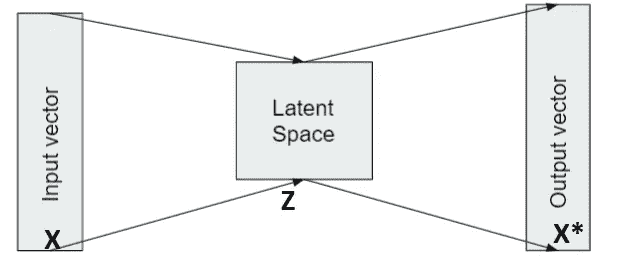
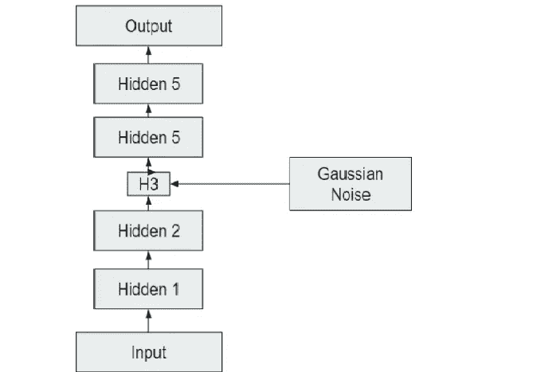
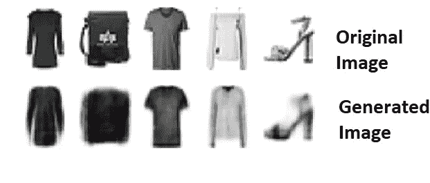
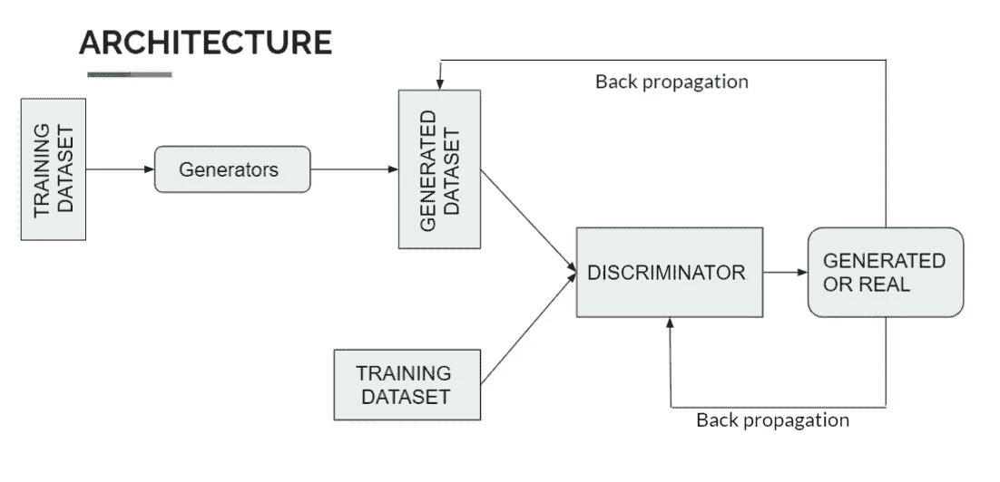

# 甘斯简介

> 原文：<https://medium.com/geekculture/introduction-to-gans-6215af1c91a6?source=collection_archive---------54----------------------->

Photo by [Alina Grubnyak](https://unsplash.com/@alinnnaaaa?utm_source=medium&utm_medium=referral) on [Unsplash](https://unsplash.com?utm_source=medium&utm_medium=referral)

当我们听到 GANs 这个词时，我们首先想到的是一个能够生成与原始数据集相似的数据集/图像的模型。这种在我们头脑中持续存在的 GANs 定义够了吗？**让我们深潜**

# 生成建模

第一个问题是: ***有没有深度学习模型有足够的能力生成看起来相似的数据集？***

> 自动编码器— → 我能帮上什么忙吗？

*   自动编码器绝对是我们能想到的最好的。

Auto-encoder

使用自动编码器的优势:

1.  通过给定输入向量，将其压缩到一个潜在空间，并再次生成输出向量，这是我们的主要工作。
2.  将输入向量转换为自身的潜在空间有很多用途:

*   它可以用于异常检测，因为它降低了维数。
*   去噪图像，因为维数减少，然后添加颜色，等等。

> 现在最大的问题是:自动编码器足够了吗？

答案是否定的。我们需要一种重要的自动编码器，它能够产生与输入数据相似的输出。变分自动编码器的作用来了。

> **变型自动编码器**

这些可以服务于我们正在寻找的 ***生成式自动编码器*** 的目的。因为它可以生成新的实例，看起来像是从训练数据集中采样的，但不会与我们添加的**高斯噪声**完全相同。

Variational Autoencoders in action

我们仅通过训练我们的模型 25 个时期就获得了上述结果。想象一下，如果我们让它接受更多时代的训练😳

现在我们想到的问题是:**如果我们有这些，为什么还要去找甘斯？它们增加了什么额外的好处？**

要回答这些问题，我们需要首先了解 GANs 的功能。

# 甘斯

一种深度学习技术，使用两个神经网络之间的竞争动态来合成真实的数据样本。给定任何数据集/图像，主要目的是创建/生成与给定数据集相似的新数据集/图像。

# **发电机**

它接受输入向量，其目的是生成无法与真实向量区分的向量。

# **歧视者**

它接受实数或生成的向量。它的目标是将接收到的输入分为真实输入和生成输入。

# **工作**

1.  **训练鉴别器**

*   使用生成器从来自输入的随机噪声向量生成向量，然后使用鉴别器对生成的向量和原始向量进行分类。将误差反向传播到鉴别器，训练它使分类误差最小化。

2.**培训发电机**

*   使用生成器从来自输入的随机噪声向量生成向量，然后使用鉴别器对生成的向量和原始向量进行分类。将误差反向传播到鉴别器，训练它**最小化**分类误差。

3.**均衡**

*   鉴别器试图最小化误差，而生成器试图最大化误差。训练什么时候停止？当生成器生成的向量与真实向量无法区分时，它就会停止。在这一点上，鉴别器不可能区分它们(导致它只能进行 50/50 的猜测)。生成器还会停止调优过程，因为一点点变化都可能给鉴别器提供线索，使其从真实数据中鉴别出假的例子，从而使生成器变得更糟。

> 在 VAEs 中，数据集正在生成，但关键是没有任何东西来检查生成的数据集是否实际上看起来像原始数据集。而在 GANs 中，这部分是由鉴别器部分完成的，因此与 VAEs 相比，我们在 GANs 中得到更好的结果。

# 参考

*   迪德里克·P·金马，马克斯·韦林，[自动编码变分贝叶斯](https://arxiv.org/abs/1312.6114) (2013)
*   [https://ineuron.ai/](https://ineuron.ai/)