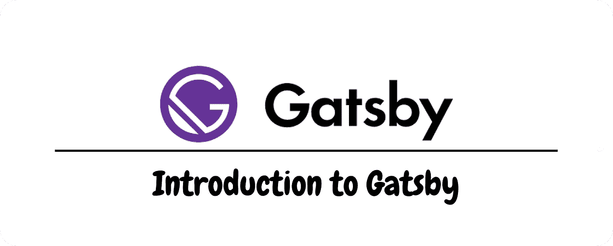

# 盖茨比简介

> 原文：<https://medium.com/geekculture/introduction-to-gatsby-4641948b450b?source=collection_archive---------31----------------------->

下一个 JS 开发者开始使用 Gatsby，让我们看看它能提供什么🙃

[Website](http://www.ihatereading.in)

## 在后台

如果你读过我以前的故事，那么你可以很容易地预测，我是下一个 JS 的最大粉丝，所以没有机会切换到 CRA(创建 React 应用程序)或盖茨比。那么为什么我要报道一个关于盖茨比的新故事呢，原因是我想多了解一些其他的框架，并且…