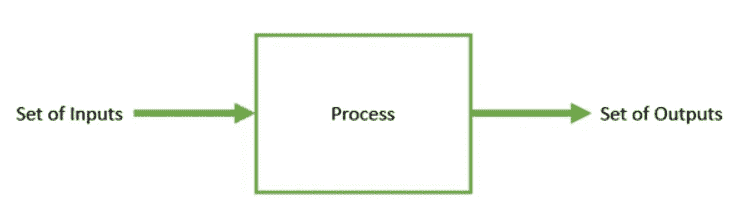
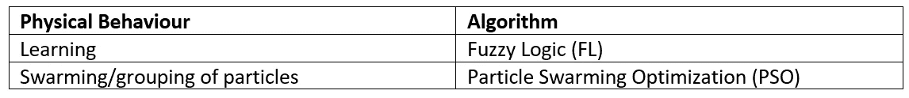
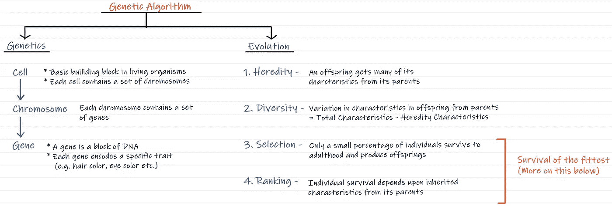
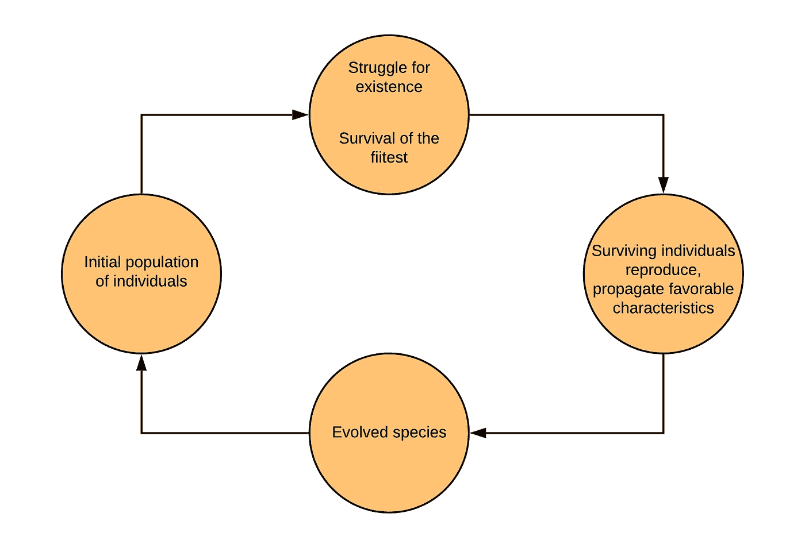
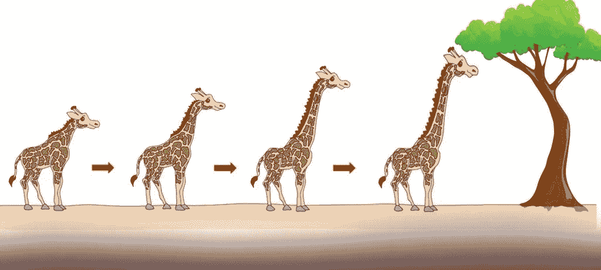
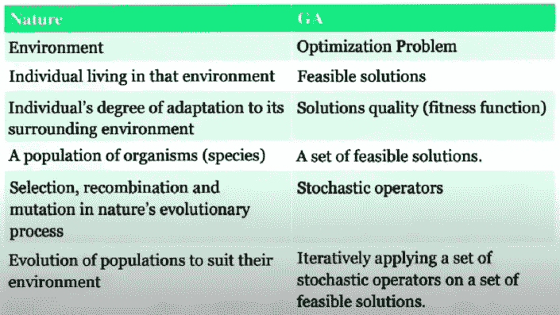
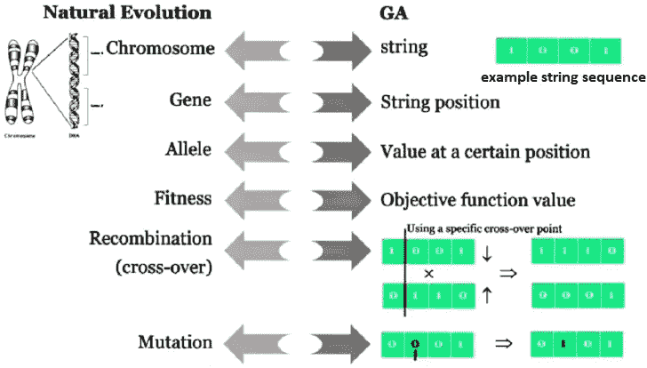
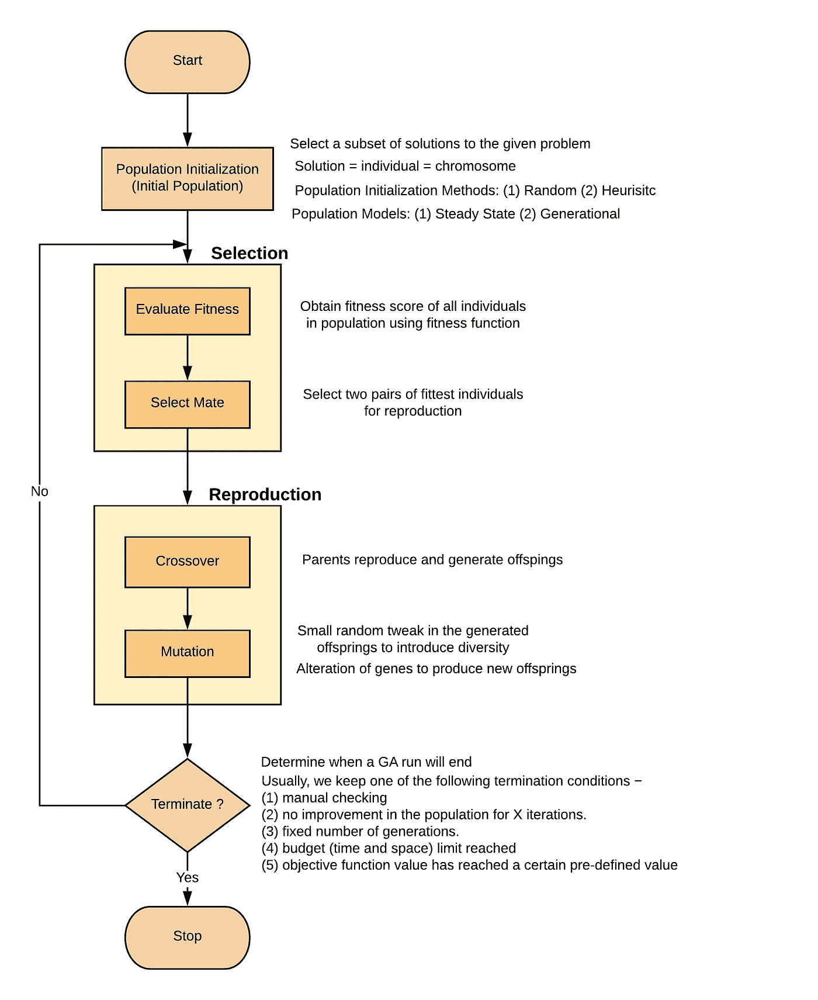

# 遗传算法简介

> 原文：<https://medium.com/geekculture/introduction-to-genetic-algorithm-d417119040b7?source=collection_archive---------14----------------------->

# 什么是优化？

*   让事情变得更好。
*   提高效率。

# 优化问题

*   一个问题，其中我们必须从所有可能的输入中找到输入值(也称为解或决策变量),以获得“最佳”输出值。
*   “最佳”的定义-找到导致一个称为目标函数的函数的最大值或最小值的输入值。
*   也可以有多个目标函数(取决于问题)。

# 最优化算法

用于解决优化问题的算法称为优化算法。

# 进化算法

模拟自然界中的物理和/或生物行为以解决优化问题的算法。

# 遗传算法

*   它是模拟/模拟遗传和进化(生物行为)以优化高度复杂功能的进化算法的子集。
*   一个高度复杂的函数可以:
    1。很难用数学建模。
    2。求解起来计算量很大。NP 难问题。
    3。涉及到大量的参数。

# GA 的背景

*   由霍兰德教授于 1965 年引进。
*   关于 GA 的第一篇文章发表于 1975 年。
*   遗传算法基于两个基本的生物过程。**遗传学(由 G.J .孟德尔于 1865 年创立):**遗传学是生物学的一个分支，研究基因、基因变异和遗传。
    2。**进化(C. Darwin 于 1875 年提出):**这是生物种群世代变化的过程。

问:那么遗传和进化之间有什么关系呢？？
Ans。基因变异→群体变化

# **进化中的自然选择**

1.  个体群体存在于资源有限的环境中。
2.  对这些资源的竞争导致选择那些更适应环境的更健康的个体。
3.  这些个体充当种子，通过重组和突变产生新的个体。
4.  进化出的新个体充当初始群体，重复步骤 1 至 3。

随着时间的推移，自然选择导致了种群适应度的上升。

*“择其精华，弃其糟粕”*

## 例子:长颈鹿有长长的脖子

1.  在早期，一些长颈鹿的脖子很短，而一些长颈鹿的脖子稍长。
2.  当所有较低的树枝被吃掉时，脖子稍长的长颈鹿可以以较高树枝的叶子为食。因此，他们有更好的生存机会。
3.  有利的特征通过长颈鹿的世代传播。
4.  现在，进化的物种有长长的脖子。

# 自然遗传类比

# 遗传算法的结构

# 遗传算法与传统算法

GA 处理函数值的编码形式(参数集)，而不是实际值本身。因此，例如，如果我们想要找到两个变量的函数 f(x1，x2)的最大值，GA 不会直接处理 x1 或 x2 值，而是处理编码这些值的字符串。

GA 使用大量的点进行搜索，而不仅仅是问题空间中的一个点。这使得遗传算法能够搜索布满局部最优点的嘈杂空间。遗传算法不是依赖于一个点来搜索空间，而是同时查看问题空间的许多不同区域，并使用所有这些信息来引导它。

遗传算法只使用收益信息来引导他们通过问题空间。许多搜索技术需要各种信息来指导自己。例如，爬山法需要导数。GA 需要的唯一信息是关于空间中一个点的某种适合度(有时称为目标函数值)。一旦遗传算法知道了一个点的当前“好”的度量，它就可以用它来继续搜索最优值。

⁴遗传算法本质上是概率性的，而不是确定性的。这是遗传算法使用随机化技术的直接结果。概率——随机交配、交换和突变的随机群体。

# 遗传算法的应用

## 1.声学

*   区分声纳反射和不同类型的物体。
*   设计主动噪声控制系统，通过产生与不需要的噪声相干扰的声波来消除不需要的声音。

## 2.航空航天工程

通过最小化超音速巡航速度时的气动阻力、最小化亚音速时的阻力和最小化气动载荷来设计超音速飞机。

## 3.金融市场

预测公开交易股票的未来表现。

## 4.地球物理学

基于地震学数据定位地震震源。

## 5.材料工程

*   设计导电碳基聚合物，称为聚苯胺。
*   电子束曝光图案的设计。

## 6.路由和调度

在电信网络中寻找最佳路由路径，用于将数据从发送方转发到接收方。

## 7.系统工程

以执行设计用于发电的风力涡轮机的多目标任务。

# GA 的问题

## 1.人口选择问题

定义种群规模和选择初始个体可能有点挑战性。

## 2.定义适应度函数

为了找出最优最小值或最大值，我们必须以这样的方式定义我们的适应度函数，使得最优解适应度可以随着每次迭代而增加。

## 3.遗传算法过早或快速收敛

*   快速收敛是遗传算法中一个非常普遍的问题。这是因为适应度函数的值变化很快，导致过早收敛。
*   有几种方法来修改我们的适应度函数，使得收敛缓慢发生，这将允许 GA 有足够的时间在整个空间中搜索并找到全局最优解。下面定义三种方式:
    1。*F ' = a * F+b
    F =群体串的正常适应值。
    a =较小的数字
    b =相对较大的数字
    现在可以清楚地看到，即使 F 快速增加，那么 F '之后也会缓慢增加。
    2。 *F' = a*(F^k)*
    k =在(0，1)
    中的常数，因此即使 f 快速增加，也不会产生快速收敛。
    3。*f ' = a*(f^k)* k = func(t)，t 是代
    这里适应度函数是每一代修改一次。*

## 4.收敛到局部最优

*   另一个重要的问题是遗传算法大部分时间收敛于局部最优。我们可能认为我们已经找到了最优解，但实际上，我们没有。
*   现在，重要的是要注意，遗传算法找到最优解的能力掌握在用户手中。只有当程序员编写了代码，使得 GA 可以在整个空间中搜索以找到最优解时，才会获得最优解。因此，在这种情况下我们应该做的是，我们应该修改我们的交叉和变异函数，因为它们负责在每次迭代中改变种群。

这就是本文的全部内容。

不要忘记👏如果你喜欢这篇文章。

如果您想了解更多关于 GA 的知识，请查看我的系列文章:

 [## 遗传算法(GA)系列

### 我发表了不少关于遗传算法的文章。虽然这些文章站在自己的立场，它将更多…

apargarg99.medium.com](https://apargarg99.medium.com/genetic-algorithm-ga-series-9cf533b292f) 

如果你有任何问题或者想要澄清什么，你可以在 LinkedIn 上找到我。

~快乐学习。