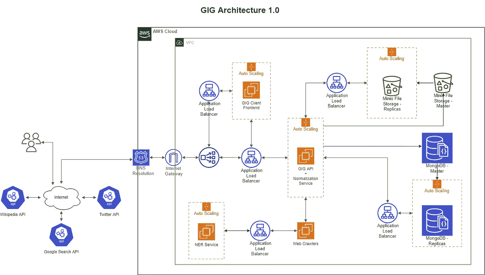

# GIG 简介——一般信息图

> 原文：<https://medium.com/geekculture/introduction-to-gig-general-information-graph-fd69b4bfbd8e?source=collection_archive---------25----------------------->

***关键词*** *—信息图、自然语言处理、命名实体识别、数据分析和数据可视化*

GIG 是面向公共信息的大规模信息存储、查询和处理系统。通过 GIG，我们的目标是提高许多社会、政治和经济领域的公开信息的质量，使企业、媒体、广大公众和政府更容易、更有效地使用这些信息。GIG 能够将不同格式的数据存储到一个结构中，并能够读取和处理数据以理解内容，并将数据与从其他数据源收集的数据进行映射。基本上，GIG 可以从不同的来源收集信息，并将数据连接起来，从不同的角度获得一个整体的想法。

例如，GIG 读取不同国家报纸的新闻文章，并读取数据以识别内容中提到的任何人或组织。然后它可以发现同样的新闻在其他报纸上是如何报道的。新闻分析师或记者会发现这些信息有助于通过比较相同信息在不同来源中的呈现方式来分析新闻来源的可信度和可靠性。这只是 GIG 的众多用例之一。凭借创造力和想象力，开发者可以想出创新的想法来利用 GIG 系统的全部力量。

# 它是如何工作的？

让我们深入 GIG 架构，了解系统的组件如何协同工作来提供可伸缩的动态数据存储。

# GIG 核心和 API

GIG API 服务器是该系统的核心。它管理来自爬虫的请求，将数据存储到我们的 MongoDB 和 Minio 存储中。它能够识别重复实体并避免实体重复。相反，它比较两个实例中的信息，并在可能的情况下将数据与时间戳合并。时间戳允许我们跟踪一段时间内对一个实体所做的修改，直到它的生命周期结束。

GIG 的核心和服务器 API 都是用 Golang 编写的。查看我们在 https://github.com/LSFLK/GIG[的主资料库](https://github.com/LSFLK/GIG)。有关如何在本地部署服务器的更多详细信息，您可以参考文档。

# 爬行动物

爬虫被设计成从不同的来源提取数据。包括 pdf 文件、扫描的文档图像、网站、电子表格等。从源中提取原始数据后，爬虫将数据放入 GIG 实体模型，该模型支持动态添加属性并将数据格式化为更易处理的内容。然后，爬虫可以使用 NER 服务器读取内容，识别内容中提到的关键实体(人、组织、位置),并将其与系统中的这些实体链接起来。其然后将调度爬行器来从因特网中寻找与那些提取的实体相关的数据。

例如，如果文章 B 提到一个名为 P 的人，我们的系统会立即将文章 B 的信息存储到系统中，并尝试将其与 P 联系起来，如果系统中有此人的个人资料。否则，它将调用一个新的进程来从不同的互联网源中查找关于个人 P 的数据，并且最终将与文章 b 相连接。

GIG Architecture

GIG 的主要目标是为开发者提供一个平台，在此基础上构建面向数据的应用程序。GIG 生态系统由各种现代技术组成。如果您喜欢自己实现它，我们将它设计为与任何替代技术相接口。

# 数据库ˌ资料库

维护来自不同来源的数据的一个主要挑战是以不同格式存储数据的能力。数据包括文本内容、列表、数组等。GIG 使用强大的 MongoDB 数据库管理系统为系统提供可伸缩性和动态数据结构。

# 文件服务器

随着数据来自不同的来源，我们不得不面对的另一个问题是多媒体数据的存储。此外，我们需要在不影响服务器响应时间的情况下异步存储这些数据，以保持爬行器在没有任何中断和等待的情况下运行。为此，我们使用 MinIO 文件服务器作为文件存储解决方案来存储通过各种来源收集的多媒体数据。它自动处理将多媒体文件异步存储到存储器中，而无需我们操心。

# NER 服务器

我们开发了一个命名实体识别服务来处理通过网络爬虫收集的数据。它可以从给定的文本内容中识别姓名、组织和位置。这项服务帮助我们阅读和识别内容，并将内容与不同的实体联系起来。在 https://github.com/umayangag/Standford-NER-python-wrapper[的斯坦福大学 NER 分校](https://github.com/umayangag/Standford-NER-python-wrapper)查看我们的 Python 包装器

# 标准化服务器

从不同来源收集数据时出现的另一个问题是提及个人、组织和地点的标准。例如，斯里兰卡可能在不同的来源中被称为“斯里兰卡”、“斯里兰卡”、“锡兰”。为了识别这些歧义，我们寻求规范化服务器的帮助。规范化服务提供文本处理来识别拼写错误，并通过参考系统中的现有数据来提供已知实体名称的建议。除此之外，我们还可以使用该服务来处理和清除个人、组织和地点的名称。

# 前端接口

我们使用 React 开发了一个极简前端，用于测试和开发目的。当然，我们也欢迎您开发自己的第三方应用程序，提供更友好的用户体验。

在[https://github.com/](https://github.com/LSFLK/GIG-Client)[LDFLK](https://github.com/LSFLK/GIG)[/GIG-Client](https://github.com/LSFLK/GIG-Client)查看前端库。

# 仓库

1.  网络服务器—[https://github.com/LDFLK/GIG](https://github.com/LSFLK/GIG)
2.  开发套件—[https://github.com/](https://github.com/LSFLK/GIG-SDK)[LDFLK](https://github.com/LSFLK/GIG)[/GIG-SDK](https://github.com/LSFLK/GIG-SDK)
3.  样本爬虫—[https://github.com/](https://github.com/LSFLK/GIG-Scripts)[LDFLK](https://github.com/LSFLK/GIG)[/GIG-Scripts](https://github.com/LSFLK/GIG-Scripts)
4.  极简前端 UI—[https://github.com/](https://github.com/LSFLK/GIG-Client)[LDFLK](https://github.com/LSFLK/GIG)[/GIG-Client](https://github.com/LSFLK/GIG-Client)
5.  https://github.com/umayangag/Standford-NER-python-wrapper 的 NER 包装纸

# 参考

1.  戈朗—[https://golang.org/](https://golang.org/)
2.  米尼奥—[https://min.io/](https://min.io/)
3.  https://www.mongodb.com/
4.  反应——https://reactjs.org/