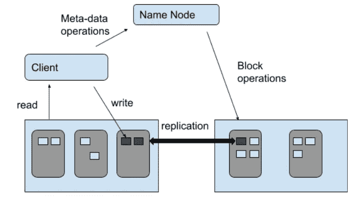
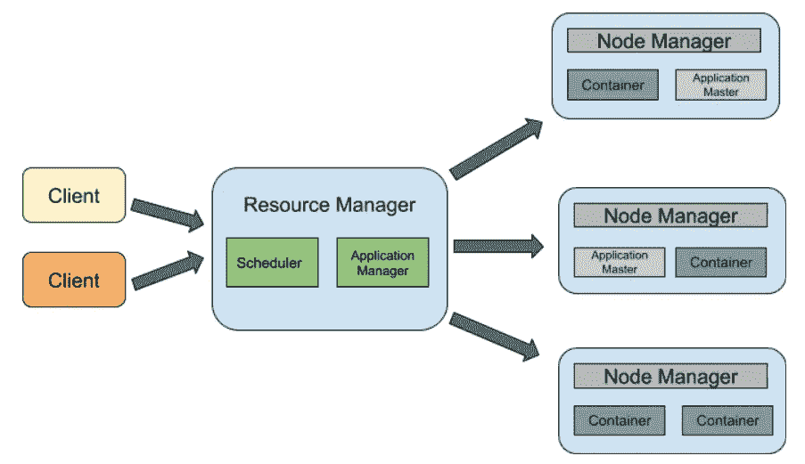

# Hadoop 架构简介

> 原文：<https://medium.com/geekculture/introduction-to-hadoop-architecture-83910caabc05?source=collection_archive---------19----------------------->

## Hadoop 是什么？

Apache Hadoop 是一个开源软件库，用于管理大数据应用程序中的数据处理和存储。Hadoop 有助于并行、更快速地分析大量数据。Apache Hadoop 于 2012 年由 Apache 软件基金会(ASF)向公众推出。

## 为什么选择 Apache Hadoop？

在数字时代之前，数据量的收集速度很慢，可以用单一的存储格式进行分析和存储。同时，为类似目的收集的数据格式也相同。然而，随着互联网和社交媒体等数字平台的发展，数据以各种格式出现(结构化、半结构化和非结构化)，其速度也大幅提高。这种数据被赋予了一个新的名称，即大数据。然后，需要多个处理器和存储单元来处理大数据。因此，作为一种解决方案，Hadoop 应运而生。

## **Hadoop 组件**

Hadoop 由三个主要组件组成。

1.  HDFS:Hadoop 中的存储单元
2.  地图缩小:处理方法
3.  纱线:资源谈判者

Hadoop components

## **1。HDFS**

HDFS 遵循主/从架构。它由一个 namenode 和许多 datanodes 组成。在 HDFS 体系结构中，文件被分成一个或多个块，并存储在单独的 datanodes 中。Datanodes 负责根据 namenode 指令进行数据块创建、删除和复制等操作。除此之外，他们还负责在文件系统上执行读写操作。

Namenode 充当 HDFS 的主服务器和中央控制器。它保存文件系统元数据并维护文件系统名称空间。Namenode 监督 datanode 的状况，并协调对数据的访问。

**HDFS 的数据复制**

在 HDFS，除了最后一个区块，所有区块的大小都相同。应用程序可以指定文件的副本数量，默认值为 3。复制因子可以在创建时指定，也可以在以后更改。在三个副本中，两个副本存储在同一局域网的不同节点中。第三个副本将存储在不同的局域网中。namenode 负责与块复制相关的所有决策。它周期性地接收指示每个节点健康状况的信号，不管它是否正常工作。

HDFS Architecture

## 2.地图缩小

传统上，数据是在单台计算机上处理的。然而，在大数据环境下，这已成为一项繁琐而耗时的任务。因此 Hadoop 有自己的处理方法，称为 Map Reduce。Map Reduce 有两个任务，即 Map 和 Reduce。映射器负责拆分和映射数据，而缩减器负责混排和缩减数据。

**分割阶段** : *输入数据被分割成更小的块。*

**映射阶段** : *组块被转换成<键，值>对及其出现频率。在这里，如果一个单词出现多次，它将不会以累计值的形式出现，而是以单个值的形式出现。*

**洗牌和排序阶段** : *系统执行排序并将输出发送到减速器的过程。在这里，排序是基于键而不是值进行的。传递给 reducer 的值可以是任意顺序的。*

**还原阶段** : *混洗和排序完成后，还原器将结果合并并输出，存储在 HDFS 中。*

Map-reduce workflow

## 3.故事

Yarn architecture

Yarn 代表“又一个资源谈判者”。Yarn 负责 HDFS 的资源管理和作业调度。纱线架构有以下组成部分。

1.  **客户端**:提交地图缩小作业
2.  **资源管理器**:负责整个应用程序的资源分配和管理。当接收到 map-reduce 任务时，它将该任务转发给相应的节点管理器，并相应地进行资源分配。资源管理器由两个主要组件组成，即调度程序和应用程序管理器。

*   **调度器**:根据分配的应用和可用资源执行调度。
*   **申请经理**:负责与资源经理协商资源，监控申请进度，跟踪申请状态。

3.**节点管理器**:负责 Hadoop 集群上的单个节点及其应用工作流。负责创建容器进程，并根据资源经理的指示执行终止操作。此外，它还负责监控资源使用情况和执行日志管理。

4.**应用主**:负责与资源经理协商资源。这将跟踪单个应用程序的状态并监控其进度。Application master 向节点管理器请求容器，方法是发送相关的详细信息来运行应用程序，并在运行后向资源管理器定期报告容器的健康状况。

5.**容器**:单个节点上 RAM、CPU 核、磁盘等物理记录的集合。

## **Hadoop 的实际应用**

1.  金融公司将 Hadoop 用于其分析目的，如评估风险、构建投资模型和交易算法。
2.  零售商使用 Hadoop 来分析结构化、非结构化和半结构化等不同类型的数据，以了解他们的客户，并以更好的方式为他们服务。
3.  Hadoop 大量用于电信行业，在分析中用于在其基础架构中执行预测性能。

## 参考

1.  [https://www.geeksforgeeks.org/hadoop-yarn-architecture/](https://www.geeksforgeeks.org/hadoop-yarn-architecture/)
2.  https://www.tutorialspoint.com/hadoop/hadoop_mapreduce.htm
3.  【https://www.guru99.com/learn-hadoop-in-10-minutes.html 