# 分层时间序列介绍

> 原文：<https://medium.com/geekculture/introduction-to-hierarchical-time-series-c8fe5da149f6?source=collection_archive---------12----------------------->

时间序列是一个在一段时间内跟踪样本的数据集，关于该序列的大多数文章都是在特定/特定的聚合级别上工作的。但是在现实世界和许多应用中，有多个时间序列是分层组织的。相关数据集有几个级别，基于地理、分支或其他特征，当我们试图观察信息，同时关注更细粒度的级别时，挑战就开始了。在这种情况下，分层时间序列是一个英雄。

但是什么是层次时间序列呢？

HTS 是一个时间序列的集合，遵循一个层次聚集结构。让我们想想电晕案例的数量，并从 worlddometer 网站上看到关于它的基本数据。故障显而易见。例如，地区和国家。它可以由城市或州来扩展。

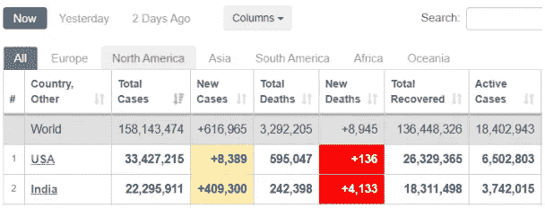

Figure 1 The number of Corona cases

按区域和目的划分的旅游需求也是分级时间序列的另一个例子。最简单的例子就是地理分裂。层次时间序列背后的逻辑是什么？顶层是数据最集中的级别。正如我们所看到的，顶层分为两个系列，第二层又分为两个系列(图 3)。

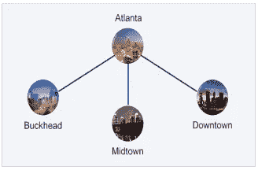

Figure 2 Example for two-level hierarchical tree diagram

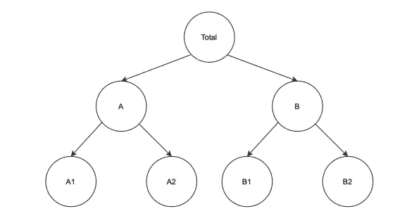

**Figure 3** A two-level hierarchical tree diagram.

y_t 代表总序列 t=1 的第 *t* 级观测值，…..，t。

y_j，t 表示对应于节点 j 的序列的第 *t* 次预测

例如，y_B，t 表示对应于级别 1 的节点 B 的系列的第 t 个观察值。

我们的级数总数是 *1+2+2+2=7* ，而最底层的级数是 *2+2=4* 。系列的总数必须大于底层系列的数量。

让我们集中在底层，看看方程。

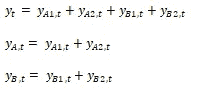

我们也有

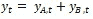

从上面的方程和这些方程可以更有效地表示使用矩阵符号。

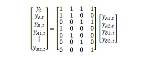

分层时间序列预测有一些主要方法，如自下而上、自上而下、中间向外。这些方法首先通过分别预测每个时间序列来开发基本预测，然后根据其固有的层次结构来协调这些基本预测。

**自下而上的方法**

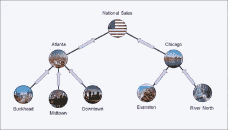

Figure 4 Example for the bottom-up approach

自下而上的方法计算底层时间序列的基本预测，然后为上层时间序列汇总这些预测。自下而上的方法计算底层时间序列的基本预测，然后为上层时间序列汇总这些预测。

我们首先为每个底层系列生成 h 步预测:

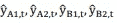

将这些相加，我们得到了该系列其余部分的 h 步连贯预测:

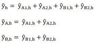

使用这种方法，我们不会因为聚合而丢失信息，但是它在高度聚合的数据上表现很差。另一个缺点是缺少系列之间的关系，例如不同国家之间的关系。

**自上而下的方法**

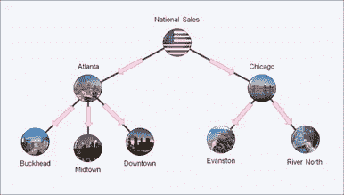

Figure 5 Example for a top-down approach

自上而下的方法只计算根时间序列的基本预测，然后根据较低级别时间序列的历史比例分解它们。

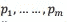

是一组分解比例，规定如何分配总系列的预测，以获得结构底层每个系列的预测。

在我们的例子中，使用我们得到的比例，

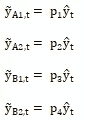

每个比例 p_j 反映了底层序列 y_j，T 在 t=1，…，T 期间相对于总总量 y_t 的历史比例的平均值

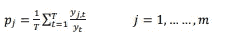

这种方法是最简单可靠的高层预报方法。但是我们在较低的层次上有较低的精确度。

**中盘出局法**

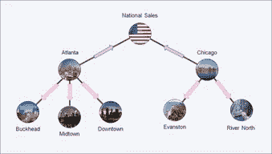

Figure 6 Example for middle-out approach

中间向外方法结合了自底向上和自顶向下两种方法，可用于至少有三个级别的层次结构。在这种方法中，我们选择中间级别并直接对其进行预测，其他预测是针对该级别的所有系列生成的。对于中层以上的序列，连贯的预测是使用自下而上的方法通过向上聚合“中层”预测而生成的。

参考

[*https://towards data science . com/introduction-to-hierarchy-time-series-forecasting-part-I-88a 116 f2e 2*](https://towardsdatascience.com/introduction-to-hierarchical-time-series-forecasting-part-i-88a116f2e2)

[*https://robjhyndman.com/publications/hierarchical/*](https://robjhyndman.com/publications/hierarchical/)

[*https://journals.plos.org/plosone/article?id = 10.1371/journal . pone . 0242099*](https://journals.plos.org/plosone/article?id=10.1371/journal.pone.0242099)

[*https://otexts.com/fpp2/reconciliation.html*](https://otexts.com/fpp2/reconciliation.html)

[*https://forecasts . org/WP-content/uploads/gravity _ forms/7-2 a51b 93047891 f1ec 3608 bdbd 77 ca 58d/2014/07/Athanasopoulos _ George _ ISF 2014 . pdf*](https://forecasters.org/wp-content/uploads/gravity_forms/7-2a51b93047891f1ec3608bdbd77ca58d/2014/07/Athanasopoulos_George_ISF2014.pdf)