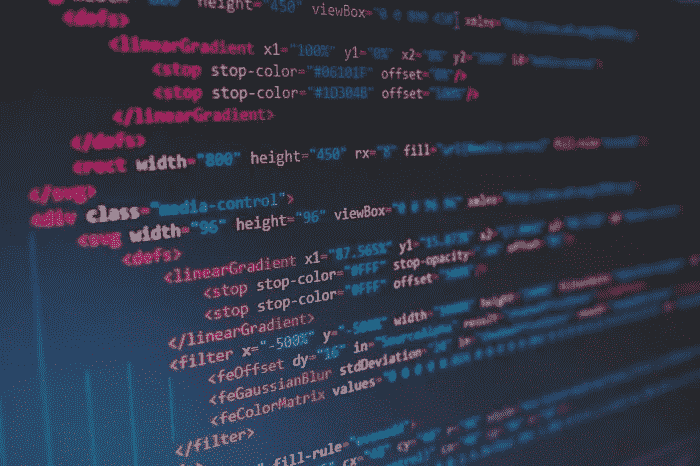

# HTML 简介:制作自己的网站

> 原文：<https://medium.com/geekculture/introduction-to-html-make-your-own-websites-75790259098e?source=collection_archive---------12----------------------->

图片来源: [en.number13.de](https://en.number13.de/)

在我们开始之前，

# 什么是 HTML？

HTML(超文本标记语言)是用于在网络浏览器上浏览的文本的标准标记语言。任何时候你打开浏览器，进入一个网站，你都会看到 HTML。事实上，当你读这篇文章的时候，如果你按 Ctrl + U，你…