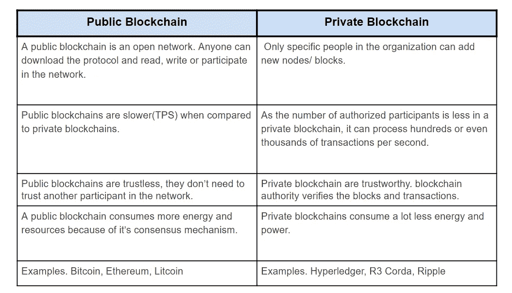
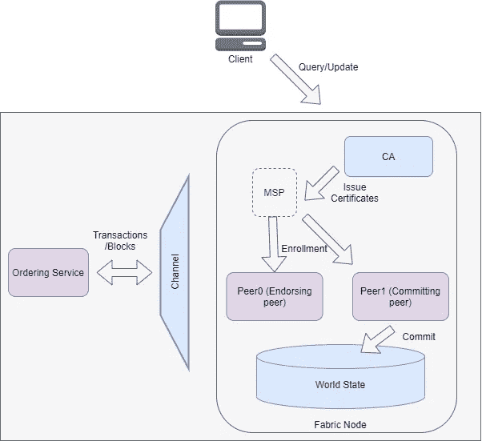

# Hyperledger 结构简介

> 原文：<https://medium.com/geekculture/introduction-to-hyperledger-fabric-1ce0a1d67494?source=collection_archive---------8----------------------->

## 介绍

在本文中，我们将讨论 hyperledger 西装和 hyperledger 面料区块链的关键概念。

## 观众

Hyperledger fabric 初学者、操作员和管理员。这是一篇理论文章。对于初学者，我想建议请通过一些区块链的基本概念。在我之前的[作品](/geekculture/introduction-to-bitcoin-and-blockchain-731c66a0831d)中，我已经解释了一些重要的概念。

## 历史

区块链最广泛认可的应用是比特币和以太坊，但以太坊采取了不同的方法，实现了许多与比特币相同的特征，但增加了一些更多的功能，如智能合约，以创建一个分布式应用的平台。

比特币和以太坊是*公开的*区块链。这意味着任何人都可以加入网络，并在任何时候离开。

## **什么是公共区块链？？**

公共区块链是没有权限的。任何人都可以加入网络，在区块链内阅读、写作或参与。

公共区块链有一个在互联网上人人可见的分类账。比特币、以太坊和莱特币是众所周知的区块链。

## 什么是二等兵区块链？？

私人区块链是允许的。只有组织中的特定人员可以添加新节点/块。

所有私有区块链解决方案都有某种形式的授权方案来识别节点/块。Hyperledger、R3Corda、Ripple 和 Quorum 是著名的二等兵区块链。

## 公立区块链 VS 私立区块链

让我们在下表中看到它们之间的区别。

**Hyperledger Fabric** 是目前榜单上最受欢迎的**私人区块链**平台之一。让我们深入探讨一下。

# 什么是 Hyperledger？？

Hyperledger 是由一家名为 Linux 基金会的开源公司设计的一组产品。

Hyperledger 为各种区块链框架提供服务，包括 Hyperledger Fabric、Hyperledger Indy、Hyperledger Besu、Hyperledger 锯齿以及各种库，如 Hyperledger caliper、Hyperledger explorer。

## 超分类帐结构

Hyperledger Fabric 是一种开源的企业级许可分布式账本技术(DLT)或区块链平台。Hyperledger 基本上是用于企业建立私人和许可的网络。

Hyperledger 在创建智能合同、创建网络、加入网络以及使其生效方面比任何其他可用的区块链堆栈都要复杂得多。

该结构具有高度模块化和可配置的体系结构。该平台最重要的优势之一是其对**可插拔共识协议**的支持，这使得该平台能够更有效地进行定制，以适应特定的使用案例和信任模型。大多数系统组件在结构中是即插即用的。这意味着，我们可以部署自己的 CA、共识算法、节点、对等体等。

就交易处理和交易确认延迟而言，Fabric 是目前性能较好的平台之一。织物可以扩展到 20000 TPS ( [来源](https://arxiv.org/abs/1901.00910))。

任何企业的一个关键特征是，只有合法用户才能进入企业网络。我们需要一个组件来启用用户 id 及其身份验证。所有成为该网络一部分的用户都需要被认证。Hyperledger fabric 中的一个实体，称为**会员服务提供商(MSP)。**不仅用户需要认证，就连将要被添加的用户也需要认证。每个实体，无论是用户、对等体、节点还是应用程序，在注册到系统之前都需要一个可信的入口。每个实体都需要认证。MSP 使用一个**认证机构**来获取证书，并将这些证书分发给各个条目。

## **会员服务提供商(MSP)**

MSP 跟踪谁需要访问什么，授予了什么特权，以及谁可以访问网络。MSP 监控所有安全证书和访问。Hyperledger Fabric 区块链网络可以由一个或多个 MSP 管理。

## 认证机构(CA)

CA 根据 MSP 的请求发布证书，以便将证书分发给节点、对等节点和用户。

## 共识；一致

与其他区块链相比，hyper ledger 结构中的共识完全不同，如比特币使用**工作证明** (PoW)，以太坊使用**工作证明** (PoW)/ **利益证明** (PoS)。

没有权力或地位概念。通常，共识由负责授权交易的单个节点驱动，并将这些节点推入区块链，这些节点被称为**签署者节点、**，而块的分发被给予称为**订购者的特殊节点。**

在块分发之后，每个节点接收它们，并且它们被称为**提交器节点的特殊节点提交。**Hyperledger fabric 中有三种类型的节点。

> 在这里，您可能会问为什么不是 PoW 或 PoS？？因为这是专用网络，所以我们已经知道谁将推送块和事务，因为它们都是授权节点。

## 频道

在面料方面，有一个在其他区块链不存在的渠道概念。在一个区块链网络中，我们可以同时运行多个网络。基本上，它提供了一个创建亚区块链网络的工具。

例如:-假设我们已经为公司组织创建了一个区块链，它由不同的部门组成，如人力资源、开发、测试和管理。在这种情况下，人力资源部门向管理层报告数据以及其他部门不应看到的机密信息。在这里，我们需要引入两个渠道，一个针对所有部门，另一个针对人力资源和管理部门。

> 有私有数据收集的概念来解决这个问题，而不创建新的信道。

## 链码(智能合同)

超级分类帐中的智能合同称为链码。此后，我们将智能合同称为**链码**。顾名思义，这是网络组织之间的契约，它们将如何同意使用业务逻辑。基本上，我们在这里编写业务逻辑。

链码使我们能够与区块链数据库互动。目前，hyperledger fabric 支持以下语言的链代码开发:Go、Nodejs 或 Java。

Chaincode 运行在一个安全的 Docker 容器中，该容器与批准对等进程相隔离。Chaincode 通过应用程序提交的事务来管理分类帐状态。

让我们看看链码的例子。假设我们有包含汽车名称、型号、所有者和颜色字段的汽车数据。我们将使用上述语言编写一个链码。这里我们必须编写两个方法，一个是将数据推入区块链，另一个是检索数据。chaincode APIs 提供了 putState()和 getState()方法，因此我们可以高效地编写契约。

## 背书人

我们已经了解了什么是背书者，因此，在单个组织中，我们可以定义多个背书者，基于此，我们可以有不同类型的**背书策略。背书政策**定义了背书人如何背书交易。

让我们看一个例子，假设我们有两个背书者。我们可以有一个政策，使他们中的任何一个可以验证交易，或者我们可以有一个政策，两个背书人都需要签署和验证交易，然后只有它会被接受。根据背书政策，我们的交易将被接受或拒绝。

## 订购者

这些是 hyperledger 结构中特殊类型的节点。也称为订购服务。订单的主要功能是通过向提交节点/对等节点分发块来维护分类帐状态。

订购者维护允许创建渠道的组织列表。订购者还控制通道的基本访问，限制谁可以向通道读写数据，谁可以配置通道。根据我们定义的策略，只有授权的实体才能修改通道中的配置元素。

配置事务由订购方处理。假设如果我们想要修改当前运行的结构网络，那么我们可以在订购服务的帮助下完成。订购者根据现有配置验证更新请求，生成新的配置事务，并将其打包到一个块中，该块被中继到通道上的所有对等点。

fabric 中有三种类型的订购服务。

1.  **Raft** (推荐):Raft 是基于 Raft 协议实现的崩溃容错订购服务。这是一个共识算法。Raft 遵循一个**“领导者和追随者”**模型，其中一个领导者节点被选出，它的决定被追随者复制。Raft 订购服务比基于 Kafka 的订购服务更容易建立和管理。你可以按照这个[链接](http://thesecretlivesofdata.com/raft/)去了解 Raft 共识的工作机制。
2.  **卡夫卡**:卡夫卡和筏是断层陶洛伦特系统。在 fabric 2.x 中已弃用
3.  **Solo** :这里我们只有一个订单节点。在 fabric 2.x 中已弃用

让我们深入探讨一下 Fabric 的事务流和体系结构

1.  第一个应用程序(客户机)创建一个事务请求，并向一个给定的节点(批准对等体)提交一个提议。
2.  背书对等体执行链码(智能合约)并创建 RWset。然后，批准节点将签名的提议响应发送回客户端应用程序。
3.  应用程序将交易和签名发送到订购服务。
4.  订购服务创建交易块，并将它们广播到区块链网络。
5.  包括创建事务的节点在内的所有节点都会收到来自订购服务的块。
6.  节点中的提交对等方验证该块并将该块提交到分类帐中。

> RWSet(读写)集由签署者生成，并由提交者用来验证事务。

## 摘要

我们已经讨论了一些关键概念，如公共和私有区块链、hyperledger 结构、会员服务提供商、认证机构、共识、渠道、链码、背书者、订购者和交易流。