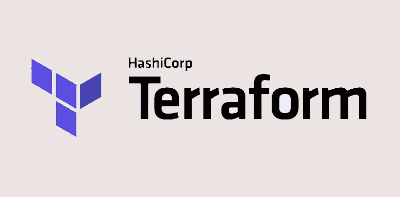
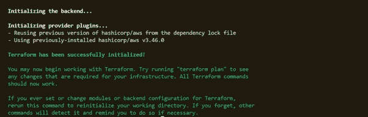
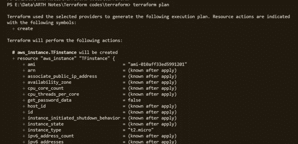
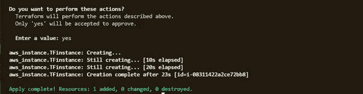

# 使用 Terraform 介绍基础设施代码

> 原文：<https://medium.com/geekculture/introduction-to-infrastructure-as-code-with-terraform-15d23abe12d?source=collection_archive---------37----------------------->



想象一下，几年前，在一家 IT 公司工作，当时虚拟机或云计算的概念还不存在。如果让您的团队负责提供推出贵公司最新产品所需的基础架构，您认为需要什么来实现这一目标？

嗯，这并不容易。您的团队将不得不经历整个硬件购买周期，并等待数天来准确配置服务器，以满足公司的期望。还有网络配置、存储配置等。落在你团队的肩上。

幸运的是，今天我们拥有虚拟化和云计算的力量。我们不再需要安装和堆叠服务器，或者购买不动产来设置数据中心。

随着 IT 部门的快速发展，如今的公司正在转向云来满足其基础架构需求。虽然这解决了早期存在的许多问题，但配置一致性的问题很快就出现了。

## 这就是代码为的**基础设施是如何诞生的。**

顾名思义，**基础设施即代码(IaC)** 允许开发人员通过简单地编写代码来提供 IT 环境。这样做的动机是为了实现**自动化**、**速度**和**一致性**。对于大型项目的大型团队来说，手动管理基础架构本身就是一项任务，并且容易出现不一致和差异。

IaC 系统允许我们将网络设备、存储设备或计算设备视为软件，并通过以人类可读语言编写代码来提供，这些代码对指定的资源提供者进行 API 调用，以满足基础架构的需求。

erraform 是一个很好的 IaC 工具的例子。Terraform 使用声明性语言编写易于理解的代码，并有效地帮助供应和管理基础设施的生命周期。它支持 1000 多家提供商，包括 AWS、Azure、GCP 等云提供商，Kubernetes 等编排工具，以及许多其他提供商。

提供者只不过是允许 Terraform 在特定提供者上提供和管理资源的插件。

例如，如果您要使用 AWS，并在那里使用 Terraform 启动 EC2 实例，您可能首先要加载提供者 AWS——包括关于访问您的 AWS 帐户的信息。

```
**provider “aws” {****region=”ap-south-1"****profile = “default”****}**
```

上面几行指定了一个提供者，而' ***概要文件*** '关键字告诉我们使用什么 AWS 概要文件来访问资源。

*注意:如果你是云的新手，在进一步阅读之前了解云计算的基本概念会有所帮助*

[terraform registry](https://registry.terraform.io/) 帮助您轻松快速地为各种提供商定义资源，最好开始学习并使用该文档实现用例。

然而，我们将在后面的博客中更多地讨论供应资源和编写代码，下面是用于供应资源的一般语法。

```
**resource “<type_of_resource>” “<name_of_resouce>” {****<resource_parameters>****}**
```

Terraform 使用**声明性语言**，因此始终保持一致性。此外，当使用 terraform 执行特定配置文件时，它会将所述环境的当前状态与代码文件中指定的要求进行比较。一个扩展名为*的文件。tfstate* 存储关于基础设施当前状态的所有信息。如果没有检测到任何变化，terraform 会自动认为基础设施是最新的。terraform 就是这样展示**幂等**性质和**一致性**的。

**基本入门命令:**

***terraform init***—用于加载和下载 terra form 配置文件中使用的提供程序

***地形图*** —用于查看执行配置文件时将发生的变化。

***terra form apply***—用于运行代码文件。

*注意:我们用 terraform 编写的每个代码文件都有一个. tf 扩展名。*

浏览此 [URL](https://learn.hashicorp.com/tutorials/terraform/install-cli) 在您的系统中安装 Terraform

为了开始一些真实的例子，创建一个 AWS 帐户。使用 IAM 服务创建一个用户，并记下 access_key 和 secret_key。

如果你还没有这样做，你可以按照下面的步骤来做，一旦你安装了 terraform。

配置 AWS CLI

```
**aws configure**
```

系统将提示您输入之前记录的区域和 IAM 凭据。输入这些内容，并将最后一个选项保留为默认值。这将创建一个' **default** ' aws 配置文件，我们可以使用它来验证我们的帐户，同时使用 Terraform 与 aws 通信。

要列出创建的配置文件，

```
**aws configure list-profiles**
```

然后，单击此处的[按钮](https://github.com/InshiyaNalawala/terraform)将基本的 terraform 代码下载到您的工作区，并运行以下命令:

```
**terraform init** 
```



```
**terraform plan**
```



您将看到类似如下的输出。

```
**terraform apply**
```

出现提示时，键入'**是**'。这个基本示例在您的 AWS 帐户中启动一个类型为 *t2.micro* 的 EC2 实例。检查 AWS 控制台以确认这一点。

如果一切顺利，您将会收到与此类似的输出。



若要撤消更改并删除实例，请运行以下命令

```
**terraform destroy**
```


我很快会带着另一个演示回来。

谢谢你。