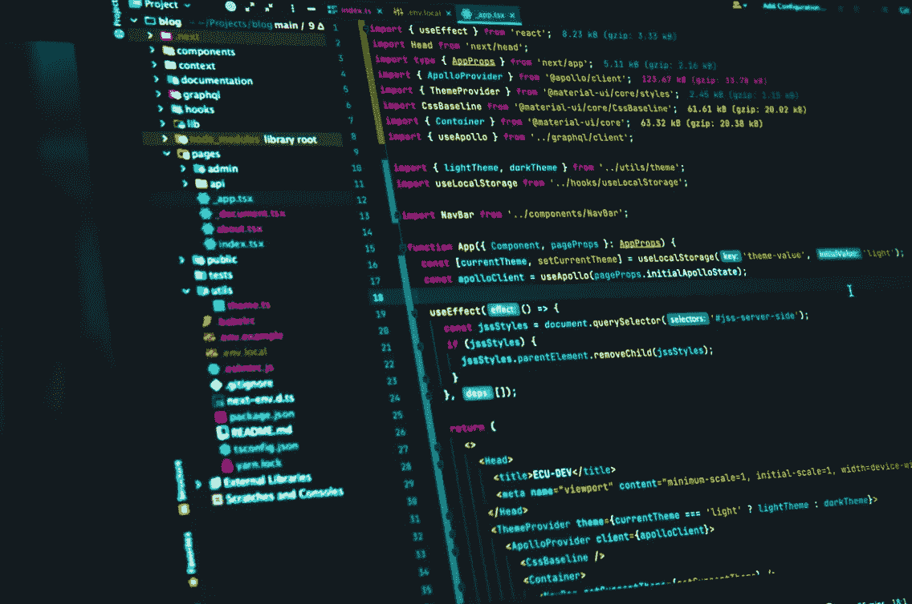

# JavaScript 简介

> 原文：<https://medium.com/geekculture/introduction-to-javascript-44201daf0d8e?source=collection_archive---------9----------------------->

JavaScript 是一种用于创建交互式网页的编程语言。正是交互元素和动画让人们在页面上保持专注。JavaScript 最有可能用于在主页上创建搜索框、在新闻网站上创建现场棒球比分或者创建您观看的视频。

# Java 与 JavaScript

JavaScript 和 Java 都是创建于 1995 年的编程语言。Java 是一种面向对象的编程语言，这意味着它可以在计算机上独立运行。它是一种可靠、适应性强的语言，用于 Android 应用程序、传输大量数据的业务系统(特别是在金融行业)以及“物联网”技术(IoT)的嵌入式功能。

# 使用和编写 JavaScript

另一方面，JavaScript 是一种基于文本的编程语言，设计用于 web 应用程序。最初创建时，它是作为 Java 的补充而创建的。然而，作为 web 开发的三大基石之一(另外两个是 HTML 和 CSS)，JavaScript 已经有了自己的生命。与 Java 应用程序不同，Java 应用程序必须先构建，然后才能在基于 web 的环境中启动，JavaScript 是专门为处理 HTML 而创建的。所有主流的 web 浏览器都支持 JavaScript，尽管大多数浏览器为用户提供了禁用它的选项。

尽管预先写好的脚本很容易获得，但许多程序员更喜欢自己学习如何做。因为它是一种解释语言，所以不需要使用特定的软件来生成可用的代码。要编写 JavaScript，您只需要一个像 Windows 记事本这样的纯文本编辑器。然而，Markdown Editor 可能会使任务变得更容易，尤其是当代码行数增加时。

# JavaScript 与 HTML

HTML 和 JavaScript 是两种可以很好地协同工作的语言。HTML 是一种用于定义静态网页内容的标记语言。这是网站的基础。JavaScript 是一种计算机语言，可用于在页面上进行动态活动，如动画或搜索框。

JavaScript 是一种脚本语言，在网站的 HTML 框架中运行，经常被使用。如果您正在编写代码，将 JavaScript 放在不同的文件中会更容易找到(使用. JS 扩展名有助于识别它们)。JavaScript 随后通过标签链接到您的 HTML。然后，只需在每个页面上添加必要的标记来建立链接，就可以在多个页面上使用相同的脚本。

# JavaScript 与 PHP

PHP 是一种服务器端编程语言，它使得在服务器和应用程序之间传输数据变得更加容易。Drupal 和 WordPress 等内容管理系统使用 PHP 来允许用户撰写文章，然后保存在数据库中并在线发布。

PHP 是目前为止 web 应用程序中使用最多的服务器端语言，但是 Node.jp，一个可以像 PHP 一样在后端运行的精简版 JavaScript，可能会在未来挑战它的霸主地位。