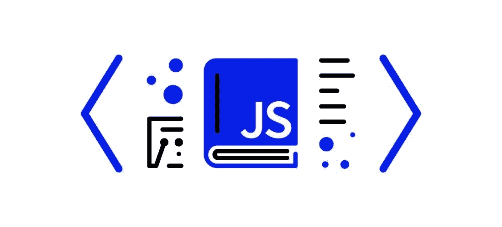
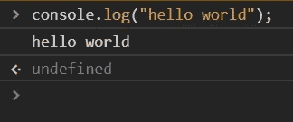
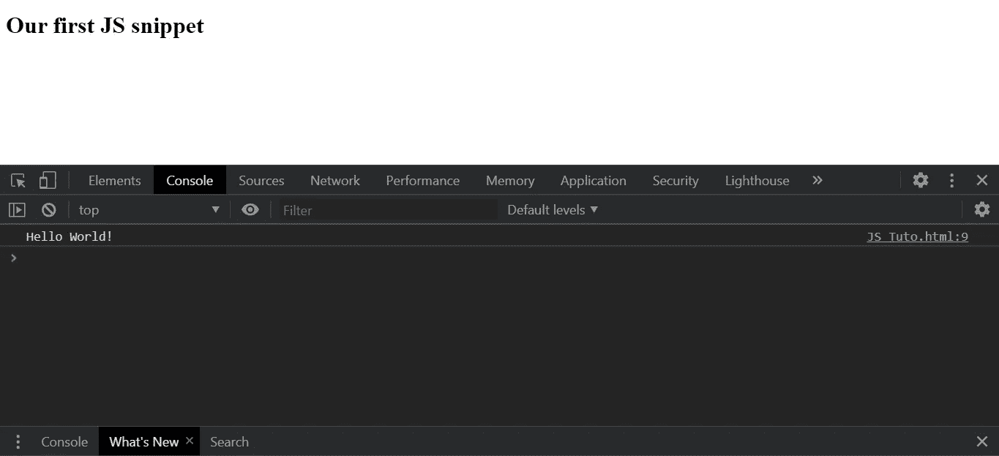

# 新手 JavaScript:初级入门

> 原文：<https://medium.com/geekculture/introduction-to-javascript-4874f595f07f?source=collection_archive---------25----------------------->



JavaScript is often abbreviated as JS

# JavaScript 是什么？

JavaScript 被认为是网页的动词，它定义了网页上要执行的所有动作。它是一种使用 JIT 编译器的面向对象编程语言。

JavaScript 或 JS 具有各种应用，例如 web 开发、移动开发。它无处不在，所有的网络浏览器都装有它。

# Java 与 JavaScript

Sun Microsystems 的程序员创造了 Java，在当时，这是一个新的领域，被视为一种新奇的语言。Sun 热切希望网景公司使用 Java 语言，使网站更具交互性和应用程序的风格。

网景公司与他们的一位前同事取得了联系，他名叫[布伦丹·艾希](https://en.wikipedia.org/wiki/Brendan_Eich)，他被招入网景公司工作。当他加入公司后，最终他的任务是研究出使用哪种语言来提高网景的交互性。

他把 Java 放在一边，因为他觉得 Java 太难了，一般的建站者用不了。在那个年代，网站建设者不是程序员；他们不是工程师。但是 Java 是一种复杂的、相当高级的、困难的编程语言。

Netscape 需要一些更容易的东西，让网站设计者使用他们可以很快学会的东西，并向按钮和表单等添加代码片段。他们想要一些更像脚本的东西，可以在网络浏览器中运行。

所以传说是艾希走了，10 天就写了 JavaScript。他带着最初以 Mocha 为名开发的东西回来了，正式名称是 LiveScript。他们最终得到了 Sun Microsystems 公司的许可，可以使用 Java 这个词，所以他们称之为 JavaScript，可能是出于营销的原因，因为 Java 在当时是最流行的。

# JavaScript 历史

*   JS 是由 was Brendan Eich 创建的
*   他在 1995 年开发了 JS
*   他还开发了第一个 JS 引擎，至今仍被 Mozilla firefox 使用的 Spider Monkey
*   JS 的名字后来被改为“摩卡”和“LiveScript ”,但由于一些商标的原因，它仍然是 JS。

# JavaScript 工具

对于使用 JavaScript 或简单的 JS，我们只需要两样东西:

*   **文字编辑**

-为了编写和编辑 JS 代码，我们需要一个简单的编辑器，也可以是记事本。

-但是还有其他强大的编辑器提供附加功能，如自动完成、缩进、突出显示等。例如:Visual Studio 代码、Sublime Text、Atom 等。

*   **浏览器**

-所有浏览器都带有内置的 JS 引擎。

-它们用于执行 JS 代码，也用于调试目的。

# JS 里的 Hello World

在开始编码之前，让我们了解一下编写 js 代码的不同方法。值得注意的是，JS 基本上被合并到 HTML 中，HTML 是网页的骨架

我们可以用 3 种方式编写 JS:

# 1.安慰

要么按 Ctrl + Shift + I 打开控制台，要么右键单击，然后进行检查。现在，既然您在控制台中，就可以开始编写代码了。

```
console.log("hello world");
```



Running JS in the browser’s console

# 2.脚本标签

**< script >** 标签用于直接在 HTML 中编写 javascript。但是每个 console.log()都会在浏览器的控制台中打印输出

```
<!DOCTYPE html>
<html>
<head>
	<title>Home</title>
</head>
<body>
	<h1> Our first JS snippet </h1>
<script>
	console.log("Hello World!");
</script>
</body>
</html>
```



Output of the previous HTML file

# 3.外存储器

JS 代码写在一个单独的文件中，并使用

*   HTML 文件代码:

```
<!DOCTYPE html>
<html>
<head>
	<title>Home</title>
</head>
<body>
	<h1>My First JS Code</h1>
<script type="text/javascript" src="home.js"></script>
</body>
</html>
```

*   JS 文件代码:

```
console.log("Hello World!");
```

# JavaScript 注释

*   注释是帮助理解代码的额外信息，在编译时不会传递给编译器。
*   在 JS 中，有两种类型的注释

**单线**

```
//this is a comment
```

**多线**

```
/*
Write
your comments
here
*/
```