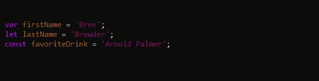
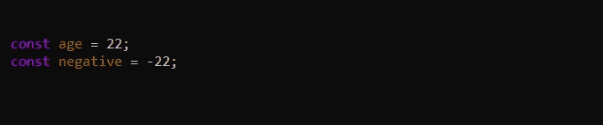
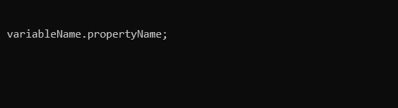
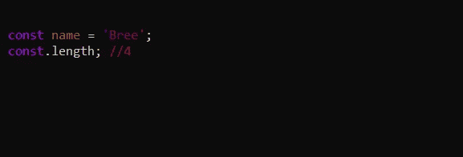
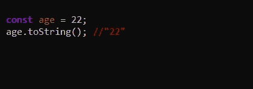
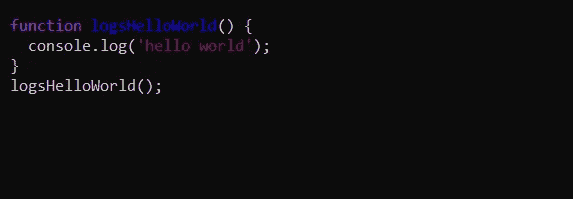

# JavaScript 简介

> 原文：<https://medium.com/geekculture/introduction-to-javascript-73f201677140?source=collection_archive---------22----------------------->

你好，今天我想谈谈开始用 JavaScript 编码时你需要知道的一些基础知识！然而，在我们开始之前，了解 JavaScript 的使用以及它在现代 web 开发中如此重要的原因，对初级开发人员是有益的。

# **概述:**

JavaScript 是网页的主要构件之一。它允许我们从网站上获取基本的静态内容，并将其转化为动态内容，从而增强可用性和视觉吸引力。这就是网页“运行”的原因。

## JavaScript 是如何“运行”的？

大多数 JavaScript 从扩展名为**的文件中运行。js** 并通过 HTML 中的 **<脚本>** 标签加载到浏览器中。

>>示例文件名: **main.js**

我今天要谈的所有话题都通过这个网站进行了精彩而深入的讨论:[https://www.javascripttutorial.net/](https://www.javascripttutorial.net/)。我强烈推荐你去看看，因为它还包括了这篇文章中没有提到的东西，但是知道这些也同样重要。

为了更好地理解 JavaScript 语言，让我们从谈论变量开始。

## 变量

我们在 JavaScript 中使用变量作为存储值的方式，以备后用。下面是在 JavaScript 中声明变量的三种方法。

***var***

这是一个通用变量关键字。

***让***

`let`将像`var`一样分配一个变量，但行为略有不同。它最大的不同在于创建了“块级范围”。

***常量***

这是一个无法改变的变量。它是“常数”的缩写。

## 原始数据类型(字符串、数字、布尔值)

基本上，“原语”意味着这些是 JavaScript 中最基本的数据类型。

*琴弦*

字符串是一个文本块。这些文本块总是用单引号或双引号来定义。

*数字*

数字周围没有引号。它们也可能是负面的。

*布尔人*

布尔源自较低级别的软件开发。它驱动二进制代码，这是计算机的核心！二进制代码只是一系列 0 和 1(010101)。这些数字代表真或假。在 JavaScript 中，我们使用这些布尔值来表示这一点。

## 属性和方法

数据类型有称为`properties`和`methods`的内置功能。这些扩展了功能，使我们可以收集信息，或操纵类型。我们将使用`dot notation`来访问属性和方法。首先，我们提供变量的名称，一个点，然后是属性或方法的名称。

***属性***

通过属性，我们可以从我们的数据类型中访问数据。每种数据类型都有许多不同的属性。下面，我们尝试访问一个字符串的长度属性。通过找到长度，它会告诉我们字符串中有多少个字符。

***方法***

方法不同于属性，因为它们后面有括号。看看下面的。toString()方法。它将把一个数字或布尔值转换成一个字符串。

## 功能

通过函数，我们可以执行各种操作来返回最终产品。有趣的事实:方法是函数的一种！

函数总是以 function 关键字开头。这让运行你的程序的任何东西知道它是什么，并照此对待它。然后，是函数的实际名称，后面是左/右括号和方括号。我们函数的所有代码都在括号中。

如上所示，我已经声明了一个函数(logsHelloWorld ),然后将它设置为 console . log“hello world”。为了让这个函数运行，我需要再写一次函数名，在括号后面加上括号。这是用于运行函数的语法。

如前所述，这篇文章更多的是为了帮助初级开发人员在真正钻研 JavaScript 语言之前开始对它有一个基本的了解。我希望这些信息对你们所有人都有帮助，就像我开始涉足 JavaScript 世界时对我一样。编码快乐！下面，我将包括几个我最喜欢的 JavaScript 资源。对于视觉学习者，也有 YouTube 视频，教你入门 JavaScript 应该知道的基础知识！

**书面资源:**

 [## JavaScript 教程

### JavaScript 是世界上最流行的编程语言。JavaScript 是网络的编程语言…

www.w3schools.com](https://www.w3schools.com/js/default.asp) 

**YouTube:**