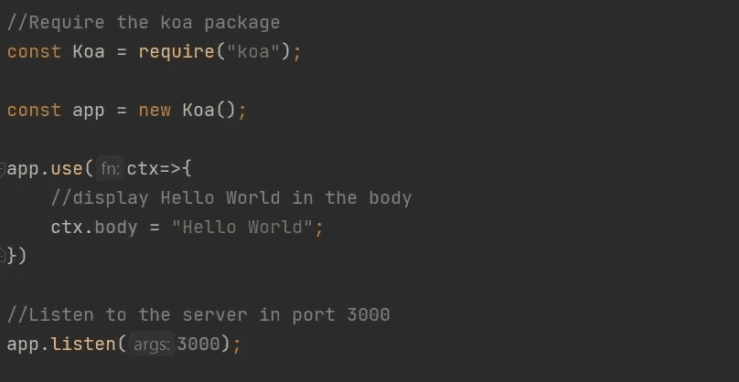

# Koa.js 简介

> 原文：<https://medium.com/geekculture/introduction-to-koa-js-c332931c6b24?source=collection_archive---------9----------------------->

# **什么是 koa.js？**

Koa.js 是由 Express.js 的创建者开发的开源、最小、灵活的 Node.js web 框架。他们将 Koa.js 称为下一级 Node.js 框架。Koa.js 官网提到 koa.js 是一个更小、更有表现力、更健壮的 web 应用和 API 的基础。Koa 通过使用异步函数消除了回调并显著改进了错误管理。Koa 的核心没有任何中间件，但是它包含了一个优雅的方法集合，可以快速方便地编写服务器。

Koa.js 的关键特性是使用 ES6 生成器，这意味着使用 Koa.js 编写的程序将有更少的回调，而在幕后，它使用我们从 Node.js 中了解到的异步代码，但代码仍然有明显的不同，它更简单，更干净，更容易掌握。

# **KOA . js 的特点**

Koa.js 有自己独特的特点，使它更具表现力和对开发人员更友好。一些功能是

**1。它是现代和未来的。**

它是基于 ES6 规范构建的。通过拥有许多新的类和模块，ES6 使得构建任何复杂的程序变得更加容易。因此，它帮助开发人员开发可维护的应用程序，这些应用程序随着时间的推移仍然有效。

**2。它占地面积小。**

与其他 Node.js 框架相比，Koa.js 占用的内存更少。这有助于开发人员编写更瘦更好的中间件。然而，他们可以选择通过插入一些模块来扩展系统以满足各种项目的需要。

**3。它使用 ES6 发电机**

它用于简化同步编程，方便上游和下游的控制流。

**4。更好的错误处理**

通过更有效地使用中间件，Koa.js 简化并改进了错误处理。该框架内置的错误捕获功能有助于开发者避免网站崩溃。即使没有编写额外的代码，程序员也可以用一个简单的“try/catch”命令来报告错误。开发人员还可以通过简单地修改默认设置来配置 Koa.js 中的错误处理。

**5。它使用一个上下文对象**

Koa.js 还帮助开发人员使用上下文将普通的响应和请求对象封装到单个对象中。统一对象通过包含许多有用的方法和评估器，使开发人员更容易创建 web 应用程序和 API。这个上下文是一个 NodeJS 对象，它将请求和响应封装到一个单独的对象中，并带有几个用于编写 web 应用程序和 API 的方法。

# **KOA . js 的优点**

**1。** Koa 提高了互操作性和健壮性，同时还使中间件的创建更加有趣。

**2。** Koa 非常轻便，只有 550 行代码。

**3。** ES6 生成器将整理代码，通过消除所有回调造成的混乱，使代码更易于管理。

**4。**它提供了非常好的用户体验。

**5。**更干净、可读性更强的异步代码。

**6。**没有回调的地狱

# **KOA . js 的缺点**

**1。**开源社区相对较小。

**2。**与 Express 风格的中间件不兼容。

**3。** Koa 使用了与所有其他 Node.js 框架中间件不兼容的生成器。

# **Express.js vs Koa.js**

使用 Koa.js 与使用 Express.js 类似，因为这两个框架都是由同一个团队开发的。由于没有不必要的样板代码和中间件，Koa 是一个非常轻便和灵活的系统，可以根据应用程序的需求进行定制。包含库增加了应用程序的模块化。

Koa 通过使用承诺和异步特性消除了回调问题，简化了错误管理。它公开自己的 ctx.request 和 ctx.response 对象，而不是节点的 req 和 res 对象。

另一方面，Express 向节点的 req 和 res 对象添加了额外的属性和方法，以及许多其他框架特性，包括路由和模板，这些都是 Koa 所缺乏的。

## **Koa 和 Express 有什么不同？**

没有回调地狱

缺少样板代码

更好的整体用户体验

使用 try/catch 更好地处理错误

Koa 较少依赖中间件

Koa 更加模块化

与 Express 不同，Routing 不可用。

正确的流处理

**你好世界**

让我们尝试使用 Koa.js 显示最著名的“Hello World”

为了使用 koa.js，您需要在计算机上安装 node.js。您可以通过在终端中键入以下代码来检查 Node.js 是否已经安装。

如果返回版本，则表示您已经安装了 Node.js。如果返回“未找到命令”,请从[***https://nodejs.org/en/download/***](https://nodejs.org/en/download/)下载并安装 node.js

然后创建一个新项目，然后创建一个 JavaScript 文件并安装 Koa 包。您可以在项目文件夹的终端中键入以下代码来安装 Koa.js 包。

成功安装软件包后，在您的 JavaScript 文件中键入以下代码，以便在浏览器中显示 Hello World。

现在，您可以通过在终端中键入以下代码来启动服务器。

在上面的代码**中，server** 是我创建的 JavaScript 文件(server.js)的名称。为了运行，你可以输入你创建的文件名，而不是上面例子中的单词**服务器**。

启动服务器后，打开浏览器并键入 ***localhost:3000*** 在浏览器中查看输出。

恭喜你！您已经成功地使用 Koa.js 创建了您的第一个程序

如果你想了解更多关于 Koa.js 的信息，请参考[其网站](http://koajs.com/)或在 Github 上找到它