# C++中机器人线性控制导论

> 原文：<https://medium.com/geekculture/introduction-to-linear-control-of-robots-in-c-88fa935a222e?source=collection_archive---------5----------------------->

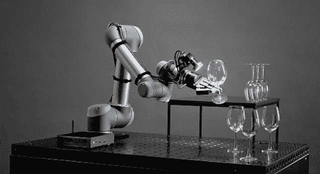

Control Engineering

下面这篇文章的目的是描述一种直观的方法来表示和控制机器人的简化物理模型。这可以作为我们讨论的背景。另一方面，我们将考虑如何解微分方程，它描述了机器人简化模型的运动。
注意:正如主题所表明的，本文必须被视为一个介绍，

本文中讨论的所有模拟的源代码可以在我的 [GitHub](https://github.com/markusbuchholz/Linear_Control_of_Robots_in_Cpp) 上找到。你还需要头文件(用于绘图)，它必须和你的 cpp(一个你可以从我的库克隆的文件)在同一个文件夹里。你的程序可以编译如下:

```
//compile
g++ my_prog.cpp -o my_prog -I/usr/include/python3.8 -lpython3.8// //run
./my_prog//folder tree
├── my_prog
├── my_prog.cpp
├── matplotlibcpp.h
```

在下面的介绍中，我们将集中讨论适用于线性系统的控制方法，这些线性系统可以用线性微分方程来正式描述。

当我们考虑机器人模型时，我们使用描述机器人动力学(机器人的动力学模型)，它与动力学运动方程相关联——一组二阶微分方程
的形式(矩阵方程)。

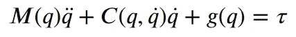

其中，τ ∈ R n 为致动器扭矩，M (q)q̈)为关节加速度产生的扭矩，C(q，q̇) q̇为科里奥利力产生的扭矩，g(q)为重力产生的扭矩。

上述方程定义了**逆动力学问题**，该问题是在给定当前关节状态(q，q̇).)的情况下，计算实现期望关节加速度所需的电机(关节)扭矩的过程

基于以下等式，机器人控制器能够计算出所需的电机扭矩，以使机器人在期望的轨迹上移动——见下图。

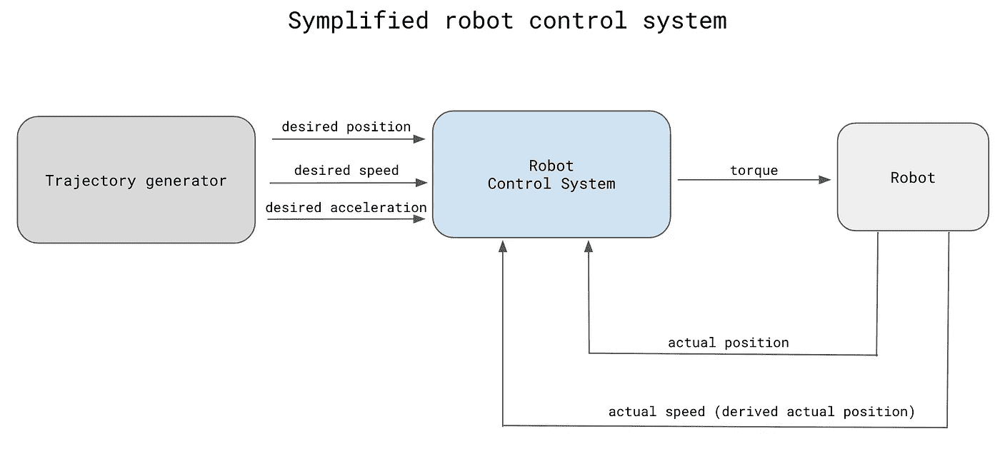

Symplified robot control system (by author)

一般来说，机器人(工业机械手)配备的传感器很少，实际上仅限于记录每个电机轴位置的编码器或分解器。从上图可以看出，机器人是在闭环控制系统下工作的。控制系统的主要任务是计算最佳控制信号(扭矩),以最小化期望位置和实际位置之间以及期望速度和实际速度之间的误差(差异):

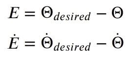

在构建机器人控制系统时，确保最终的闭环系统符合预定的性能要求是主要的挑战。系统的稳定性是这类系统最基本的要求。就我们的目的而言，如果在执行不同的计划轨迹时，甚至在面对某些“实质性”干扰时，误差保持“小”，那么我们将系统描述为稳定的。另一方面，控制系统的性能也可以由移动机器人以最大加速度尽可能快地测量，而不降低机器人路径精度或可重复性。

在本文中，我们讨论的是基础知识，因此，我们的机器人可以表示为一个由质量块 **m** 组成的机械系统，耦合到一个刚度为 **k** 的弹簧，并且易受系数为**b**的阻尼器的影响。见图

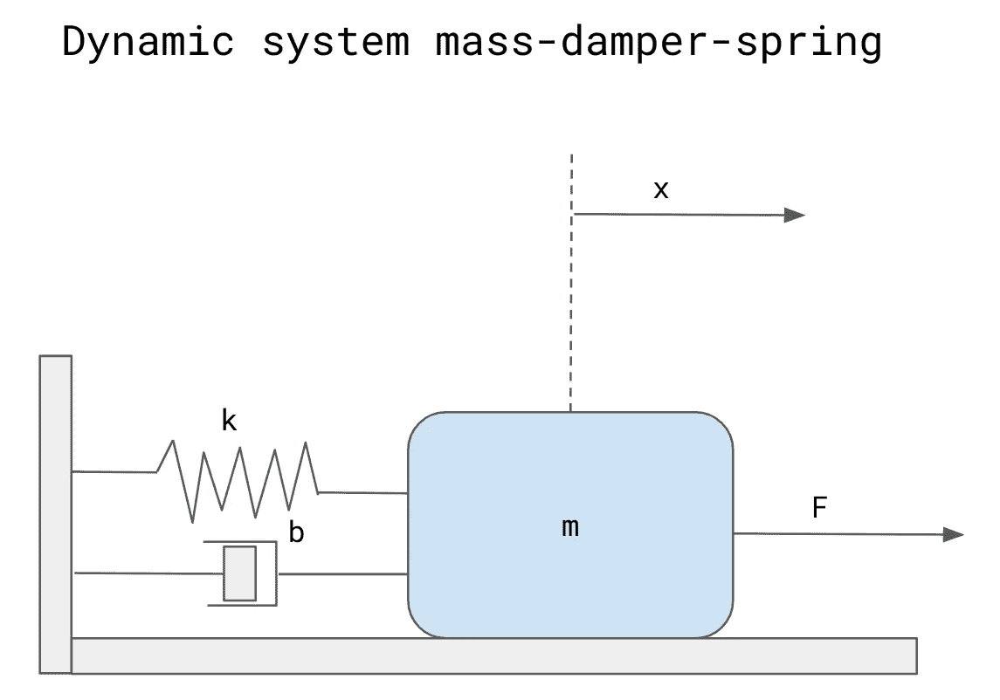

Dynamic system mass-damper-spring (by author)

我们可以认为二阶机械系统的默认响应不是我们想要的那样。此外，我们可以说，所描绘的机械系统(机器人)在执行任务之后永远不会返回到 x = 0。存在必须消除的偏差(误差)。在我们的例子中，我们不能改变机械参数，如阻尼器的质量或数值。在这种情况下，系统的行为可以改变为控制系统。

运动方程是从自由体图上得到的(这是上面给出的方程的“简化”版本)。

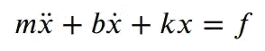

现在假设我们也有传感器可以跟踪物体的位置和运动。我们现在提出一个控制法则，它决定了致动器相对于所感测的反馈应该施加的力:


其中 kp 和 kv 是控制系统的系数增益，见下图。正确调整控制增益，我们就能控制机械系统

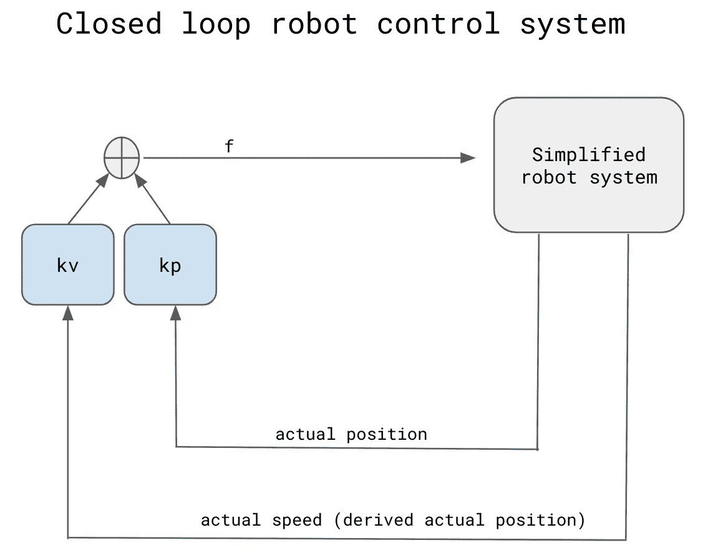

Closed loop robot control system (by author)

上面的等式，我们可以改写为

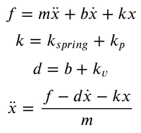

介绍，

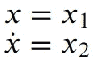

我们得到两个微分方程，

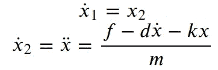

使用 Runne Kutta 的四阶方法，我解决了特定的导数方程。结果可以描述如下。请玩弄系统的动态参数，调整初始条件。

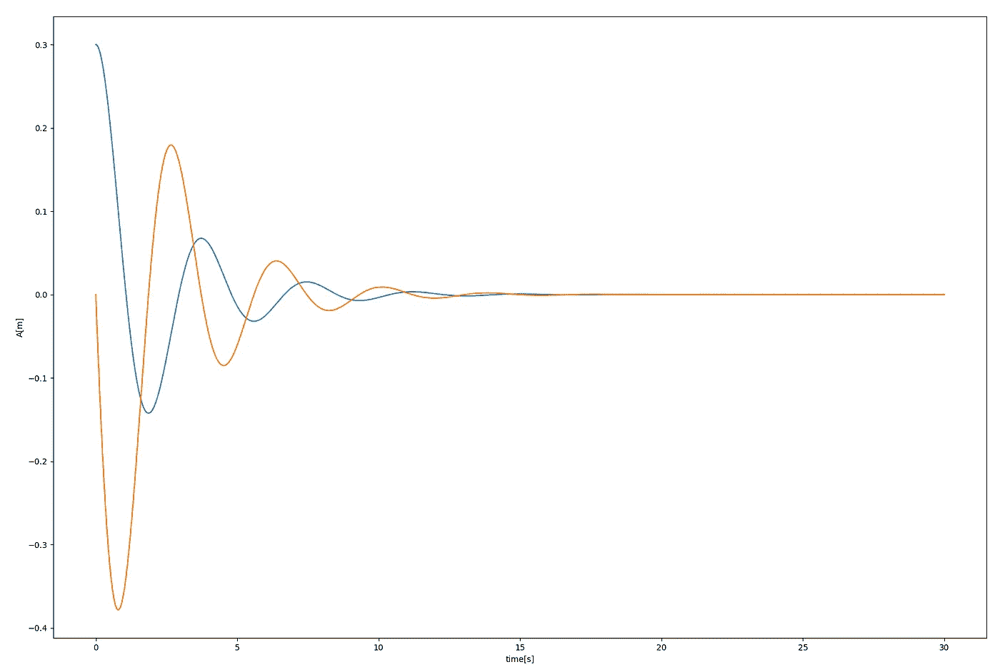

time response (blue poison of mass, orange speed of mass)

下图描述了毒素和质量速度之间的关系，

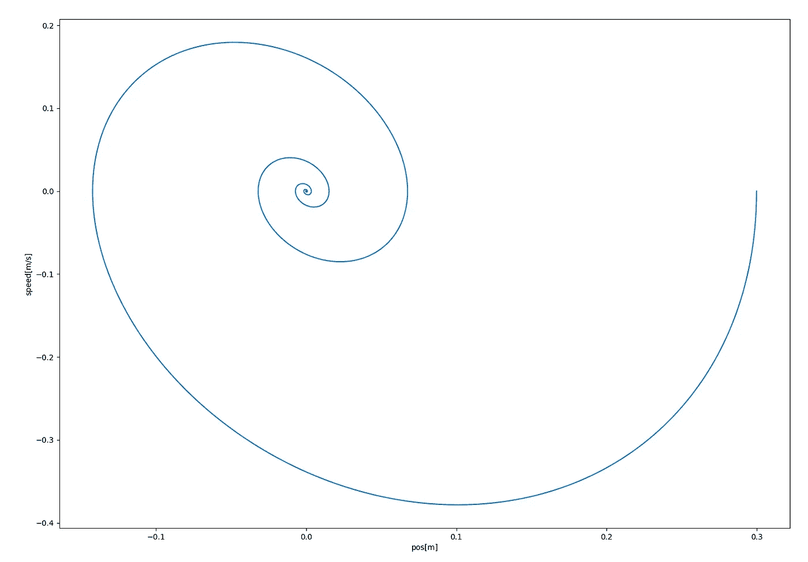

mass position vs speed

我们可以将我们的简化模型扩展到下面的模型(我们可以想象这是一个三轴机器人模型的模型)。

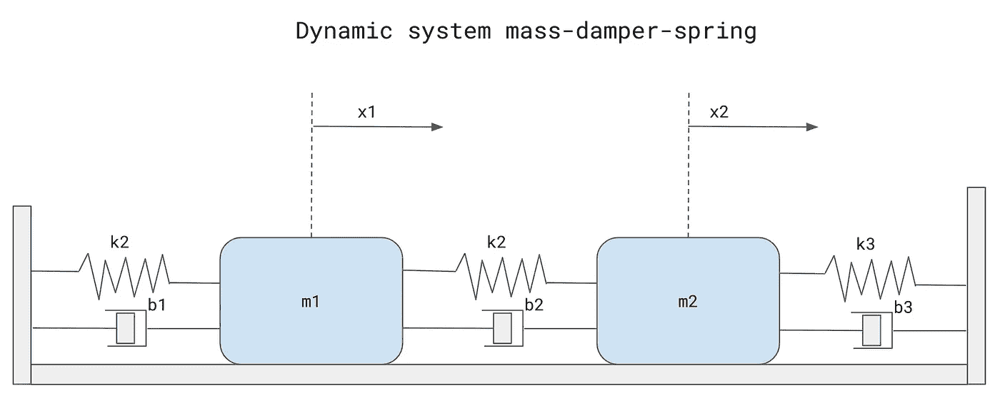

Dynamic system mass-damper-spring (by author)

这里最重要的是我们如何定义模型，以及如何求解微分方程，在这种情况下，可以写成如下形式:

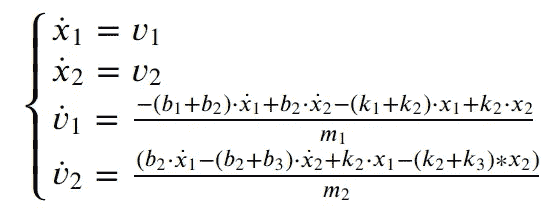

同样，我们使用 Runne Kutta 的四阶方法来求解方程。结果可以描述如下:

对于质量为 1 的。

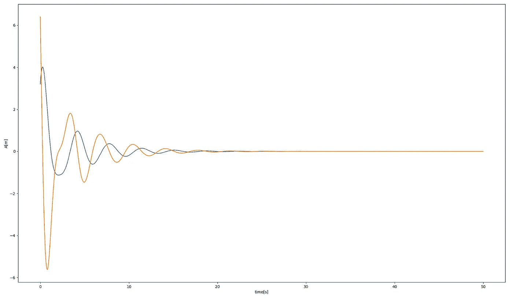

time response (blue poison of mass, orange speed of mass nr 1)

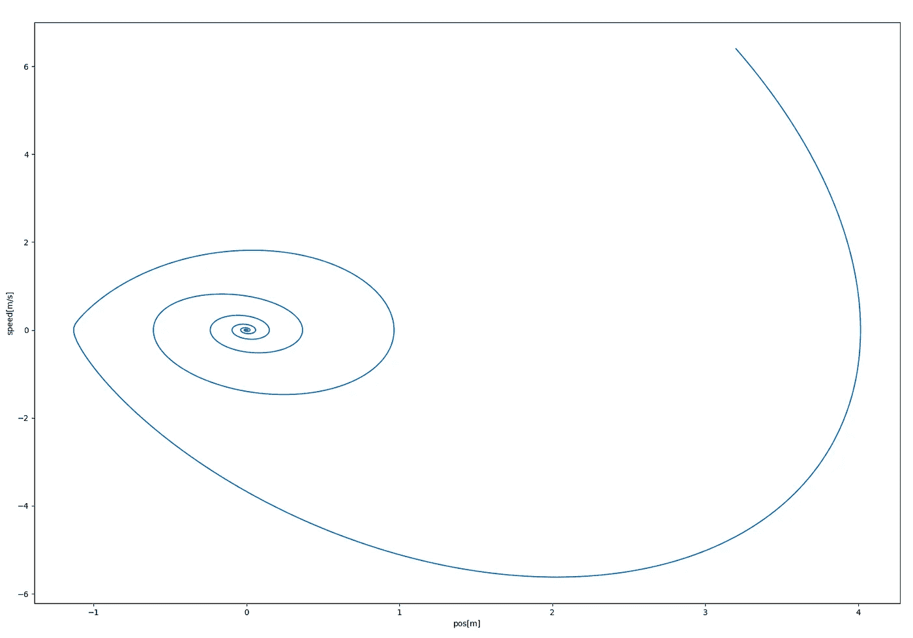

mass1 position vs speed

请注意，在许多情况下，线性状态变量方程可能无法充分捕捉潜在的物理行为。通常，机械手由非线性微分方程描述，该方程描述了各种机器人连杆之间的相互作用。

举一个简单的例子我们可以考虑一个经典的非线性系统:[范德波尔振荡器](https://en.wikipedia.org/wiki/Van_der_Pol_oscillator)其特征在于([非线性](https://en.wikipedia.org/wiki/Nonlinearity) [阻尼](https://en.wikipedia.org/wiki/Damping_ratio))。该系统可以描述如下，

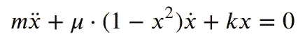

我们使用 Runne Kutta 的四阶方法求解方程。结果可以描述如下:

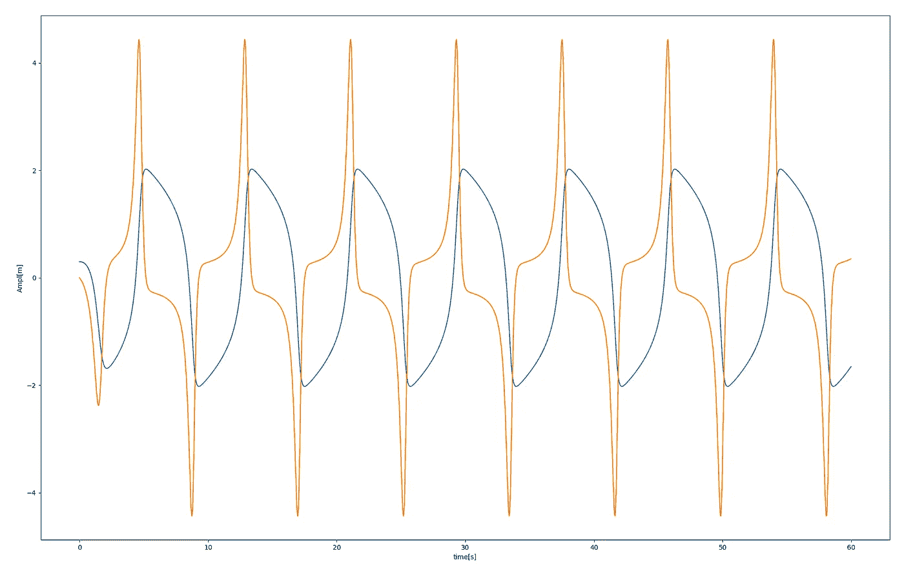

time response (blue poison of mass, orange speed of mass)

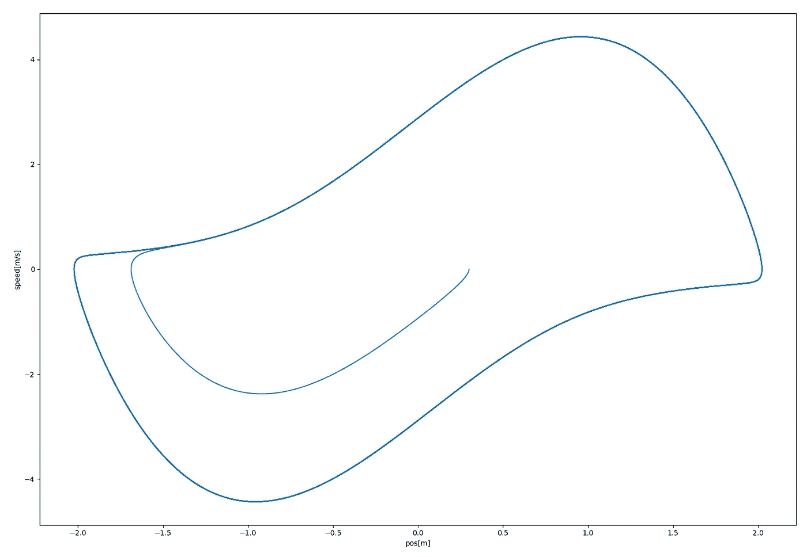

mass position vs speed

感谢您的阅读。