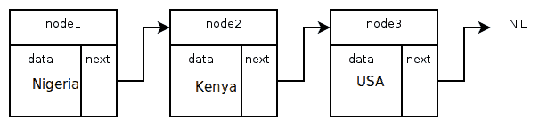
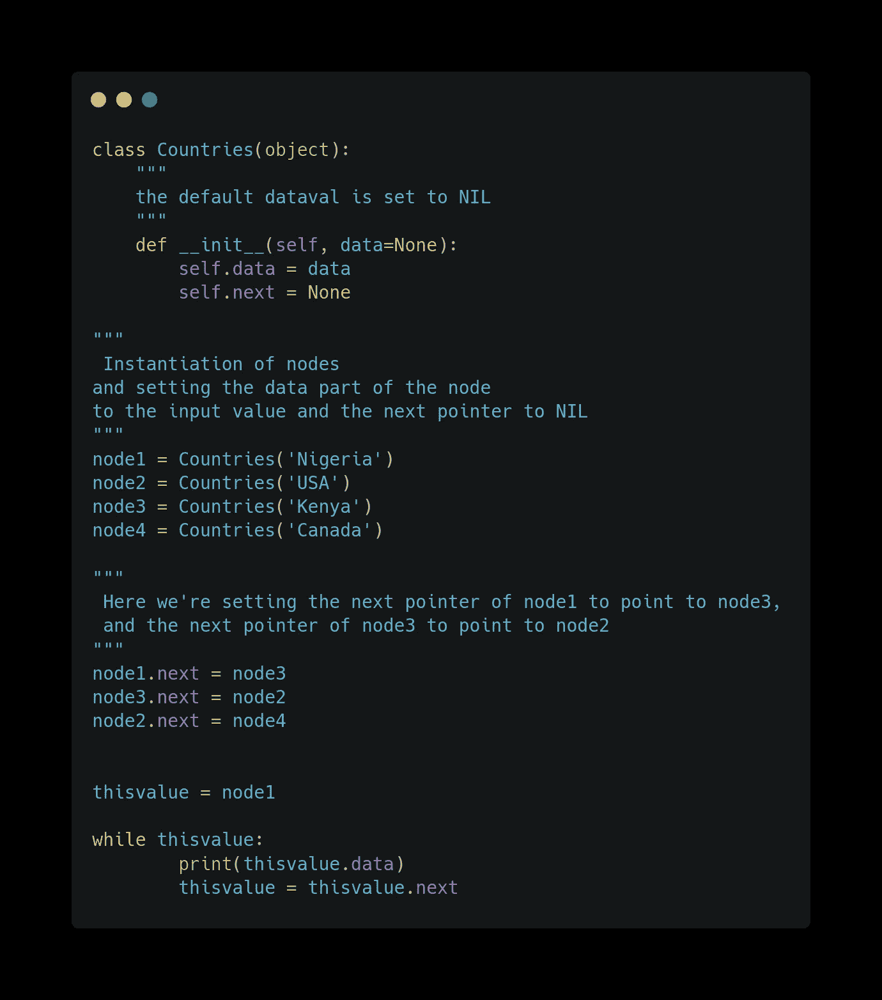

# Python 中的链表简介

> 原文：<https://medium.com/geekculture/introduction-to-linked-list-in-python-a6fda53ac11e?source=collection_archive---------2----------------------->

# 介绍

有些情况下，存储数据的内存分配不能位于连续的内存块中，也不能按顺序存储在内存中，这些情况包括:

*   您需要不断地插入和删除列表(例如在实时计算中，时间可预测性是绝对重要的)。
*   你不知道列表中会有多少项。
*   你不需要随机访问任何元素
*   您希望能够在列表中间插入项目(例如优先级队列)等等。

我们用节点实现数据结构，比如`linked list`。一个节点只是一个数据元素，由两部分组成: *data &指向下一个节点的指针。*

它可以由地址数据、地理数据、几何数据、路由信息或交易细节等组成。所以节点帮助我们从当前数据元素的值中知道下一个数据元素的地址。

*图 1:单链表的示例实现*

这些称为节点的数据元素使用指针进行链接，因此在 Python 中称为`linked list`。

# 为单链表创建节点

节点是在 Python 中处理各种其他数据结构`linked lists`和`trees`的基础。通过实现一个保存指针和数据元素的类来创建节点。

在下面的例子中，我们创建了一个名为“ListNode”的类来保存国家的名称。“下一个”指针被初始化为空和三个节点，并用所示的值初始化。

节点 1 的下一个指针指向节点 3，而节点 3 的下一个指针指向节点 2。

# 遍历节点元素

我们可以通过创建一个变量并将第一个节点赋给它来遍历上面创建的`linked list`的数据元素/节点。然后我们使用 while 循环和`next`指针打印出所有的节点元素。

***注意，我们多了一个额外的数据元素*** `***node4***` ***和*** `***next***` ***指针被适当地排列，以得到按国家排序的输出。***

当执行上述代码时，产生的输出如下所示:

通过在普通数据结构(如链表和树)中使用这些节点容器实现适当的方法，可以完成附加操作，如添加节点、删除节点、搜索列表和双向链表。

这就是 Python 中链表的实用介绍😀。

感谢观众，希望这篇文章对你有所帮助🤗。你可以随时在 Github、T2、推特和 T4 的 LinkedIn 上联系我。一定要点赞、评论和分享😌。

*最初发布于*[*https://blog . next Webb . tech*](https://blog.nextwebb.tech/introduction-to-linked-list-in-python)*。*