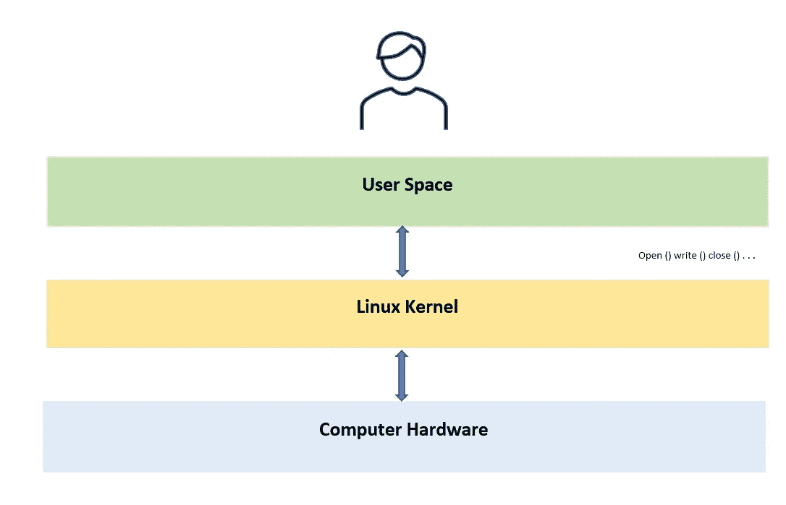

# Linux 简介

> 原文：<https://medium.com/geekculture/introduction-to-linux-8745d214e7be?source=collection_archive---------31----------------------->

## 面向初学者的 Linux

这是一个围绕开源 Linux 内核构建的操作系统。Linux 内核由不同的操作系统使用，这些操作系统被称为 Linux 发行版。我基于自由和开源软件的理念。我们可以改变、编辑以适应我们的需要，Linux 由全球成千上万的开发者开发和维护。它可以用来运行巨大的全球网络，以控制电子项目，如树莓派。它还可以运行世界上最大的超级计算机之一。

这些应用共享相同的基本组件，

*   核心
*   用户空间
*   资源

有许多不同工作角色的人使用 Linux。作家、视频编辑、分析师和各种专业人士将它用于许多目的。软件开发人员使用 Linux 进行编码和开发工作。此外，互联网上的许多服务都托管在 Linux 服务器上。

## 基本面是什么？

**Linux 内核**

所有的操作系统都有内核，但是大多数情况下，当我们谈论操作系统时，我们不会像谈论 Linux 内核那样谈论内核。它是 Linux 发行商和开源程序的核心。它最初是由 Linux Torvalds (1991)发布的。内核是提供与计算机软件通信能力的软件。它可以自己运行，但需要在计算机上运行软件。内核是工作操作系统的一部分。

Linux Architecture

*   Linux 内核可以在多种硬件上运行。
*   它可以包含对特定软件或各种硬件的支持。
*   大多数用户不会直接与内核交互。
*   程序员或系统管理员可以直接与内核交互。

## 如何与 Linux 系统交互？

***图形桌面环境***

***基于文本的外壳***

***图形桌面环境***

它可以在各种桌面环境之间安装和切换。GNOME Shell、KDE、MATE 和 Cinnamon 是最流行的桌面环境。尽管许多人在桌面环境下使用 Linux 来完成他们的任务，但有时我们需要以不同的方式来做这些事情。因此，我们必须转移到另一个主要方法，即与 ***控制台*** 互动。

## 什么是控制台？

它是一个基于文本的界面，交互式 shell 在其中运行。我们在 shell 中键入命令，它以文本形式返回我们需要知道的内容。

Linux 内核可以在多种硬件上运行。

*   它可以包含对特定软件或各种硬件的支持。
*   大多数用户不会直接与内核交互。
*   程序员或系统管理员可以直接与内核交互。

## 什么是 Linux Shell？

*   它是我们用来输入命令的软件，因此它会返回文本。
*   *Bash，Zsh，csh，*和 *fish* 都是流行的贝壳。
*   shell 可以作为控制台在文本模式下运行，也可以在 GUI 的终端模拟器中运行。
*   这可以在本地或远程使用。

## 什么是 GNU Coreutils？

它是一个 GNU 软件包，由许多基本工具的实现组成，比如 *cat、ls、chmod、*和 *rm* 。这些命令用于类似 Unix 的操作系统。

## 你对 BusyBox 了解多少？

*   有一些系统使用 BusyBox 而不是 GNU Coreutils。
*   它通常出现在嵌入式或轻量级系统中。
*   *car、sp、mkdir、sleep、*和 *stty* 是 BusyBox 命令的一些例子。

## 什么是 Linux 文件系统？

*   目录和文件组成了这个系统。
*   文件系统层次结构(FSH)描述了文件系统是如何组织的，它有助于确保分布中位置的一致性。
*   根是文件系统的顶层，用斜杠(/)表示。

## Linux 上有哪些用户账号？

Linux 可以被多用户使用，因为它被不止一个用户支持。这将是没有效率的，这是一个安全的噩梦。

*   **标准用户**

人类、程序或服务可以有自己的帐户。他们可以处理自己的文件，但不允许访问属于他人的文件，除非他们获得许可。

*   **超级用户(root)**

这些用户可以访问系统上的任何文件。标准用户可以通过 *su* 或 *sudo* 命令使用 root 权限。标准用户借用 root 的权限来安装或维护软件。

## 有哪些 Linux 发行版？

Linux 发行版为您处理繁重的工作，编译来自开源项目的所有代码，并将其集成到您可以启动和安装的单一操作系统中。他们也为你做决定，例如桌面环境、浏览器和其他要使用的软件。

*   发行版是独特的，它们是预装的工具。
*   发行版维护人员决定系统如何配置和如何运行。
*   每个发行版都有所不同，这是基于通过软件仓库可以获得的软件、发行版的支持时间以及使用的 Linux 内核版本。
*   发行版附带了 GNU Corutils、BusyBox 和/或其他工具包。
*   它们有一些特定用途的工具，如服务器、实用程序、桌面和配置。

在使用 Linux 时，了解您的发行版和版本是很重要的。如果你不知道你在运行什么，你可以使用这个命令来找到它。

**cat/etc/*//发布**

如果你是初学者，不知道选择发行版，我推荐你选择 Ubuntu，因为它很容易使用。

所以我希望你能很好地理解 Linux。如果您有任何问题，请评论。如此快乐的编码！！