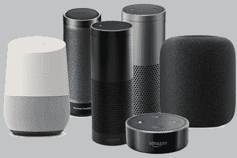
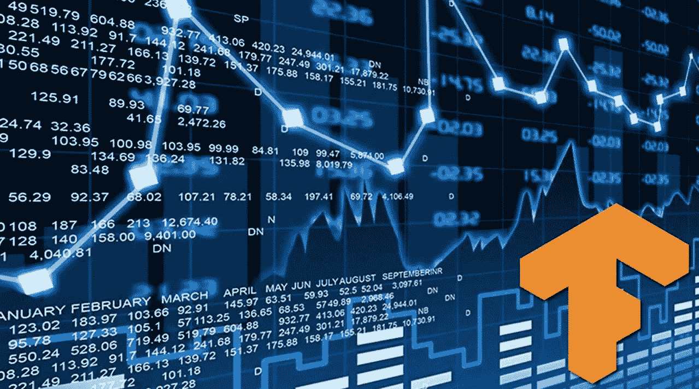
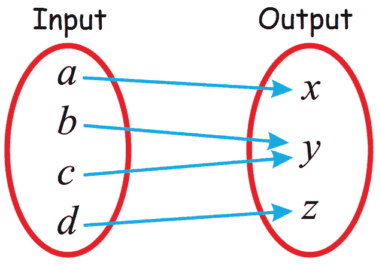
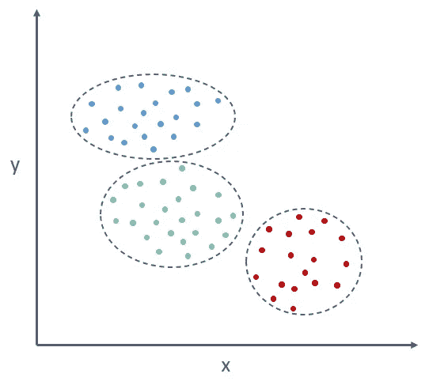
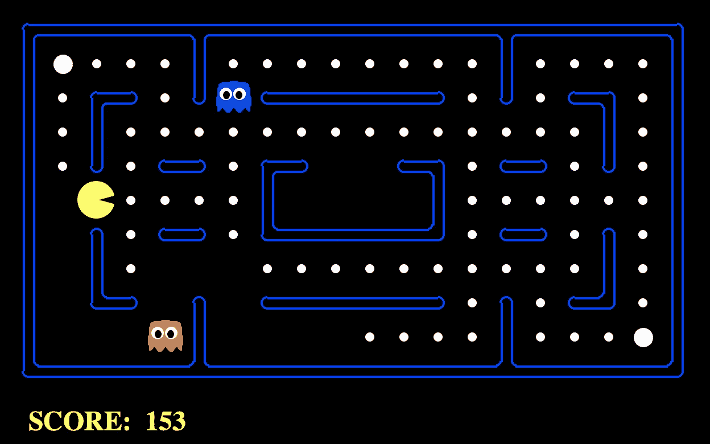
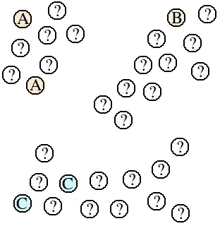

# 机器学习导论

> 原文：<https://medium.com/geekculture/introduction-to-machine-learning-428a630417dd?source=collection_archive---------11----------------------->

本文的目的是对什么是机器学习，机器学习的子集是什么，机器学习的用途是什么，是什么使机器学习成为当今有趣和热门的话题/技术有一个清晰的概念。

## 什么是机器学习？

虽然人工智能(AI)是模仿人类能力的广义科学，但机器学习是人工智能的一个特定子集，它训练机器如何学习。

机器学习诞生于模式识别和计算机可以学习而无需被编程来执行特定任务的理论；对人工智能感兴趣的研究人员想看看计算机能否从数据中学习。机器学习的迭代方面很重要，因为随着模型暴露于新数据，它们能够独立适应。他们从以前的计算中学习，以产生可靠的、可重复的决策和结果。这不是一门新的科学——但它已经获得了新的动力。

机器学习涉及计算机发现它们如何在没有明确编程的情况下执行任务。它涉及计算机从提供的数据中学习，以便它们执行某些任务。对于分配给计算机的简单任务，可以编程算法告诉机器如何执行解决手头问题所需的所有步骤；就计算机而言，不需要学习。对于更高级的任务，人工创建所需的算法可能会很有挑战性。在实践中，帮助机器开发自己的算法可能会比让人类程序员指定每个需要的步骤更有效。

## 机器学习的一些应用

机器学习有如此多的应用，它几乎被用于你能想到的每个领域:

*谷歌地图*:当推荐一条路线时，谷歌地图使用从其他用户和公司收集的关于交通、速度、体验的所有数据，以便预测即将到来的交通状况，并推荐最佳和最快的路线。

*社交媒体*:例如，在自动好友标记建议的背后，有一个 ML 算法，它通过之前收集的关于你的数据进行学习。脸书使用人脸识别和图像识别…

*虚拟个人助理*:以 SIRI 或 AmazonHome 为例:语音识别、语音到文本转换、自然语言处理、文本到语音转换。

*自动驾驶汽车*:使用机器学习算法(深度学习)，通过传感器和摄像头收集关于环境的信息。

*动态定价与风险管理:*为商品或服务设定合适的价格是经济学理论中的一个老问题。有大量的定价策略取决于所追求的目标。无论是电影票、机票还是出租车费，一切都是动态定价的。近年来，人工智能使定价解决方案能够跟踪购买趋势，并确定更具竞争力的产品价格。优步使用 ML 算法(别名 Geosurge)来确定乘车价格。

*在线视频流和视频游戏*:他们不断收集关于你如何播放视频或游戏的信息，你暂停它的时间，你跳过的内容，你观看的时间，你给的评级，浏览和滚动行为。他们使用收集的数据来了解客户行为，看看他们可以改进什么，推荐…

*欺诈检测*:欺诈检测是最重要的应用之一。每当客户进行交易时，机器学习模型都会对他们的个人资料进行彻底的 x 射线扫描，以搜索可疑的模式。在机器学习中，像欺诈检测这样的问题通常被框架化为分类问题。

## ML 方法

本节将非常简要地介绍这些方法，因为我们将在接下来的讲座中详细介绍它们。有三种主要的方法:监督学习、无监督学习和强化学习。

**监督学习**

监督学习是基于示例输入-输出对学习将输入映射到输出的函数的机器学习任务。它从由一组训练样本组成的带标签的训练数据中推断出一个函数。在监督学习中，每个例子是由输入对象(通常是向量)和期望的输出值(也称为监督信号)组成的对。监督学习算法分析训练数据并产生推断的函数，该函数可用于映射新的示例。最佳方案将允许算法正确地确定不可见实例的类标签/值。这需要学习算法以一种“合理”的方式从训练数据归纳到看不见的情况。
因此我们有输入 **X** 和输出 **Y** ，我们需要找到一个映射函数，使得 **f(X)=Y** 对看不见的数据也有很好的表现，当 Y 的空间是离散的时，我们正在处理一个**分类问题**，否则就是一个**回归问题**(输出是一个连续的量)。

分类问题像:邮件分类到 Spam/NotSpam，评论分类到正/负，基于图片分类到动物类型(这里我们有两个以上的类，我们称之为多分类)。

回归问题:像预测产品价格、温度预测、年龄预测…

**无监督学习**

无监督学习是一种从未标记的数据中学习模式的机器学习技术。相反，它允许模型自己发现以前未被发现的模式和信息。它主要处理未标记的数据。

这种无监督学习问题的目标可能是发现数据中的相似示例组，这被称为聚类，或者确定数据如何在空间中分布，这被称为密度估计。

无监督学习中最重要的方法之一是**聚类**:聚类可以认为是最重要的无监督学习问题；因此，和其他这类问题一样，它处理的是在一组未标记的数据中找到一个结构。聚类的一个宽泛定义可以是“将对象组织成其成员在某些方面相似的组的过程”。因此，一个集群是它们之间“相似”而与属于其他集群的对象“不相似”的对象的集合。还有其他方法，如密度估计来了解数据是如何分布的，主成分主要用于降维。正如你所注意到的，非监督学习可以与监督学习相结合，作为工具来做一些数据分析，例如，探索标记的数据。

一个展示无监督学习如何工作的例子:假设我第一次向你展示一只狗和一只猫，你自己去识别两者之间的一些特征和差异，假设我向你展示另一只狗，并问你，这两只狗中哪一只看起来最像。根据你从第一次经历中学到的东西，你应该回答“它是一只狗”。

无监督学习的应用包括:基于客户行为的聚类、异常检测、可视化、降维、发现关联规则…

**强化学习**

强化学习是机器学习的一个子领域，它教会代理如何在特定的环境中从其动作空间中选择一个动作，以便随着时间的推移使回报最大化。它是对机器学习模型的训练，以做出一系列决策。代理人学习在不确定的、潜在的复杂环境中实现目标。在强化学习中，人工智能面临着类似游戏的情况。计算机采用反复试验的方法来解决这个问题。为了让机器做程序员想做的事情，人工智能对它所做的行为要么给予奖励，要么给予惩罚。它的目标是最大化总报酬。

强化学习有四个基本要素:

1.  代理人:你训练的程序，目的是做你指定的工作。
2.  *环境*:代理执行动作的真实或虚拟世界。
3.  *动作*:由代理做出的动作，其导致环境中的状态改变。
4.  *奖励*:对一个行为的评价，可以是正面的，也可以是负面的。

让我们以游戏吃豆人为例，代理吃豆人正在网格世界中移动，这是一个到达食物(积极奖励)和避免鬼(游戏结束)的环境。状态是吃豆人在格子中的位置，动作是从给定位置的可能移动。

强化学习的主要挑战在于准备模拟环境，这高度依赖于要执行的任务。当模型必须在国际象棋、围棋或雅达利游戏中超越人类时，准备模拟环境相对简单。当谈到建立一个能够驾驶自动驾驶汽车的模型时，在让汽车在街上行驶之前，建立一个逼真的模拟器是至关重要的。

**其他类型的学习**

还有其他类型的学习:

**混合学习**:半监督学习、自我监督学习和多示例学习。
**统计推断学习:**归纳学习、演绎学习、直推学习
**学习技巧:**多任务学习、主动学习、在线学习、迁移学习、集成学习。
所有这些方法都是相互作用的，讨论所有这些方法超出了本讲座的范围。然而，我们将讨论最有趣的半监督学习。

**半监督**学习是一种机器学习的方法，它在训练过程中结合了少量的已标记数据和大量的未标记数据。半监督学习介于无监督学习(没有标记的训练数据)和监督学习(只有标记的训练数据)之间，它将前两者的一些方面结合成一种自己的方法。

半监督算法对具有少量标签的数据进行操作，但是大部分是无标签的。传统上，要么选择受监督的路径，只对带有标注的数据进行操作，从而极大地减小数据集的大小。否则，人们会选择无监督的路线并丢弃标签，同时保留数据集的其余部分用于类似聚类的工作。

在真实世界的数据中，情况往往如此。由于标注非常昂贵，尤其是在大多数数据集存在的量级上，大型数据集(尤其是用于企业目的的数据集)可能只有几个标注。例如，考虑确定用户活动是否具有欺诈性。在一百万个用户中，公司知道有一万个用户是这样，但是其他九万个用户可能是恶意的，也可能是良性的。有一些真正的公司只是为了注释数据而工作。

半监督学习可以指 [**直推式学习**](https://en.wikipedia.org/wiki/Transduction_(machine_learning)) 或 [**归纳式学习**](https://en.wikipedia.org/wiki/Inductive_reasoning) **:转导式**或**直推式推理**是从观察到的、特定的(训练)案例到特定的(测试)案例的推理。相反，归纳是从观察到的训练案例中推理出通用规则，然后应用到测试案例中。

给定一个点的集合，这样一些点被标记(A、B 或 C)，但是大多数点未被标记(？).目标是为所有未标记的点预测适当的标记。

解决这个问题的**归纳方法**是使用标记点来训练监督学习算法，然后让它预测所有未标记点的标签。然而，对于这个问题，监督学习算法将只有五个标记点用作建立预测模型的基础。它肯定会努力建立一个模型来捕捉这些数据的结构。例如，如果使用最近邻算法，那么靠近中间的点将被标记为“A”或“C”，即使很明显它们与标记为“B”的点属于同一个聚类。

**转换**的优点是在执行标记任务时，能够考虑所有的点，而不仅仅是标记的点。在这种情况下，直推算法会根据未标记点所属的簇来标记它们。因此，中间的点最有可能被标记为“B ”,因为它们非常靠近那个星团。

转导的一个优点是，它可以用更少的标记点做出更好的预测，因为它使用了在未标记点中发现的自然间断。转导的一个缺点是它不建立预测模型。如果一个先前未知的点被添加到集合中，则需要对所有点重复整个直推算法，以便预测标签。如果数据以增量方式出现在流中，那么这在计算上是很昂贵的。此外，这可能会导致一些旧点的预测发生变化(这可能是好的或坏的，取决于应用程序)。另一方面，监督学习算法可以立即标记新点，只需要很少的计算成本。

**换能的例子:**进行半监督学习的一种方法是结合聚类和分类算法。聚类算法是无监督的机器学习技术，它根据数据的相似性将数据分组在一起。聚类模型将帮助我们在数据集中找到最相关的样本。然后，我们可以标记这些，并使用它们来训练我们的监督机器学习模型，以完成分类任务。假设我们想要训练一个机器学习模型来对手写数字进行分类，但我们所拥有的只是一个由数字的未标记图像组成的大型数据集。注释每个例子是不可能的，我们想使用半监督学习来创建你的人工智能模型。因此，我们使用一些聚类算法来构造聚类(在本例中有 10 个聚类，但是请记住，相同的数字有多种写法，因此我们应该选择更多的聚类来涵盖不同的数字绘制方式)。在训练聚类算法之后，我们从每个聚类中挑选最接近质心的元素来更好地代表该聚类，并且在使用来自监督学习的分类算法之后，我们使用我们挑选的 50 个元素作为标签来分类。训练 ML 算法基于 50 个示例进行分类听起来是一个可怕的想法，但请记住，事实上，这个从《使用 Scikit-Learn、Keras 和 Tensorflow 进行机器学习》一书中摘录的示例表明，仅在聚类算法选择的 50 个样本上训练回归模型就可以达到 92%的准确率。但是我们仍然可以从我们的半监督学习系统中获得更多。在我们标记了每个聚类的代表性样本之后，我们可以将相同的标记传播到同一聚类中的其他样本。使用这种方法，我们可以用几行代码来注释数千个训练示例。这将进一步提高我们的机器学习模型的性能。

**归纳的例子:**另一种方法是伪标记，假设我们有一部分数据集被标记，我们使用这个标记的数据作为模型的训练数据，我们训练模型就像我们在处理一个监督问题一样。然后我们在剩余的未标注数据上使用这个训练好的模型来预测它们的标签，这样它们就得到我们所说的伪标签。然后，我们在完整的数据集上训练我们的模型，这样我们就能够在更大的数据集上训练，而不需要数小时的手动标记。通过在我们的训练集中使用伪标记样本，我们可能会冒错误标记数据的风险。为了降低风险，我们可以做的事情是，在我们的训练集中只包含伪标签样本，这些样本接收特定类别的预测概率高于 X%。例如，我们可以制定一个规则，只在训练集中包含伪标签样本，这些样本接收到特定类别的预测，比如说 80%或更多。这并没有完全消除贴错标签的风险，但确实降低了风险。由于没有满足 X%规则的预测而没有通过筛选的样本，可以在用包含第一轮伪标记样本的更大数据集重新训练模型后再次进行预测。此外，在经历伪标记过程之前，我们需要确保我们的模型在训练和验证期间表现良好(“表现良好”在这里是主观的)。此外，最初对模型进行训练的标记数据应该是完整数据集的适当表示。

半监督学习最重要的应用之一是使用对抗训练的文本文档分类，但那是另一个主题。

这是一个关于什么是机器学习及其工作方式的简单介绍。接下来的文章将试图深入讨论每一种 ML 方法，从监督学习开始。