# 机器学习导论

> 原文：<https://medium.com/geekculture/introduction-to-machine-learning-77350717a2b3?source=collection_archive---------38----------------------->

**本文以全球 AI Hub 为内容。我准备了这篇文章，以便直观地解释和理解它。请访问全球人工智能中心，并表明你的赞赏，这是一个伟大的数据科学免费资源。[1]**

**你可以查看我的“数据科学基础知识”中间文章，了解定义和基础知识。**

# **机器学习类型**

## **监督学习**

**回归**用于**连续**目标变量(例如**房价预测**)。

**分类**用于**分类**目标变量(例如**医学影像**)。

## **无监督学习**

不存在目标变量。

**聚类**(例如**客户细分**或**关联**)应用(例如**购物篮分析**)。

## **半监督学习**

**分类**(例如**文本分类**)或**聚类**(例如**GPS 数据寻路**)应用于**分类**目标变量。

## **强化学习**

**控制**用于**无**目标变量(例如**自动驾驶汽车**)。

**分类**用于**分类**目标变量(例如**优化营销**)。

# **格式化数据以适应模型**

**1 _ 清理数据**

去掉不必要的数据，修正不正确的数据，聚合来自不同资源的数据。

**2 _ 确定数据类型**

检查日期，数值，书写格式数据，并转换方便的数据类型。

**3 _ 降维**

必要时做 PCA(降维)，去掉不必要的列，分析相关性。

**4_ 分析数据分布和规律性**

最小-最大缩放和标准化

# **成功表现**

# **分类指标**

## **混淆矩阵**

TP(真阳性)，FN(假阴性)，FP(假阳性)，TN(真阴性)。

**精度**是模型的整体性能。它是全部正确预测值与所有预测值的比率。对于不均匀分布的数据集，它本身是不够的。

**(TP+TN)/(TP+TN+FP+FN)**

**精度**是正面预测的准确性。

**TP/(TP+FP)**

**召回(灵敏度)**是实际阳性样本的覆盖率。

**TP/(TP+FN)**

**特异性**是实际阴性样本的覆盖率。

**TN/(TN+FP)**

**F1 得分**是对不平衡类别有用的混合指标。这是精确和回忆的调和平均值。

**2TP/(2TP+FP+FN)**

# **回归指标**

## 平均绝对误差

给出预测值和实际值的绝对差值的平均值。它不受训练集中异常值的影响。MAE 的问题是，它在最小值时是不可导的。这可能会在训练机器学习模型时导致收敛。

## 均方误差

MSE 很常见，因为它简单、连续且可推导。当我们计算平均值时，由于考虑到一个大的异常值，它很有可能是一个巨大的值，因此它会导致很高的误差。

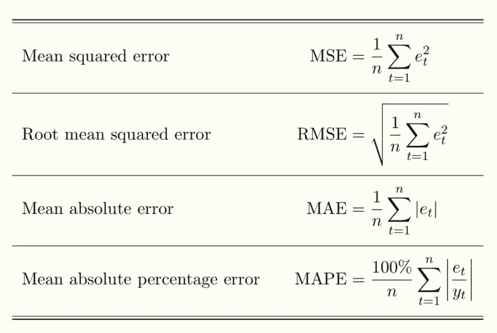

Regression metrics[3]

# **模型的优化**

使用交叉验证调整超参数。

做超参数搜索，比如 gridsearch。

尝试整体方法。组合您的最佳模型通常会产生更好的结果。

当您对您的最终模型更有把握时，使用测试数据集进行性能测试。

# **模型部署**

ML 部署是将机器学习模型的集成部署到已经存在的生产环境中(比如 SaaS 和 PaaS)。

Streamlit 是一个 python 库，让你在不知道 HTML 和 CSS 的情况下创建交互式网站。

Docker 是编码环境最流行的容器化方式。

**Heroku** 是云计算平台即服务基础设施服务。

# **交叉验证**

它允许您选择一个不太依赖于第一个学习集的模型。

假设我们有一个数据集。我们将数据集的前%n 作为验证，其余的作为训练集。这是第一次折叠，有一个 E1 验证错误。现在，我们只将数据集的下一个%n 作为验证集，其余的作为训练集，并重复这个过程 k 次。最后的交叉验证误差:(E1+E2+…+Ek)/K

# **偏差-方差权衡**

**偏差:**偏差是对给定点的预测和我们试图预测的正确模型之间的差异。

**方差:“**方差衡量集合中的每个数字与平均值的距离，以及与集合中其他数字的距离”。[2]

**方差权衡:**越简单的现代，偏倚越高。模型越复杂，方差越高。

# **诊断欠拟合和过拟合**

**欠拟合:**高训练误差，高偏差，训练误差类似于测试误差，模型学习不好。

**过拟合:**非常低的训练误差，高方差，训练误差比测试误差小得多，模型记忆了数据。

**理想:**训练误差略小于测试误差。

**不可约误差**与噪声有关，唯一的解决方法是清除数据。

**防止欠拟合:**可以增加训练数据，降低模型复杂度，训练时可以应用提前停止，可以应用正则化。

**防止过拟合:**可以通过添加新的特征值或层来增加模型的复杂度。可以从数据中去除噪声。在训练期间，历元的数量可以减少。可以给出更好的特征值(特征工程)。可以减少限制模型的值(例如正则化参数)。可以增加数据的数量。

# **回归分析技术的类型【4】**

**线性回归**:以直线形式进行预测。下面是表示线性回归的等式。

**y=xw+b**

y:因变量，x:自变量，w:斜率，b:偏差或截距。

**岭回归**:这是一种强大的回归方法，不容易过度拟合，通常在自变量之间存在高度相关性时首选。模型方程如下所示，(λ)解决了多重共线性问题。

β = (X^{T}X + λ*I)^{-1}X^{T}y

**套索回归:**套索回归涉及特征选择。它防止回归系数的绝对大小增加，并且系数值接近零。该模型由下面的等式表示。

n^{-1}σ^{n}_{i=1}f(x_{i}，y_{I}，α，β)

**多项式回归**:自变量(x)和因变量(y)之间的联系在多项式回归中用 n 次表示(类似于多元线性回归，稍有修改)。下面是等式。

l = β0+ β0x1+ε

# **R 平方**

它是对线性回归模型的适合度的度量。

R =1-SS 回归/SS 总数

**R2 值并不总是意味着模型好，过度拟合时 R 也很高。**

# 提前停止

如果当验证集误差低于或等于我们确定的最小误差值时，性能没有继续提高，我们的误差值将返回到最佳点，训练将停止。

# 价值函数

它是模型的预测值和真实值之间的差异。训练完我们的模型后，我们需要看看它的效果如何。虽然准确性向我们展示了模型运行得有多好，但它并没有告诉我们如何改进它。我们需要一个成本函数来帮助我们达到训练不足的模型和训练过度的模型之间的微小点。我们需要一个成本函数来帮助我们确定模型何时最准确，因为我们需要达到欠训练模型和过训练模型之间的小点。

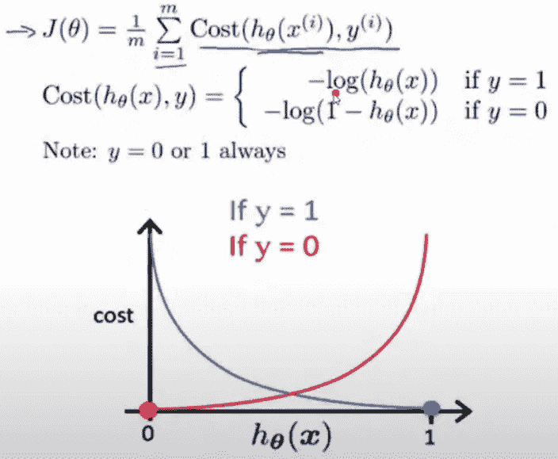

Cost function equation and graph[1]

## 损失函数与成本函数

损失函数(误差函数)是针对单个训练示例的。

成本函数是整个训练数据集的平均损失。

# 梯度下降

迭代地调整权重以最小化成本函数。这样做，直到误差值收敛到局部最小值。

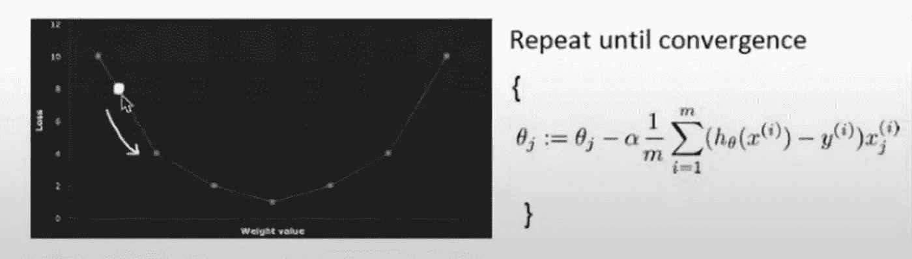

Gradient Descent formula on the right and its graph on the left[1]

由于所有的代价函数都不是凸的，该算法收敛于局部极小值。

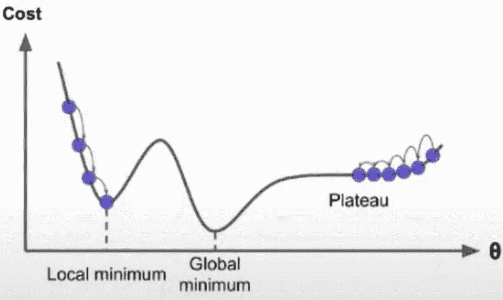

Local minimum, global minimum, and plateau[1]

像 MSE 和 MAE 这样的成本函数是凸的，所以我们可以确定只有一个全局最小值。

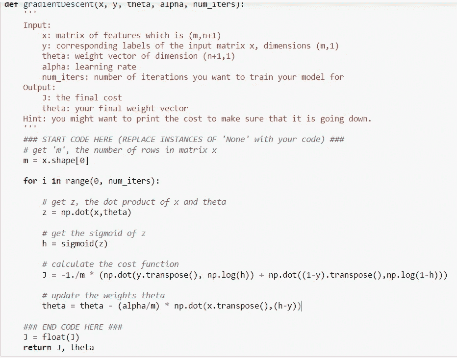

Gradient Descend Python Code[8]

# 正规化

正则化是通过约束来简化模型，从而防止过度拟合的过程。

我们将比较 2 正则化算法 L1 拉索和 L2 岭。

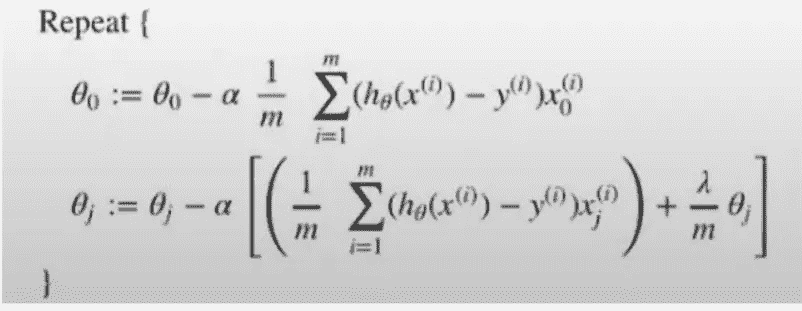

L1 Lasso[1]

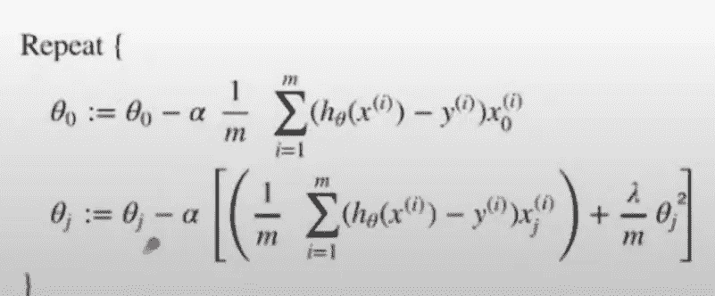

L2 Ridge[2]

误差函数在 L1，用权重的绝对值来惩罚，而在 L2，用权重的平方来惩罚。

L1 的导数是 k(一个与重量无关的常数),并从重量中减去该常数，其中 L2 的导数是 2 *重量并去除重量的 x%。

如果你拥有的特征多于观测值的数量(N)，L1 最多拥有 N 个系数，而 L2 是解决这个问题的经典方法。

L1 可以通过限制 L1 系数范数和固定某些系数值的级数来解决多重共线性问题。多重共线性意味着两个独立变量高度相关。L2 可以通过限制 L2 系数范数和保护所有变量来解决多重共线性问题。

# 超参数定义

**学习速率(α)** :决定梯度下降时误差收敛到最优点的速率。

**Theta(θ)** :特征值的权重。

**正则项(λ)** :是正则参数，是决定罚多少权的惩罚项。如果给的太多，我们的重量会接近于零。这防止了我们的模型过度拟合，但同时，创建的模型不会非常高效。

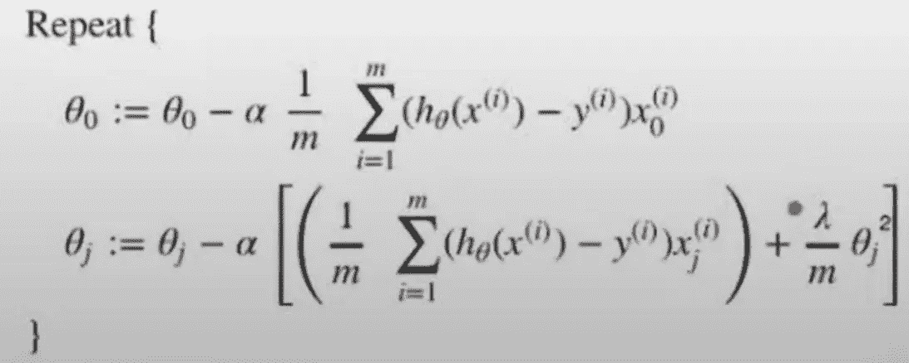

Regularization term in the formula[1]

# 分类

将结果分成两个或更多不同的类别。可以在结构化和非结构化数据集上完成。这些类通常被称为目标、类别或标签。

## **逻辑回归**

这被称为回归，但实际上，它将结果分成两类(分类)，因此目标变量只能有两个值。这是一个快速和基本的算法。目标变量和自变量之间的关系由 s 形曲线表示。

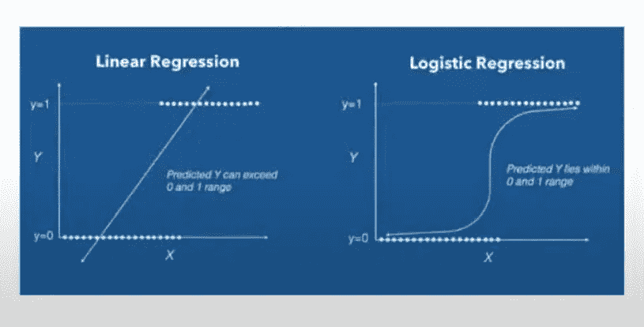

Logistic Regression[1]

逻辑回归方程)如下所示。

logit(p)= ln(p/(1-p))= B0+b1x 1+B2 x2+b3x 3…+bkXk

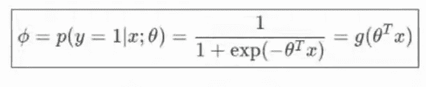

Logistic regression formula[1]

# 激活功能

我们将线性表达式转换成非线性表达式。

## 西格蒙德·丰克西约努

sigmoid 函数是非线性函数，其结果在[0，1]之间。

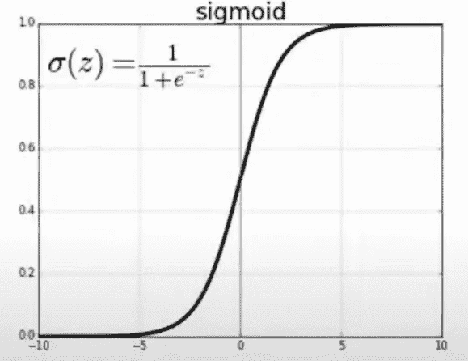

Sigmoid function and its graph[1]

如果需要有多个输出类，应该怎么做？答案是 softmax。

## Softmax Fonksiyonu

Softmax 非常类似于 sigmoid 函数(性能更好)，适用于多个输出类。特别是用在输出层的深度学习。

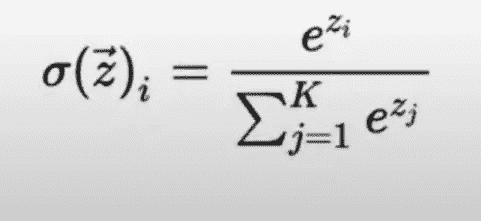

softmax formula [1]

# ROC 曲线

它是在各种阈值下对分类问题的性能测量。ROC 是概率曲线，AUC 是输出到类别的可分辨性的度量。ROC-AUC 曲线是使用最广泛的指标之一。

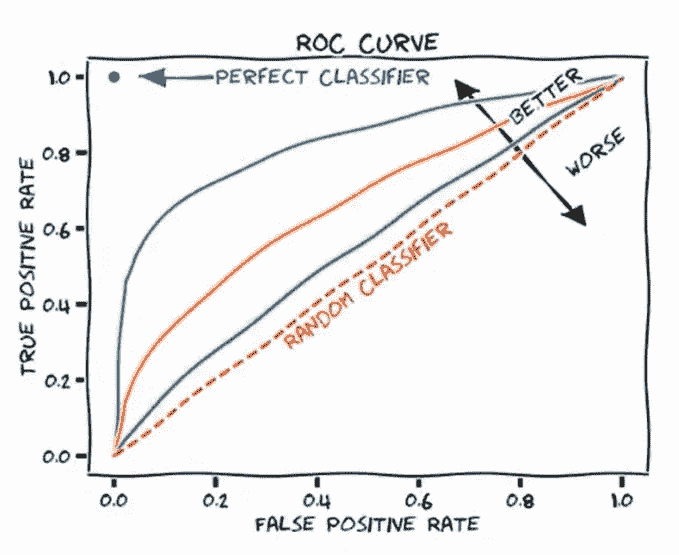

ROC curve graph[1]

# 流行的分类算法

## k-最近邻(KNN)

它是一种具有非参数结构的监督学习算法，被认为是一种惰性分类器。模型上不进行任何训练。它通过查看最近的邻居来预测数据属于哪个类。

选择邻居的数量(k ),并确定数据之间的欧几里得距离。

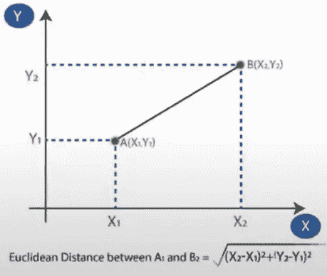

Euclidean distance formula and graph[1]

欧几里德方程的结果是，如果 A 类中的邻居数量多于 B 类中的邻居数量，则推断未知数据来自 A 类。

不同的距离计算器可以用来解决这个问题。

当需要计算依赖于 C 值的距离时，使用 Minkowski。当 C=1 公式给出曼哈顿距离，C=2 给出奥克里德距离。汉明距离给出了两个二进制序列之间的相似性。

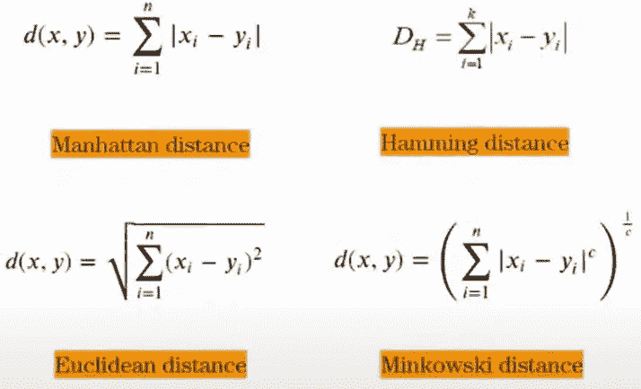

Different distance formulas[1]

## 支持向量机

它是分类问题中使用的监督学习方法之一。画一条线来分隔放置在平面上的点，这条线的目的是在 2 类点内的最大距离处。复杂但适合中小型数据集。解决二元分类问题

SVM[5]

SVM 通常对线性数据进行分类，但它也可以对非线性数据进行分类。目标是找到超序列，使两类之间的分离达到最佳。它也被应用于分类问题产生的后回归问题。

## 硬利润与软利润

Margin 是在到达数据点之前可以增加的宽度。边距是仅从直线到最近点的垂直距离。

**如果数据是线性可分的，并且对异常值非常敏感，则硬边界**有效。

**软边界**用于数据混乱且无法被超平面分隔的情况

我们可以用 c 超参数控制两者的平衡。

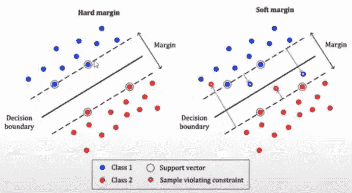

Hard margin and soft margin [1]

# 决策树

它是一种基于树的算法，在回归和分类中都使用。决策树往往会过度拟合。用于复杂的数据集中。决策树是基于树数据结构的，要了解更多，你可以查看我的“树数据结构”文章。

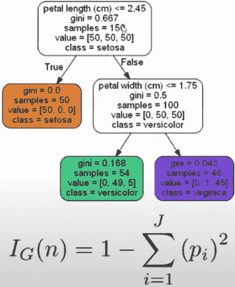

Decision tree formula and representation [1]

## 决策树的优势

对连续值和离散值都有效。

不需要异常值检测和缩放(较少需要数据预处理)。

简单易懂，决策规则清晰可见。

用于多路输出。

## 基尼指数

纯意味着所有数据集值属于同一个类。

基尼系数是对随机变量新样本错误分类的一种度量。

基尼=(选择红球的概率+选择蓝球的概率)

## **合奏学习**

在这种情况下，一个以上的分类估计算法组合并产生改进的结果。

集成学习的一些例子是最大投票、平均、加权平均、堆叠、混合。

## 拔靴带

使用随机抽样方法，这种策略可以估计几乎任何统计的抽样分布。它用于最小化数据集的高方差和噪声。[7]

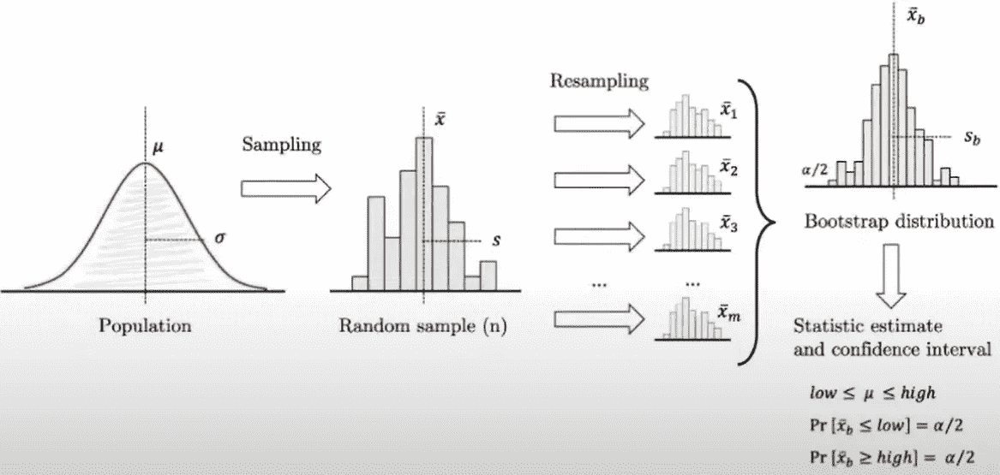

Bootstrapping Process[1]

## 引导聚集

它是用于机器学习集成的元算法，旨在提高统计分类和回归中使用的机器学习算法的稳定性和准确性。在从主数据集生成数据的随机子集之后，独立地训练多个弱模型。它还最小化了差异，并有助于避免过度拟合。虽然它通常与决策树一起使用(使用随机森林)，但它可以用于任何方法。[6]

# 无监督学习

## 流行的无监督学习算法

**聚类**

基于质心、基于密度的空间聚类(DBSCAN)、聚类分析、相似性传播。

**异常和新奇检测**

一级 SVM 和隔离林。

**关联规则学习**

先验和 Eclat。

**可视化和降维**

主成分分析，核主成分分析，局部线性嵌入(LLE)，t-分布随机邻居，t-分布随机邻居嵌入(t-SNE)。

## **主成分分析**

它减少了复杂数据集的大小，捕获了数据中的关键特征，并试图用更少的变量来显示它们。

## **逐步 PCA**

标准化数据集。计算数据集中要素的协方差矩阵。计算协方差矩阵的特征值和特征向量。计算特征值和相应的特征向量。选择 k 个特征值，创建一个特征值矩阵。转换原始矩阵。

## t 分布随机邻居嵌入(t-SNE)

它用于可视化高维样本。它通过保持相似的特征接近而不同的特征远离来降低维数。

## 使聚集

它是通过识别未标记的数据将数据分组到相似组的过程。

## 亲和传播

将每个数据点视为网络中的一个节点，并将所有数据点视为潜在样本。它存在一些问题，比如发现许多不必要的聚类，以及在处理大量数据时表现不佳。

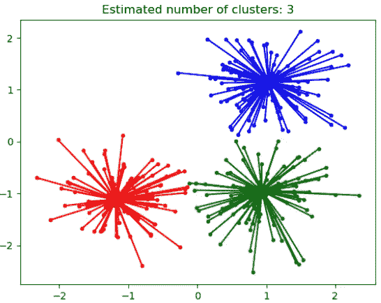

Affinity Propagation [1]

## **层次聚类**

它根据相似性将数据分为不同的级别和层次。创建了一个称为树状图的树状结构。

层次聚类有两种工作方式，逻辑相似。

**集聚集群**

每个数据集在开始时都被视为一个聚类。实际的聚类是通过迭代组合彼此接近的聚类而形成的。

**分裂聚类**

有一个聚类在开始时包含所有数据集。它首先接受单个簇中的所有数据，然后根据邻近程度划分成簇。

## 基于密度的聚类

它假设数据由高斯分布等分布组成，并根据密度进行聚类。当聚类时，考虑距中心的距离。它不需要聚类数量超参数，而是根据数据的密度来确定聚类的数量。

## 基于质心的聚类

在最大 n 个质心的帮助下，将数据分成 n 个簇。K-means 是最流行的基于质心的算法。它对初始条件和异常值很敏感。

**K 均值聚类**

它试图将样本分成 n 个方差相等的组。它的目标是最小化一个被称为平方误差函数的目标函数。

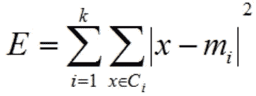

Squared error function[1]

## k-表示循序渐进

K-means 算法为每个聚类分配随机质心。然后，我们将使用聚类指标来评估我们的模型。

为了找到聚类的最佳数量，使用了肘方法。画一个扭曲-k 数的聚类图。图形看起来像一只手臂，肘点将显示最佳点。

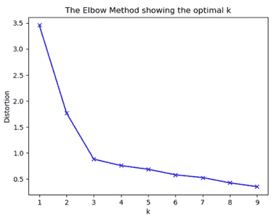

The Elbow Method[1]

## 剪影分数

这是发现聚类技术如何聚类的标准。其结果介于-1 和 1 之间。-1 表示聚类是错误的，1 表示聚类彼此相距很远，容易被分割。0 表示聚类之间的距离没有任何意义。

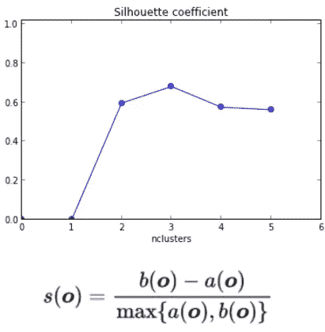

Silhouette equation and graph[1]

计算完成后，将重新计算质心。对于每个聚类，该算法通过平均聚类中的所有点来重新计算质心。重复这个过程。

## K-NN 与 K-Means

K-NN 是用于分类和回归的监督学习算法，而 K-Means 是用于聚类的非监督学习算法。

K-NN 基于特征相似性，而 K-Means 基于距离和均值。

在 K-NN 中，一个对象可以有许多簇，而在 K-NN 中，意味着一个数据属于一个簇。

## 小批量 K 均值

小批量用于减少计算时间。

每次迭代时，小批量接收随机选择的小堆栈。

小批量 K-means 更快，但给出的结果略有不同。

如果你喜欢我的帖子，请别忘了鼓掌。谢谢你。

## **参考文献:**

[1]全球人工智能中心机器学习介绍

【https://globalaihub.com/ 

[2]亚当·海斯(2021 年 4 月 2 日)，方差:

https://www . investopedia . com/terms/v/variance . ASP #:~:text = The % 20 term % 20 variance % 20 refers % 20 to，other % 20 number % 20 in % 20 The % 20 set。

[3]sada yeong，(2020 年 4 月 4 日)，时间序列变异因素和模型:

 [## 시계열의 변동요인과 모형

### 하나또는여러사건(사상)에대해시간의흐름에따라일정한간격으로관찰하여기록한자료(데이터)前특정소비재의월별판매량혹은연도별농작물의생산량등어떠한경제현상이나…종합주가지수

sodayeong.tistory.com](https://sodayeong.tistory.com/19) 

[4] Pavan Vadapalli，(2020 年 7 月 27 日)，机器学习中的后悔模型的类型:

[https://www . upgrad . com/blog/types-of-regression-models-in-machine-learning/](https://www.upgrad.com/blog/types-of-regression-models-in-machine-learning/)

[5]维基百科，(2018 年 10 月 19 日)，SVM_margin.png

[https://en.wikipedia.org/wiki/File:SVM_margin.png](https://en.wikipedia.org/wiki/File:SVM_margin.png)

[6]维基百科，(2021 年 7 月 16 日)，自举汇总

[https://en.wikipedia.org/wiki/Bootstrap_aggregating](https://en.wikipedia.org/wiki/Bootstrap_aggregating)

[7]维基百科，(2021 年 7 月 15 日)，自举

[https://en . Wikipedia . org/wiki/Bootstrapping _(statistics)# cite _ note-Varian-3](https://en.wikipedia.org/wiki/Bootstrapping_(statistics)#cite_note-Varian-3)

[8]Coursera，(2021 年 10 月 1 日)，作业:逻辑回归:

[https://www . coursera . org/learn/class ification-vector-spaces-in-NLP/programming/P4CTb/assignment-logistic-regression/](https://www.coursera.org/learn/classification-vector-spaces-in-nlp/programming/P4CTb/assignment-logistic-regression/lab?path=%2Fnotebooks%2FWeek1%2FC1_W1_Assignment.ipynb)