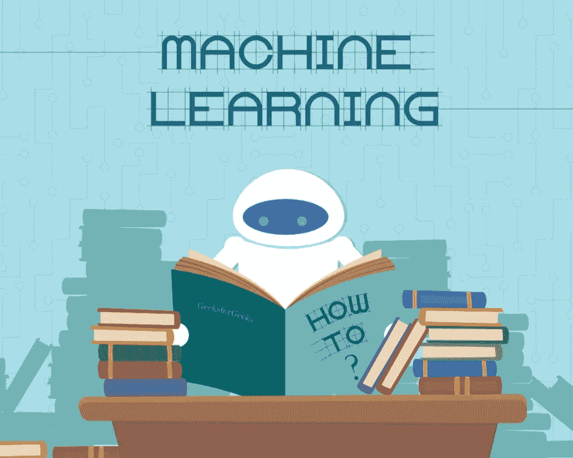

# 机器学习导论:回归

> 原文：<https://medium.com/geekculture/introduction-to-machine-learning-regression-fee4200132f0?source=collection_archive---------15----------------------->

# 介绍

本文涵盖回归分析，这是机器学习的许多应用和整个科学学科的基础。我们将浏览一些概念，然后使用来自 [AlphaWave Data](https://www.alphawavedata.com/) 的财务数据深入研究一些回归示例。