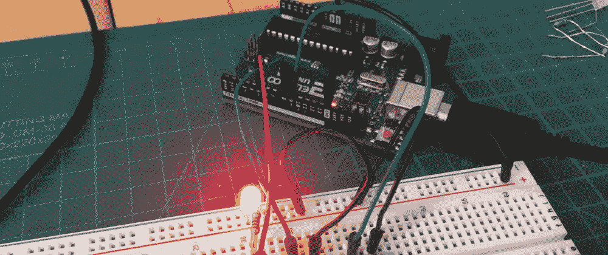
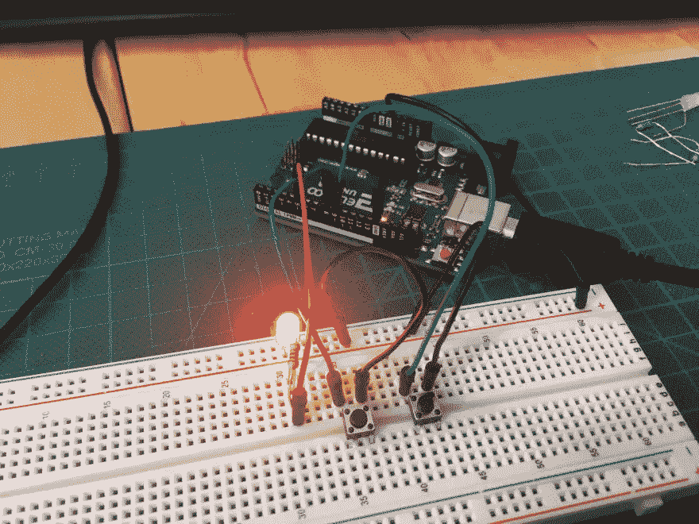

# 微控制器和单板计算机介绍

> 原文：<https://medium.com/geekculture/introduction-to-microcontrollers-and-single-board-computers-5e2fa3011279?source=collection_archive---------6----------------------->

当我开始创建一个机器人的项目时，我对所需的计算机硬件只有一个模糊的概念。阅读其他机器人项目，提到 Arduino 和 Raspberry Pi。两者都是重要的计算机，但用途非常不同。

在我的微控制器博客系列中，我想调查 Arduino，Raspberry PI，它们的硬件功能和连接选项。在这第一篇文章中，我简要研究了 Arduino 和 Raspberry Pi 之间的区别，并解释了 GPIOs 的概念。

*本文原载于* [*我的博客*](https://admantium.com/blog/micro01_microcontroller_introduction/) 。

# 微控制器与单板计算机

微控制器是一种特殊类型的计算机，主要用于访问其他硬件并与之交互。它在 CPU 和 RAM 方面只有很少的资源，但也提供了非常低的功耗和对连接硬件的实时、细粒度处理的可用性。此外，微控制器没有完整的通用操作系统，但对于其使用情况来说非常专业。

单板计算机，也称为片上系统，是小型成熟的计算机。它们提供当前标准的面向消费者的接口，如 HDMI、USB、Wifi 和蓝牙。它们提供 SD 卡或小型 SSD 来存储数据，并有几个 CPU 核心和 RAM。SBC 安装了完整的操作系统，通常是 Linux 或 Windows，因此提供了大量的通用硬件选择。

Arduino 是一种微控制器，是一种设计用于连接外部传感器的电路板，不提供操作系统。Raspberry Pi 是一台单板计算机或片上系统，它运行一个完整的 Linux 操作系统。这两种系统体积都很小，消耗的能量也很少，因此它们可以用于便携式项目。

这两个系统都允许通过使用 GPIO 引脚与其他硬件接口，并且它们支持不同的协议和总线系统来连接到其他计算机。为了简洁起见，我将使用术语微控制器来指代 Arduino 和 Raspberry Pi。

# GPIO 引脚

微控制器向用户提供有限数量的数字信号引脚。引脚可以大致分为数字引脚和模拟引脚。数字引脚将数字数据(0 或 1)表示为两个不同的电压带，主要是 0V 和 3.3/5.0V。模拟引脚提供连续值。它们要么提供非常精细的电压带，要么使用[脉宽调制](https://en.wikipedia.org/wiki/Pulse-width_modulation)，这是一种将连续信号“斩波”成不同开/关电压频率的技术，以表示数据。

在现代微控制器中，只有一些引脚服务于定义的目的，最重要的是电和地的输入/输出，或连接协议。大多数其他引脚是通用的:它们的具体用途由用户定义。

正如在[维基百科](https://en.wikipedia.org/wiki/General-purpose_input/output)上解释的那样，GPIO 引脚在 Arduino 和 Raspberry Pi 等流行的微控制器或单板计算机发明之前就存在了。然而，GPIOs 由于其灵活性而受到这些主板的欢迎。用户向 Arduino 上传一个具体的程序，称为草图。草图可以以编程方式定义这些引脚的行为:它们是用作输入还是输出？他们提供的是数字值还是模拟值？更重要的是，随着 Shields (Arduino) ^1 和 HATS (Raspberry Pi，即“添加在顶部的硬件”的首字母缩写)的添加，特殊电路被附加到 gpios 以提供独特的功能，例如扩展 Wifi 和蓝牙等功能，或允许精确控制执行器。

了解了这些之后，让我们来看看 Arduino Uno、Raspberry Pi 和 Raspberry Pico 的 GPIO 引脚和支持的协议。

# 结论

这篇短文介绍了微控制器、单板计算机和 GPIO 引脚，这是与其他硬件交互的主要接口。从下一篇文章开始，我将研究 Arduino Uno、Raspberry Pi 和 Raspberry Pico 的特征。

# 脚注

1.  这里有一篇关于盾牌的很好的[概述文章，以及一份](https://learn.sparkfun.com/tutorials/arduino-shields/all)[盾牌](http://shieldlist.org/)的详细列表。 [↩](https://dev.to/admantium/introduction-to-microcontrollers-and-single-board-computers-2am4#fnref1)