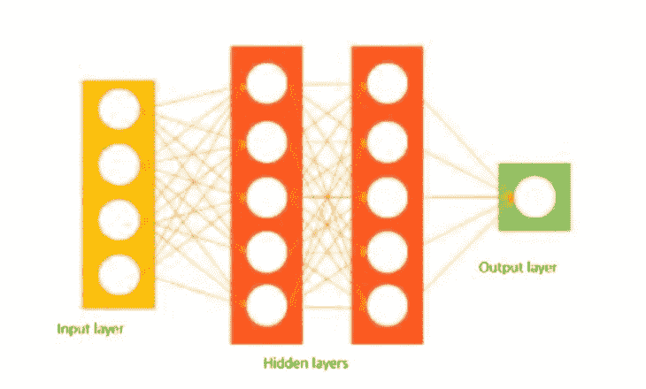
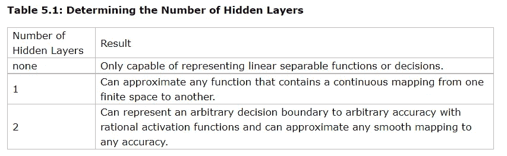

# 如何确定隐含层的层数和神经元数？

> 原文：<https://medium.com/geekculture/introduction-to-neural-network-2f8b8221fbd3?source=collection_archive---------1----------------------->

深度学习为人工智能提供了模仿人脑神经网络的能力。它是机器学习的一个子集。深度学习和机器学习的主要区别在于数据呈现给机器的方式。机器学习访问大量数据(结构化和非结构化)，并从中学习以预测未来，而深度学习网络则在多层人工神经网络上工作以预测未来。

# 神经网络的一般结构

神经网络具有输入层、隐藏层和输出层。它可以理解数据中的模式、噪声和混淆来源。当特征线性相关时，通常神经网络不是优选的，它可以通过使用机器学习来完成。即使在线性相关中，如果使用神经网络，也不需要任何隐藏层。

神经网络计算加权和。计算出的权重之和作为输入传递给隐藏层中的激活函数。激活函数是将输入映射到期望输出的函数。它将“输入的加权和”作为函数的输入，加上一个偏差，并决定神经元是否应该被激发。输出层给出预测输出，模型输出与实际输出进行比较。在训练神经网络之后，该模型使用反向传播方法来改善网络的性能。成本函数有助于降低错误率。

# 输入和输出层中的神经元数量

输入层中神经元的数量等于数据中要素的数量，在极少数情况下，会有一个输入层用于偏置。而输出中神经元的数量取决于模型是用作回归器还是分类器。如果模型是回归器，则输出层将仅具有单个神经元，但是如果模型是分类器，则根据模型的类别标签，它将具有单个神经元或多个神经元。

# 隐含层中的神经元数量和层数

当谈到隐藏层时，主要关注的是需要多少隐藏层和多少神经元？

一个[**Java 的神经网络介绍，第二版**](https://web.archive.org/web/20140721050413/http://www.heatonresearch.com/node/707) 作者 **jeffheaton** 提到隐层数确定如下。

有许多经验方法可以确定在隐藏层中使用的神经元的正确数量，例如:

*   隐藏神经元的数量应该在输入层的大小和输出层的大小之间。
*   隐藏神经元的数量应该是输入层大小的 2/3，加上输出层的大小。
*   隐藏神经元的数量应该小于输入层大小的两倍。

此外，隐藏层所需的神经元数量和层数还取决于训练案例、离群值的数量、要学习的数据的复杂性以及所使用的激活函数的类型。

大多数问题可以通过使用神经元数量等于输入和输出层的平均值的单个隐藏层来解决。如果选择较少数量的神经元，将导致欠拟合和高统计偏差。然而，如果我们选择太多的神经元，可能会导致过度拟合、高方差，并增加训练网络所需的时间。

# 修剪

修剪可用于优化隐层中神经元的数量，并提高计算和分辨率性能。它通过识别那些对网络性能没有影响的神经元，在训练过程中调整神经元。它也可以通过检查神经元的权重来识别，接近零的权重相对不太重要。在修剪中，这样的节点被移除。