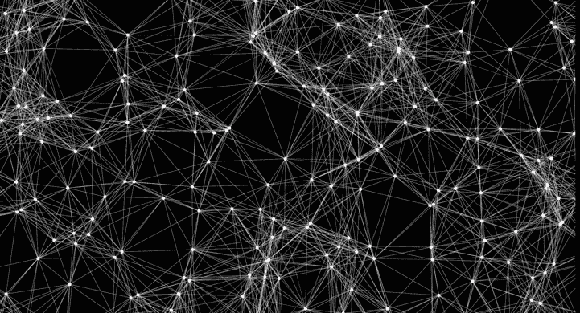
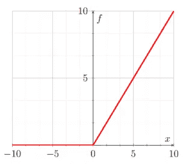

# 神经网络导论

> 原文：<https://medium.com/geekculture/introduction-to-neural-networks-4decf5e749a9?source=collection_archive---------12----------------------->

在这本笔记本中，你将学习如何创建和使用神经网络来对服装进行分类。为了实现这一点，我们将使用 TensorFlow 的一个名为 *keras* 的子模块。



克拉斯

在我们深入讨论神经网络之前，我想简要介绍一下 keras。

根据 keras 官方文件(【https://keras.io/】T2)对 keras 的描述如下。

“Keras 是一种高级神经网络 API，用 Python 编写，能够在 TensorFlow、CNTK 或 Theano 之上运行。它的开发重点是支持快速实验。

如果您需要一个深度学习库，可以使用 Keras:

*   允许简单快速的原型制作(通过用户友好性、模块化和可扩展性)。
*   支持卷积网络和递归网络，以及两者的组合。
*   在 CPU 和 GPU 上无缝运行。"

Keras 是一个非常强大的模块，允许我们避免从头开始构建神经网络。它还在有用的包、模块和方法中隐藏了大量的数学复杂性(否则我们将不得不实现)。

在本指南中，我们将使用 keras 快速开发神经网络。

# 什么是神经网络

那么，这些一直在打败象棋大师、驾驶汽车、检测癌细胞、赢得电子游戏的神奇的东西是什么呢？

深度神经网络是数据的分层表示。术语“深”是指存在多个层。回想一下，在我们的核心学习算法(如线性回归)中，数据并没有在模型中进行转换或修改，它只是存在于一个层中。我们将一些特性传递给我们的模型，做了一些数学运算，返回了一个答案。在整个过程中，数据没有改变或转换。神经网络以不同的方式处理我们的数据。它试图通过在每一层应用特定的操作来转换我们的数据，从而以不同的方式和不同的维度来表示我们的数据。另一种表达方式是，在每一层，我们的数据都被转换，以便了解更多信息。通过执行这些转换，模型可以更好地理解我们的数据，从而提供更好的预测。

# 它是如何工作的

在进入太多细节之前，我将提供一个关于神经网络如何在数学层面上工作的非常表面的解释。我讨论的所有术语和概念将在下面更详细地定义和解释。

在较低的层次上，神经网络只是初级数学运算和一些更高级的线性代数的结合。每个神经网络都由一系列数据通过的层组成。这些层由神经元组成，一层的神经元与下一层相连(见下文)。这些联系被定义为我们所说的权重(某个数值)。每一层也有一个叫偏见的东西，这只是一个额外的神经元，没有联系，只有一个数值。数据从输入层开始，并在通过后续层时进行转换。每个后续神经元的数据定义如下

你刚刚读到的等式叫做加权和。当我们通过网络传递信息时，我们将对每个神经元进行加权求和。然后我们会在这个总和上加上所谓的偏差。偏置允许我们将网络上移或下移一个恒定值。它就像一条直线的 y 轴截距。

但是这个等式并不完整！我们忘记了一个关键的部分，激活函数。这是一个函数，我们将它应用到上面看到的等式中，以增加我们网络的复杂性和维度。添加了激活函数 F(x)的新方程如下所示。

Y=(∑ni=0wixi)+b

w 代表每个神经元连接的权重

x 代表前一个值中连接的神经元的值

b 代表每层的偏差，这是一个常数

n 是连接的数量

y 是当前神经元的输出

∑代表总和

你刚刚读到的等式叫做加权和。当我们通过网络传递信息时，我们将对每个神经元进行加权求和。然后我们会在这个总和上加上所谓的偏差。偏置允许我们将网络上移或下移一个恒定值。它就像一条直线的 y 轴截距。

但是这个等式并不完整！我们忘记了一个关键的部分，**激活功能**。这是一个函数，我们将它应用到上面看到的等式中，以增加我们网络的复杂性和维度。添加了激活函数 F(x)的新方程如下所示。

> *Y=F((∑ni=0wixi)+b)*

# 破坏神经网络！

在我们深入研究任何代码之前，让我们先来分析一下神经网络是如何工作的，它能做什么。


# 数据

神经网络处理的数据类型根据所解决的问题有很大的不同。当我们建立一个神经网络时，我们定义它可以接受什么样的数据。有时可能有必要修改我们的数据集，以便它可以传递给我们的神经网络。

下面列出了神经网络使用的一些常见数据类型。

*   矢量数据(2D)
*   时间序列或序列(3D)
*   图像数据(4D)
*   视频数据(5D)

当然有许多不同的类型或数据，但这些是主要的类别。

# 层

正如我们前面提到的，每个神经网络由多层组成。在每一层都会发生不同的数据转换。我们的初始输入数据通过这些层，最终到达输出层，在那里我们将获得结果。

## 输入层

输入层是我们的初始数据被传递到的层。这是我们神经网络的第一层。

## 输出层

输出图层是我们将从中检索结果的图层。一旦数据通过所有其他层，它将到达这里。

## 隐藏层

我们神经网络中的所有其他层都被称为“隐藏层”。这是因为它们对我们来说是隐藏的，我们无法观察它们。大多数神经网络包括至少一个隐藏层，但可以有无限的数量。通常，模型越复杂，隐藏的层就越多。

## 神经元

每一层都由所谓的神经元组成。神经元有一些不同的特性，我们将在后面讨论。现在要理解的重要方面是，每个神经元负责生成/保存/传递一个数值。

这意味着在我们的输入层的情况下，我们有多少输入信息，它就有多少神经元。例如，假设我们想要传递一个 28x28 像素的图像，那就是 784 像素。我们在输入层需要 784 个神经元来捕捉每个像素。

这也意味着我们的输出层将拥有和输出信息一样多的神经元。输出有点复杂，难以理解，所以我现在就不举例子了，但希望你已经明白了。

但是我们隐藏的层呢？这些神经元的数量由我们决定。我们稍后将讨论如何选取这些值，但是要理解一个隐藏层可以有任意数量的神经元。

## 连接的层

那么所有这些层是如何连接的呢？一层中的神经元会连接到下一层中的神经元。然而，神经元可以以各种不同的方式连接。

以*图 1* 为例(见上图)。一层中的每个神经元都与下一层中的每个神经元相连。这叫做**密集的**层。还有许多其他方式来连接层，但我们会讨论这些，因为我们看到他们。

# 砝码

权重与我们神经网络中的每个连接相关联。每对连接的节点将具有一个权重，该权重表示它们之间的连接强度。这些对于神经网络的内部工作至关重要，并将随着神经网络的训练而调整。该模型将尝试确定这些权重应该是什么，以实现最佳结果。权重开始时是一个常量或随机值，随着网络看到训练数据而变化。

# 偏见

偏差是神经网络的另一个重要部分，也将随着模型的训练而调整。偏差只是与每一层相关联的恒定值。它可以被认为是一个没有联系的额外神经元。偏置的目的是将整个激活函数移动一个恒定值。当选择激活和训练网络时，这允许更多的灵活性。每一层都有一个偏差。

# 激活功能

激活函数只是一个应用于神经元加权和的函数。它们可以是我们想要的任何东西，但通常是高阶/次函数，旨在为我们的数据添加更高维度。我们想这样做是为了给我们的模型引入更多的复杂性。通过将数据转换到更高维度，我们通常可以做出更好、更复杂的预测。

下面列出了一些常见的激活功能及其图表。

*   整流线性单位



# 反向传播

反向传播是训练神经网络的基本算法。它改变了我们网络的权重和偏见。为了充分解释这个过程，我们需要从讨论一个叫做成本/损失函数的东西开始。

## 损失/成本函数

正如我们现在所知，我们的神经网络通过各层馈送信息，直到它最终到达输出层。这一层包含了我们用来确定网络预测的结果。在训练阶段，我们的网络很可能会犯很多错误和预测失误。事实上，在训练开始时，我们的网络什么都不知道(它有随机的权重和偏差)！

我们需要某种方法来评估网络是否运行良好，以及运行得有多好。对于我们的训练数据，我们有特征(输入)和标签(预期输出)，因此我们可以将网络的输出与预期输出进行比较。根据这些值之间的差异，我们可以确定我们的网络做得好还是差。如果网络做得很好，我们将对权重和偏差做一些小的改变。如果它做得不好，我们的改变可能会更激烈。

这就是成本/损失函数的作用。该功能负责确定网络的运行状况。我们将输出和预期输出传递给它，它返回给我们一些代表网络成本/损失的值。这有效地使网络工作优化这个成本函数，试图使它尽可能低。

一些常见的损失/成本函数包括。

*   均方误差
*   绝对平均误差
*   铰链损耗

## 梯度下降

梯度下降和反向传播密切相关。梯度下降是用于为我们的网络寻找最佳参数(权重和偏差)的算法，而反向传播是计算梯度下降步骤中使用的梯度的过程。

梯度下降需要一些非常高级的微积分和线性代数来理解，所以我们现在将远离它。现在让我们只阅读正式的定义。

梯度下降是一种优化算法，用于通过沿梯度负值定义的最陡下降方向迭代移动来最小化某个函数。在机器学习中，我们使用梯度下降来更新我们模型的参数。”([https://ml-cheat sheet . readthedocs . io/en/latest/gradient _ descent . html](https://ml-cheatsheet.readthedocs.io/en/latest/gradient_descent.html))

这就是我们现在真正需要知道的。我将带你去看视频，以获得更深入的解释。


# 【计算机】优化程序

您有时可能会看到术语优化器或优化功能。这只是实现上述反向传播算法的函数。下面列举几个常见的。

*   梯度下降
*   随机梯度下降
*   小批量梯度下降
*   动力
*   内斯特罗夫加速梯度

*这篇文章很好地解释了它们，这也是我列出这个清单的原因。*

([https://medium . com/@ sdoshi 579/optimizer-for-training-neural-network-59450d 71 caf 6](/@sdoshi579/optimizers-for-training-neural-network-59450d71caf6))

# 创建一个神经网络

好了，现在你已经到达了本教程的激动人心的部分！不再有数学和复杂的解释。是时候动手训练一个非常基本的神经网络了。

*如前所述，本指南基于以下 TensorFlow 教程。*[https://www.tensorflow.org/tutorials/keras/classification](https://www.tensorflow.org/tutorials/keras/classification)

```
%tensorflow_version 2.x # this line is not required unless you are in a notebook# TensorFlow and tf.kerasimport tensorflow as tffrom tensorflow import keras# Helper librariesimport numpy as npimport matplotlib.pyplot as plt
```

# 资料组

在本教程中，我们将使用 MNIST 时装数据集。这是一个包含在 keras 中的数据集。

该数据集包括 60，000 幅用于训练的图像和 10，000 幅用于验证/测试的图像。

```
fashion_mnist = keras.datasets.fashion_mnist # load dataset(train_images, train_labels), (test_images, test_labels) = fashion_mnist.load_data() # split into tetsing and training
```

让我们看看这些数据，看看我们在做什么。

```
 train_images.shape
```

所以我们有 60，000 张由 28x28 像素(总共 784 个像素)组成的图像。

```
train_images[0,23,23] # let’s have a look at one pixel
```

我们的像素值在 0 到 255 之间，0 为黑色，255 为白色。这意味着我们有一个灰度图像，因为没有颜色通道。

```
train_labels[:10] # let’s have a look at the first 10 training labels
```

我们的标签是从 0 到 9 的整数。每个整数代表一件特定的衣服。我们将创建一个标签名称数组来表示哪个是哪个。

```
class_names = [‘T-shirt/top’, ‘Trouser’, ‘Pullover’, ‘Dress’, ‘Coat’,‘Sandal’, ‘Shirt’, ‘Sneaker’, ‘Bag’, ‘Ankle boot’]
```

最后，让我们看看这些图片是什么样子的！

```
plt.figure()plt.imshow(train_images[1])plt.colorbar()plt.grid(False)plt.show() 
```

# 数据预处理

创建模型之前的最后一步是*预处理*我们的数据。这仅仅意味着在将数据输入模型之前，先对数据进行一些转换。在这种情况下，我们将简单地将所有灰度像素值(0–255)缩放到 0 到 1 之间。我们可以通过将训练集和测试集中的每个值除以 255.0 来实现这一点。我们这样做是因为较小的值将使模型更容易处理我们的值。

```
train_images = train_images / 255.0test_images = test_images / 255.0
```

# 构建模型

现在是建立模型的时候了！我们将使用带有三个不同层的 keras *序列*模型。这个模型代表一个前馈神经网络(从左到右传递值)。我们将在下面分解每一层及其架构。

```
model = keras.Sequential([keras.layers.Flatten(input_shape=(28, 28)), # input layer (1)keras.layers.Dense(128, activation=’relu’), # hidden layer (2)keras.layers.Dense(10, activation=’softmax’) # output layer (3)
```

**第 1 层:**这是我们的输入层，由 784 个神经元组成。我们使用输入形状为(28，28)的展平层来表示我们的输入应该以该形状进入。展平意味着我们的层将把 shape (28，28)数组整形为 784 个神经元的向量，这样每个像素将与一个神经元相关联。

第二层:这是我们的第一个也是唯一的隐藏层。*密集*表示该层将被完全连接，并且前一层的每个神经元连接到该层的每个神经元。它有 128 个神经元，使用整流线性单元激活功能。

**第三层:**这是我们后期输出的，也是致密层。它有 10 个神经元，我们将观察它们来决定我们的模型输出。每个神经元代表一个给定图像成为 10 个不同类别之一的可能性。激活函数 *softmax* 用于该层，以计算每个类的概率分布。这意味着该层中任何神经元的值都将在 0 和 1 之间，其中 1 表示该图像属于该类别的可能性很高。

# 编译模型

构建模型的最后一步是定义我们想要跟踪的损失函数、优化器和指标。我不会详细说明我们为什么现在选择其中的每一个。

```
model.compile(optimizer=’adam’,loss=’sparse_categorical_crossentropy’,metrics=[‘accuracy’])
```

# 训练模型

现在终于到了训练模型的时候了。因为我们已经对数据做了所有的工作，这一步就像调用一个方法一样简单。

```
model.fit(train_images, train_labels, epochs=10)  # we pass the data, labels and epochs and watch the magic!
```

# 评估模型

现在是测试/评估模型的时候了。我们可以使用 keras 的另一个内置方法很容易地做到这一点。

keras 文档将 *verbose* 参数定义为:“verbose: 0 或 1。详细模式。0 =无声，1 =进度条。([https://keras.io/models/sequential/](https://keras.io/models/sequential/))

```
test_loss, test_acc = model.evaluate(test_images, test_labels, verbose=1)print(‘Test accuracy:’, test_acc)
```

您可能会注意到，这里的精度比训练模型时要低。这种差异称为**过拟合**。

现在我们有了一个训练好的模型，可以用来预测一些值！

# 做预测

为了进行预测，我们只需要将一组数据以我们在输入层指定的形式传递给`.predict()`方法

```
predictions = model.predict(test_images)
```

这个方法为我们传递的每个图像返回一个预测数组。让我们看看对图 1 的预测。

```
predictions[0]
```

如果我们不想得到最高分的值，我们可以使用 numpy 中一个有用的函数`argmax()`。这只是从 numpy 数组中返回最大值的索引。

```
np.argmax(predictions[0])
```

我们可以通过查看相应测试标签的值来检查这是否正确。

```
test_labels[0]
```

# 验证预测

我在这里写了一个小函数，用一些简单的视觉效果来帮助我们验证预测。]

```
COLOR = 'white'plt.rcParams['text.color'] = COLORplt.rcParams['axes.labelcolor'] = COLORdef predict(model, image, correct_label):class_names = ['T-shirt/top', 'Trouser', 'Pullover', 'Dress', 'Coat','Sandal', 'Shirt', 'Sneaker', 'Bag', 'Ankle boot']prediction = model.predict(np.array([image]))predicted_class = class_names[np.argmax(prediction)]show_image(image, class_names[correct_label], predicted_class)def show_image(img, label, guess):plt.figure()plt.imshow(img, cmap=plt.cm.binary)plt.title("Excpected: " + label)plt.xlabel("Guess: " + guess)plt.colorbar()plt.grid(False)plt.show()def get_number():while True:num = input("Pick a number: ")if num.isdigit():num = int(num)if 0 <= num <= 1000:return int(num)else:print("Try again...")num = get_number()image = test_images[num]label = test_labels[num]predict(model, image, label)
```

这就是关于神经网络的基本介绍！

"基本分类:对服装图像进行分类:张量流核心."张量流，[www.tensorflow.org/tutorials/keras/classification](http://www.tensorflow.org/tutorials/keras/classification)。

“梯度下降。”梯度下降-ML 词汇文档，[www . ML-cheat sheet . readthedocs . io/en/latest/gradient _ Descent . html](http://www.ml-cheatsheet.readthedocs.io/en/latest/gradient_descent.html)。乔莱·françois.用 Python 进行深度学习。曼宁出版公司，2018。