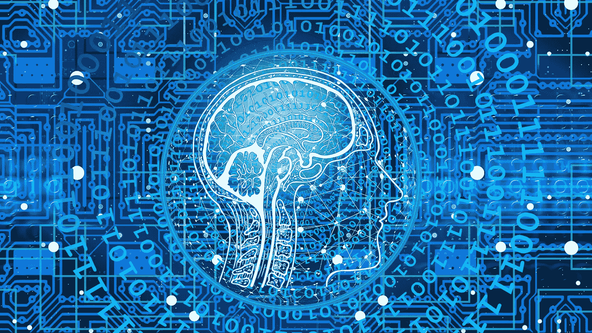
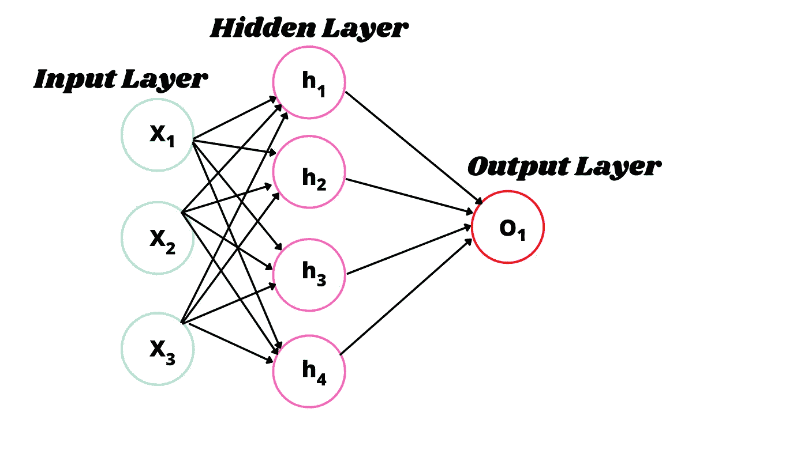
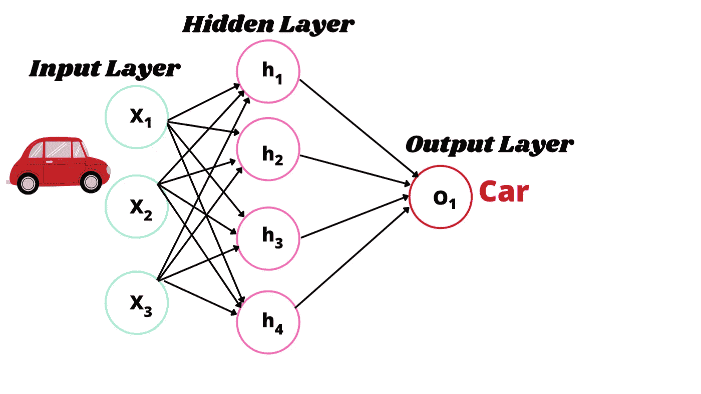

# 神经网络简介|初学者指南|

> 原文：<https://medium.com/geekculture/introduction-to-neural-networks-beginners-guide-d98a3fa7e532?source=collection_archive---------36----------------------->

# 神经网络——深度学习的核心

> 你有没有想过自动驾驶汽车，垃圾邮件检测，疾病诊断等。，工作？

—它们都是在“神经网络”的帮助下工作的。

想从事机器学习工程师、数据科学家、AI 科学家等职业的人。，应该从深度学习理念开始学习。神经网络在深度学习和机器学习项目中发挥着至关重要的作用。

Neural Network

**神经网络的先决条件:**

—有数学技能。像线性代数、统计学、概率、微积分这样的主题将有助于从头开始学习这门学科。

**神经网络的定义:**

在发送信息的神经元的帮助下，神经网络近似模拟了人脑的运作过程。

神经网络由人工神经元组成，这些人工神经元接受许多输入并产生单一输出。它由输入层、隐藏层和输出层组成，如下所示:

The architecture of Simple Neural Network

**输入层:**神经网络中的第一层。初始数据存在于其中，并处理到网络的其余部分。

**隐层:**神经网络中的第二层或中间层。这一层负责神经网络的性能和复杂性。它们可以同时执行许多功能和计算。

注意:隐藏层有时可以是多个。

**输出层:**神经网络中的最后一层。它产生给定输入的结果。

**示例:**

Example of Neural Network

**神经网络的类型:**

最重要的神经网络类型如下:

—人工神经网络

—卷积神经网络(CNN)

循环神经网络(RNN)

**人工神经网络(ANN):**

人工神经网络的行为类似于人脑，在网络的不同层中具有相互连接的神经元。它们有助于模拟非线性问题。

人工神经网络可以解决的几个问题如下:

—分类

—回归

—模式识别

—异常检测

—聚类

—机器翻译等。,

**卷积神经网络(CNN):**

卷积神经网络是一种特殊类型的人工神经网络，它期望图像作为输入。像 ANN 一样，它们也有神经元、权重和损失函数。

CNN 的应用如下:

—图像识别

—语义分段

—医学图像分析

—物体检测等。,

**递归神经网络(RNN):**

递归神经网络也是一种人工神经网络，设计用于识别序列特征中的数据点，并使用模式生成一系列中的下一个输出。

RNN 通常用于自然语言处理、语音识别、生成手写等。,

请点击本页查看相关文章:

 [## 利希塔·卡卡努鲁-培养基

### 在进行代码之前，我们需要了解 OpenCV 和 NumPy Python 库。让我们从 OpenCV 库开始…

likhithakakanuru.medium.com](https://likhithakakanuru.medium.com/)