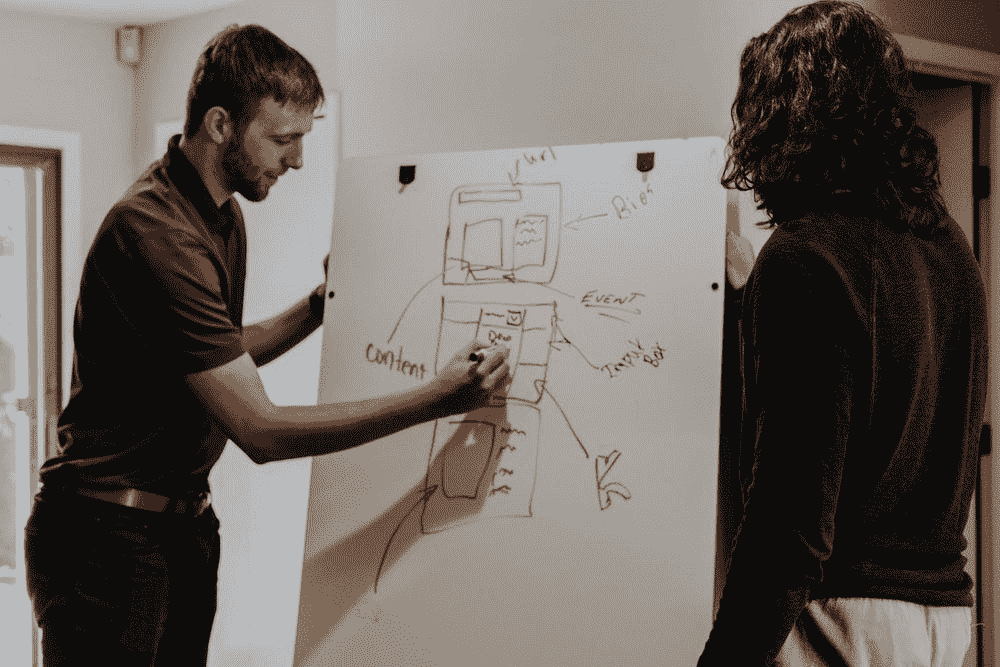
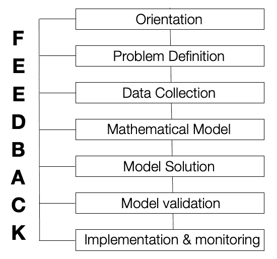

# 运筹学导论

> 原文：<https://medium.com/geekculture/introduction-to-operations-research-a5de51b09120?source=collection_archive---------28----------------------->

Source: Unsplash

## 什么是运筹学？

利用数学解决商业问题的研究。运筹学，也称为管理科学、决策科学或运营分析。运筹学是一种先进的分析方法，可以做出更好的决策。它在数据科学和机器学习等主题方面有着令人着迷的地位。此外，运筹学用于分析复杂的现实世界系统，以提高或优化性能。

## 运筹学的起源和历史。

人们认为查尔斯·巴贝奇是运筹学之父，因为他对运输成本和邮件分类的研究导致了 1840 年英国通用的便士邮政。

运筹学的起源可以追溯到几十年前，当时人们试图用科学的方法来管理组织。运筹学这个名称是在第二次世界大战早期，当时英国的一组科学家应用科学技术研究军事行动以赢得战争。它被用于部署雷达，管理车队，优先考虑轰炸任务，以及控制反潜行动。

这些科学家小组是第一批。战争结束后，人们对在军队之外应用运筹学产生了兴趣。

## 运筹学的影响。

我们每天做出的决定涉及许多因素。这些因素往往是不确定的，被迫根据我们的直觉做出决定。有了运筹学，我们可以更好地决策，也可以更有效地工作。

在世界范围内，运筹学对提高许多组织的效率产生了令人印象深刻的影响。运筹学通常应用于以下领域*(这是几个例子)*:

*   军事、国防和安全应用
*   公共交通
*   卫生保健
*   教育
*   农业和林业
*   金融、投资分析、保险和收入管理
*   能源部门
*   生物信息学
*   生产行业中的切割和包装问题
*   航空机组人员排班
*   可持续性和环境
*   材料处理和供应链管理
*   海运和物流

一些组织的列表，以及他们每年通过应用运筹学节省了多少资金。

*   DHL —优化营销资源的使用—2200 万美元
*   惠普—产品组合管理—1.8 亿美元
*   Deere& Company —供应链中的库存管理—10 亿美元
*   MISO——管理 13 个州的电力传输——7 亿美元
*   三星电子—减少制造时间和库存水平—收入增加 2 亿美元
*   FAA——管理恶劣天气下的空中交通流量——2 亿美元
*   taco Bell——在餐馆计划员工的工作时间表——1300 万美元

Source: Unsplash

# 运筹学建模方法

模型是现实生活中问题的理想化表示的抽象。建模是现实生活中的情景，有助于我们研究问题的不同行为。它忽略不相关的细节，只表示相关的细节。运筹学需要使用模型，模型是实际系统的数学表示。

> “所有的模型都是错的，但有些是有用的。”——统计学家乔治·博克斯

运筹学中解决问题的模型方法阶段；

Operations research phases

大多数学者专注于数据收集、数学模型和模型求解，记住从实践角度来看，其他步骤同样重要。对这些步骤不够重视是运筹学有时被错误地认为在现实世界中不切实际或无效的原因。

## 方向

在这个阶段，重点是问题导向。这一步的主要目标是解决问题，并确保所有团队成员都清楚相关的问题。通常，团队会召开几次会议来讨论所有涉及的问题，并在关键问题上达成一致。定位阶段的目的是清楚地了解问题以及它与系统的各种操作方面的关系，并就项目的主要焦点达成共识。此外，团队还应该对其他地方为解决相同(或类似)问题所做的工作(如果有的话)有所了解。

## 问题定义

这一阶段将程序从定向阶段进一步细化到对问题的范围和结果有明确定义的阶段。它不应该与定向阶段混淆。前一阶段是非常面向目标的，这一阶段是关于开发一个定义良好的问题陈述。

## 数据收集

随着过去两年大数据的爆炸式增长。运筹学团队现在经常发现，他们最大的数据问题不是数据太少，而是数据太多。在这种环境下，定位特别相关的数据并识别这些数据中有趣的模式会成为一项艰巨的任务。

## 数学模型

在定义了问题并收集了数据之后，下一个阶段是以一种便于分析的形式重新表述这个问题。由于建模是所有运筹学项目的一个定义特征，所以这个阶段值得很多关注。

模型或理想化的表现是日常生活不可或缺的一部分。一些例子模型飞机，肖像，地球仪，等等。数学模型也是理想化的表示，只是用数学符号和表达式来表示。商业问题的数学模型是描述问题本质的方程组和相关的数学表达式。在商业问题的数学模型中，真正的问题通常没有单一的“正确”模型。

## 模型解

运筹学的下一个阶段是开发一个基于计算机的程序，从这个模型中推导出问题的解决方案。你可能认为这一定是研究的主要部分，但实际上，这是一个相对简单的步骤。在大多数情况下，运筹学的标准算法被应用。在应用特定的技术时，有一些重要的事情要记住。即使不能保证是*最佳*解决方案，通常也足以获得*好的*解决方案。运营团队偶尔只使用**启发式程序**(即，不保证最优解的直观设计的程序)**来找到一个好的次优解**。当为一个适当的问题模型寻找最优解所需的时间或成本很大时，这是最常见的情况。

> 经济学家希尔伯特·西蒙用“令人满意”这个词来描述这个概念——一个人在寻找最优解，但当找到一个可以接受的好解决方案时，他就停下来了。

## 模型验证

这个测试和改进模型以增加其有效性的过程通常被称为**模型验证。**在此阶段，可能会发现一个在模型公式中被忽略的典型错误。结果是一个明显不切实际的解决方案，在解决它之前需要调整模型。重复这个过程，直到结果几乎肯定是符合逻辑的，并且来自有效的系统表示。

## 实现和建模

在开发了应用该模型的系统之后。运筹学研究的最后一个阶段是按照管理层的规定实施这个系统。这是一个关键的阶段，因为只有在这里，研究的益处才能被收获。运营研究团队向运营管理层详细解释了将要采用的新系统，以及它与运营现实的关系。如果模型成功实现。运筹学团队需要监控最初的经验，并设法确定将来应该进行的任何修改。

## **参考文献**

*   Hillier，F. S .和 G. J. Lieberman，*运筹学导论*，麦格劳-希尔出版公司，纽约，纽约州，1995 年。
*   塔哈，H. A .，*运筹学*，普伦蒂斯霍尔，上马鞍河，新泽西州，1997 年。