# 熊猫图书馆分步编码指南

> 原文：<https://medium.com/geekculture/introduction-to-pandas-data-wrangling-series-1-a6b1862eb2fb?source=collection_archive---------24----------------------->

Python 的熊猫库初学者入门。一个简单的循序渐进的数据科学入门综合编码指南。

> 如果你是新手，欢迎下载我的[代码文件](https://github.com/Prashantoza/Data_wrangling)，跟着文章走，以便更好的理解。

***什么是熊猫？*** *Pandas 是一个为 Python 编程语言编写的用于数据操作和数据分析的软件库，它提供了用于操作数值表和时间序列的数据结构和操作。*

> Pandas 是用于数据操作和数据分析的最强大和最快速的 DataFrame 对象。

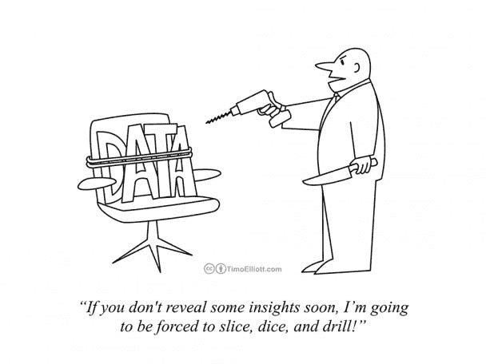

For awesome analytics cartoons— [https://timoelliott.com/blog/cartoons/more-analytics-cartoons](https://timoelliott.com/blog/cartoons/more-analytics-cartoons)

> **我们将介绍以下内容:**

1.  *概述*
2.  *导入库并加载数据集。*
3.  *访问主数据框组件。*
4.  *理解 python 中的数据类型。*
5.  *选择和操作|系列&数据框*
6.  *方法链接*
7.  *填充缺失值*
8.  *比较缺失值*
9.  *重命名行名和列名*
10.  *创建和删除列*
11.  *订购色谱柱以便更好地使用*
12.  *变换数据帧的方向*

# 一.概述

在 pandas 中有两种广泛使用的数据结构，**系列**和**数据帧**，理解系列和数据帧的每个组成部分是至关重要的。

让我们从 pandas 中基本数据结构的一个快速、非全面的概述开始。关于数据类型、索引和轴标签的基本行为适用于所有对象。

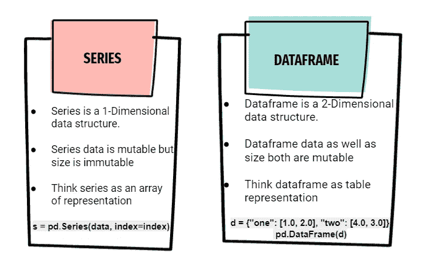

视觉上，熊猫数据帧(在 Jupyter 笔记本中)的输出显示看起来只不过是由行和列组成的普通数据表。隐藏在表面之下的是三个组件——**索引**、**列和数据**(也称为值),为了最大限度地发挥数据框架的全部潜力，您必须了解这三个组件。**分析数据帧的标记解剖:**

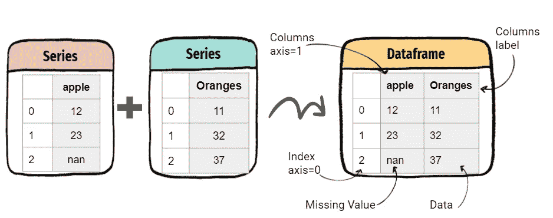

Anatomy of DataFrame

现在，让我们了解一下 python 中什么是**方法**和**属性**，了解这两者的区别有助于更好地理解基础知识。**方法**是在类中定义的**函数。一个**属性**是在**类中定义的**实例变量。**

为了简单起见，让我们以一头大象为例。

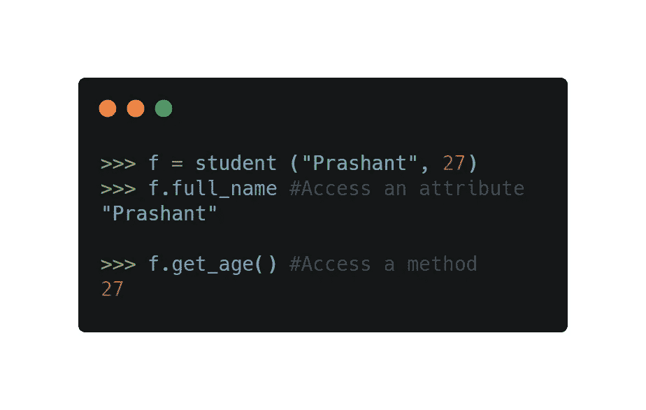

## **属性==特征**

大象有什么特点？*它有象鼻、大扇形耳朵、食草动物和象牙……等等。*

## **方法==动作**

大象有哪些方法(动作)？它可以走路、喝水、跑步、吃东西、吃草……等等。

> 在深入研究大熊猫之前，讨论这种方法对于清楚地了解基本情况至关重要。在这里，我将使用两个数据集 **Netfli** x 和 **Spotify** 。*以下练习的两个主要目标是理解* ***熊猫*** *的解剖和工作原理，以及有哪些不同的方法来接近任何数据集以更好地理解它。我从选择一个数据集并进行探索性数据分析的传统方法中转移出来，只从选择的数据集中理解业务洞察力。相反，我们将重点关注* ***熊猫*** *的工作方式，它们的* ***方法*** *和* ***属性*** *，以便将来可以在任何数据集上使用它们。因此，我将根据需要从一个数据集切换到另一个数据集。*
> 
> *另外，我将介绍* ***探索性数据分析*** *在下一个练习中，我们将看到如何使用下面的* ***方法*** *和* ***属性*** *从数据集中获得业务洞察力。*

# 二。导入库并加载数据集

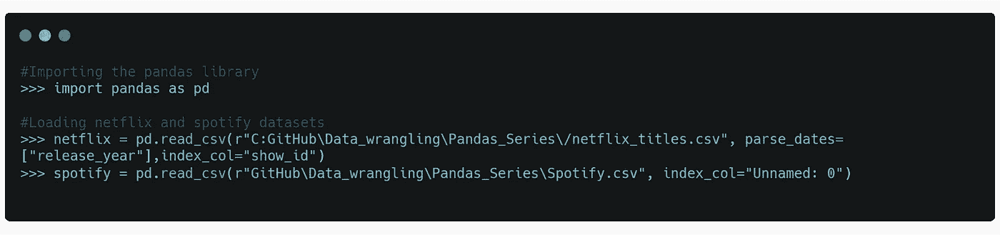

# 三。访问主数据框架组件

三个数据帧组件中的每一个——索引**、列**和数据——都可以从数据帧中直接访问。每个组件本身都是一个 Python 对象，有自己独特的**属性**和**方法**。通常情况下，您希望在单个组件上执行操作，而不是在数据帧上。

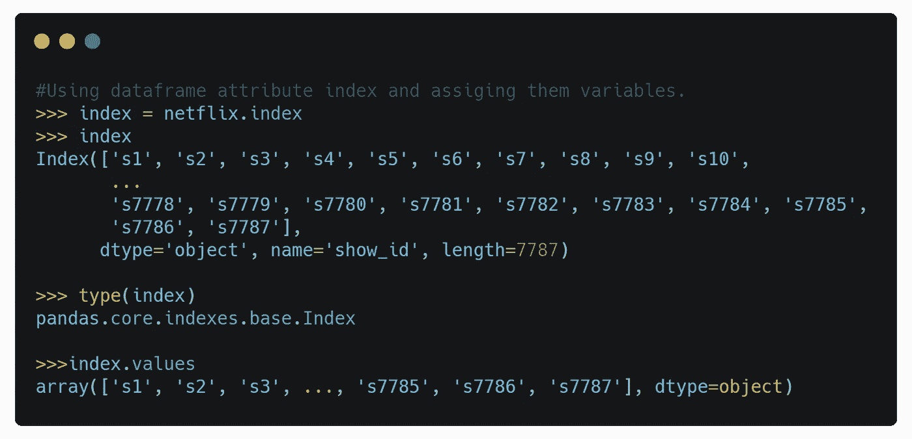

columns 属性的输出似乎只是列名的序列。*变量列和索引的对象的全限定类名为****pandas . core . indexes . base . index .***

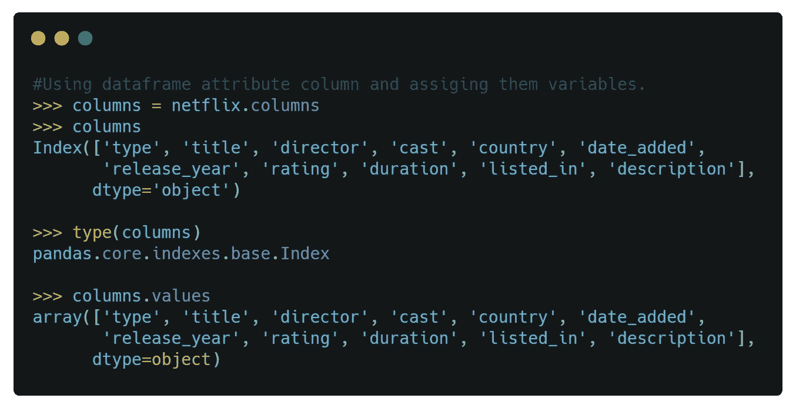

这里， **Pandas** 是包名，后面是模块名，即 **core。索引。基数**和结束于类型名称**索引**。

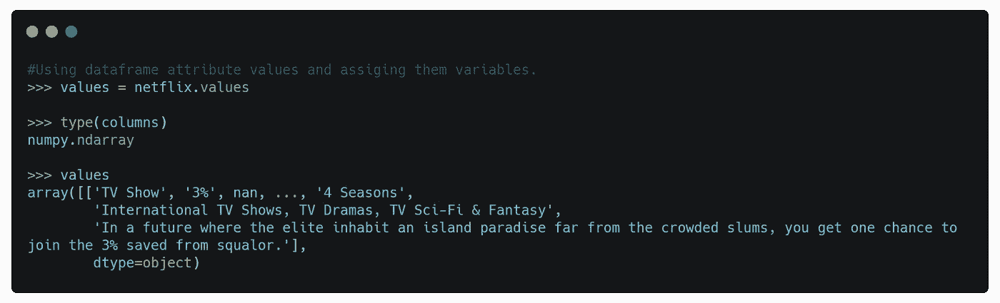

如您所见，DataFrame 属性的值返回了一个 **NumPy n 维数组**。大多数熊猫非常依赖 n 维数组。

# 四。理解 python 中的数据类型

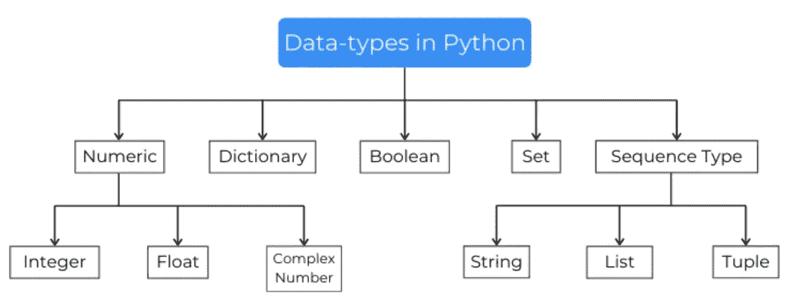

Datatypes in python

从广义上讲，数据可以分为连续数据和分类数据。连续数据总是数字，代表某种度量。另一方面，分类数据表示离散的有限值。

> *熊猫不会将数据宽泛地分为连续型或分类型。敬请访问* [***python 文档网站***](https://docs.python.org/3/library/datatypes.html) *查看其清晰精确的定义。*

# 动词 （verb 的缩写）选择和操作|系列和数据框

使用点符号将列名作为字符串传递，以选择一系列数据。或者，你也可以和**网飞【导演】**做同样的工作。有趣的是看到使用点符号的旧列(系列的名称)实际上已经成为系列的一个属性。

**>****to _ frame()**用 **to_frame** 方法可以把这个系列变成一列数据帧。此方法将使用系列名称作为新的列名称。

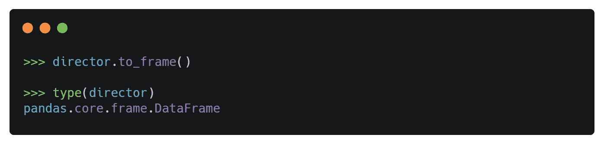

**> head( )/tail( )** 一旦我们将数据集读入一个 pandas DataFrame，我们将对数据进行概述， **head 或 tail 方法**帮助我们以表格形式获得概述。

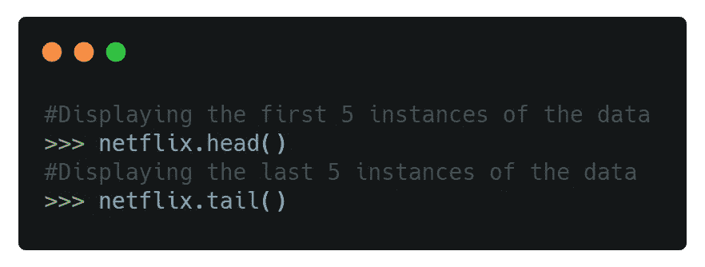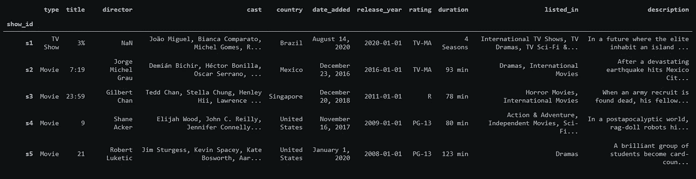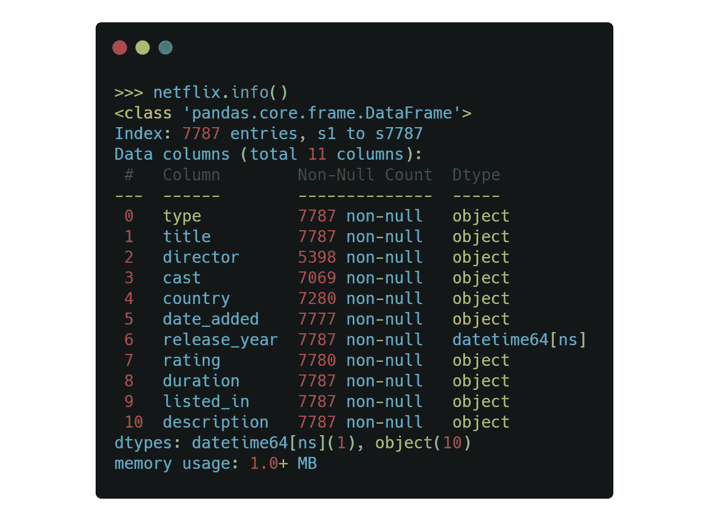

**> info( )** 这有助于我们获得数据集的简明摘要，在对数据进行探索性数据分析时，它会派上用场。

显示每一列的数据类型，在 pandas 中一列只能有一种数据类型。

**> type( )** 该方法返回作为参数传递的实参(对象)的类类型，该函数主要用于调试目的。

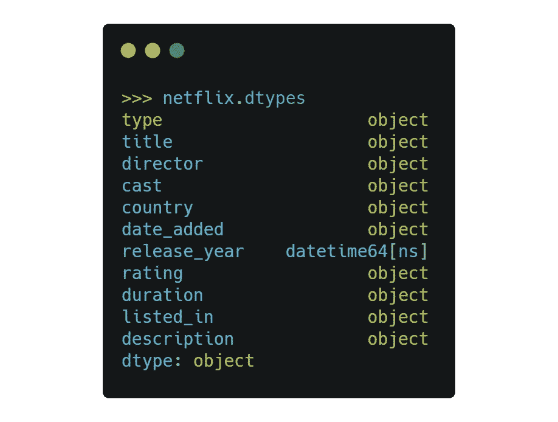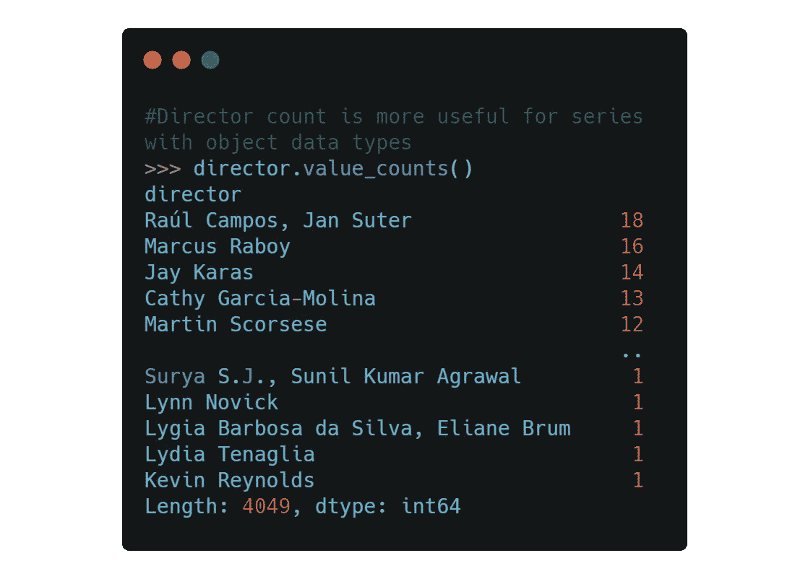

**> value_counts( )** 数列的数据类型通常决定了哪种方法最有用。例如，对象数据类型 Series 最有用的方法之一是 **value_counts** ，它计算每个唯一值的所有出现次数。

所以在这种情况下， **value_count** 对于具有对象数据类型的序列更有用，但有时它也可以提供对数字数据类型的洞察。

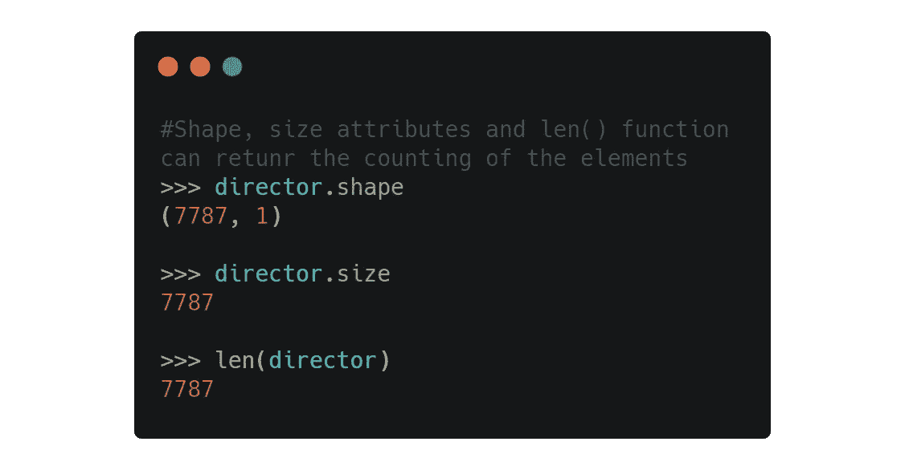

**> shape，size 和 len( )** 前两个 s **hape 和 size** 属性可以返回元素的计数，我们也可以使用 **len( )** 方法进行同样的操作。这两个函数都返回缺失值和非缺失值。

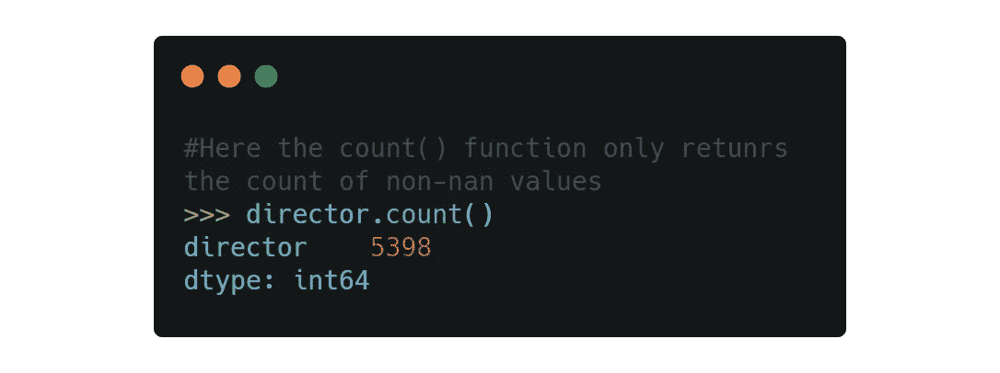

**> count( )** 这个方法只返回非 nan 值的值，或非缺失值。所以**记住**这个和上面那个不一样。

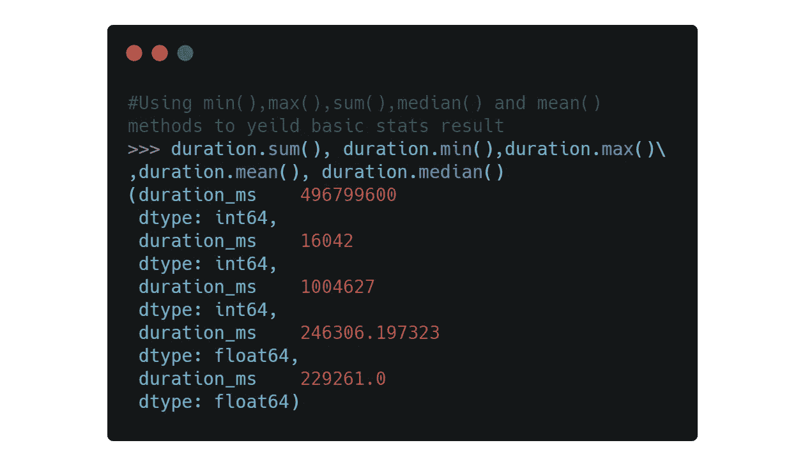

**> min()、max()、Mean()、median()、sum( )** 以上是熊猫提供的一些基本汇总统计方法。它们可以帮助您检查数据分布中的任何错误，还可以帮助您找到数据集中的任何异常数据。它们通常用于数字数据类型，但当用于对象数据类型时，会产生完全不同的输出。

**> describe( )** 这个专用的 stats 方法有助于一次性计算带有一些分位数的数据集的汇总统计数据，它返回一个序列。

**> quantile( )** 这个方法用来计算数值型数据的分位数，我们可以像 *([0.1，0.2，. 03，. 04，.05])来研究数据的分布。*当传递单个值时，它返回标量值。

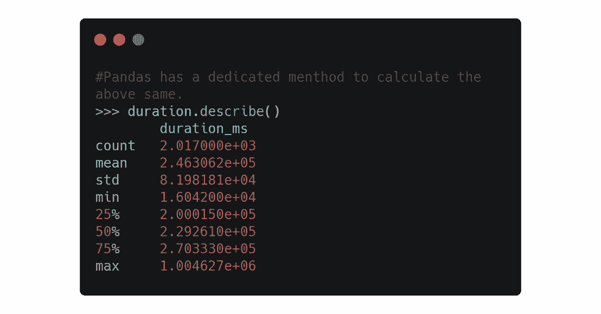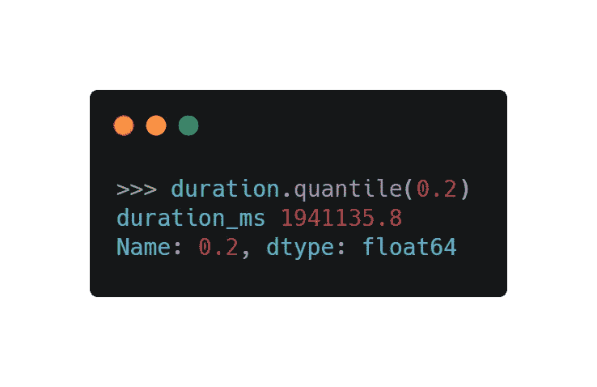

# **六。方法链接**

**方法链接**，也称为**命名参数习语**，是面向对象编程语言中调用多个方法调用的常用语法。在 Python 中，每个变量都是一个对象，所有对象都有引用或返回更多对象的属性和方法。

每个方法返回一个对象，允许在单个语句中使用点标记将调用链接在一起，而不需要变量来存储中间结果。这种方法有助于开发人员避免命名变量和记住变量的认知负担。

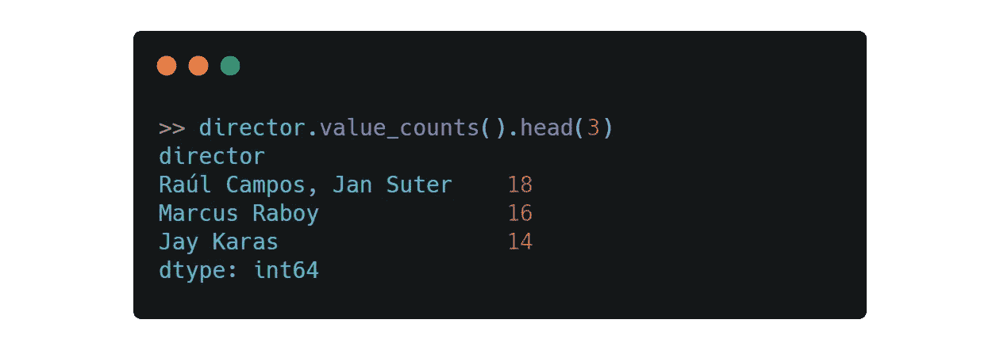

添加到链中最常见的方法之一是 head 方法。这抑制了长输出。对于较短的链，没有必要将每个方法放在不同的行上。

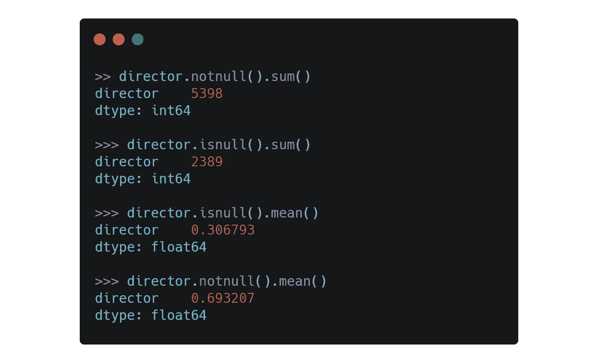

除了调用 **notnull()** 或 **isnull()** 方法并获得布尔值作为回报，我们还可以对结果求和以提供对数据的洞察，我们还可以要求 **mean()、median()、count()** 等值作为回报，以便更好地解释和理解数据。

# 七。填充缺失值

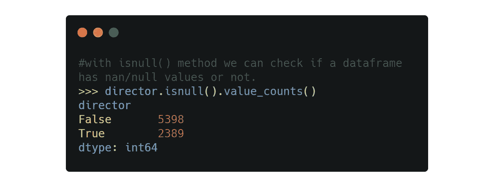

**>是 null()。如果数据中缺少值，value_counts() count( )** 方法返回一个小于元素总数的值。 **isnull( )** 方法帮助查找每个值是否缺失，

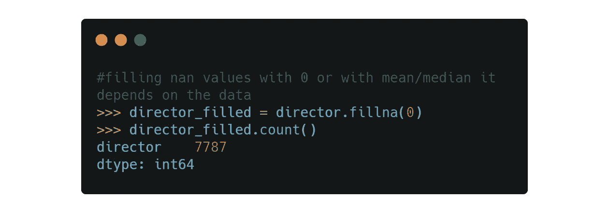

**>菲尔娜()。count()** 可以用 fillna 方法替换一个序列中所有缺失的值。

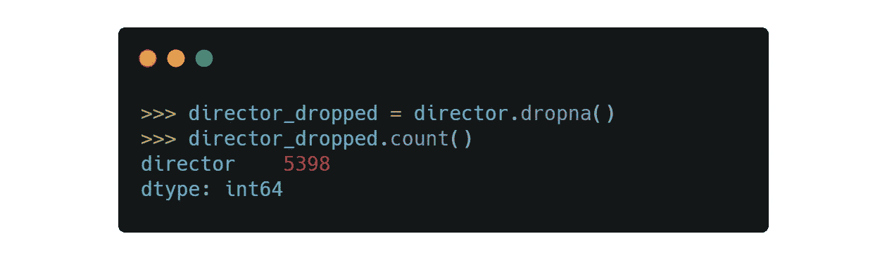

**> dropna()。count()** 在某些情况下，特定列中缺失值的数量更多，因此我们可以删除该列。

# 八。比较缺失值

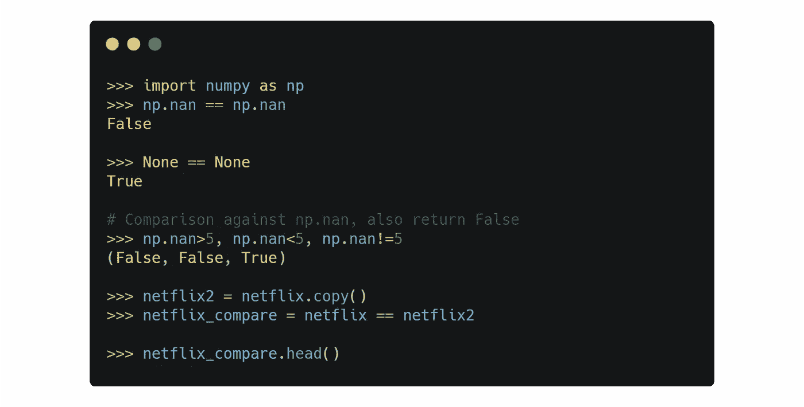

在这里，我想讨论一下 python 的一个不寻常的对象，即 **Numpy NaN(np。**对象楠)。Panadas 用这个来表示一个缺失值。

甚至 python 的 None 对象在与自身比较时也被评估为 **True**

> 更确切地说，它不等于自身，任何其他与 np.nan 的比较也返回 False。

上面我使用 **copy()** 方法创建了一个**网飞**数据集的副本，然后将其与**网飞**原始数据集进行比较，您可以在下面看到结果。这正如预期的那样工作，但是当您试图比较缺少值的数据帧时，就会出现问题。在 director 列中，第一个实例为 false，因为它是 nan 值。**出现此问题是因为 nan 不等于 nan。**

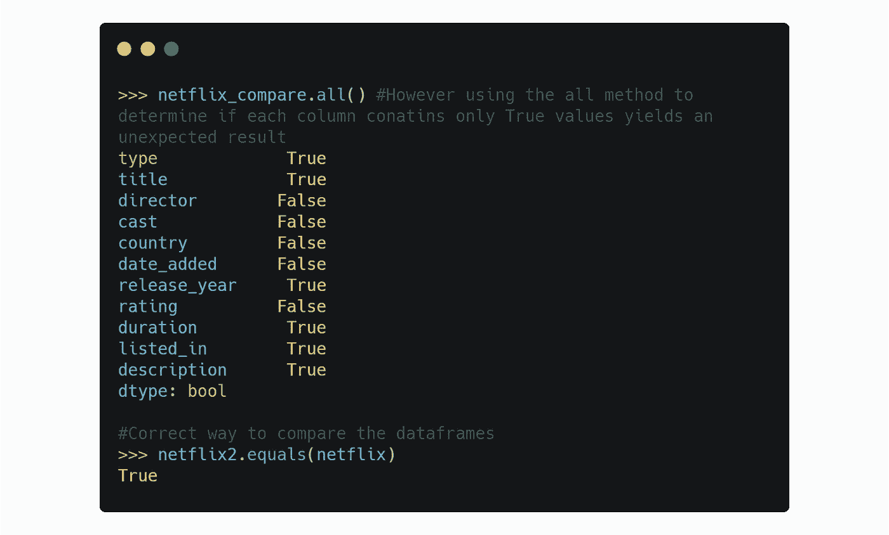

要解决上述问题，比较两个完整数据帧的正确方法不是使用 equals 运算符，而是使用 equals 方法，如左图所示。

# 九。重命名行和列名

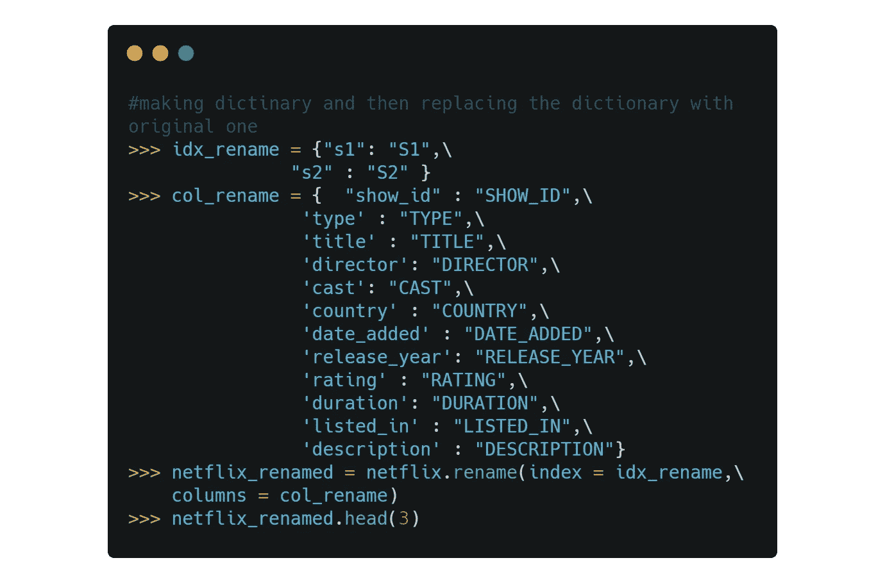

对数据帧最基本和最常见的操作之一是重命名行或列名。好的列名有助于我们更好地与它包含的数据联系起来。

我在这里展示的只是将小写字母改为大写字母，但是您可以很好地更改列的名称。

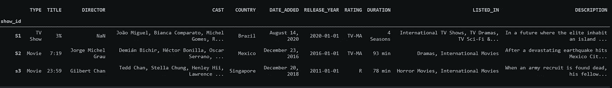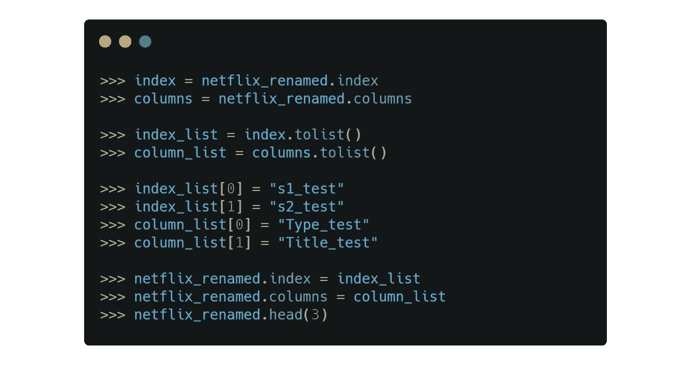

重命名行标签和列标签有多种方法。可以将行和列的值存储在列表中，然后将索引和列属性直接重新分配给 Python 列表。当列表中的元素数量与行标签和列标签的数量相同时，这种赋值方式有效。下面的代码在每个 Index 对象上使用 **tolist()** 方法来创建一个 Python 标签列表。然后修改列表中的几个值，并将列表重新分配给属性的索引和列。

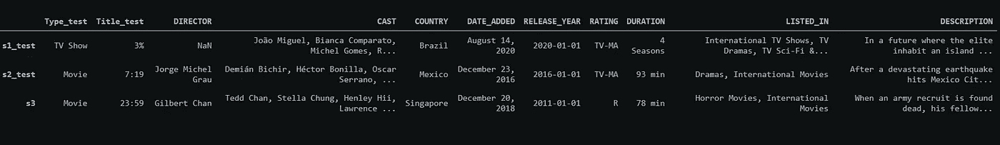

# X.创建和删除列

在数据分析期间，极有可能需要创建新的列来表示新的变量。通常，这些新列将从数据集中以前的列中创建。创建新列最简单的方法是给它分配一个标量值。将新列的名称作为字符串放入索引操作符中。

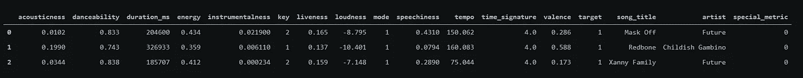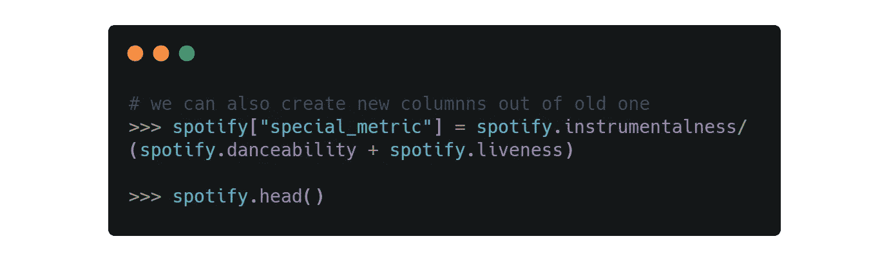

几个列包含歌曲的数字数据，这是某种测量值。我们还可以通过添加几个现有列并将它们与一个现有列分开来创建一个新列，这种方法可以帮助您对数据集进行特征工程设计，从而消除多个列并只关注几个新列。

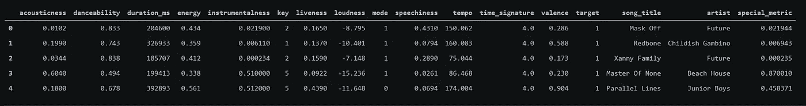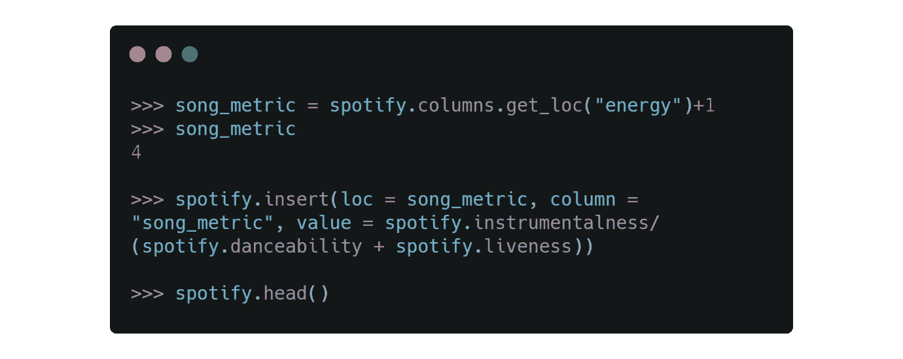

在 DataFrame 中，使用 insert 方法，可以在特定位置插入新列，而不仅仅是在末尾。insert 方法将新列的整数位置作为第一个参数，新列的名称作为第二个参数，值作为第三个参数。您将需要使用 **get_loc 索引方法**来查找列名的整数位置。**插入方法就地修改调用数据帧，所以不会有赋值语句。**

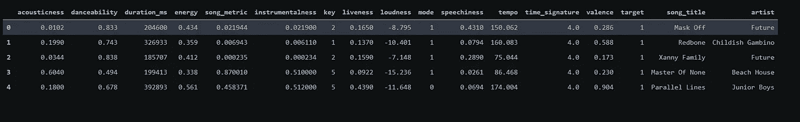

# XI。订购色谱柱以便更好地使用

我们获得了数据的第一个视图，其中 head 方法只显示了 3 个数据实例。

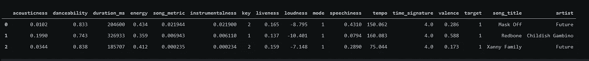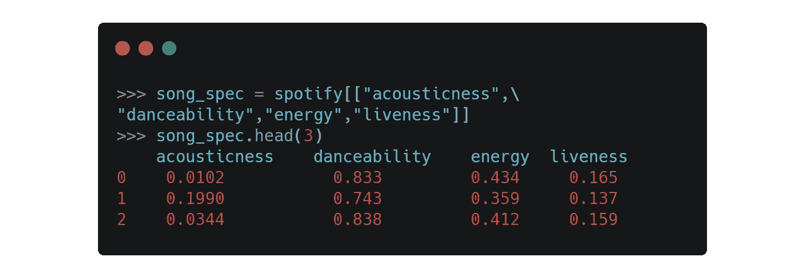

这里，我们通过从数据集和索引操作符的列表中选择多个列来创建一个新的数据帧。存在需要选择数据帧的一列的情况。**这是通过将单个元素列表传递给索引操作符来完成的。**

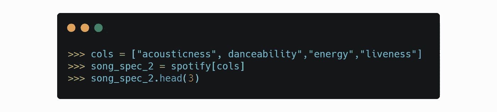

在索引操作符中传递长列表可能会导致可读性问题。为此，您可以先将所有列名保存到一个列表中。

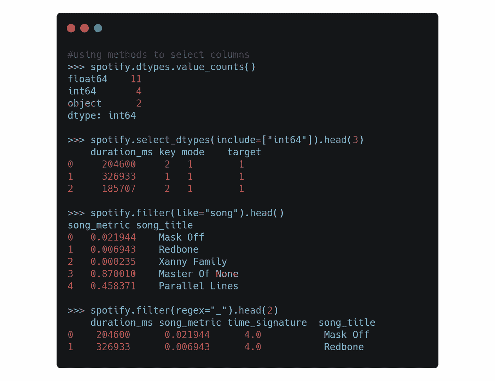

在这里，在左边，我们使用 **dtype.value_count()** 方法链接技术对不是数据类型基础的列进行分组。

上面我们已经看到，可以通过向数据集传递一个字符串来选择列，但是您也可以使用数据类型选择和创建一个新的 dataframe。选择列的另一种方法是使用 filter 方法。这种方法很灵活，可以根据使用的参数搜索列名(或索引标签)。这里，我们使用 like 参数来搜索包含精确字符串 song 的所有列名

filter 方法允许通过带有 **regex** 参数的正则表达式来搜索列。在这里，我们搜索名称中有“_”的所有列。

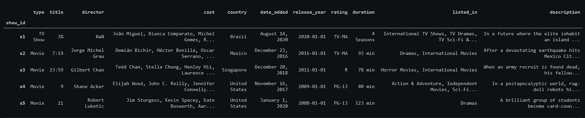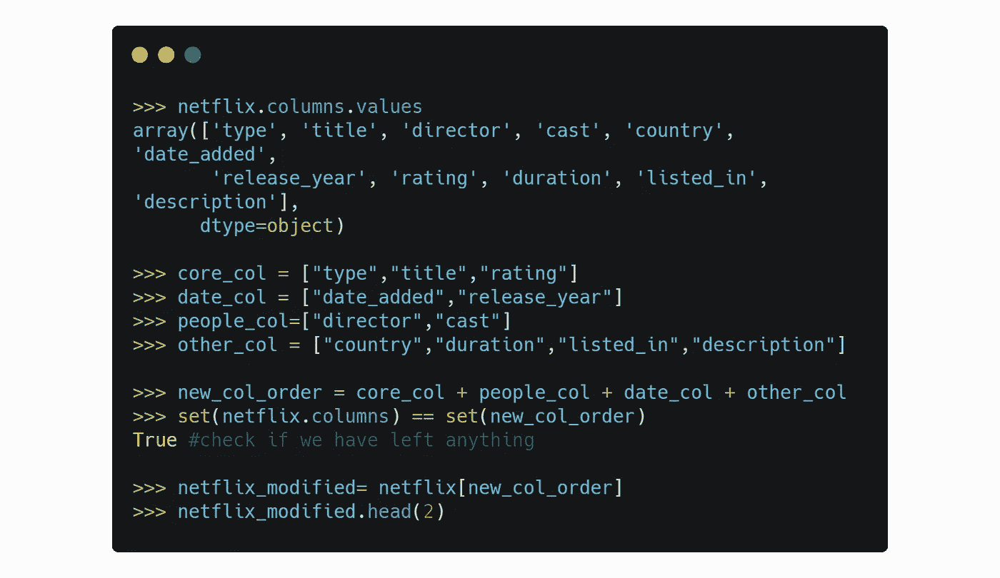

这些列似乎没有任何逻辑顺序。通过合理地组织名称，我们可以更好地理解数据。为此，我创建了以字符串形式存储列名的新变量，并将列分成 4 部分，并相应地创建了新列。

将所有列表连接在一起以获得最终的列顺序。

此外，确保该列表包含原始列表中的所有列，然后将具有新列顺序的列表传递给数据帧的索引操作符，以对列进行重新排序。

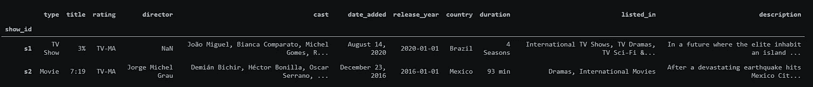

# 十二。变换数据帧的方向

许多 DataFrame 方法都有一个轴参数。这个重要的参数控制操作发生的方向。轴参数只能是 0 或 1 这两个值中的一个，并分别作为字符串的索引和列的别名。

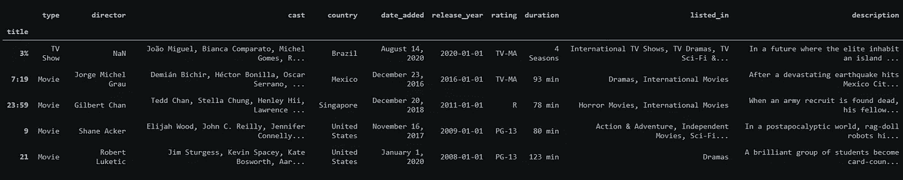

将 axis 参数更改为 1/columns 会调换操作，以便每一行数据都有一个非缺失值的计数，记住这个技巧有助于输出更多关于数据的信息。

你好，我期待着你的评论和建议。
善意的鼓掌，订阅，分享。

> **这是我即将推出的 DataWrangling 系列的第一篇帖子，敬请期待。**

