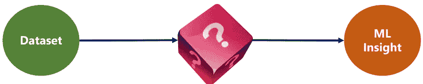
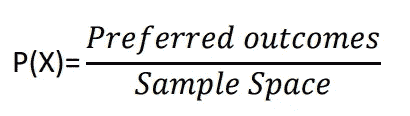
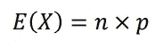
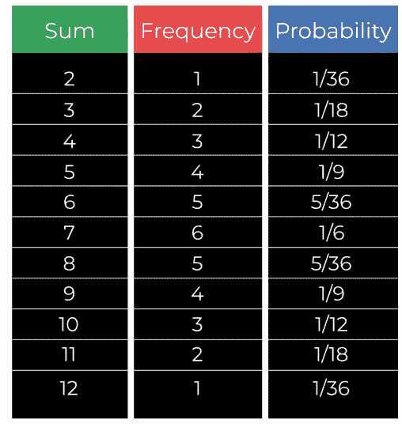

# 数据科学的概率介绍

> 原文：<https://medium.com/geekculture/introduction-to-probability-for-data-science-3d2bdfd6ecb4?source=collection_archive---------19----------------------->

欢迎词

**你在这里是因为**你想在进入统计和机器学习的世界之前理解概率的基础知识。了解关键统计特征背后的驱动力对于实现掌握数据科学的目标至关重要。通过这种方式，你将能够在通过有监督的机器学习方法(如回归)分析数据时提取重要的见解，而且还能够理解无监督或辅助的 ML 给你的输出。

**贝叶斯推理**是在许多数学领域大量使用的关键组件，用于简洁地表达复杂的陈述。通过贝叶斯符号，我们可以传达元素、集合和事件之间的关系。理解这些新概念将有助于你理解复杂数据分析方法背后的数学直觉。

**分布**是我们对数据集进行分类的主要方式。如果数据集符合某些特征，我们通常可以将其值的可能性归因于特定的分布。因为，许多这些分布在某些结果和它们发生的概率之间有着优雅的关系，知道我们数据的关键特征是极其方便和有用的。

# **什么是概率？**

概率是事件发生的可能性。这个项目几乎可以是任何事情——获得人头，滚动 4 磅，甚至卧推 225 磅。我们用 0 到 1 之间的数值来衡量概率，因为我们喜欢比较事件的相对可能性。观察一般概率公式:—

*概率公式:——*

1.  事件 X 发生的概率等于样本空间中优选结果的*数量*除以结果的*数量*。
2.  首选结果是我们希望发生的结果或我们感兴趣的结果。我们也称这种结果为*【有利】*。
3.  *样本空间*指所有可能发生的结果。是*【大小】*表示里面的元素数量。

*如果两个事件是独立的:——*

它们同时发生的概率等于它们各自发生的乘积。

P(A B) = P(A) * P(B)

# **预期值**

*试验—* 观察事件发生并记录结果。

*实验—* 一个或多个试验的集合。

*实验概率—* 根据我们进行的实验，我们分配事件的概率。

*预期值—* 我们运行实验时预期会出现的特定结果。

尝试的例子——抛硬币并记录结果。

实验示例——投掷硬币 20 次，记录 20 个单独的结果。

在这种情况下，得到人头的实验概率等于我们在 20 个结果过程中记录的人头数，超过 20(试验总数)。

根据我们感兴趣的事件类型，*期望值*可以是数字、布尔、分类或其他。例如，试验的期望值是两个结果中更有可能的一个，而试验的期望值是我们期望在 20 次试验后得到正面或反面的次数。

*分类*变量的期望值:—

*数字*变量的预期值:—

# **概率频率分布**

Probability Frequency Distribution for two 6-sided dice.

*什么是概率频率分布？:*一个事件每个可能结果的概率集合。

*为什么我们需要频率分布？:*当期望值无法达到时，尝试预测未来事件。

*什么是频率？:*给定值或结果在样本空间中出现的次数。

*什么是频率分布表？:*将样本空间中的每个不同结果与其相关频率进行匹配的表格。

我们如何从频率分布表中获得概率频率分布？:将每个频率除以样本空间的大小。(想想“优于一切”的公式。)

# **补码**

一个事件的补语是**一切**一个事件是**不是**。我们用撇号(')来表示事件的补语。

*补语的特点:——*

1.  永远不会同时发生。
2.  加起来就是样本空间。 **(A + A' =样本空间)**
3.  他们的概率加起来是 1。 **(P(A) + P(A') = 1)**
4.  补码的补码是原事件。 **((A')' = A)** 。

*示例:——*

假设，事件 A 代表抽黑桃，那么 P(A) = 13/52 = 0.25。

然后，A '代表 ***而不是*** 抽黑桃，所以抽梅花、方块或红桃。P(A') = 1 — P(A)，所以 P(A') = 0.75。