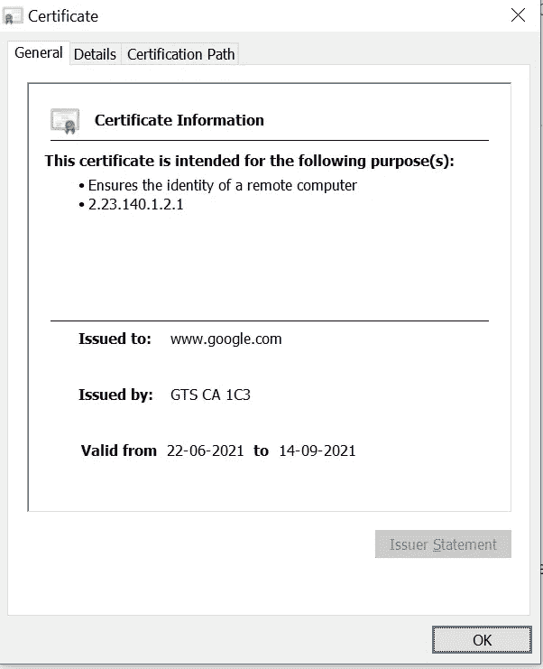
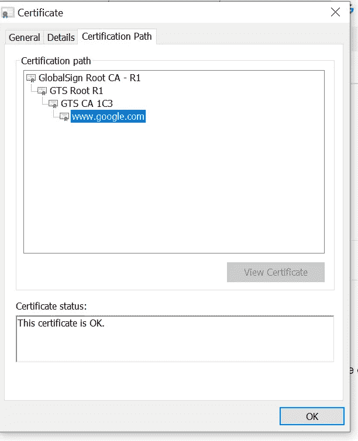
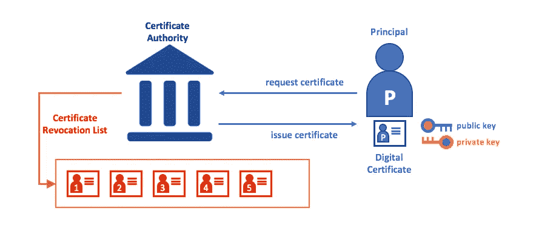
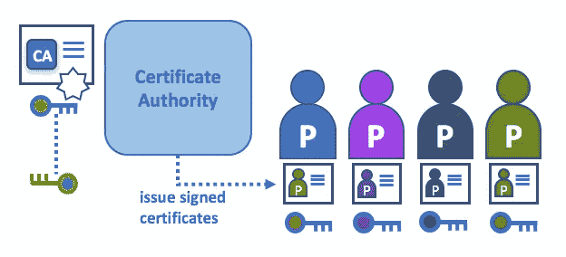
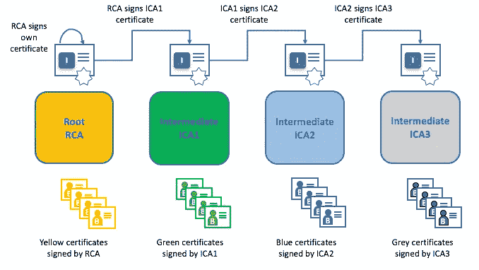

# 公钥基础设施(PKI)简介

> 原文：<https://medium.com/geekculture/introduction-to-public-key-infrastructure-pki-32286018cc59?source=collection_archive---------10----------------------->

Encryption

# 简介:

在本文中，我们将了解公钥基础设施(PKI)是如何工作的。

# 观众

软件工程师、安全工程师、开发人员、系统管理员、开发人员。

# 什么是 PKI？？

公钥基础设施(PKI)是在不安全的公共网络中提供安全通信的互联网技术的集合。是 PKI 将**的**放在了**的**——如果你正在网络浏览器上阅读这个文档，你可能正在使用 PKI 来确保它来自一个经过验证的来源。

PKI 有助于确定人员、设备和服务的身份，实现对系统和资源的受控访问、数据保护和交易责任。

# 公钥基础设施的组成部分

## **x.509 数字证书:**

*   PKI 因为数字证书而发挥作用。数字证书就像驾照一样，是网站和组织的一种电子身份证明形式。两台通信机器之间的安全连接是通过 PKI 实现的，因为双方的身份可以通过证书来验证。

SSL Certificate (Format x.509)

> 这里，我使用 SSL 证书，它使用 x.509 证书格式。x.509 是通用证书格式。

证书生命周期:

1.  ***证书注册*** :实体向认证机构(CA)提交证书请求。一个实体可以是一个人，一个设备，甚至是几行代码。
2.  ***证书颁发****:*CA 需要验证申请人的身份，这通常是通过凭证或者通过信任另一个已经验证了申请人的 CA 来完成的。
3.  ***证书验证*** *:* 每次使用证书进行身份验证时，服务器都会向 CA 进行检查，确认证书仍然有效，没有过期或被吊销。
4.  ***证书撤销*** *:* 证书包含一个在首次颁发时指定的到期日期。当到达该日期时，CA 自动将该证书添加到证书撤销列表(CRL)中，这是一种黑名单，指示服务器不要验证这些证书。
5.  ***证书更新*** : CA 具有在到期日更新证书的设置，尽管通常它们会重新验证身份。

## **公钥和私钥:**

*   ***公钥*** 是一种可以向公众分发的加密密钥，不需要安全存储。用公钥加密的消息只能用相应的私钥解密。
*   ***私钥*** 被接收者用来解密用公钥加密的消息。因为消息是用给定的公钥加密的，所以只能用匹配的私钥解密。

## **证书颁发机构和信任链:**

*   数字身份具有符合 X.509 标准并由证书颁发机构(CA)颁发的加密验证数字证书的形式。
*   信任链指的是证书及其如何链接回可信的**证书颁发机构**。要使 SSL 证书可信，它必须能够追溯到签署它的可信根，这意味着证书链中的所有证书——服务器、中间证书和根证书——都需要得到正确的信任。

*   在上图中，我们可以看到**google.com**是我们连接的服务器。 **GTS-CA 1C3** 是一个中间 CA。 **GTS 根 R1** 为中间型 CA。**全球标志根 CA- R1** 顶级根 CA。这样就可以建立起信任链。

信任链有 3 个部分:

*   **根证书** —根证书是属于发行证书机构的数字证书。它在大多数浏览器中都是预先下载的，存储在所谓的“信任存储”中根证书由证书颁发机构严密保护。例如，上图显示 **GlobalSign 根 CA- R1** 是根 CA。
*   **中级证书**——中级证书像树枝一样从根证书中分叉出来。它们充当受保护的根证书和向公众发布的服务器证书之间的中间人。一个证书链中至少会有一个中间证书，但也可以有多个。例如，上图显示 **GTS-CA 1C3** 和**GTS-鲁特 R1** 为中间 CA。
*   **服务器证书** —服务器证书是颁发给特定域的证书。例如，上图显示服务器证书是发给**google.com**的。
*   ca 是互联网安全协议的常见组成部分，您可能听说过一些更流行的 ca:Symantec(最初是 Verisign)和 Digicert。

# PKI 使用什么类型的加密？

*   PKI 合并了不对称和对称加密的使用。对称和非对称加密都有自己的优势和最佳使用场景，这就是为什么两者的结合在公钥基础设施中如此强大。
*   ***对称加密:*** 对称加密保护在双方初始交换数字握手时生成的单个私钥。这个密钥必须从一方传递到所有相关方，以便对交换的信息进行加密和解密。这个密钥可以是密码的形式，也可以是一系列随机数字或字母。
*   ***非对称加密:*** 非对称加密使用两个密钥，一个公钥，一个私钥。公钥加密，私钥解密。也称为“公钥加密”

# PKI 如何与 SSL 一起工作？

1.  首先，当客户端(浏览器)应用户请求访问 web 服务器时，客户端向服务器发送其支持和兼容的 SSL/TLS 版本，以启动连接。

2.作为回报，web 服务器检查密码套件以及 SSL/TLS 版本，并将其公共证书发送给客户端。

3.收到证书文件后，客户端(浏览器)会对其进行身份验证。如果发现证书有效，浏览器通过用 SSL/TLS 证书的公钥加密“预主密钥/密钥”来启动私钥验证过程。

4.作为回报，web 服务器用它的私钥解密预主密钥。

5.现在，客户端和服务器都从客户端随机密钥、服务器随机密钥和预主密钥生成会话密钥。两者生成的会话密钥必须相同。

6.客户端发送用会话密钥加密的“完成”消息。

7.服务器发送用会话密钥加密的“完成”消息。

一旦完成了上述所有步骤，SSL/TLS 握手过程也就完成了，客户端和浏览器之间的安全连接就建立了。

> 这是 TLS 1.2 握手的图示。在 TLS 1.3 中，验证身份所需的步骤较少。

# PKI 如何与 SSH 一起工作？

设置公钥认证(用于 SSH)需要以下简单步骤:

1.  创建密钥对(通常由用户创建)。这通常是用 ssh-keygen 完成的。
2.  私钥留在用户那里(并且只在那里)，而公钥被发送到服务器。
3.  服务器存储公钥(并将其“标记”为**授权**)。
4.  服务器现在将允许任何能够证明他们拥有相应私钥的人访问。
5.  举例。对于无密码认证，我们使用 ssh-keygen 创建公钥和私钥，并将公钥复制到 GitHub 或 GitLab。下一次，每当用户试图推送或拉取代码时，Github 会基于公钥和私钥对用户进行身份验证。

# 公匙基建在区块链如何运作？？

*   密码学使得区块链更加健壮，从其他技术中脱颖而出。使用高级数学原理方法传输和存储数据的加密技术，其存储方式只有数据的目标用户才能读取和处理。
*   公钥加密是比特币协议的重要组成部分，在多个地方被用于确保协议中创建的消息的完整性。钱包创建和交易签名是任何货币的核心组成部分，在很大程度上依赖于公钥加密。
*   比特币的协议使用所谓的椭圆曲线数字签名算法(ECDSA)来创建一组新的私钥和相应的公钥。公钥然后与哈希函数一起使用，创建比特币用户用来发送和接收资金的公共地址。私钥是保密的，用于签署数字交易，以确保交易的来源是合法的。

# PKI 如何在 Hyperledger Fabric 区块链中工作？？

*   公钥基础设施由向各方(例如，服务的用户、服务提供商)颁发数字证书的认证机构组成，然后各方使用数字证书在其环境中交换的消息中认证自己。

Source: Hyperledger Fabric Web

## 证书颁发机构

一个节点可以通过系统信任的权威机构为其颁发的**数字身份**加入区块链网络。

CA

在区块链的场景中，每个希望与网络互动的演员都需要一个身份。正是 CA 提供了可验证的数字身份。

## 根 ca、中间 ca 和信任链

*   CAs 分为两种:**根 CAs** 和**中间 CAs** 。因为根 ca(赛门铁克、Geotrust 等)必须**安全地向互联网用户分发**数亿份证书。
*   这些中间 CA 拥有由根 CA 或另一个中间机构颁发的证书，允许为链中任何 CA 颁发的任何证书建立一个**“信任链】**。
*   这种追溯到根 CA 的能力不仅允许 CA 的功能扩展，同时仍然提供安全性—允许使用证书的组织放心地使用中间 CA—它还限制了根 CA 的暴露，如果暴露，将危及整个信任链。另一方面，如果一个中间 CA 受到损害，那么暴露程度会小得多。

Chain of trust

> 图片来源:Hyperledger fabric 官方文档。

*   当涉及到跨多个组织颁发证书时，中间 ca 提供了巨大的灵活性，这在许可的区块链系统中非常有用。

> 在根 CA 和一组中间 CA 之间建立信任链，只要这些中间 CA 的证书的发行 CA 是根 CA 本身或者具有到根 CA 的信任链。

# 摘要

我们已经看到了 PKI 基础设施是如何工作的。PKI 在区块链技术中的应用。