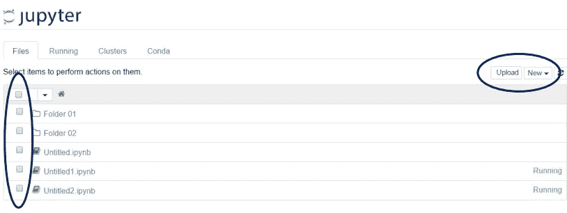
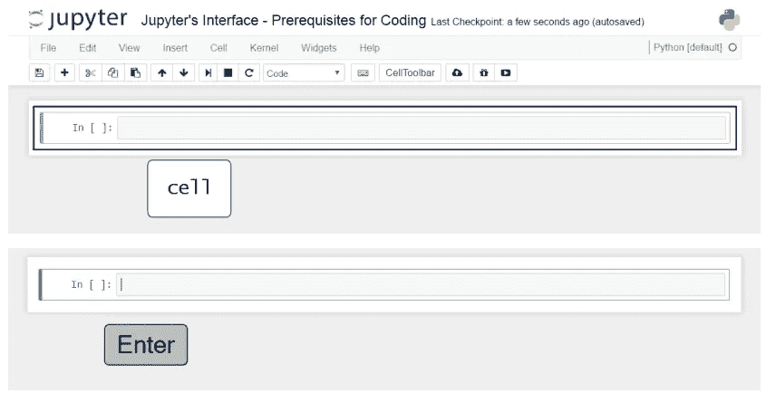
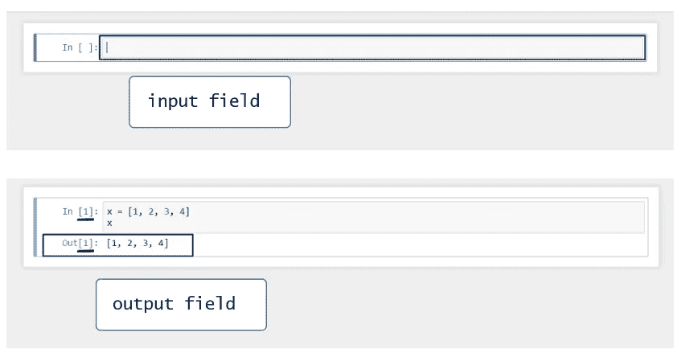
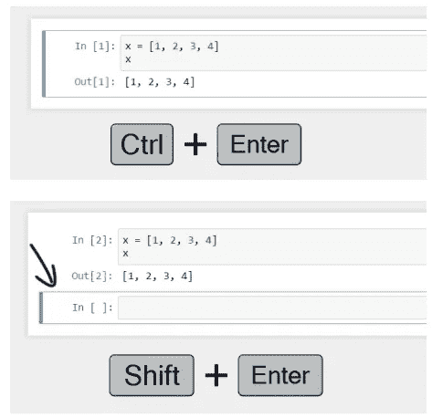
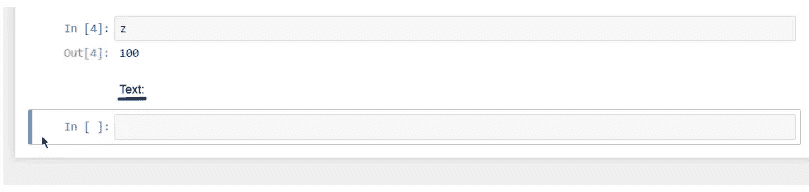

# Python 简介

> 原文：<https://medium.com/geekculture/introduction-to-python-a66fac393bed?source=collection_archive---------27----------------------->

# 编程说明

计算机只能识别 1 和 0。为了与计算机交流现实生活中的问题，你需要创建一种特定类型的文本，称为**源代码**或**人类可读代码**，软件可以在 1 和 0 内读取并处理给计算机。

*   *程序—* 指定如何执行计算的一系列指令。
*   *编程—* 接受一项任务，用计算机可以理解和执行的编程语言写下来。

Python 是一种开源、通用的高级编程语言。

*   *开源软件(OSS)——*开源意味着它是免费的。Python 拥有一个庞大而活跃的科学社区，可以访问该软件的源代码，并根据用户的需求为其持续开发和升级做出贡献。
*   *通用—*Python 可以应用的领域非常广泛；web 编程，金融数据分析，大数据分析等等。
*   *高级—* 高级语言使用更接近人类逻辑的语法，这使得语言更容易学习和实现。

Python 的流行基于两个主要支柱。一是它是一种易于学习的编程语言，可读性很强，语法非常清晰直观。第二个原因是它的用户友好性并没有削弱它的优势。Python 可以执行各种复杂的计算，是专家们首选的最强大的编程语言之一。

# 为什么是朱庇特

Jupyter Notebook 应用程序是一个服务器-客户端应用程序，允许您通过 web 浏览器编辑代码。

**语言内核**是设计用来读取和执行特定编程语言代码的程序，如 Python、R 或 Julia。Jupyter 安装总是附带一个已安装的 Python 内核，其他内核可以另外安装。

可以编写代码的**接口**代表客户端。这种客户端的一个例子是*网络浏览器。*

Jupyter 服务器提供了一个客户端匹配相应的*语言内核的环境。*在我们的例子中，我们将把重点放在作为客户端的 *Python、*和 *web 浏览器*上。

## JUPYTER 的界面——仪表板

你一加载笔记本，Jupyter 仪表盘就会打开。每个文件和目录旁边都有一个复选框。通过勾选和取消勾选一个项目，您可以操作相应的对象，这意味着您可以复制或关闭正在运行的文件。

通过右上角的*上传*按钮，您可以将笔记本上传到您所在的目录。你可以展开*新增*按钮。从列表中，您很可能需要创建一个新的文本文件、一个新的文件夹或一个新的笔记本文件。

您可以通过按“Return/Enter”来访问单元格。完成后，您将能够看到光标，因此您可以开始键入代码。

您可以用两种方式执行命令:—

*   第一种是按住 Ctrl/CMD，然后按 Enter/Return。通过这样做，机器将执行单元格中的代码，而您将“停留”在那里，这意味着我没有创建或选择另一个单元格。
*   第二个选项允许更流畅的代码编写。要执行相同的代码，按住“Shift”然后按“Enter/Return”。正在执行前两个命令，然后创建一个可以编写代码的新单元。

如果您使用“Shift”和“Enter/Return”，您可以轻松地继续键入代码。

一个**减价单元格**是一个严格包含文档的单元格——文本不是作为代码执行的。它将包含一些你想留给文件读者的信息。